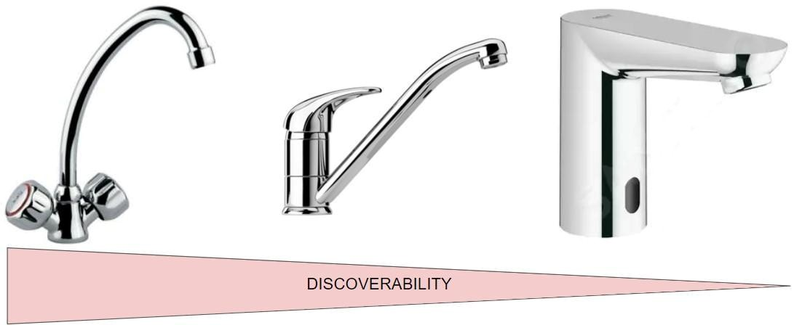
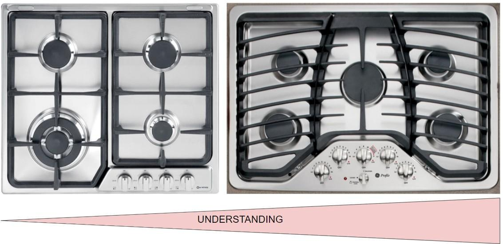
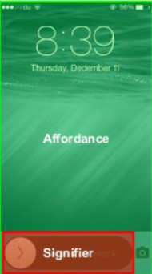
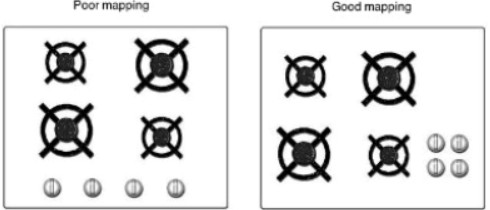
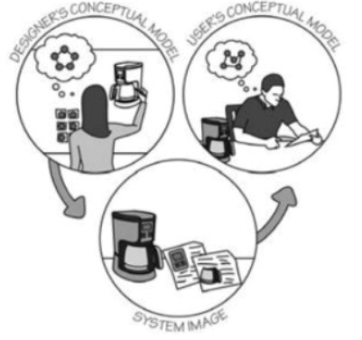
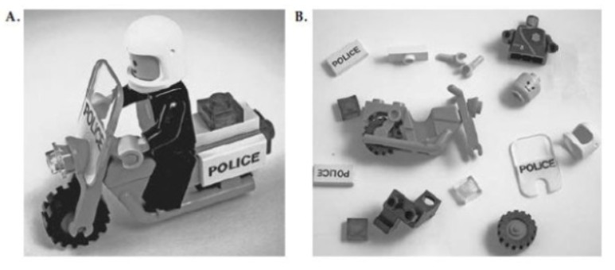

> **Principi Fondamentali di HCI**

**1 \| Progettazione delle interfacce**

Secondo Donald Norman esistono solamente due tipi di design, riuscito e fallito; buono e cattivo.

Ma il design non è universale, anche perché non esiste un prodotto, progetto o sistema apprezzato da tutti. Infatti l'esperienza di interazione è una cosa soggettiva e quindi dipende più dalla persona che dall'artefatto.

In questo corso vedremo come classificare gli utenti in gruppi così da poter identificare degli archetipi di persona per i quali andare a progettare l'interazione.

Ci sono due proprietà che sono fondamentali per qualsiasi progetto destinato ad essere utilizzato da persone: discoverability (rilevabilità) e understanding (comprensibilità).

**Discoverability**: capacità di un sistema di veicolare e comunicare i propri possibili usi all'utente. Un sistema che a prima vista fa capire all'utente a cosa serve e cosa ci si può fare ha una buona discoverability. La visibilità spesso è usata per avere buona discoverability.

> 

Per esempio un rubinetto con i pomelli ha una migliore discoverability di un rubinetto automatico perché le sue funzioni sono più facilmente identificabili appunto grazie ai pomelli.

**Understanding**: capacità del prodotto di farsi usare correttamente dall'utente. La discoverability è la misura di quanto bene si capisce **cosa** si può fare con il prodotto mentre l'understanding invece è la proprietà associata a quanto bene un prodotto dice **come** si usano le funzioni disponibili.

> 

# Design of Useful Things 

*“Quando le cose vanno bene, si dimenticano subito mentre quando vanno male non si dimenticano mai!”*

E' più facile ricordare le disavventure che le belle esperienze, spesso percepite come ovvie e scontate. Questo accade perché viviamo in una società dove **le cose devono andare bene**. Quando qualcosa va storto, la persona prova sensazioni ed emozioni spiacevoli. Questo è un processo neurologico del tutto normale e, dal punto di vista evolutivo, sbagliare significa rischiare la vita mentre fare bene è solo l'ovvio cammino per la sopravvivenza.

Per Norman il design deve preoccuparsi di **come funzionano le cose** (Funzionalità e Modello Mentale), **come vengono controllate** (Visibilità, Mapping, Feedback) e della **natura delle interazion**i (User Experience, Usabilità) tra questi oggetti e le varie categorie di utenti.

Software e sistemi ben progettati danno vita a esperienze rilassanti, mentre quelli mal progettati causano esperienze spiacevoli e conseguenti emozioni negative.

L'esperienza negativa può portare in primis ad abbandonare l'utilizzo di un prodotto ma soprattutto porta l'utente ad etichettare il prodotto e l'azienda come da evitare.

Gli esseri umani sono coloro che concepiscono e progettano le **macchine** ma allo stesso tempo queste non hanno niente a che vedere con loro: le macchine sono sistemi logici, deterministici e basati su algoritmi mentre l'essere umano è aleatorio, variabile e intuitivo. In più le macchine non hanno esperienza per come la intendiamo noi: qualsiasi azione che una macchina compie è nuova e fine a se stessa. Nei nostri confronti, in aggiunta, le macchine sono assai **limitate**. Sono concepite per fare poche cose ma in maniera perfetta. Invece gli uomini possono fare tutto in modo mediocre e talvolta qualcosa in maniera eccellente.

Le macchine seguono **regole di comportamento rigide**, molto complicate. E' molto facile sbagliare a seguire queste regole, tanto che l'utente viene in un certo senso obbligato a smettere di comportarsi da umano per cercare di capire la macchina e interagire con essa.

L'umano è costretto implicitamente ad assecondare la macchina per poter ottenere un risultato e procedere nell'esecuzione dell'attività col minor numero possibile di intoppi.

*We have to humanize machines instead of dehumanizing humans* (David Hanson).

Questo rapporto di sottomissione dell'essere umano rispetto alla macchina è dovuto al fatto che le regole di funzionamento della macchina sono solo note alla macchina stessa e ai suoi progettisti. Quando la macchina fa la **cosa sbagliata** viene data subito la colpa all'utente. Bisogna **ribaltare il punto di vista: quando le cose vanno male la colpa non è mai dell'utente ma è sempre della macchina e quindi del progettista.**

Questa prospettiva è il punto di partenza fondamentale per la progettazione dei prodotti.

Spesso la formazione dei progettisti e dei tecnici è la maggior causa del “cattivo design”. Per tanti anni il bagaglio formativo dei tecnici si è basato su tematiche tecnologiche invece che sugli aspetti del mercato e della psicologia umana. Gli ingegneri e gli informatici sono senza dubbio eccellenti sul piano tecnico ma sono limitati nella comprensione delle persone e della socialità. Pensano che essendo anche loro essere umani allora sono in grado di capire i nostri simili ma in realtà si sbagliano. La spiegazione logica di un sistema non è sufficiente per consentire a chiunque di utilizzarlo. Pensano che il pensiero logico sia il modo comune di ragionare ma non è così: è fondamentale accettare che il comportamento umano è illogico.

**Bisogna progettare per come le persone sono e non per come vorremmo che fossero!**

*“We were designing things for people, so we needed to understand both technology and people. But that's a difficult step for many engineers: machines are so logical, so orderly. If we didn't have people, everything would work so much better. Yup, that's how I used to think.” (Donald Norman)*

# L'incidente di Three Mile Island 

Incidente avvenuto a causa di una parziale fusione del nocciolo nella centrale nucleare nell'omonima isola; nella Contea di Dauphin, in Pennsylvania, il 28 marzo 1979. Fu il più grave incidente nucleare negli Stati Uniti d'America, portando al rilascio di piccole quantità di gas radioattivi e di iodio radioattivo nell'ambiente. Avvenuto alle ore 4.00 di mercoledì 28 marzo 1979, quando il reattore era ad un regime di potenza del 97%. L'incidente ebbe inizio nel circuito di refrigerazione secondario, con il blocco della portata di alimentazione ai generatori di vapore. Il blocco portò ad un considerevole aumento della pressione del refrigerante, causando prima l'apertura di una valvola PORV di rilascio posta sulla pressurizzazione e poi lo “SCREAM” (arresto di emergenza del reattore). A questo punto la valvola di rilascio non si richiuse ma il problema più grande fu che *non era presente la reale posizione della valvola perché la strumentazione era legata solo all'alimentazione del motore di questa valvola e non alla posizione precisa*. Il circuito di raffreddamento primario si svuotò parzialmente e il calore residuo del nocciolo del reattore non poté essere smaltito: per questo il nocciolo subì gravi danni. *Gli operatori non poterono identificare correttamente il problema per via della carente strumentazione della sala controllo e dell'inadeguato addestramento a cui erano stati sottoposti.*

Da: [<u>Incidente</u> <u>di</u> <u>Three</u> <u>Mile</u> <u>Island</u> <u>-</u> <u>Wikipedia</u>](https://it.wikipedia.org/wiki/Incidente_di_Three_Mile_Island)

**2 \| Principi Fondamentali dell'Interazione**

Un buon design produce un'esperienza piacevole! La parola *esperienza* è troppo soggettiva secondo i tecnici e per questo non è molto apprezzata. Se per esempio chiediamo ad un ingegnere di descrivere la sua automobile preferita descriverà prima il modello e i dettagli tecnici e poi ci parlerà della sensazione che ha provato durante la guida.

L'esperienza è fondamentale nell'utilizzo di un sistema tecnologico, crea la **tonalità del ricordo** che associamo agli oggetti coi quali abbiamo interagito. Se la tecnologia si comporta in maniera incomprensibile o inaspettata, allora gli utenti proveranno principalmente **emozioni negative** come rabbia e frustrazione. Se invece la tecnologia si comporta in maniera comprensibile e come previsto dall'utente, allora proverà una sensazione di controllo, soddisfazione e orgoglio, tutte **emozioni positive**. Se non si mette l'utente in uno stato mentale propenso alla sperimentazione e all'interazione, inevitabilmente l'utente compierà più errori perché avrà un basso interesse per l'oggetto: **cognizione ed emozione sono profondamente legate**.

Come detto nel capitolo precedente, la **discoverability** (**visibilità**) è la **capacità di un prodotto di comunicare i possibili usi** **all'utente.** Questa deriva da 6 principi psicologici fondamentali:

1.  **Affordances**

2.  **Signifiers**

3.  **Mapping**

4.  **Feedback**

5.  **Conceptual model of the system and System Image**

6.  **Constraints**

# 2.1 \| Affordance (Invito all'uso) 

Letteralmente significa "offrire" o "mettere a disposizione". Il termine indica la relazione fra le proprietà di un oggetto fisico (o sistema) e le capacità del suo utilizzatore, che determina come l'oggetto possa essere usato.

Le affordances non sono delle proprietà oggettive di un prodotto bensì relazioni prodotto-utente.

Per esempio, una sedia sembra fatta apposta per sostenere, quindi **invita** alla seduta. Inoltre, la maggior parte delle sedie è abbastanza leggera da poter essere sollevata e spostata da una persona. Possiamo dunque dire che una sedia *presenta l'affordance* per il “sedersi” e per “essere sollevata” (ma solo per una persona adulta e con adeguate capacità fisiche).

L'esistenza di un affordance dipende sia dalle proprietà dell'oggetto che dalle proprietà dell'agente. Un bambino piccolo avrà difficoltà a salire su una sedia per sedersi e sicuramente non sarà in grado di trasportarla. Per quel bambino, dunque, quella sedia non ha l'affordance per il “sedersi” e per “essere sollevata”, mentre per altri utenti sì.

Questo dimostra che **le affordance non sono proprietà universali** insite nell'oggetto, ma relazioni tra le proprietà di un oggetto e le capacità di un agente che determina solo come l'oggetto potrebbe essere usato.

Oltre alle affordance esistono anche le **anti-affordance**. Un'anti-affordance è una relazione fra oggetto e utente che se stabilita va a negare, vietare alcune proprietà o modi di interazione disponibili fra utente e oggetto. Un esempio sono gli "spuntoni" sui cornicioni per allontanare i volatili e vietare che ci si posino sopra.

Per essere efficaci, le affordance e le anti-affordance devono essere **discoverable** (**rilevabili**) e **perceivable** (**percepibili**).

Il vetro “afforda” per la trasmissibilità della luce ma ha un'anti-affordance per l'attraversabilità. Non consente infatti il passaggio di corpi solidi.

Essendo trasparente, questa anti-affordance non è facilmente percepibile dall'utente e quindi l'utente può attuare interazioni non permessa dando origine a problemi di utilizzo (sbattere sulla porta a vetri).

Se uno di questi impedimenti all'uso non è percepibile bisogna aumentare allora la visibilità. Per dare visibilità ad un'affordance si usano i **significanti (signifiers)**. Spesso si legge erroneamente in alcuni test di design che *“è stata aggiunta un'affordance per ...”*. Le affordance sono modalità d'interazione, non si mettono né si tolgono, per abilitare delle affordance rendendole visibili vengono usati appunto dei significanti.

# 2.2 \| Signifiers (significanti) 

I progettisti hanno il problema di capire come rendere comprensibili gli oggetti che creano. Devono decidere, ad esempio, quali parti degli schermi elettronici debbano toccate, premute o fasse scorrere.

Qui entrano in gioco i significanti: segnali percepibili che indicano all’utente **dove** e **come** effettuare un’azione, rendendo espliciti i modi d’interazione.

> 
>
> **Affordance**: *cosa si può fare? Quale azione è possibile compiere? (Nell’immagine: toccare lo schermo)*
>
> **Signifier**: *dove e come è possibile fare l'azione? (Nell’immagine: trascinare verso destra)*

Spesso i significanti sono **indispensabili** perché la maggior parte delle affordance sono invisibili. I significanti possono essere: **voluti o intenzionali**, nel caso di un'etichetta o un'icona, oppure **accidentali o non intenzionali**, come nel caso di un sentiero tracciato dal passaggio di altre persone.

Solitamente nel design **il significante viene considerato come più importante delle affordances** perché comunica immediatamente come usare il prodotto.

Ma come si passa dalla percezione di un’affordance alla comprensione di un’azione potenziale? Tramite convenzioni nella maggior parte dei casi.

L'interpretazione di un'affordance percepita è una convenzione culturale. Una maniglia induce la percezione di poter essere afferrata ma è ormai appurato per convenzione che viene usata per aprire e chiudere una porta: è semplicemente un aspetto culturale del design.

# 2.3 \| Mapping 

Il termine mapping indica la **relazione fra gli elementi di due insiemi di oggetti**

**(solitamente i comandi e l'azione che producono)**. E’ concetto molto importante nella progettazione e nel layout di controlli e display.

Un buon mapping sfrutta la corrispondenza spaziale tramite il **posizionamento dei significanti**. Se i comandi sono disposti nello spazio come gli oggetti controllati, l’uso diventa intuitivo.

Il miglior modo di fare mapping è quello **naturale**, perché sfrutta abitudini mentali, fisiche o culturali. Bisogna tenere in mente però che il concetto di naturale è molto diverso dal concetto di **universale**, poiché ci possono essere molti mappings che sembrano naturali ma che in realtà sono specifici a una cerchia di culture. Si pensi agli interruttori della luce: mentre in America “su” significa acceso, in Italia significa spento. In questo caso Lo stesso movimento ha significati opposti in culture diverse.

> 

## 2.3.1 - Activity-Centered Control (Mapping basato sull'attività) 

Quando i dispositivi sono complessi, il mapping spaziale tradizionale non basta più. In questi casi è più opportuno usare comandi centrati sulle attività: un singolo comando configura più dispositivi contemporaneamente per uno scopo preciso (Ad es. ”Guarda Film” accende TV e Audio e spegne le luci).

Questo metodo è un'estensione diretta dello Human-Centered Design che sposta l'attenzione dal dispositivo all'attività, definita come l'insieme di azioni per raggiungere un obiettivo.

Teoricamente è un metodo eccellente, ma difficile da realizzare perché è necessario tenere conto di tutti i possibili imprevisti. (Nell’esempio del pulsante “Guarda Film” cosa succede se ho la tv accesa ma l’impianto audio spento? Se non li sincronizzo spengo la tv e accendo le casse.)

Questi controlli poi devono essere realmente incentrati sull'attività dell'utente e non sulla logica del dispositivo. Se costringono l'utente a conoscere il modello tecnico alla base del sistema, il design ha fallito e creerà confusione.

# 2.4 \| Feedback 

Il feedback è la comunicazione del risultato di un'azione, è una risposta che l'interfaccia dà all'utente. E' qualcosa che fa sapere all’utente che il sistema sta funzionando in seguito alla sua richiesta.

Una delle caratteristiche senza dubbio più importanti del feedback è che **deve essere immediato** perché anche un piccolo ritardo potrebbe causare una sensazione di dubbio e frustrazione all'utente e lo potrebbe portare alla rinuncia dell'attività che sta compiendo.

Il feedback deve essere anche **informativo**, ma senza eccessi. Deve far capire chiaramente se l'azione è in corso o se è stata completata, ma senza sovraccaricare l'utente di dati inutili. Paradossalmente, un feedback mal progettato (che confonde o distrae) può essere peggiore dell'assenza di feedback.

Infine, deve essere **essenziale e non intrusivo**: troppi avvisi sonori o visivi finiscono per desensibilizzare l'utente, portandolo a ignorare anche i segnali davvero importanti. Un buon design mantiene l'ambiente calmo.

Ricapitolando: un feedback efficace deve essere immediato, informativo, semplice e proporzionato all'azione.

# 2.5 \| Modello concettuale del sistema 

**Un modello concettuale** è una spiegazione, di solito semplificata, di come funziona un sistema. Non deve essere necessariamente accurata, ma è importante che sia **utile**.

Un esempio di questo principio è quello delle cartelle, dei file e delle icone che troviamo nei computer. Questi costrutti sono stati concepiti per aiutare le persone a formarsi un modello concettuale dei documenti e dell’archiviazione e organizzazione dei dati, ma nel computer non esistono davvero le cartelle.

**Esistono anche i “modelli semplificati”, che però sono validi solo finché i presupposti che li supportano sono veri**. E' l'esempio della sincronizzazione del cloud: i file sembrano essere sul dispositivo ma il materiale effettivo “è nel cloud”. Questo modello semplificato è utile per l'utilizzo normale, ma se la connessione di rete ai servizi cloud viene interrotta, il risultato può essere confuso (l'informazione è sempre presente sullo schermo ma l'utente non può più salvarla o recuperare altri dati).

**Il modello concettuale** esprime **come il designer vuole che l'utente percepisca il prodotto**. Una volta pensato il modello concettuale, viene implementata l'interfaccia, in modo che il modello concettuale venga veicolato all'utente tramite affordances, significanti e mapping presenti su essa.

**Un modello mentale** è un modello concettuale presente nella mente delle persone che rappresenta la loro comprensione di come le cose funzionano. È possibile che persone diverse abbiano un modello mentale diverso dello stesso oggetto, oppure che una persona abbia diversi modelli mentali per lo stesso oggetto. Ad esempio, un meccanico che accelera con la macchina ha un modello mentale del concetto di “acceleratore” più tecnico rispetto al normale cittadino.

**Più grande è la differenza tra il modello mentale e quello concettuale, più l'utente farà fatica ad usare il sistema**.

L'ideale sarebbe che l'utente apprenda un modello concettuale giusto **direttamente dal dispositivo che utilizza** e non leggendo manuali oppure tramite trasmissione da altre persone, altrimenti si crea il tipico passaparola del telefono senza fili: l'interpretazione cambia da persona a persona e si può generare molta confusione.

Quindi è necessario che il modello concettuale trasmesso dal prodotto sia unico in relazione a quello mentale che l'utente si costruisce.

## 2.5.1 - System image 

Le persone creano continuamente modelli mentali di loro stesse, degli altri, dell'ambiente e delle cose con cui interagiscono. Questi sono modelli formati tramite l'esperienza, che servono come guide per capire il mondo e raggiungere obiettivi.

Per comprendere meglio cosa è l'Immagine di Sistema ed il suo ruolo, è opportuno immaginarla come un elemento di mediazione tra il progettista e l'utente.

Tutto parte dal **modello mentale del Designer**, ovvero la concezione che il progettista ha del funzionamento del prodotto. Da qui, dato che il progettista non può comunicare a parole ad ogni utente come usare l'oggetto una volta rilasciato, il prodotto deve 'parlare' da solo.

È qui che entra in gioco l'**Immagine di Sistema**: essa rappresenta tutto ciò con cui l'utente entra in contatto (la forma fisica, l'interfaccia, i manuali, le pubblicità ma anche elementi non intenzionali come il rumore o le sensazioni). L'utente, interagendo con questa immagine, si costruisce il proprio modello mentale.

L'obiettivo del design è fare in modo che l'immagine di sistema sia così chiara e coerente da permettere all'utente di sviluppare un modello mentale quanto più simile possibile a quello originario del progettista.

Infatti, **per quanto un prodotto possa essere tecnicamente geniale**, se l’utente non riesce a comprenderne il funzionamento tramite l’immagine di sistema, l’esperienza sarà frustrante e l’accoglienza negativa. Il compito del designer è quindi riuscire a comunicare lo scopo del proprio prodotto usando solo l’immagine del sistema. Di conseguenza, una buona immagine di sistema è quella che trasmette all'utente un utilizzo corretto.

In pratica, se un buon modello concettuale è la base per un prodotto utile e gradevole, l’immagine di sistema è il mezzo fondamentale per far sì che l’utente “riceva” il modello modello mentale e lo usi correttamente.

Ricapitolando, l'immagine di sistema rappresenta la totalità dell'informazione disponibile all'utente. Essa agisce come comunicazione tra progettista e utente nella creazione di un modello mentale, includendo sia l'aspetto fisico dell'oggetto sia le informazioni ausiliarie (come manuali ed etichette).

> 

# 2.6 \| Constraints 

*Come facciamo a capire una cosa che non abbiamo mai visto prima e con cui non abbiamo mai interagito?*

L'unico modo è quello di unire **l'informazione presente nel mondo esterno con quella che si trova già in testa**.

L'insieme delle conoscenze che si trovano nel mondo comprende le varie affordances, i significanti visibili e i vincoli fisici che limitano ciò che è possibile fare.

La conoscenza che una persona ha in mente comprende tutti i vari modelli concettuali, i vincoli culturali, semantici e logici oltre alle esperienze passate e a quelle che si svolgono nel momento dell’interazione.

> 

I vincoli giocano un ruolo centrale in questo processo. Essi sono indicazioni che guidano l’utente verso le azioni corrette, riducendo l’ambiguità e il numero di possibilità da considerare.

Un esempio chiaro è quello dei piccoli modellini LEGO. Anche senza istruzioni, spesso è possibile costruire il modellino corretto unendo diversi tipi di vincoli.

I vincoli fisici limitano le parti che possono essere incastrate tra loro, poiché i pezzi possono combaciare solo in determinati modi.

I vincoli culturali e semantici restringono ulteriormente le opzioni, suggerendo quali pezzi abbiano senso in una certa posizione, ad esempio per colore o funzione rappresentata. Infine, i vincoli logici permettono di completare il modello: se alla fine rimanesse un solo pezzo, la logica indicherebbe chiaramente dove collocarlo.

L’incastro finale del modellino emerge quindi dall’interazione di più vincoli che cooperano tra loro. In questo senso, i vincoli sono limitazioni utili come strumenti di orientamento.

Esistono dunque quattro classi di vincoli:

1.  **Vincoli fisici**: sono legati alle proprietà del mondo fisico e agli oggetti materiali. Un esempio sono i pezzi della LEGO che possono incastrarsi solo in un determinato modo oppure una chiavetta USB che entra nella porta solo in un verso specifico.

2.  **Vincoli culturali**: derivano da abitudini, **convenzioni** sociali e pratiche condivise all’interno di una cultura. Un esempio è il senso di scrittura che varia in diverse parti del mondo.

3.  **Vincoli semantici**: si legano al significato della situazione e aiutano a circoscrivere l'insieme delle azioni possibili. Si basano sulla conoscenza della situazione e del mondo. Un esempio è la posizione sensata del motociclista, ovvero che deve stare seduto rivolto in avanti.

4.  **Vincoli logici**: si basano sulla pura logica umana e sulle relazioni tra elementi. Se nel completare un modellino LEGO rimanesse fuori un singolo pezzo, sapremmo dove infilarlo.

Un designer sfrutta questi vincoli al meglio per portare l'utente verso un modello mentale del prodotto che si avvicini il più possibile al modello concettuale desiderato.

Spesso vincoli e mapping vengono confusi.

Un mapping ben progettato può introdurre vincoli logici così forti da impedire errori. In questi casi, un mapping efficace diventa esso stesso un vincolo.

Al contrario, l’assenza sia di vincoli sia di mapping chiari genera nell’utente una sensazione di smarrimento e frustrazione, tipica delle interfacce poco comprensibili.

## 2.6.1 - Convenzioni 

Quando viene introdotto un nuovo approccio in una serie di prodotti e sistemi esistenti, le persone tendono a lamentarsi. Questo accade non tanto per le nuove convenzioni in sé, quanto per il fatto del cambiamento. **I potenziali vantaggi** **del nuovo sistema diventano secondari, se il cambiamento porta alla rottura delle abitudini e quindi a disagio**.

Se una convenzione viene violata, allora l’utente ha bisogno di apprenderla da capo.

**Per questo la coerenza nel design è una virtù**. Se un nuovo modo di fare le cose è solo leggermente migliore di quello precedente, allora è preferibile mantenere la convenzione stabilita. Se però il nuovo cambiamento è necessario, allora dovrà essere adottato in modo consistente da tutti.

## 2.6.2 - Forcing functions 

**Le funzioni obbliganti (forcing functions) sono una forma estrema di vincolo fisico**: sono situazioni in cui le azioni sono vincolate in modo che un passaggio mancato impedisca di procedere al successivo. Il loro scopo è **impedire comportamenti inappropriati o pericolosi**.

Esistono tre principali tipi di forcing functions:

1.  **Interlock**: forza una sequenza precisa di operazioni (operazioni \> 1) in cui più azioni devono essere svolte in uno specifico ordine. Sistemi interlock sono usati come sistemi di sicurezza nei macchinari industriali o nel mondo software. **Per passare all’operazione successiva è necessario completare quella precedente.**

> 

2.  **Lock-in**: mantiene attiva un'operazione impedendo che venga interrotta prematuramente. Un esempio tipico è il messaggio che avvisa l’utente del rischio di uscire da un’applicazione senza aver salvato. **Per completare un task si deve compiere un'azione**.

> 

3.  **Lock-out**: impedisce l’accesso ad uno spazio o funzione pericoloso/sensibile oppure che non si verifichi un evento. E’ concettualmente l'opposto di un lock-in. Un esempio è la richiesta di conferma della maggiore età prima di accedere a determinati contenuti. **Per accedere ad un task si deve compiere un'azione**.

> 
