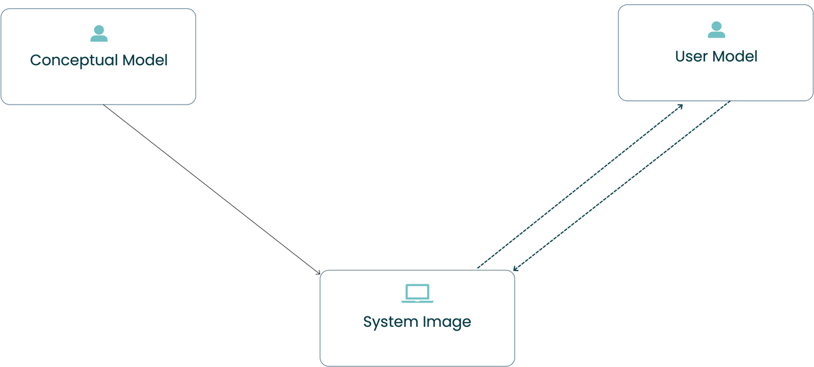
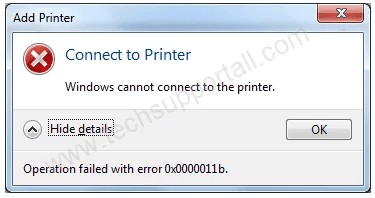
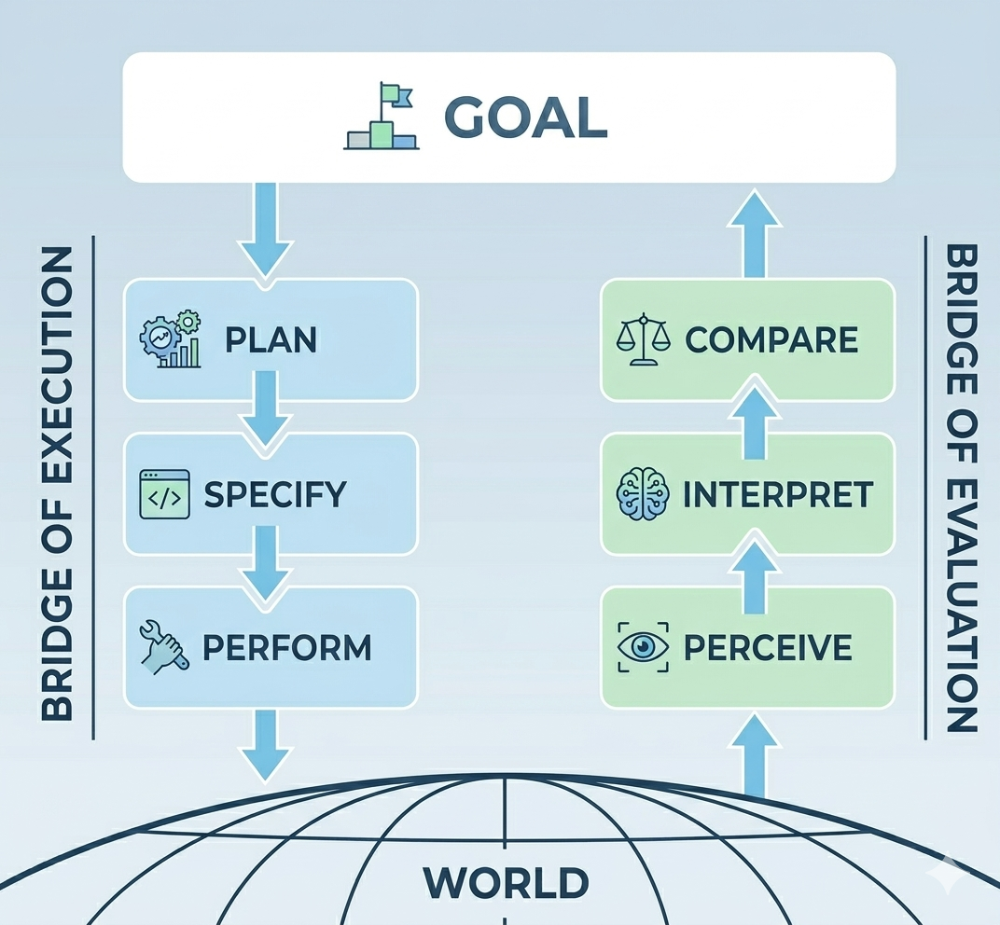
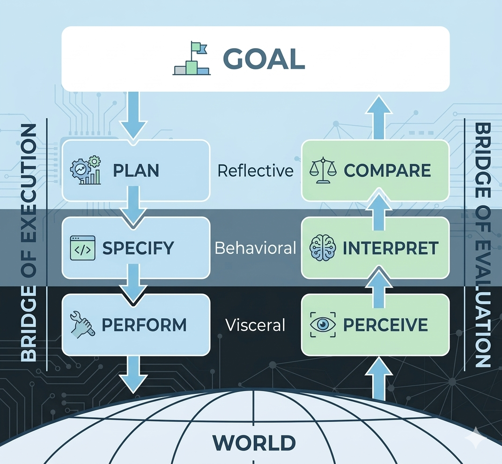
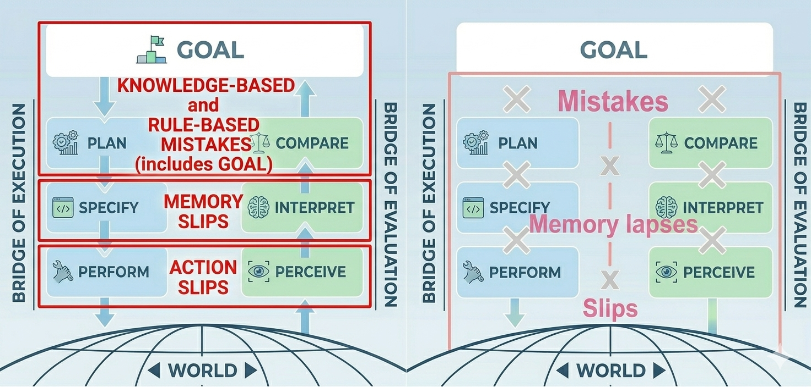

# People

Fino agli anni Settanta, i calcolatori erano strumenti riservati a specifici contesti professionali e la questione dell'usabilità era marginale: l'interfaccia doveva soddisfare solo esperti già familiari con la logica della macchina. 

La rivoluzione arrivò nel decennio successivo, quando Apple implementò, nelle sue tecnologie, le ricerche sulle GUI (Graphical User Interface) condotte dalla Xerox PARC negli anni Settanta. A partire dal 1984, infatti, con il lancio sul mercato del Macintosh, il computer divenne pian piano uno strumento di lavoro anche per persone senza competenze informatiche. Questo cambiamento tuttavia portò a una situazione paradossale: nonostante le potenzialità tecniche fossero maggiori, molti utenti avevano difficoltà a svolgere alcuni compiti. 

Il problema risiedeva nel metodo di progettazione, centrato sulla macchina e basato su una concettualizzazione errata dell’utente, visto più come un mero esecutore di task, che un soggetto dotato di una straordinaria variabilità comportamentale. Emerse allora la necessità di un approccio radicalmente diverso, user centered, che tenesse sempre conto dei reali bisogni degli utenti. In altre parole, emerse la necessità di conoscere e comprendere il funzionamento della mente umana durante l'interazione con le macchine. In questa direzione, il contributo più influente è stato quello di Donald Norman, che ha offerto una panoramica schematizzata di cosa accade quando un utente cerca di raggiungere un obiettivo attraverso un artefatto, mettendo in evidenza le possibili difficoltà che emergono durante il processo di interazione. 

# How do people do things?
**Ricordiamo**: 
> Un prodotto è usabile quando il progettista è riuscito a trasmettere all’utente il proprio modello concettuale attraverso l’immagine del prodotto stesso. 

Tale affermazione si basa sulla relazione tra gli elementi alla base di una progettazione *user centered*: il modello concettuale del progettista (o *conceptual model*); l’immagine del prodotto (o *system image*); il modello mentale dell’utente (o *user model*). Questi elementi possono essere disposti a triangolo come in *Figura 1*, dove in basso troviamo l’immagine del sistema, mentre in alto il modello concettuale (a sinistra) e il modello dell’utente (a destra).

>
>
> *Figura 1 Modello concettuale e modello dell'utente.*

Dato il rapporto tra gli elementi, è evidente che **l'usabilità non è una proprietà intrinseca del prodotto, bensì il risultato di una comunicazione indiretta più o meno riuscita tra progettista e utente**. L’assenza di un collegamento diretto tra progettista ed utente indica infatti che il progettista comunica con l’utente attraverso un intermediario, ossia l’immagine del sistema. 

Nel caso in cui la comunicazione, abbia successo, significa che il progettista ha compiuto delle scelte di design tali da rendere l’immagine del sistema chiara all’utente e, di conseguenza, tali da permettere un’interazione fluida e intuitiva. Diversamente, quando l'utente ha difficoltà a comprendere il funzionamento del sistema, esisterà un divario più o meno profondo tra il modello concettuale e il modello mentale che l’utente costruisce del prodotto in questione. 

Se finora abbiamo parlato di comunicazione, significa che tra l’immagine del sistema e l’utente avviene un dialogo, uno scambio di messaggi, dal sistema all’utente e dall’utente al sistema, come del resto evidenzia la (Figura 1) attraverso i due puntatori paralleli.

Gli interlocutori tuttavia si scambiano messaggi in linguaggi diversi: l’utente comunica i propri intenti mentalmente, in termini psicologici (es. intenzioni, obiettivi), mentre il prodotto trasmette il proprio stato attraverso segnali fisici e percepibili (es. suoni, icone).

### Golfi interattivi

Questo implica che *inevitabilmente* tra i due interlocutori esista una *distanza*, descritta da Norman attraverso la metafora dei **golfi interattivi**, spazi che separano gli stati mentali dell’utente dagli stati fisici del prodotto.

Norman in particolare distingue tra due golfi che devono essere superati dall’utente: il **golfo dell’esecuzione** e il **golfo della valutazione**.

Nel primo, *l’utente deve comprendere come funziona il sistema*, nel secondo *quali risultati il sistema produce*. In questo senso, si può dire che ogni golfo misura la sua tipologia di **distanza cognitiva**: 

- Il golfo dell’esecuzione misura la distanza tra gli obiettivi dell’utente e il modo di ottenerli mediante il sistema. 
- Il golfo della valutazione misura la distanza tra le rappresentazioni fornite dal sistema e quelle che l’utente si aspetta. 

I golfi risultano più o meno profondi in base a quanto le informazioni sul versante dell’esecuzione, riunite sotto il concetto di **feedforward**, e quelle sul versante della valutazione, costituite dal **feedback**, siano progettate in modo efficace e correttamente interpretate dall’utente.

Con **feedforward** si intendono le informazioni (fornite dal sistema) che aiutano a capire come eseguire un’azione, mentre con **feedback** le informazioni che aiutano a capire cosa è successo dopo il compimento dell’azione.

Questi due flussi lavorano insieme per fornire all’utente un modello concettuale coerente e unitario, cioè una rappresentazione mentale chiara di come funziona il sistema. Tuttavia, ciascuno di essi deriva da un modello dedicato (o sotto-modello) progettato dal designer nel sistema per quello specifico aspetto:

Ad esempio, il modello dedicato all'esecuzione guida l’utente mostrando cosa fare e come farlo (feedforward). Il modello dedicato alla valutazione invece mostra il risultato dell’azione (feedback). Questi modelli sono composti dagli stessi principi: significanti, mapping e vincoli, che permettono rispettivamente di anticipare l’azione e comprenderne l’impatto.

Per comprendere meglio la questione dei golfi, consideriamo il Cestino sul desktop, un ottimo esempio di design che usa una metafora fisica, in quanto anticipa e riproduce effettivamente ciò che accade con un cestino fisico.

Sul versante dell’esecuzione (Feedforward) le informazioni derivano dal modello dedicato all'esecuzione: il significante è l'icona del cestino che indica dove agire; il mapping è naturale (trascinare l'oggetto nel contenitore corrisponde all'eliminazione); il vincolo (fisico/logico) impedisce di trascinare il file in aree non valide o fuori dallo schermo, guidando l'azione verso l'obiettivo.

Sul versante della valutazione (Feedback) invece, le informazioni derivano dal modello dedicato alla valutazione, che spiega cosa è successo. Qui il significante è l'icona che cambia stato (si "riempie"); il mapping associa la pienezza visiva alla presenza di file eliminati; il vincolo è l'impossibilità di aprire o modificare i file mentre sono nel cestino (confermando che sono in uno stato di sospensione/eliminazione) oppure l'obbligo di conferma per lo svuotamento definitivo.

Diverso è il caso dei messaggi di errore come quello mostrato in (Figura 2).

>
>
> Figura 2 Modal dialogs without context 

Se al livello dell’esecuzione l’utente non ha idea di quale azione intraprendere poiché non ci sono azioni alternative proposte (il pulsante "OK" si limita a far sparire il messaggio senza risolvere il problema, mentre "Nascondi dettagli" nasconde informazioni utili, forse, solo agli specialisti), dall’altro il messaggio non aiuta minimamente a capire cosa è successo: "Impossibile connettersi" e "Errore: 0x00000011b" sono privi di significato: manca un’indicazione comprensibile sulla causa dell’errore di connessione.

È chiaro allora che il dialogo tra utente e sistema sarà tanto più fluido quanto più il prodotto riesce a inviare messaggi comprensibili sul proprio stato prima e dopo l’utilizzo, e viceversa, ovvero quanto più l’utente è capace di inviare un certo input e interpretare il relativo output in accordo con le proprie esigenze. 

Ad ogni modo, quanto detto finora ha almeno tre **corollari fondamentali**:

1) All’origine dei problemi di usabilità vi è il modo diverso di comunicare tra l’utente e il prodotto.
2) Compito del progettista è aiutare gli utenti a superare i due golfi, progettando prodotti che inviino messaggi chiari sia sul loro possibile utilizzo, sulle loro azioni e funzioni, sia sul loro stato una volta utilizzati.
3) Le difficoltà nell’uso di un prodotto hanno origine nel design, non nell’utente. 

### Stadi dell'azione
Quali sono allora le caratteristiche di una buona *User Interface*? Di nuovo viene in aiuto Norman che, oltre a fornire un metodo per individuare le cause dei problemi di usabilità di un prodotto, suggerisce il modo di rimuovere le difficoltà che si incontrano durante l’interazione. Più precisamente, Norman propone uno schema, semplificato in sette stadi, del ciclo di un’azione compiuta dall’utente quando questi si confronta con un prodotto qualsiasi, dove il primo step indica l’inizio, gli step dal secondo al quarto rientrano nel golfo dell’esecuzione, mentre gli altri nel golfo della valutazione. Gli *step* in questione sono:

1) **Formulazione dell’obiettivo**: l'utente identifica cosa vuole ottenere in termini astratti.

**Nel golfo dell’esecuzione**:

2. **Definizione dell’intenzione**: l'utente sceglie una strategia per raggiungere l'obiettivo, sulla base di ciò che il prodotto sembra offrire. 
3. **Specificazione della sequenza di azioni**: l'utente pianifica mentalmente i passi concreti da compiere. 
4. **Esecuzione**: l'utente compie fisicamente le azioni pianificate.

**Nel golfo della valutazione**:

5. **Percezione dello stato del sistema**: l'utente osserva cosa è successo dopo l'azione.
6. **Interpretazione dello stato del sistema**: l'utente cerca di dare significato a ciò che percepisce. 
7. **Valutazione**: l'utente confronta lo stato attuale con l'obiettivo iniziale per capire se l'azione ha avuto successo o meno.

>  \
> Figura 3 Stadi di azione.

 

### Principi di Progettazione
Da ciascuno stadio è possibile ricavare, secondo Norman, una domanda sull’usabilità del prodotto, e ancora, dalle risposte alle domande, sette principi di buon design da seguire, come mostrato in *Tabella 1*.

>| Fase | Step | Domanda (Utente) | Principio di Design (Progettista) |
>| :--- | :--- | :--- | :--- |
>| **Pianificazione** | **1. Obiettivo** | Cosa voglio fare? | **Modello Concettuale**: Permette di capire se lo scopo è raggiungibile col sistema. |
>| **Esecuzione** | **2. Intenzione** | Quali sono le alternative? | **Visibilità e Vincoli**: Mostra cosa si può fare e impedisce azioni errate. |
>| **Esecuzione** | **3. Sequenza di azioni** | Quali azioni posso fare ora? | **Affordance**: L'invito fisico all'uso (es. una maniglia invita a tirare). |
>| **Esecuzione** | **4. Esecuzione** | Come faccio l'azione? | **Significanti e Mapping**: Segnali chiari e relazione logica tra entità ed effetto. |
>| **Valutazione** | **5. Percezione** | Cosa è successo? | **Feedback**: Informazione di ritorno immediata sull'azione appena compiuta. |
>| **Valutazione** | **6. Interpretazione** | Cosa significa? | **Modello Concettuale**: Coerenza tra il risultato visivo e il funzionamento logico. |
>| **Valutazione** | **7. Valutazione** | Ho risolto il problema? | **Confronto con lo scopo**: Verifica finale tra lo stato del mondo e l'obiettivo iniziale. |

>*Tabella 1 I sette principi dell'usabilità*

Tuttavia, per quanto i principi siano mappati uno a uno sugli stadi dell’azione, esiste un rapporto flessibile, tra principio e stadio. Sia il feedforward che il feedback, ad esempio, sono il risultato dell'applicazione combinata di tutti questi principi. Questo per dire che il modello di Norman è solo un punto di partenza per l’individuazione delle aree di miglioramento del prodotto.

Inoltre è importante sottolineare che la maggior parte dei comportamenti umani non segue un andamento lineare e fisso come quello teorizzato da Norman, in quanto dettati da obiettivi opportunistici, scaturiti cioè dalle circostanze, quindi dal contesto, più che da un’attenta pianificazione. Si pensi a come usiamo lo smartphone durante la giornata. Vediamo una notifica e la apriamo senza aver pianificato di controllare quella specifica applicazione; scorriamo casualmente il feed di Instagram senza un obiettivo preciso; interrompiamo la scrittura di una e-mail, o qualsiasi altro task, per rispondere immediatamente a un messaggio che arriva. Spesso gli utenti insomma sono imprevedibili, agiscono fuori dagli schemi, il che conferma quanto detto in precedenza: il modello di Norman va inteso come guida, anziché come uno schema rigido. Si tratta di uno strumento che aiuta il progettista a capire dove può risiedere un problema di usabilità – in quale golfo, in quale stadio – ma non pretende di descrivere esattamente come ogni utente si comporterà in ogni momento con un dato artefatto.

### I tre livelli di processing

Progettare prodotti usabili insomma richiede una certa flessibilità cognitiva. Questo perché, come abbiamo visto, **l’usabilità non è solo legata alla performance, all’interazione fluida, al contesto d’uso, ma anche allo stato emotivo dell’utente**, di cui il progettista deve tener conto quando crea il proprio prodotto. Le emozioni, in particolare, infatti influenzano i processi cognitivi attraverso il rilascio di ormoni, modificando l’attività cerebrale e conseguentemente il nostro comportamento.

Ecco allora che Norman, oltre a descrivere la struttura dell'azione, identifica *tre livelli di esperienza con la tecnologia* – **viscerale, comportamentale e riflessivo** – ciascuno con caratteristiche, funzioni e implicazioni emotive, nonché di design, diverse.

Quando elaboriamo un obiettivo (stadio 1), pianifichiamo un’intenzione (stadio 2), valutiamo se abbiamo raggiunto il nostro obiettivo di partenza (stadio 7), il cervello elabora le informazioni al livello riflessivo. 
Si tratta di un livello di elaborazione dell’informazione tipicamente conscio, dove hanno luogo la comprensione profonda, il ragionamento, i processi decisionali e dove risiedono i livelli più alti di emotività. In pratica, è qui che si forma la nostra **memoria degli eventi** Questo significa che **veicolare informazioni all'utente mentre si trova nel livello riflessivo è estremamente efficace** per il progettista per almeno tre motivazioni:

1. Le emozioni riflessive sono le più durature: queste emozioni formano il nucleo dei nostri ricordi.
2. I ricordi plasmano la reputazione del prodotto: i ricordi sono spesso più importanti della realtà effettiva. Un'applicazione può avere alcune imperfezioni tecniche (livello comportamentale), ma se lascia l'utente con un forte senso di soddisfazione (livello riflessivo), sarà ricordata positivamente.
3. La riflessione guida le raccomandazioni.

Quando eseguiamo (stadio 4) un’azione e percepiamo (stadio 5) lo stato del sistema entra in gioco il livello viscerale, che giudica gli stimoli sensoriali in maniera istintiva, immediata e quindi subconscia. 
Ciò significa che qui non conta quanto il prodotto sia usabile, efficace o comprensibile dal punto di vista funzionale, ma lo stile: l'aspetto visivo guida la risposta viscerale. In altri termini, l’utente ha già formulato un giudizio estetico ed emotivo sul prodotto, e quindi ne ha già fatto esperienza, ancora prima di utilizzarlo semplicemente percependone l’aspetto generale. 

Se invece dobbiamo stabilire in che modo compiere una determinata azione (stadio 3) e in che modo interpretare un determinato feedback (stadio 6) allora si attiva il livello comportamentale. La correlazione con lo stadio 3 indica non solo che a questo livello conta la prestazione del sistema, ma anche la dipendenza di questo livello dal contesto, confermandone l’importanza all’interno della progettazione *user centered*. 

Questo perché nel livello in questione risiedono i pattern comportamentali (le abilità apprese attraverso la pratica e che diventano progressivamente automatiche) che vengono attivati nel momento in cui riconosciamo situazioni (contesti appunto) familiari o analoghe a esperienze passate. Ciò implica che anche a questo livello l’elaborazione dell’informazione è largamente subconscia: pur essendo consapevoli di ciò che stiamo facendo, le azioni fluiscono senza bisogno di pensiero deliberato. Ne consegue che il livello comportamentale è guidato dalle aspettative. Tuttavia, durante l’attesa di conferma di tali aspettative è guidato dalle emozioni, il che è probabilmente l’aspetto più critico per il progettista, perché a seconda che l’aspettativa sia positiva o negativa e smentita o confermata a questo livello verranno esaltate o limitate sia le reazioni viscerali sia le risposte riflessive, che poi influenzeranno il giudizio finale dell’utente (stadio 7). È pertanto fondamentale sotto questo profilo curare il feedback e creare pattern di interazione coerenti. 

I tre livelli di *processing* dunque non sono compartimenti stagni, ma lavorano in parallelo e si influenzano reciprocamente, ad esempio:

- un'interfaccia visceralmente sgradevole può compromettere la percezione comportamentale, anche se tecnicamente è ben progettata;

- un'esperienza comportamentale frustrante (troppi errori) può innescare una valutazione riflessiva negativa del prodotto;

- una valutazione riflessiva positiva ("questo prodotto è perfetto per le mie esigenze") può rendere più tollerabili piccoli difetti viscerali o comportamentali.

Da ciascun livello insomma possiamo trarre una lezione importante per il design del nostro prodotto, ovvero che è importante:

1.  costruire una narrazione (positiva) memorabile attorno all’esperienza d’uso (livello riflessivo)

2.  fornire un feedback chiaro e creare pattern di interazione coerenti per facilitare l’automatizzazione (livello comportamentale)

3.  curare l’estetica con la stessa attenzione dedicata alla funzionalità (livello viscerale).

La tabella seguente aiuterà a focalizzare quanto spiegato in precedenza.

### Tabella 2: I Tre Livelli di Processing e il Design

>| Livello Cognitivo | Stadi Coinvolti | Implicazioni per il Design |
>| :--- | :--- | :--- |
>| **Viscerale** | 4. Esecuzione 5. Percezione | • *First impressions matter*: l'estetica conta. • Feedback sensoriale immediato. • Reazione istintiva: "Ha un bell'aspetto/sensazione?" |
>| **Comportamentale** | 3. Specificazione 6. Interpretazione | • Interazioni fluide e abituali. • Uso chiaro di *significanti* e *mapping*. • Pattern coerenti: "Posso farlo in modo automatico?" |
>| **Riflessivo** | 1. Obiettivo 2. Intenzione 7. Valutazione | • Comprensione profonda e modelli concettuali. • Memoria e soddisfazione a lungo termine. • Analisi: "Perché è successo? Lo consiglierei?" |

> Tabella 2 I tre livelli di processing 

>  \
> Figura 4 Stadi di azione associati al processing.

 

# **3.2. *Human Errors***

Strettamente legato al modello dei tre livelli di processing è il tema della **cognizione umana e della distinzione tra processi consci e inconsci**, fondamentale per comprendere come gli utenti percepiscono, interpretano e agiscono durante l'interazione con i sistemi.

Gran parte della nostra attività cognitiva avviene in modo **inconscio**. Si tratta di processi automatici, rapidi che gestiscono compiti di routine sulla base delle esperienze passate. Il riconoscimento di pattern, l'elaborazione visiva di base, le reazioni emotive immediate e molte abilità motorie sono gestite da questa modalità. 

I processi **consci**, al contrario, sono lenti, controllati e richiedono un certo sforzo cognitivo. Sono quelli che usiamo quando dobbiamo ragionare su un problema, pianificare una sequenza di azioni complesse, o riflettere sulle conseguenze delle nostre scelte. A differenza del subconscio, inoltre, la cognizione conscia ha una capacità limitata: possiamo tenere in memoria solo pochi elementi alla volta, secondo il celebre numero di Miller circa 7 elementi +/- 2.

### Tabella 3: Conscio e Inconscio (Subconscio)

>| Subconscio (Inconscio) | Conscio |
>| :--- | :--- |
>| Veloce | Lento |
>| Automatico | Controllato |
>| Capacità illimitata | Capacità limitata |
>| Controlla le abilità apprese | Valuta le nuove situazioni |

> Tabella 3 Conscio e Inconscio 

Entrambi i processi cognitivi coinvolgono la memoria a lungo termine, ma in modi diversi. La memoria a lungo termine infatti contiene sia **conoscenza dichiarativa** sia **conoscenza procedurale**.

La prima si riferisce a una vasta gamma di conoscenze esplicite che sono direttamente accessibili alla coscienza e possono essere comunicate verbalmente. In altri termini, riguarda fatti e conoscenze sul mondo e sulla nostra vita. 

La seconda invece contiene conoscenza tacita, ovvero non comunicabile semplicemente a parole, e riguarda il modo in cui svolgiamo le azioni, come andare in bicicletta.

La distinzione tra conscio e inconscio e tra i tre livelli di processing si riflette nel modo in cui gli errori vengono commessi e gestiti dagli utenti. Da un punto di vista psicologico, infatti, l’errore è concettualizzato in maniera variabile a seconda del fatto che l’utente sia più o meno consapevole di aver sbagliato e a seconda del livello di elaborazione cognitiva sottostante l’azione da cui è stato prodotto, come mostra la Figura 5. 

> 
> Figura 5 I diversi tipi di errore 

Partendo dal fatto di essere più o meno consapevoli di star sbagliando, possiamo distinguere tra errori inconsci e consci, ovvero tra *slip* e *mistake*. 

Uno **slip** è un errore del sistema inconscio che si verifica quando l'esecuzione fallisce, nonostante l'intenzione fosse corretta. Ne consegue che una persona che *intende fare un'azione A* finisce per *eseguire un'azione B*.

Gli slip sono più frequenti negli utenti più esperti e il motivo è semplice: chi usa un sistema tutti i giorni tende a eseguire le azioni in modo automatico, quasi istintivo, affidandosi al subconscio. Un principiante, al contrario, presta attenzione a ogni singolo passaggio, di conseguenza incorrerà meno frequentemente in questo tipo di errori.

I **mistake** invece sono errori pienamente consci, che hanno origine nella pianificazione dell’azione: l'esecuzione rispecchia l'obiettivo e il piano iniziali, peccato però che entrambi siano sbagliati. Dunque l’azione è interamente erronea.

Questa distinzione tra slip e mistake tuttavia non descrive tutti i tipi di errore. È chiaro che slip e mistake hanno origini diverse: i primi sono essenzialmente azioni involontarie, mentre i mistake nascono da un problema di comprensione del sistema. Tuttavia, se questa distinzione fosse così netta, ci aspetteremmo che entrambe le categorie di errore si manifestino in modi facilmente distinguibili. Purtroppo, non è così. Anzi, sia slip che mistake possono originarsi dall’applicazione di pattern consolidati che, pur avendo funzionato innumerevoli volte in passato, sono in quel momento specifico inappropriati per il contesto attuale.
Tuttavia, emerge una differenza critica: gli Slip sono errori di esecuzione e vengono solitamente riconosciuti e corretti facilmente se il feedback è immediato (vedo che ho fatto un’azione sbagliata o diversa da quella intenzionale e correggo). I Mistake, invece, sono errori molto più 'robusti': l'utente è convinto di agire nel giusto (basandosi su un modello mentale errato) e potrebbe ignorare i feedback negativi o razionalizzarli, persistendo nella procedura errata. Ad esempio:

- Slip: l’utente preme CTRL + S per salvare un documento, ma, non accorgendosi di avere ancora attiva la finestra del browser, si apre il menù Salva pagina del browser (un feedback inaspettato).

- Mistake: l’utente riavvia il computer perché solitamente risolve i problemi, senza capire che in realtà questa volta il problema è la connessione di rete.

In entrambi i casi, l’utente sta usando soluzioni affidabili, testate nel tempo e tramite l’esperienza, che quindi “di solito funzionano”, ma fuori dal loro ambito di validità. Inoltre alcuni errori si collocano a metà strada tra le categorie degli slip e dei mistake. È necessario dunque dividere gli slip e i mistake in altre sottocategorie:

Per qunto riguarda gli slips:
- **Action-based slips**: sono casi in cui viene eseguita l'azione sbagliata oppure l'azione corretta e pianificata, ma nel contesto o verso l'oggetto sbagliato.
    > Esempio: incollare per abitudine il numero della carta di credito nel campo "Nome intestatario" perché è il primo campo che vediamo.

- **Memory lapses**: sono dovuti a un fallimento della memoria a breve termine. L'utente dimentica di eseguire l'azione pianificata o di valutarne i risultati.
    > Esempio: aprire un'applicazione e dimenticare immediatamente perché lo abbiamo fatto, oppure dimenticare di spegnere il fornello dopo aver finito di cucinare.

Per quanto riguarda i mistakes:

- **Rule-based mistakes**: l'utente interpreta correttamente la situazione, ma applica la regola sbagliata. Al livello comportamentale, tendiamo a usare regole empiriche ("Se X, allora Y"). Se il contesto cambia in modo sottile, applichiamo una vecchia regola a un problema nuovo.
    > Esempio: il computer si blocca e decidiamo di spegnerlo forzatamente (regola nota), ignorando che esiste una procedura di ripristino più sicura.

- **Knowledge-based mistakes**: l'utente interpreta erroneamente la situazione a causa di un modello mentale errato o incompleto. Manca la conoscenza accurata del funzionamento interno, spesso perché il sistema fornisce informazioni fuorvianti.
    > Esempio: pensare che un programma sia chiuso perché la finestra è sparita, quando in realtà è ancora attivo in background.

- **Memory-lapse mistakes**: si verificano quando l'utente dimentica un passaggio fondamentale proprio nelle fasi di pianificazione, formulazione dell'obiettivo o valutazione finale.
    > Esempio: dimenticare la necessità di fare un backup dei dati prima di iniziare la formattazione di un disco.

 

### Definizione di errore

Questa distinzione cambia radicalmente il modo di concepire l’errore, non solo dal punto di vista pratico, ma anche umano, culturale. Un sistema che genera frequentemente errori non sta rivelando l'incompetenza degli utenti – sta rivelando l'inadeguatezza della progettazione. Sotto questo profilo, un errore non è più un qualcosa da punire, bensì un tentativo (inutile) dell’utente di andare nella giusta direzione.

Viene da chiedersi allora come progettare sistemi che aiutino a prevenire e a risolvere ogni tipo di errore.

Anzitutto, è necessario cercare di capire quando e perché l’errore si è verificato, per poter minimizzare la probabilità che si ripresenti. A tal proposito possiamo applicare la **Root Cause Analysis (RCA)**, che si avvale della tecnica dei **Cinque Perché**, il metodo principale e lo strumento fondamentale per condurre questo tipo di indagine.

La RCA è un metodo strutturato che punta a scoprire l’origine effettiva di un incidente, risalendo nella catena degli eventi con l'obiettivo di trovare il vero errore che si nasconde sotto l'errore umano. Tuttavia, la RCA smette di essere utile se condotta in modo superficiale. Da un'indagine frettolosa nascono infatti due ostacoli principali:

- **La molteplicità delle cause**: Il primo ostacolo è l'illusione che esista quasi sempre una sola causa. In realtà, la maggior parte degli incidenti è il risultato di una concatenazione di fattori che si sommano e si influenzano reciprocamente. Per comprendere questa dinamica, James Reason ha sviluppato il celebre *Swiss Cheese Model* degli incidenti. Secondo questo modello, ogni sistema di sicurezza è come una fetta di formaggio svizzero: presenta dei "buchi", cioè delle vulnerabilità o punti deboli. Normalmente questi buchi non sono allineati tra loro, quindi il sistema nel complesso resta protetto. Tuttavia, quando più fette vengono sovrapposte e i buchi si allineano perfettamente, un pericolo può attraversare tutte le barriere difensive e causare un incidente.

- **La tendenza a fermarsi al colpevole**: Il secondo ostacolo è la tendenza umana a fermarsi al colpevole immediato senza scavare a fondo. Spesso, l'analisi si interrompe non appena si incontra un errore umano: una volta trovata la persona che ha sbagliato, si considera chiusa l'indagine, senza chiedersi perché il sistema abbia indotto quella persona a commettere quell'errore. In altre parole, ci si ferma alla superficie del problema; un approccio del genere, di fatto, non costituisce nemmeno una vera RCA.

 

### Five Whys

In Giappone è stata sviluppata da tempo una procedura particolarmente efficace per comprendere le vere cause sistemiche del problema: si chiama *I cinque perché* (in inglese ‘*Five Whys*’), ed è stata ideata da Sakichi Toyoda, fondatore della Toyota. In pratica, quando cerchiamo la ragione di un evento, non dobbiamo accontentarci della prima risposta che troviamo, bensì dobbiamo continuare a chiederci "perché?" fino a individuare le vere cause di fondo del problema. Ne consegue che il numero cinque è solo indicativo: a seconda della complessità della situazione, potrebbero bastare tre o anche sette "perché", l'importante è non fermarsi alla superficie.

Vediamo un esempio pratico. Immaginiamo che un veicolo non si accenda. Applichiamo la tecnica dei cinque perché:

1.  Perché il veicolo non si accende? Perché la batteria è scarica.

2.  Perché la batteria è scarica? Perché l'alternatore non funziona e non la ricarica.

3.  Perché l'alternatore non funziona? Perché la cinghia dell'alternatore è rotta.

4.  Perché la cinghia dell'alternatore è rotta? Perché era ben oltre il suo tempo di servizio e non è stata sostituita.

5.  Perché non è stata sostituita per tempo? Perché il veicolo non è stato sottoposto a manutenzione secondo le tempistiche raccomandate.

Se ci fossimo fermati al primo "perché" ("la batteria è scarica"), avremmo semplicemente sostituito la batteria, ma il problema si sarebbe ripresentato poco dopo. Scavando più a fondo, scopriamo che la vera causa del problema è un sistema di manutenzione inadeguato ed è questa l'area su cui dobbiamo intervenire per risolvere definitivamente il problema.

Ricondurci all' analisi profonda è essenziale anche nel design delle interfacce. 
Nel caso degli *slip*, la root cause è spesso l'eccessiva competenza (overlearning): l'utente è così esperto da eseguire l'azione in modo automatico (subconscio), il che lo rende paradossalmente più vulnerabile alla disattenzione o alle interruzioni. 
Al contrario, i *mistake* nascono tipicamente da informazioni ambigue, incomplete o poco chiare sullo stato attuale del sistema.

In altre parole, se da una parte lo slip è un "deragliamento" di un'azione ben nota, il mistake è quasi sempre il risultato di un cattivo design che non fornisce all'utente un modello concettuale adeguato o gli strumenti per comprendere cosa sta succedendo e come interagire efficacemente con il sistema.

 

### Prevenire l'errore

Scoperte le cause, esaminiamo come possiamo prevenire gli errori attraverso un design appropriato. Riprendendo il modello a groviera di Reason, la tabella seguente illustra come ciascuna strategia di prevenzione si traduca in scelte progettuali specifiche.

### Tabella 4: Matrice delle strategie di design per prevenire e mitigare gli errori

>| Strategia | Implicazioni per il Design | Tipo di errore affrontato |
>| :--- | :--- | :--- |
>| **Aumentare il numero di controlli** *(Aggiungere più "fette di formaggio")* Se un controllo fallisce, ce ne sono altri pronti a intercettare l'errore prima che causi danni. | **Aggiungere vincoli alle azioni**, ad esempio segregandoli cosicché controlli confondibili tra loro vengano piazzati lontani l’uno dall’altro, oppure separando i moduli in modo che qualsiasi controllo non direttamente rilevante all’operazione corrente non sia visibile a schermo ma richieda uno sforzo extra per essere raggiunto. | **Action slip**: la separazione fisica dei controlli riduce la probabilità di eseguire l'azione giusta sull'oggetto sbagliato (es. cliccare "Elimina" invece di "Salva" perché i pulsanti sono adiacenti).  **Rule-based mistake**: la separazione modulare chiarisce il contesto, riducendo l'applicazione di regole inappropriate in situazioni ambigue. |
>| **Fornire un modello concettuale chiaro e accurato** *(Ridurre le dimensioni dei "buchi")* Un buon modello riduce la probabilità che gli utenti commettano errori in partenza. | **Ridurre il carico cognitivo**: minimizzare il numero di passaggi per compiere un'azione (ogni passaggio è un'opportunità di interruzione).  **Semplificare scoperta, comprensione e risoluzione**: guidare l'utente con feedback chiaro, tempestivo e moderato nella frequenza (avvisi fastidiosi/inutili sono fonte di distrazione). | **Knowledge-based mistake**: corregge o previene la formazione di modelli mentali errati.  **Memory-lapse / slip**: ridurre passaggi e feedback inutili significa meno informazioni da tenere in memoria e meno distrazioni.  **Rule-based mistake**: aiuta l'utente a capire quali regole applicare nel giusto contesto. |
>| **Effettuare controlli di sensibilità** *(Allertare quando i "buchi" si allineano)* Riconoscere situazioni ad alto rischio o distruttive e avvisare proattivamente l'utente. | **Messaggi d'errore e di conferma**: chiedere conferma prima di un comando critico. Spesso le persone cliccano "Sì" automaticamente. Un controllo migliore visualizza chiaramente l'azione e l'oggetto. Inoltre, **per prevenire l'automatismo**, il designer può rendere il pulsante distruttivo *non* di default: se l'utente è costretto a spostarsi sul bottone secondario per eliminare, un click frettoloso per abitudine sul bottone primario semplicemente annullerà l'azione. | **Knowledge-based mistake**: conferme intelligenti esplicitano le conseguenze, aiutando l'utente a riconoscere un modello mentale errato.  **Memory-lapse / slip**: fungono da "promemoria contestuale", ricordando all'utente l'obiettivo originale. |
>| **Recupero / Mitigazione dell'errore** *(Rete di salvataggio)* Assumere che l'utente sbaglierà comunque, nonostante le conferme, e fornirgli una via d'uscita. | **Implementare Undo (Annulla)**: permettere l'annullamento delle azioni, idealmente con più livelli per intere sequenze, o comunque rendere difficile l'irreversibilità. Si implementa l'Undo proprio quando si pensa che i controlli preventivi possano fallire. Questo trasforma l'interfaccia da punitiva a esplorativa: l'utente può sperimentare senza l’ansia di sbagliare. | **Action slip**: l'Undo rapido permette una correzione immediata da parte dell'utente non appena il feedback visivo gli fa percepire lo slip, prima che l'errore causi danni reali. |

>Tabella 4 Matrice delle strategie di design per prevenire gli errori 

Questa architettura cognitiva aiuta a capire su quali elementi gli utenti costruiscono i loro modelli mentali, ovvero sulla base delle loro esperienze passate, del **system image** (l’aspetto del sistema), del suo comportamento durante l’interazione. Ciò dimostra, e conferma, che l’usabilità è più di un fatto tecnico, in quanto **l’interfaccia** non deve essere solo ***fisicamente* compatibile** con le caratteristiche della **percezione** e dell’**azione** umana, ma anche ***cognitivamente* compatibile** con le caratteristiche della **comunicazione**, della **memoria** e della **soluzione dei problemi** umani. Ne consegue che il segreto dell’usabilità consiste nel calarsi nei panni dell’utente e cercare di immaginare tutti i problemi che potrà incontrare davanti al prodotto (o quanto meno la maggior parte). Così facendo, il progettista si accorgerà che molte delle cose per lui scontate, perché già le conosce, in realtà non lo sono affatto e devono pertanto essere spiegate o evidenziate in maniera diversa.
