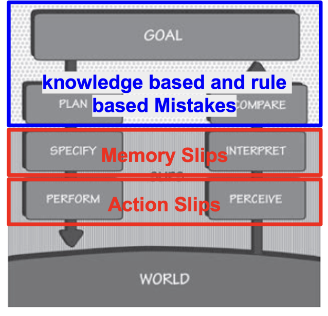
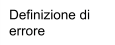

3.  ***People***

Fino agli anni Settanta, i calcolatori erano strumenti riservati a specifici contesti professionali e la questione dell'usabilità era marginale: l'interfaccia doveva soddisfare solo esperti già familiari con la logica della macchina. La rivoluzione arrivò nel decennio successivo, quando Apple implementò le ricerche sulle GUI (*Graphical User Interface*) condotte dalla Xerox PARC negli anni Settanta. A partire dal 1984, infatti, con il lancio sul mercato del Macintosh, il computer divenne pian piano uno strumento di lavoro anche per persone senza competenze informatiche. Questo cambiamento tuttavia portò a una situazione paradossale: nonostante le potenzialità tecniche fossero maggiori, molti utenti avevano difficoltà a svolgere alcuni compiti. Il problema risiedeva nel metodo di progettazione, centrato sulla macchina e basato su una concettualizzazione errata dell’utente, visto più come un mero esecutore di *task*, che un soggetto dotato di una straordinaria variabilità comportamentale. Emerse allora la necessità di un approccio radicalmente diverso, *user centered*, che tenesse *sempre* conto dei reali bisogni degli utenti. In altre parole, emerse la necessità di conoscere e comprendere il funzionamento della mente umana durante l'interazione con le macchine. In questa direzione, il contributo più influente è stato quello di **Donald Norman**, che ha offerto una panoramica schematizzata di cosa accade quando un utente cerca di raggiungere un obiettivo attraverso un artefatto, mettendo in evidenza le possibili difficoltà che emergono durante il processo di interazione.

**3.1. *How people do things?***

Quando un prodotto è *usabile* significa che il progettista è riuscito a trasmettere all’utente il proprio modello concettuale attraverso l’immagine del prodotto stesso. Tale affermazione si basa sulla relazione tra gli elementi alla base di una progettazione *user centered*: il modello concettuale del progettista (o *conceptual model*); l’immagine del prodotto (o *system image*); il modello mentale dell’utente (o *user model*). Questi elementi possono essere disposti a triangolo come in *Figura 1*, dove in basso troviamo l’immagine del sistema, mentre in alto il modello concettuale (a sinistra) e il modello dell’utente (a destra).

*Figura 1 Modello concettuale e modello dell'utente.*

Dato il rapporto tra gli elementi, è evidente che **l'usabilità non è una proprietà intrinseca del prodotto, bensì il risultato di una comunicazione indiretta più o meno riuscita** **tra progettista e utente**. L’assenza di un collegamento diretto tra progettista ed utente indica infatti che il progettista comunica con l’utente attraverso un intermediario, ossia l’immagine del sistema.

Nel caso in cui la comunicazione, abbia successo, significa che il progettista ha compiuto delle scelte di *design* tali da rendere l’immagine del sistema chiara all’utente e, di conseguenza, tali da permettere un’interazione fluida e intuitiva. Diversamente, quando l'utente ha difficoltà a comprendere il funzionamento del sistema, esisterà un divario più o meno profondo tra il modello concettuale e il modello mentale che l’utente costruisce del prodotto in questione.

Se finora abbiamo parlato di *comunicazione*, significa che tra l’immagine del sistema e l’utente avviene un dialogo, uno *scambio di messaggi*, dal sistema all’utente e dall’utente al sistema, come del resto evidenzia la Figura 1 attraverso i due puntatori paralleli.

Gli interlocutori tuttavia si scambiano messaggi in linguaggi diversi: l’utente comunica i propri intenti mentalmente, in termini psicologici (es. intenzioni, obiettivi), mentre il prodotto trasmette il proprio stato attraverso segnali fisici e percepibili (es. suoni, icone).

Questo implica che *inevitabilmente* tra i due interlocutori esista una *distanza*, rappresentata da Norman attraverso la metafora dei **golfi interattivi**, spazi che separano gli stati mentali dell’utente dagli stati fisici del prodotto. Norman in particolare distingue tra il **golfo dell’esecuzione** e il **golfo della valutazione** che richiedono di essere compresi dall’utente: dalla parte dell’esecuzione l’utente deve *comprendere* *come funziona* il sistema, dall’altra quali *risultati* il sistema produce. In questo senso, si può dire che i golfi misurano due tipologie di **distanze cognitive**: il primo tra gli obiettivi dell’utente e il modo di ottenerli mediante il sistema, il secondo tra le rappresentazioni fornite dal sistema e quelle che l’utente si aspetta. I golfi saranno più o meno profondi a seconda di quanto le informazioni sul versante dell’esecuzione, riunite sotto il nome di ***feedforward***, e quelle sul versante della valutazione, che costituiscono il cosiddetto ***feedback***, vengono elaborate correttamente dall’utente. Nello specifico, per ***feedforward*** si intendono le informazioni che aiutano a capire come eseguire un’azione, mentre per ***feedback*** le informazioni che aiutano a capire cosa è successo dopo il compimento dell’azione. *Feedforward* e *feedback* insieme restituiscono l'unità e la coerenza del modello concettuale. Allo stesso tempo, si deve tener presente che ciascuno di questi contenitori di informazioni si ottiene a sua volta da un modello concettuale dedicato, specifico, composto da significanti, vincoli e *mapping* in grado di trasmettere rispettivamente l’anteprima e l’impatto dell’azione.

Per comprendere meglio la questione dei golfi, si veda il seguente confronto. Il *Cestino* è uno degli esempi più riusciti di design, in quanto anticipa e riproduce effettivamente ciò che accade con un cestino fisico. Sul versante dell’esecuzione infatti l'utente sa immediatamente *come* eliminare un file: basta trascinarlo sull'icona del cestino. L'azione fisica dunque corrisponde perfettamente all'intenzione mentale ("voglio buttare via questo file"). Sul versante della valutazione, il *feedback* è altrettanto chiaro e immediato. Così come un cestino reale, l’icona si "riempie" ogni qualvolta un file viene eliminato; suggerisce che l’azione è reversibile (è possibile "frugare" nel cestino per recuperare ciò che è stato buttato) e si svuota solo quando l’utente conferma di voler eliminare tutti i contenuti.

Diverso è il caso dei messaggi di errore come quello mostrato in Figura 2.

# Figura 2 Modal dialogs without context 

Se al livello dell’esecuzione l’utente non ha idea di quale azione intraprendere poiché non ci sono azioni alternative proposte (il pulsante "OK" si limita a far sparire il messaggio senza risolvere il problema, mentre "Nascondi dettagli" nasconde informazioni utili, forse, solo agli specialisti), dall’altro il messaggio non aiuta minimamente a capire cosa è successo: "Impossibile connettersi" e "Errore: 0x00000011b" sono privi di significato: manca un’indicazione comprensibile sulla causa dell’errore di connessione.

È chiaro allora che il dialogo tra utente e sistema sarà tanto più fluido quanto più il prodotto riesce a inviare messaggi comprensibili sul proprio stato prima e dopo l’utilizzo, e viceversa, ovvero quanto più l’utente è capace di inviare un certo input e interpretare il relativo output in accordo con le proprie esigenze.

Ad ogni modo, quanto detto finora ha almeno tre corollari:

1.  È il modo diverso di comunicare tra l’utente e il prodotto all’origine dei problemi di usabilità.

2.  Compito del progettista è aiutare gli utenti a superare i due golfi, progettando prodotti che inviino messaggi chiari sia sul loro possibile utilizzo, sulle loro azioni e funzioni, sia sul loro stato una volta utilizzati.

3.  Le difficoltà nell’uso di un prodotto hanno origine nel design, non nell’utente.

Quali sono allora le caratteristiche di una buona *User Interface*? Di nuovo viene in aiuto Norman che, oltre a fornire un metodo per individuare le cause dei problemi di usabilità di un prodotto, suggerisce il modo di rimuovere le difficoltà che si incontrano durante l’interazione. Più precisamente, Norman propone uno schema, semplificato in sette stadi, del ciclo di un’azione compiuta dall’utente quando questi si confronta con un prodotto qualsiasi, dove gli *step* dal primo al quarto rientrano nel golfo dell’esecuzione, mentre gli altri nel golfo della valutazione. Gli *step* in questione sono:

1.  **Formulazione dell’obiettivo**: l'utente identifica cosa vuole ottenere in termini astratti.

2.  **Definizione dell’intenzione**: l'utente sceglie una strategia per raggiungere l'obiettivo, sulla base di ciò che il prodotto *sembra* offrire.

3.  **Specificazione della sequenza di azioni**: l'utente pianifica mentalmente i passi concreti da compiere.

4.  **Esecuzione**: l'utente compie fisicamente le azioni pianificate.

5.  **Percezione dello stato del sistema**: l'utente osserva cosa è successo dopo l'azione.

6.  **Interpretazione dello stato del sistema**: l'utente cerca di dare significato a ciò che percepisce.

7.  **Valutazione**: l'utente confronta lo stato attuale con l'obiettivo iniziale per capire se l'azione ha avuto successo o meno.

Da ciascuno stadio è possibile ricavare, secondo Norman, una domanda sull’usabilità del prodotto, e ancora, dalle risposte alle domande, sette principi di buon design da seguire, come mostrato in *Tabella 1*.

<table style="width:99%;">
<colgroup>
<col style="width: 33%" />
<col style="width: 32%" />
<col style="width: 33%" />
</colgroup>
<thead>
<tr>
<th style="text-align: left;">STEP</th>
<th style="text-align: left;">DOMANDA</th>
<th style="text-align: left;"><blockquote>

PRINCIPIO

</blockquote></th>
</tr>
</thead>
<tbody>
<tr>
<td style="text-align: left;">Obiettivo</td>
<td style="text-align: left;">Cosa voglio ottenere?</td>
<td><blockquote>

<strong>Visibilità</strong>: è necessario che sia facile scoprire immediatamente quali azioni sono possibili e qual è lo stato attuale del dispositivo.

</blockquote></td>
</tr>
<tr>
<td style="text-align: left;">Intenzione</td>
<td style="text-align: left;">Quali sono le sequenze d’azione alternative?</td>
<td><blockquote>

<strong>Feedback</strong>: è opportuno che ci sia un’informazione completa e continua riguardo ai risultati delle azioni e allo stato attuale del prodotto o del servizio. Dopo aver eseguito un’azione, deve essere facile determinare il risultato.

</blockquote></td>
</tr>
<tr>
<td style="text-align: left;">Sequenza di azioni</td>
<td style="text-align: left;">Quale azione posso fare ora?</td>
<td><blockquote>

<strong>Modello concettuale</strong>: il design dovrebbe fornire tutta l’informazione necessaria per creare un buon modello concettuale del sistema, che favorisca la comprensione e la sensazione di controllo da parte dell’utente. Il modello concettuale potenzia sia la visibilità, sia la valutazione dei risultati.

</blockquote></td>
</tr>
<tr>
<td style="text-align: left;">Esecuzione</td>
<td style="text-align: left;">Come faccio questa azione?</td>
<td><blockquote>

<strong>Affordance</strong>: è bene che le <em>affordance</em> siano studiate per rendere possibili le azioni desiderate e impossibili quelle indesiderate.

</blockquote></td>
</tr>
<tr>
<td style="text-align: left;">Percezione</td>
<td style="text-align: left;">Cosa è successo?</td>
<td><blockquote>

<strong>Significanti</strong>: un uso efficace dei significanti assicura la visibilità e la comprensibilità dei comandi.

</blockquote></td>
</tr>
<tr>
<td style="text-align: left;">Interpretazione</td>
<td style="text-align: left;">Cosa significa?</td>
<td><blockquote>

<strong>Mapping</strong>: è necessario che la relazione fra i comandi e le rispettive azioni obbedisca ai principi del buon mapping, sostenuto, per quanto

possibile, dalla disposizione spaziale e dalla contiguità temporale.

</blockquote></td>
</tr>
<tr>
<td style="text-align: left;">Valutazione</td>
<td style="text-align: left;">Ho realizzato il mio scopo?</td>
<td><blockquote>

<strong>Vincoli</strong>: bisogna fornire vincoli fisici, logici, semantici e culturali, in modo tale da guidare l’azione e facilitandone l’interpretazione.

</blockquote></td>
</tr>
</tbody>
</table>

*Tabella 1 I sette principi dell'usabilità*

Tuttavia, per quanto i principi siano mappati uno a uno sugli stadi dell’azione, esiste un rapporto flessibile, malleabile tra principio e stadio. Sia il *feedforward* che il *feedback*, ad esempio, sono il risultato dell'applicazione combinata di tutti questi principi. Questo per dire che il modello di Norman è solo un punto di partenza per l’individuazione delle aree di miglioramento del prodotto.

Inoltre è importante sottolineare che la maggior parte dei comportamenti umani non segue un andamento lineare e fisso come quello teorizzato da Norman, in quanto dettati da obiettivi opportunistici, scaturiti cioè dalle circostanze, quindi dal *contesto*, più che da un’attenta pianificazione. Si pensi a come usiamo lo smartphone durante la giornata. Vediamo una notifica e la apriamo senza aver pianificato di controllare quella specifica applicazione; scorriamo casualmente il *feed* di Instagram senza un obiettivo preciso; interrompiamo la scrittura di una e-mail, o qualsiasi altro *task*, per rispondere immediatamente a un messaggio che arriva. Spesso gli utenti insomma sono imprevedibili, agiscono fuori dagli schemi, il che conferma quanto detto in precedenza: il modello di Norman va inteso come guida, anziché come uno schema rigido. Si tratta di uno strumento che aiuta il progettista a capire *dove* può risiedere un problema di usabilità – in quale golfo, in quale stadio – ma non pretende di descrivere esattamente come ogni utente si comporterà in ogni momento con un dato artefatto.

Progettare prodotti usabili insomma richiede una certa flessibilità cognitiva. Questo perché, come abbiamo visto, **l’usabilità** non è solo **legata** alla ***performance***, all’interazione fluida, al **contesto** d’uso, ma anche allo **stato emotivo dell’utente**, di cui il progettista deve tener conto quando crea il proprio prodotto. Le emozioni, in particolare, infatti influenzano i processi cognitivi attraverso il rilascio di ormoni, modificando l’attività celebrale e conseguentemente il nostro comportamento.

Ecco allora che Norman, oltre a descrivere la struttura dell'azione, identifica ***tre livelli di esperienza*** con la tecnologia – ***viscerale, comportamentale e riflessivo*** – ciascuno con caratteristiche, funzioni e implicazioni emotive, nonché di design, diverse.

Quando elaboriamo un obiettivo (stadio 1), pianifichiamo un’intenzione (stadio 2), valutiamo se abbiamo raggiunto il nostro obiettivo di partenza (stadio 7), il cervello elabora le informazioni al livello riflessivo. Si tratta di un livello di elaborazione dell’informazione tipicamente conscio, dove hanno luogo la comprensione profonda, il ragionamento, i processi decisionali e dove risiedono i livelli più alti di emotività. In pratica, è qui che si forma la nostra **memoria degli eventi.** Questo significa che **veicolare informazioni all'utente mentre si trova nel livello riflessivo è estremamente efficace** per il progettista per almeno tre motivazioni:

1.  Le emozioni riflessive sono le più durature: queste emozioni formano il nucleo dei nostri ricordi.

2.  I ricordi plasmano la reputazione del prodotto: i ricordi sono spesso più importanti della realtà effettiva. Un'applicazione può avere alcune imperfezioni tecniche (livello comportamentale), ma se lascia l'utente con un forte senso di soddisfazione (livello riflessivo), sarà ricordata positivamente.

3.  La riflessione guida le raccomandazioni.

Quando eseguiamo (stadio 4) un’azione e percepiamo (stadio 5) lo stato del sistema entra in gioco il livello viscerale, che giudica gli stimoli sensoriali in maniera istintiva, immediata e quindi subconscia. Ciò significa che qui non conta quanto il prodotto sia usabile, efficace o comprensibile dal punto di vista funzionale, ma lo stile: l'aspetto visivo guida la risposta viscerale. In altri termini, l’utente ha già formulato un giudizio estetico ed emotivo sul prodotto, e quindi ne ha già fatto esperienza, ancora prima di utilizzarlo semplicemente percependone l’aspetto generale.

Se invece dobbiamo stabilire in che modo compiere una determinata azione (stadio 3) e in che modo interpretare un determinato *feedback* (stadio 6) allora si attiva il livello comportamentale. La correlazione con lo stadio 3 indica non solo che a questo livello conta la prestazione del sistema, ma anche la dipendenza di questo livello dal contesto, confermandone l’importanza all’interno della progettazione *user centered*. Questo perché nel livello in questione risiedono i *pattern* comportamentali (le abilità apprese attraverso la pratica e che diventano progressivamente automatiche) che vengono attivati nel momento in cui riconosciamo situazioni (contesti appunto) familiari o analoghe a esperienze passate. Ciò implica che anche a questo livello l’elaborazione dell’informazione è largamente subconscia: pur essendo consapevoli di ciò che stiamo facendo, le azioni fluiscono senza bisogno di pensiero deliberato. Ne consegue che il livello comportamentale è guidato dalle aspettative. Tuttavia, durante l’attesa di conferma di tali aspettative è guidato dalle emozioni, il che è probabilmente l’aspetto più critico per il progettista, perché a seconda che l’aspettativa sia positiva o negativa e smentita o confermata a questo livello verranno esaltate o limitate sia le reazioni viscerali sia le risposte riflessive, che poi influenzeranno il giudizio finale dell’utente (stadio 7). È pertanto fondamentale sotto questo profilo curare il *feedback* e creare *pattern* di interazione coerenti.

I tre livelli di *processing* dunque **non sono compartimenti stagni**, ma lavorano in parallelo e si influenzano reciprocamente, ad esempio:

- un'interfaccia visceralmente sgradevole può compromettere la percezione comportamentale, anche se tecnicamente è ben progettata;

- un'esperienza comportamentale frustrante (troppi errori) può innescare una valutazione riflessiva negativa del prodotto;

- una valutazione riflessiva positiva ("questo prodotto è perfetto per le mie esigenze") può rendere più tollerabili piccoli difetti viscerali o comportamentali.

Da ciascun livello insomma possiamo trarre una lezione importante per il design del nostro prodotto, ovvero che è importante:

1.  costruire una narrazione (positiva) memorabile attorno all’esperienza d’uso (livello riflessivo)

2.  fornire un feedback chiaro e creare pattern di interazione coerenti per facilitare l’automatizzazione (livello comportamentale)

3.  curare l’estetica con la stessa attenzione dedicata alla funzionalità (livello viscerale).

La tabella seguente aiuterà a focalizzare quanto spiegato in precedenza.

<table style="width:97%;">
<colgroup>
<col style="width: 21%" />
<col style="width: 21%" />
<col style="width: 54%" />
</colgroup>
<thead>
<tr>
<th style="text-align: left;"><blockquote>

<strong>Livello cognitivo</strong>

</blockquote></th>
<th style="text-align: left;"><strong>Stadi coinvolti</strong></th>
<th style="text-align: left;"><strong>Implicazioni per il Design</strong></th>
</tr>
</thead>
<tbody>
<tr>
<td style="text-align: left;"><blockquote>

Viscerale

</blockquote></td>
<td><ol start="4" type="1">
<li>
Esecuzione
</li>
<li>
Percezione
</li>
</ol></td>
<td style="text-align: left;"><blockquote>

First impressions matter

Visual/aesthetic appeal

Immediate sensory feedback

"Does it look/feel right?"

</blockquote></td>
</tr>
<tr>
<td style="text-align: left;"><blockquote>

Comportamentale

</blockquote></td>
<td style="text-align: left;">
3. Specificazione 6.

Interpretazione
</td>
<td style="text-align: left;"><blockquote>

Smooth, practiced interactions

Clear signifiers &amp; mappings

Consistent patterns

"Can I do this automatically?"

</blockquote></td>
</tr>
<tr>
<td style="text-align: left;"><blockquote>

Riflessivo

</blockquote></td>
<td><ol type="1">
<li>
Obiettivo
</li>
<li>
Intenzione
</li>
</ol>

7. Valutazione
</td>
<td style="text-align: left;"><blockquote>

Deeper understanding

Conceptual models

Memory &amp; satisfaction

</blockquote>

"Why did this happen? Would I recommend it?"
</td>
</tr>
</tbody>
</table>

# Tabella 2 I tre livelli di processing 

**3.2. *Human Errors***

Strettamente legato al modello dei tre livelli di *processing* è il tema della **cognizione umana** e della **distinzione tra processi** **consci** e **inconsci**, fondamentale per comprendere come gli utenti percepiscono, interpretano e agiscono durante l'interazione con i sistemi.

Gran parte della nostra attività cognitiva avviene in modo **inconscio**. Si tratta di processi automatici, rapidi che gestiscono compiti di routine sulla base delle esperienze passate. Il riconoscimento di pattern, l'elaborazione visiva di base, le reazioni emotive immediate e molte abilità motorie sono gestite da questa modalità.

I processi **consci**, al contrario, sono lenti, controllati e richiedono un certo sforzo cognitivo. Sono quelli che usiamo quando dobbiamo ragionare su un problema, pianificare una sequenza di azioni complesse, o riflettere sulle conseguenze delle nostre scelte. A differenza del subconscio, inoltre, la cognizione conscia ha una capacità limitata: possiamo tenere in memoria solo pochi elementi alla volta, secondo il celebre numero di Miller circa 7 elementi +/- 2.

**Subconscio Conscio**

Veloce Lento

Automatico Controllato

> Capacità illimitata Capacità limitata Controlla le abilità apprese Valuta le nuove situazioni

# Tabella 3 Conscio e Inconscio 

Entrambi i processi cognitivi coinvolgono la memoria a lungo termine, ma in modi diversi. La memoria a lungo termine infatti contiene sia **conoscenza dichiarativa** sia **conoscenza procedurale**. La prima si riferisce a una vasta gamma di conoscenze esplicite che sono direttamente accessibili alla coscienza e possono essere comunicate verbalmente. In altri termini, riguarda fatti e conoscenze sul mondo e sulla nostra vita. La seconda invece contiene conoscenza tacita, ovvero non comunicabile semplicemente a parole, e riguarda il modo in cui svolgiamo le azioni, come andare in bicicletta.

La distinzione tra conscio e inconscio e tra i tre livelli di *processing* si riflette nel modo in cui gli errori vengono commessi e gestiti dagli utenti. Da un punto di vista psicologico, infatti, l’errore è concettualizzato in maniera variabile a seconda del fatto che l’utente sia più o meno consapevole di aver sbagliato e a seconda del livello di elaborazione cognitiva sottostante l’azione da cui è stato prodotto, come mostra la Figura 3.

# Figura 3 I diversi tipi di errore 

Partendo dal fatto di essere più o meno consapevoli di star sbagliando, possiamo distinguere tra errori inconsci e consci, ovvero tra *slip* e *mistake*.

Uno ***slip*** è un errore del **sistema inconscio** che si verifica quando **l'esecuzione** fallisce, nonostante l'intenzione fosse **corretta**. Ne consegue che una persona che **intende fare un'azione A** finisce per **eseguire un'azione B**. Gli *slip* sono più frequenti negli utenti più esperti e il motivo è semplice: chi usa un sistema tutti i giorni tende a eseguire le azioni in modo automatico, quasi istintivo, affidandosi al subconscio. Un principiante, al contrario, presta attenzione a ogni singolo passaggio, di conseguenza incorrerà meno frequentemente in questo tipo di errori.

I *mistake* invece sono errori pienamente consci, che hanno origine nella pianificazione dell’azione: l'esecuzione rispecchia l'obiettivo e il piano iniziali, peccato però che entrambi siano sbagliati. Dunque l’azione è interamente erronea.

Questa distinzione tra *slip* e *mistake* tuttavia non descrive tutti i tipi di errore. È chiaro che *slip* e *mistake* hanno origini diverse: i primi sono essenzialmente azioni involontarie, mentre i *mistake* nascono da un problema di comprensione del sistema. Tuttavia, se questa distinzione fosse così netta, ci aspetteremmo che entrambe le categorie di errore si manifestino in modi facilmente distinguibili. Purtroppo, non è così. Anzi, sia *slip* che *mistake* possono presentarsi come “errori robusti ma sbagliati”: l’utente applica una soluzione che ha funzionato innumerevoli volte in passato, che è divenuta un pattern consolidato, ma che in quel momento specifico è inappropriato per il contesto attuale. Ad esempio:

> ▪ *Slip*: l’utente preme CTRL + S per salvare un documento, ma, *non accorgendosi* di avere ancora attiva la finestra del browser, si apre il menù Salva pagina del browser.
>
> ▪ *Mistake*: l’utente riavvia il computer perché solitamente risolve i problemi, *senza capire* che in realtà questa volta il problema è la connessione di rete.

In entrambi i casi, l’utente sta usando soluzioni affidabili, testate nel tempo e tramite l’esperienza, che quindi “di solito funzionano”, ma fuori dal loro ambito di validità. Inoltre alcuni errori si collocano a metà strada tra le categorie degli *slip* e dei *mistake*. È necessario dunque dividere gli *slip* e i *mistake* in altre sottocategorie:

- ***action-based slips***, dove viene **eseguita l’azione** pianificata ma nel **contesto** **sbagliato**. Esempio: incollare il numero della carta di credito nel campo "Nome intestatario".

- ***memory lapses***, dovuti a un **fallimento della memoria** per cui o ci si dimentica di eseguire l’azione pianificata o di valutare i risultati di quell’azione. Esempio: dimenticare perché abbiamo aperto una certa applicazione oppure di spegnere il fornello dopo aver finito.

- ***rule-based mistakes***: l'utente **interpreta correttamente la situazione**, ma applica la **regola sbagliata** per risolverla. Come abbiamo visto, nel livello comportamentale, gli utenti costruiscono regole empiriche ("Se X, allora Y") basate sull'esperienza con altri sistemi simili. Tuttavia, quando il contesto cambia in modo sottile, applicano la regola vecchia al problema nuovo. Esempio: riconosciamo correttamente che il computer si è bloccato, ma decidiamo di spegnerlo forzatamente senza salvare il lavoro, quando invece esisteva una procedura più sicura.

- ***knowledge-based mistakes***: l'utente **interpreta erroneamente** la situazione perché ha un **modello mentale errato o incompleto** del sistema. L'utente non possiede conoscenza sufficiente o accurata del funzionamento interno del sistema, perché il sistema comunica informazioni fuorvianti. Esempio: pensiamo che un programma si sia chiuso correttamente quando in realtà è ancora attivo in *background*, consumando risorse.

- ***memory-lapse mistake***: l'utente **dimentica un passaggio** nella fase di pianificazione, formulazione dell'obiettivo, o valutazione finale. Esempio: ci dimentichiamo che dobbiamo fare il backup dei dati prima di formattare un disco.

Questa distinzione cambia radicalmente il modo di concepire l’errore, non solo dal punto di vista pratico, ma anche umano, culturale. Un sistema che genera frequentemente errori non sta rivelando l'incompetenza degli utenti – sta rivelando l'inadeguatezza della progettazione. Sotto questo profilo, un errore non è più un qualcosa da punire, bensì un tentativo (inutile) dell’utente di andare nella giusta direzione.

Viene da chiedersi allora come progettare sistemi che aiutino a prevenire e a risolvere ogni tipo di errore.

Anzitutto, è necessario cercare di capire quando e perché l’errore si è verificato, per poter minimizzare la probabilità che si ripresenti. A tal proposito possiamo applicare due tecniche complementari come la *Root Cause Analysis* (RCA) e quella dei *Cinque Perché* .

La RCA è un metodo d’indagine che punta a scoprire l’origine effettiva di un incidente, risalendo nella catena degli eventi fino a identificare il momento preciso in cui qualcuno ha preso una decisione sbagliata o ha compiuto un’azione inappropriata. Tuttavia la RCA presenta due limiti. *In primis,* la maggior parte degli incidenti ha più di una sola causa. Gli eventi negativi sono quasi sempre il risultato di una concatenazione di fattori che si sommano e si influenzano reciprocamente. Per comprendere questa dinamica, James Reason ha sviluppato il celebre modello a groviera degli incidenti (in inglese *Swiss Cheese Model*). Secondo questo modello, ogni sistema di sicurezza è come una fetta di groviera: presenta dei "buchi", cioè delle vulnerabilità o punti deboli. Normalmente questi buchi non sono allineati tra loro, quindi il sistema nel complesso resta protetto. Tuttavia, quando più fette vengono sovrapposte e i buchi si allineano perfettamente, un pericolo può attraversare tutte le barriere difensive e causare un incidente.

In secondo luogo, l'analisi si ferma quando si incontra un errore umano. Una volta trovata la persona che ha sbagliato, si considera chiusa l'indagine, senza indagare perché quella persona ha commesso quell'errore. In altre parole, ci si ferma alla superficie del problema senza scavare a fondo.

In Giappone è stata sviluppata da tempo una procedura particolarmente efficace per comprendere le vere cause sistemiche del problema: si chiama *I cinque perché* (in inglese ‘*Five Whys*’), ed è stata ideata da Sakichi Toyoda, fondatore della Toyota. In pratica, quando cerchiamo la ragione di un evento, non dobbiamo accontentarci della prima risposta che troviamo, bensì dobbiamo continuare a chiederci "perché?" fino a individuare le vere cause di fondo del problema. Ne consegue che il numero cinque è solo indicativo: a seconda della complessità della situazione, potrebbero bastare tre o anche sette "perché", l'importante è non fermarsi alla superficie.

Vediamo un esempio pratico. Immaginiamo che un veicolo non si accenda. Applichiamo la tecnica dei cinque perché:

1.  Perché il veicolo non si accende? Perché la batteria è scarica.

2.  Perché la batteria è scarica? Perché l'alternatore non funziona e non la ricarica.

3.  Perché l'alternatore non funziona? Perché la cinghia dell'alternatore è rotta.

4.  Perché la cinghia dell'alternatore è rotta? Perché era ben oltre il suo tempo di servizio e non è stata sostituita.

5.  Perché non è stata sostituita per tempo? Perché il veicolo non è stato sottoposto a manutenzione secondo le tempistiche raccomandate.

Se ci fossimo fermati al primo "perché" ("la batteria è scarica"), avremmo semplicemente sostituito la batteria, ma il problema si sarebbe ripresentato poco dopo. Scavando più a fondo, scopriamo che la vera causa del problema è un sistema di manutenzione inadeguato ed è questa l'area su cui dobbiamo intervenire per risolvere definitivamente il problema.

Nel caso degli *slip* la causa principale è la disattenzione o le interruzioni, mentre i *mistake* nascono tipicamente da informazioni ambigue o poco chiare sullo stato attuale del sistema. In altre parole, i *mistake* sono quasi sempre il risultato di un cattivo design che non fornisce all'utente gli strumenti per comprendere cosa sta succedendo e come interagire efficacemente con il sistema.

Scoperte le cause, esaminiamo come possiamo prevenire gli errori attraverso un design appropriato. Riprendendo il modello a groviera di Reason, la tabella seguente illustra come ciascuna strategia di prevenzione si traduca in scelte progettuali specifiche.

<table style="width:99%;">
<colgroup>
<col style="width: 32%" />
<col style="width: 33%" />
<col style="width: 32%" />
</colgroup>
<thead>
<tr>
<th style="text-align: left;">
<strong>STRATEGIA DI</strong>

<strong>PREVENZIONE</strong>
</th>
<th style="text-align: left;">
<strong>IMPLICAZIONI PER IL</strong>

<strong>DESIGN</strong>
</th>
<th style="text-align: left;">
<strong>TIPO DI ERRORE</strong>

<strong>PREVENUTO</strong>
</th>
</tr>
</thead>
<tbody>
<tr>
<td style="text-align: left;"><strong>Aumentare il numero di controlli</strong> (aggiungere più fette di formaggio): se un controllo fallisce, ce ne sono altri pronti a intercettare l'errore prima che causi danni<strong>.</strong></td>
<td style="text-align: left;"><strong>Aggiungere vincoli alle azioni,</strong> ad esempio segregandoli cosicché controlli confondibili tra loro vengano piazzati lontani l’uno dall’altro oppure separando i moduli, in modo che qualsiasi controllo non direttamente rilevante all’operazione corrente non sia visibile a schermo ma richieda uno sforzo extra per essere raggiunto.</td>
<td>
<strong>Action slip: l</strong>a separazione fisica dei controlli riduce la probabilità di eseguire l'azione giusta sull'oggetto sbagliato (es. cliccare "Elimina" invece di "Salva" perché i pulsanti sono adiacenti).

<strong>Rule-based mistake: l</strong>a separazione modulare chiarisce il contesto, riducendo l'applicazione di regole inappropriate in situazioni ambigue.
</td>
</tr>
<tr>
<td style="text-align: left;"><strong>Fornire agli utenti un modello concettuale chiaro e accurato di come funziona il sistema</strong> (ridurre le dimensioni dei buchi): un buon modello concettuale riduce la probabilità che gli utenti commettano errori in partenza.</td>
<td style="text-align: left;">
<strong>Ridurre il carico cognitivo:</strong> minimizzare il numero di passaggi necessari per compiere un'azione. Ogni passaggio aggiuntivo è un'opportunità per interruzioni.

<strong>Semplificare la scoperta, la comprensione e la risoluzione degli errori:</strong> l’utente deve essere guidato tramite un feedback chiaro, tempestivo e moderato nella frequenza (avvisi fastidiosi o non necessari che si presentano spesso durante l’uso di un sistema sono fonte di distrazione e quindi di interruzione dell’azione).
</td>
<td>
<strong>Knowledge-based mistake: u</strong>n modello concettuale chiaro corregge o previene la formazione di modelli mentali errati del sistema.

<strong>Memory-lapse/ slip: r</strong>idurre i passaggi e moderare il feedback significa meno informazioni da tenere in memoria, nonché meno interruzioni.

<strong>Rule-based mistake: l</strong>a chiarezza concettuale aiuta l'utente a capire <em>quali</em> regole applicare in <em>quale</em> contesto, riducendo l'applicazione di euristiche inappropriate.
</td>
</tr>
<tr>
<td style="text-align: left;"><strong>Effettuare controlli di sensibilità (allertare l'operatore quando diversi buchi si allineano):</strong> il sistema dovrebbe essere in</td>
<td style="text-align: left;"><strong>Messaggi d'errore e di conferma</strong>: molti sistemi cercano di prevenire l'errore chiedendo conferma prima di eseguire un comando critico.</td>
<td style="text-align: left;"><strong>Action slip</strong>: l'undo rapido permette correzione immediata prima che l'errore causi danni.</td>
</tr>
<tr>
<td style="text-align: left;">grado di riconoscere situazioni ad alto rischio – quando più fattori di vulnerabilità coincidono – e avvisare proattivamente l'utente prima che l'errore si verifichi.</td>
<td style="text-align: left;">
Tuttavia, queste richieste sono spesso mal temporeggiate: dopo aver richiesto un'operazione, le persone sono già certe di volerla compiere, quindi cliccano "Sì" automaticamente. Un controllo migliore visualizza chiaramente sia l'azione da compiere che l'oggetto interessato, con opzioni contestuali (annulla/prosegui).

<strong>Implementare Undo</strong>:

permettere l'annullamento delle azioni, idealmente con più livelli di undo per intere sequenze o comunque <strong>rendere difficile l'irreversibile</strong>. Questo trasforma l'interfaccia da punitiva a esplorativa: l'utente può sperimentare senza l’ansia di sbagliare.
</td>
<td>
<strong>Knowledge-based mistake</strong>:

Conferme intelligenti che esplicitano le conseguenze aiutano l'utente a riconoscere quando sta per applicare un modello mentale errato.

<strong>Memory-lapse/ slip</strong>: Conferme ben progettate fungono da "promemoria contestuale", ricordando all'utente l'obiettivo originale e il contesto dell'azione.
</td>
</tr>
</tbody>
</table>

# Tabella 4 Matrice delle strategie di design per prevenire gli errori 

Questa architettura cognitiva aiuta a capire su quali elementi gli utenti costruiscono i loro modelli mentali, ovvero sulla base delle loro esperienze passate, del *design model* (l’aspetto del sistema), del suo comportamento durante l’interazione. Ciò dimostra, e conferma, che l’usabilità è più di un fatto tecnico, in quanto **l’interfaccia** non deve essere solo ***fisicamente* compatibile** con le caratteristiche della **percezione** e dell’**azione** umana, ma anche ***cognitivamente* compatibile** con le caratteristiche della **comunicazione**, della **memoria** e della **soluzione dei problemi** umani. Ne consegue che il segreto dell’usabilità consiste nel calarsi nei panni dell’utente e cercare di immaginare tutti i problemi che potrà incontrare davanti al prodotto (o quanto meno la maggior parte). Così facendo, il progettista si accorgerà che molte delle cose per lui scontate, perché già le conosce, in realtà non lo sono affatto e devono pertanto essere spiegate o evidenziate in maniera diversa.
