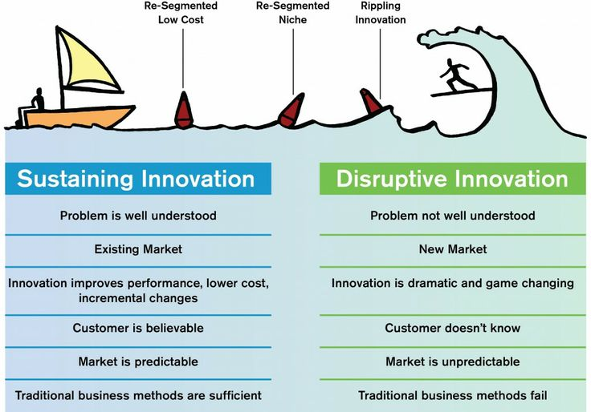
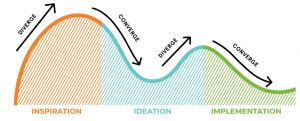
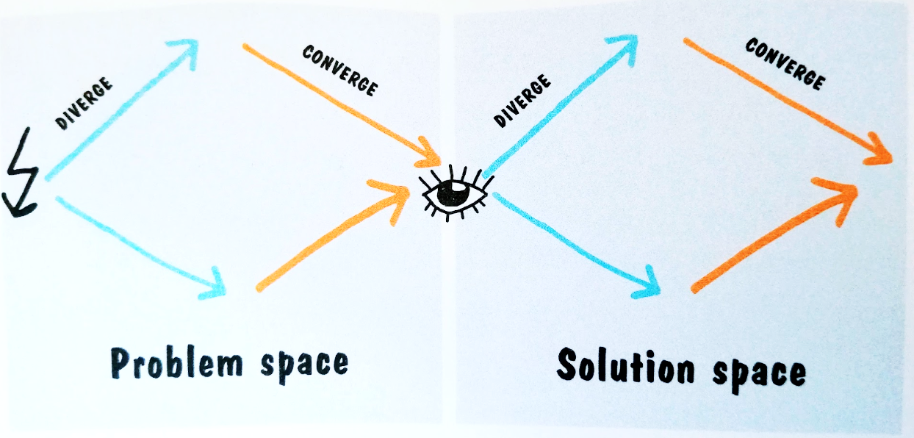
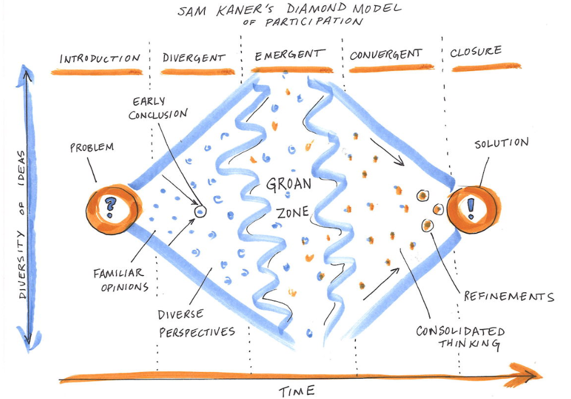
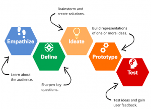
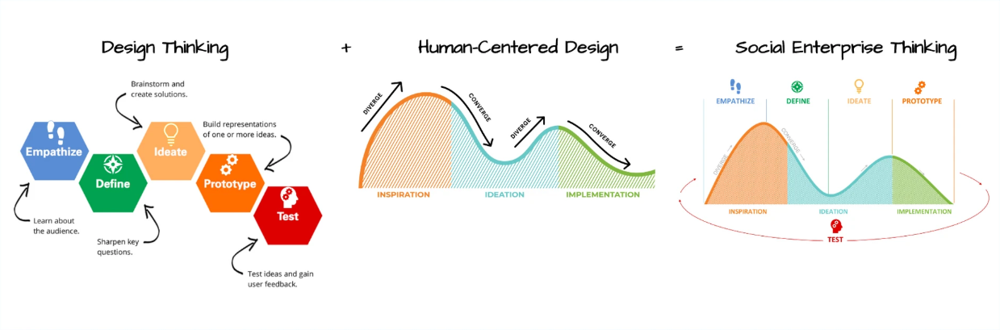
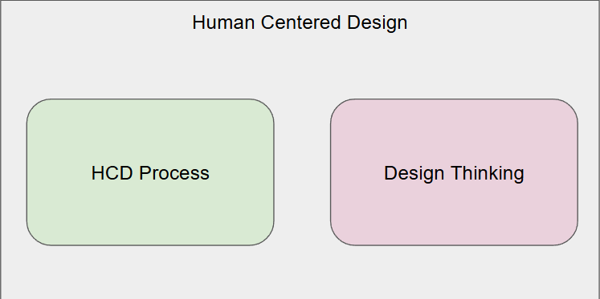
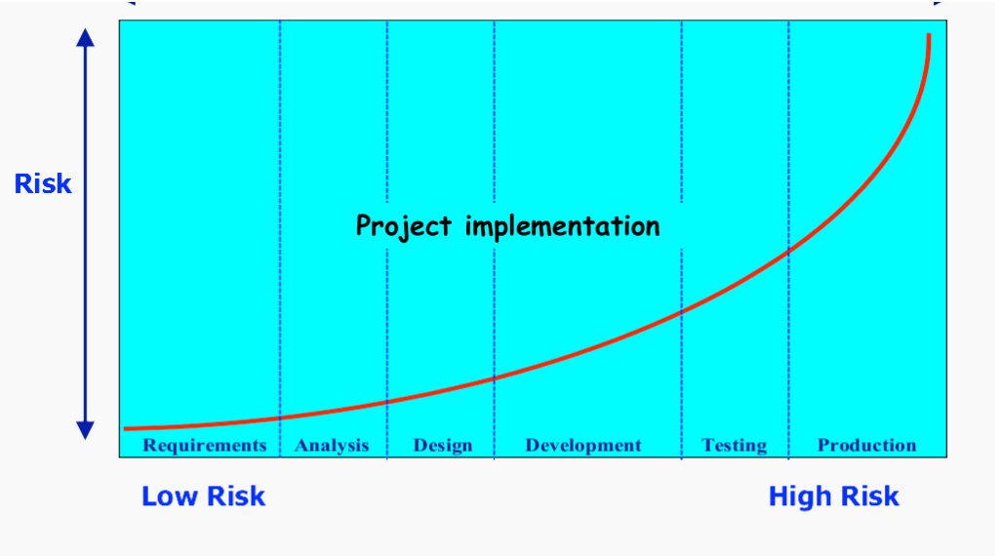
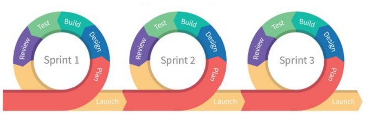
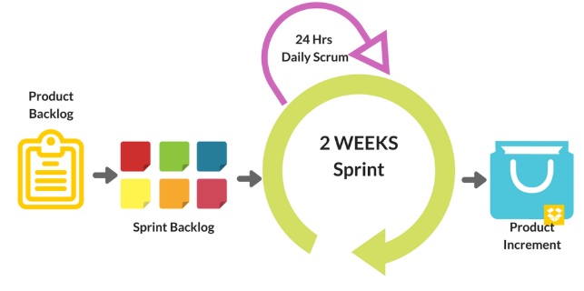

# 3. Metodi e Framework di Innovazione

## 3.1 Il concetto di Innovazione
L'innovazione è comunemente definita come l'introduzione di "nuove combinazioni": nuovi beni, metodi di produzione, mercati o modelli organizzativi. Esistono diverse definizioni accademiche e istituzionali, ma tutte condividono un focus fondamentale su tre elementi: novità, miglioramento e diffusione. Un'innovazione, infatti, è qualcosa di originale e più efficace che "irrompe" nel mercato o nella società, generando un impatto reale. 

È fondamentale distinguere l'innovazione dall'invenzione. L'invenzione è la pura creazione di qualcosa di nuovo. L'innovazione implica l'implementazione pratica dell'invenzione per creare un impatto significativo; per questo motivo, non tutte le innovazioni richiedono per forza una nuova invenzione di base. Anche nell'ambito tecnico e ingegneristico, non è possibile innovare senza un approccio Human-Centered Design (HCD): affinché un prodotto o un servizio sia veramente innovativo, deve innanzitutto essere usabile.

## 3.2 Innovazione Incrementale (Sustaining Innovation)
La maggior parte dei processi innovativi aziendali si basa sull'innovazione incrementale, ovvero su miglioramenti minori e continui di prodotti già esistenti. Si tratta di un processo graduale caratterizzato da bassi rischi e velocità contenuta. Questo tipo di approccio non richiede stravolgimenti nell'organizzazione aziendale né impone agli utenti di dover riapprendere da zero come utilizzare il prodotto (re-skilling). Rivolgendosi a un target di utenti e a un settore di mercato già stabili, l'innovazione incrementale ha una bassa probabilità di cambiare radicalmente o scalare il business aziendale, limitandosi a sostenerne il ciclo di vita.

## 3.3 Innovazione Dirompente (Disruptive Innovation)
A differenza di quella incrementale, un'innovazione dirompente crea un mercato e una rete di valore completamente nuovi, finendo col tempo per smantellare i mercati preesistenti e rimpiazzare i prodotti e le aziende leader del settore. Il termine, coniato dallo studioso americano Clayton M. Christensen nel 1995, è considerato una delle idee di business più influenti del XXI secolo.

È importante notare che non tutte le innovazioni rivoluzionarie sono necessariamente dirompenti. Ad esempio, le prime automobili della fine del XIX secolo non furono un'innovazione dirompente: essendo beni di lusso estremamente costosi, non intaccarono minimamente il mercato dei veicoli trainati da cavalli. Fu la Ford Model T del 1908, prodotta in serie e a basso costo, a cambiare il mercato dei trasporti, qualificandosi a tutti gli effetti come un'innovazione dirompente. Ancora una volta, la regola fondamentale dell'HCD rimane valida: l'innovazione dirompente deve essere centrata sull'utente, perché senza adozione da parte delle persone, non c'è vera innovazione.

 

# 4. Human-Centered Design e Sviluppo del Prodotto

## 4.1 Definizione Standard (ISO 9241-210)
Secondo lo standard internazionale ISO 9241-210, lo Human-Centered Design (HCD) è un approccio allo sviluppo di sistemi interattivi che mira a renderli usabili e utili concentrandosi esplicitamente sugli utenti, sui loro bisogni e requisiti. Questo approccio integra conoscenze di ergonomia, fattori umani e tecniche di usabilità. L'obiettivo finale dell'HCD è duplice: da un lato, migliorare l'efficacia, l'efficienza, la soddisfazione dell'utente, l'accessibilità e la sostenibilità generale del prodotto; dall'altro, mitigare e contrastare i possibili effetti avversi che l'uso della tecnologia potrebbe avere sulla salute, la sicurezza e le prestazioni umane.

## 4.2 Product Management vs. Product Development
Nel ciclo di vita di un prodotto, è essenziale distinguere due ruoli complementari. Il **Product Management** si concentra sul *cosa* fare: definisce la strategia, i requisiti e la direzione del prodotto basandosi sui bisogni del mercato. Il **Product Development** (sviluppo del prodotto), invece, si concentra sul *come* farlo. Il team di sviluppo prende i requisiti specificati dal product manager e li trasforma materialmente in un prodotto funzionante che rispetti gli standard di qualità dell'organizzazione. Questo team è multidisciplinare e include sviluppatori software, designer, ingegneri e tester (QA): è il motore che porta concretamente un'idea dal concetto astratto al mercato reale.

 

# 5. Metodologie per l'Innovazione: L'approccio IDEO

Quando si parla di applicare l'HCD per generare innovazione dirompente, l'agenzia di design IDEO rappresenta un punto di riferimento globale. Il principio cardine della filosofia di IDEO è l'**empatia** totale verso l'utente finale. Per scoprire cosa le persone desiderano veramente, i designer devono entrare nel loro mondo attraverso due azioni pratiche:
1.  **Osservare il comportamento**: studiare le persone nel loro contesto naturale (ad esempio, se si progetta un'aspirapolvere, bisogna guardare le persone mentre puliscono casa).
2.  **Vivere la situazione**: mettersi fisicamente ed emotivamente nei panni dell'utente per provare in prima persona la reale esperienza d'uso.

Le informazioni raccolte tramite l'empatia diventano il carburante per il design. IDEO definisce l'HCD come un approccio creativo al *problem-solving* che inizia con le persone e termina con soluzioni innovative su misura per loro.

 <em>Fonte: <a href="https://blog.movingworlds.org/human-centered-design-vs-design-thinking-how-theyre-different-and-how-to-use-them-together-to-create-lasting-change/">MovingWorlds Blog</a></em>

## 5.1 Il ritmo del Design: Convergenza e Divergenza
Il processo creativo non è un percorso lineare, ma segue un ritmo di espansione e contrazione del pensiero, noto come divergenza e convergenza. 

* Nello **spazio del problema (Problem Space)**, inizialmente si *diverge* per esplorare e raccogliere il maggior numero possibile di informazioni e prospettive sul contesto. Successivamente si *converge*, sintetizzando i dati per definire con estrema chiarezza quale sia il vero problema da risolvere.
* Nello **spazio della soluzione (Solution Space)**, si *diverge* nuovamente attraverso il brainstorming per ideare molteplici soluzioni possibili, per poi *convergere* selezionando, testando e affinando l'idea migliore.

Questo andamento è ben illustrato anche nei modelli decisionali di gruppo, come il **Diamond Model di Sam Kaner**.

Il modello di Kaner mostra come un team passi da una fase di pensiero divergente, attraversi una fisiologica zona di fatica (la *groan zone*, dove si negoziano prospettive contrastanti), per arrivare infine a una fase convergente che porta a una decisione condivisa. 

*Nota applicativa nel Design:* Guardando a questo grafico, possiamo riadattare i termini al ciclo di sviluppo del prodotto, sostituendo la fase del "Problem" con l'esplorazione della "Solution" (ideazione) e il punto di arrivo della "Solution" con la realizzazione di un "Prototype" testabile.

## 5.2 Le Tre Fasi del Processo HCD (IDEO)
Il processo pratico si articola in tre grandi macro-fasi:

1.  **Inspiration (Ispirazione)**: È la fase dedicata alla comprensione dei bisogni e delle sfide dell'utente. Il progettista deve abbandonare ogni nozione preconcetta e astenersi dal pensare a soluzioni immediate. L'obiettivo è mantenere la mente aperta a un'ampia varietà di possibilità, assorbendo informazioni dal contesto.
2.  **Ideation (Ideazione)**: Consolidata la ricerca, si passa al brainstorming e alla visualizzazione. Disegnare e buttare giù idee, anche se inizialmente sembrano imperfette o poco pratiche, aiuta il team a capire cosa potrebbe funzionare. In questa fase si evitano prototipi costosi: si usano bozze (sketches) o modelli rudimentali per liberare la creatività senza la pressione di un prodotto finito. L'acquisizione di feedback rapidi (early feedback) permette di iterare ciclicamente le idee migliori fino a ottenere un concetto solido e di impatto.
3.  **Implementation (Implementazione)**: Trovato il concetto giusto, si entra nella pre-produzione. Si realizzano prototipi ad alta fedeltà da far provare agli utenti e si avvia la produzione reale (o la scrittura del codice). Questa è anche la fase in cui si costruisce un modello di business attorno al prodotto, si stringono le partnership necessarie e ci si prepara per il lancio nel mondo reale.

 

# 6. Design Thinking

Reso celebre dalla Stanford University, il **Design Thinking** è un processo strutturato per creare soluzioni che vengano effettivamente adottate dalle persone. Si tratta di un processo iterativo attraverso il quale cerchiamo di comprendere a fondo l'utente, sfidare i preconcetti e ridefinire i problemi, nel tentativo di identificare strategie e soluzioni alternative che potrebbero non essere immediatamente evidenti con la nostra comprensione iniziale.

Oltre a essere un modo di pensare e di lavorare, il Design Thinking fornisce un approccio pratico (*hands-on*) e orientato alla soluzione (*solution-based*). È estremamente utile per affrontare problemi mal definiti o del tutto sconosciuti, poiché permette di riformulare il problema in un'ottica antropocentrica (human-centric), generando molteplici idee tramite sessioni di brainstorming e promuovendo la sperimentazione continua attraverso schizzi, prototipi e test empirici.

Il processo si articola classicamente in **5 fasi** iterative:
1. **Empathise (Empatizzare)**: studiare profondamente gli utenti per comprenderne l'esperienza.
2. **Define (Definire)**: sintetizzare i bisogni degli utenti, il loro problema centrale e le intuizioni (*insights*) raccolte.
3. **Ideate (Ideare)**: sfidare le assunzioni di base e generare idee per soluzioni innovative.
4. **Prototype (Prototipare)**: costruire rappresentazioni tangibili (anche a bassa fedeltà) delle idee.
5. **Test (Testare)**: validare i prototipi con gli utenti reali.

## 6.1 L'Unione tra Processo HCD e Design Thinking
Se integriamo il processo di Human-Centered Design (visto in precedenza con IDEO) con le fasi operative del Design Thinking, otteniamo un flusso di lavoro completo chiamato Social Enterprise Thinking.

## 6.2 Design Thinking vs. Human-Centered Design
A questo punto è lecito chiedersi: qual è la differenza esatta tra questi concetti? Per chiarirlo, possiamo dire che qualsiasi azienda può usare il Design Thinking per costruire una soluzione capace di generare profitto (ad esempio, ideare un videogioco o uno show televisivo per bambini molto accattivante). Tuttavia, è l'applicazione dello **Human-Centered Design** "al di sopra" di questo processo che garantisce che il prodotto serva *realmente* ai bisogni e al benessere delle persone che lo utilizzano.

La regola d'oro per non confonderli è riassunta in questo schema:

* L'**HCD è un *mindset*** (una filosofia, una forma mentis).
* Il **Processo HCD e il Design Thinking sono *metodi* di design** (strumenti operativi per applicare quella filosofia).
* Il processo HCD e il Design Thinking sono parte dello stesso sistema: lo **Human Centered Design**

### Esempi Pratici:
Spesso l'innovazione nasce dall'osservazione di pattern di comportamento inaspettati, resi evidenti dall'analisi dei dati (Data Science). Questi due esempi classici mostrano come comprendere l'utente porti a un vantaggio di business clamoroso.

**House of Cards (Netflix)**
Prima di avviare la produzione della serie *House of Cards*, Netflix analizzò attentamente i propri dataset. Notarono una forte correlazione tra tre segmenti di pubblico: i fan della serie originale britannica della BBC, i fan dell'attore Kevin Spacey e i fan del regista David Fincher. Invece di tirare a indovinare, Netflix ha semplicemente unito questi tre elementi in un unico prodotto, creando a tavolino un cult istantaneo che rispondeva esattamente ai gusti del suo pubblico.

**Pannolini e Birra (Walmart)**
Birra e pannolini per bambini non sono due articoli che di solito verrebbe in mente di associare. Tuttavia, questo caso è diventato leggendario nel mondo dell'analisi dei dati. Nel 1992, Karen Heath, un'analista di Teradata, scoprì che gli uomini che visitavano i supermercati Walmart per comprare i pannolini avevano un'altissima probabilità di acquistare anche della birra (tipicamente padri mandati a fare la spesa serale). Posizionando fisicamente i due articoli vicini all'interno del punto vendita, Walmart riuscì ad aumentare le vendite di entrambi i prodotti con un margine significativo, semplicemente assecondando un pattern comportamentale degli utenti.

 

# 7. Metodi di Sviluppo per Prodotti Innovativi: Agile, Scrum e DevOps

## 7.1 Lo Sviluppo a Cascata (Waterfall)
La metodologia Waterfall è un approccio lineare alla gestione dei progetti. In questo modello, i requisiti dei clienti e degli stakeholder vengono raccolti e definiti interamente all'inizio del progetto; solo in seguito viene creato un piano sequenziale per accogliere e soddisfare tali requisiti. Prende il nome di "cascata" proprio perché ogni fase del progetto fluisce in quella successiva, scendendo costantemente verso il basso senza tornare indietro. È una metodologia molto strutturata, rigorosa e in uso da molto tempo perché, in contesti altamente prevedibili, funziona bene. Sebbene sia regolarmente impiegata in settori come l'edilizia o l'ingegneria tradizionale, il termine è diventato celebre soprattutto nel contesto dello sviluppo software e IT.

## 7.2 L'Approccio Agile
Agile è, prima di tutto, la capacità di creare e rispondere al cambiamento. È un modo di affrontare un ambiente incerto e turbolento. Si basa sull'analizzare l'ambiente attuale, identificare le incertezze con cui ci si scontra e capire come adattarsi man mano che il progetto avanza. 

Più che un singolo framework (come Scrum o Extreme Programming), lo sviluppo software Agile è un termine "ombrello" che racchiude un insieme di pratiche basate sui valori e sui 12 principi del *Manifesto per lo Sviluppo Software Agile*. Ciò che distingue nettamente Agile dagli approcci tradizionali è il forte focus sulle persone e sul modo in cui lavorano insieme. Le soluzioni, infatti, evolvono attraverso la collaborazione di team interfunzionali e auto-organizzati, che utilizzano le pratiche più appropriate per il loro specifico contesto. 

Essendo basato su continue iterazioni, Agile è considerato il metodo di sviluppo ideale per implementare lo Human-Centered Design e il Design Thinking.

### Rischio

## 7.3 Il Framework Scrum
Scrum è uno dei framework Agile più diffusi per lo sviluppo, la consegna e il mantenimento di prodotti complessi. Sebbene nasca con un'enfasi sullo sviluppo software, oggi è applicato con successo in campi come la ricerca, le vendite, il marketing e le tecnologie avanzate. È progettato per team composti da non più di dieci membri, i quali suddividono il lavoro in obiettivi completabili all'interno di iterazioni a tempo prestabilito (timeboxed) chiamate **Sprint**.

Un principio chiave di Scrum è l'accettazione di due realtà ineluttabili: i clienti cambieranno inevitabilmente idea su ciò di cui hanno bisogno (fenomeno noto come *volatilità dei requisiti*) e sorgeranno sfide imprevedibili che un approccio puramente pianificato non può gestire. Per questo motivo, Scrum adotta un approccio empirico basato sull'evidenza: si accetta che il problema non possa essere definito in anticipo nella sua interezza, e ci si concentra invece sul massimizzare la capacità del team di consegnare valore rapidamente e adattarsi alle mutevoli condizioni di mercato.

**Il Ciclo dello Sprint**
Lo Sprint è l'unità base di sviluppo in Scrum. La sua durata è concordata e prefissata, variando normalmente tra una e quattro settimane (con due settimane come standard più comune). 
* Inizia con un evento di *Sprint Planning*, che stabilisce un obiettivo chiaro e seleziona gli elementi necessari dal *Product Backlog*. 
* Durante lo Sprint, il team monitora i progressi in riunioni giornaliere di 15 minuti chiamate *Daily Scrums*. 
* Si conclude con due eventi: la *Sprint Review*, per mostrare agli stakeholder il lavoro effettivamente completato, e la *Sprint Retrospective*, per identificare lezioni apprese e migliorare le dinamiche di lavoro in vista del ciclo successivo.
\
\

\
**I Ruoli in Scrum**
Il framework si regge su tre ruoli ben definiti, eliminando la figura tradizionale del project manager autoritario:
1. **Product Owner**: rappresenta gli stakeholder ed è la "voce del cliente". È responsabile dei risultati di business del prodotto. Definisce le funzionalità in termini centrati sull'utente (tipicamente sotto forma di *User Stories*), le inserisce nel Product Backlog e le prioritizza in base all'importanza e alle dipendenze strategiche.
2. **Development Team (Team di Sviluppo)**: il gruppo di professionisti che realizza materialmente il prodotto.
3. **Scrum Master**: agisce come un facilitatore e un "cuscinetto" protettivo tra il team di sviluppo e qualsiasi influenza o distrazione esterna. Non è un capo, ma un *servant-leader* che si assicura che le regole e le pratiche del framework Scrum vengano comprese e rispettate da tutti.
\
\
