<figure data-latex-placement="t">

</figure>

# User Experience Design (UX)

La **UX research** comprende tutte le attività che mettono in contatto il team di sviluppo con gli utenti, per comprendere come utilizzano il sistema, quanto sono soddisfatti e quali difficoltà incontrano. Ha un impatto soprattutto nelle **fasi iniziali e finali** del processo di sviluppo.  
  
I **metodi di UX research** servono a creare rappresentazioni realistiche e affidabili degli utenti target, così da progettare soluzioni mirate ai loro bisogni. Spesso tali bisogni non sono noti agli utenti stessi e possono essere scoperti attraverso l’attività di ricerca.  
  
Le **fasi intermedie** del processo sono invece curate dallo **UX design**, che si basa sui principi dello **user-centered design**: l’utente rappresenta la componente principale attorno alla quale viene costruita l’esperienza complessiva.

<figure data-latex-placement="h!">

</figure>

## User Personas

Quando si inizia un progetto, la prima attività consiste nell’identificare le **user personas**. Una **user persona** è un personaggio fittizio che rappresenta un potenziale tipo di utente del nostro sito o applicazione. All’interno dell’**user-centered design**, le personas aiutano il team di design a concentrare le proprie scelte progettuali sugli utenti reali. Esse costituiscono quindi una parte fondamentale della fase di **UX research** nello sviluppo.  
  
Durante l’**user research**, gli UX researcher raccolgono dati relativi agli obiettivi, ai comportamenti e alle frustrazioni degli utenti, per poi creare le personas che forniscono contesto e significato a tali dati.  
  
L’obiettivo è identificare l’ambito in cui si intende operare e capire chi sono i potenziali utenti (per esempio esperti tecnologici, persone anziane, studenti, ecc.). Anche un servizio semplice può coinvolgere più di un tipo di user persona, e questa fase serve proprio a individuarli tutti. Elencare e descrivere tutti i possibili tipi di personas rappresenta una sorta di **checklist per il designer**, che aiuta il team di sviluppo a comprendere la varietà di obiettivi e bisogni degli utenti.

All’interno di una stessa categoria di utenti è possibile distinguere personas differenti. Crearne troppo poche o troppe può essere problematico: se sono poche, si rischia di non rappresentare adeguatamente la diversità dell’utenza; se troppe, si rischia di frammentare eccessivamente o di pensare che l’app sia destinata “a tutti”, generalizzando troppo.  
  
Lo sviluppo delle user personas aiuta a costruire un **ponte tra l’azienda e i suoi utenti**. Questo processo guida le decisioni di design, permettendo al team di comprendere a fondo le persone per cui sta progettando, così da realizzare un sistema che esse possano effettivamente utilizzare. Le personas favoriscono una **comunicazione condivisa** all’interno del team, poiché offrono un linguaggio comune per discutere degli utenti.  
  
Creare user personas non è un processo semplice: si parte dalla ricerca, osservando gli utenti per comprendere i loro comportamenti e motivazioni. Esistono diverse tecniche per raccogliere informazioni, tra cui:

- **Analisi delle task**: per esempio *card sorting* o *first click testing*), per capire come gli utenti categorizzano le informazioni.

- **Feedback**: interviste individuali o di gruppo per raccogliere opinioni dirette e approfondite.

- **Prototyping** o **pretotyping**: per sperimentare idee e soluzioni prima dello sviluppo vero e proprio.

A seconda della quantità e qualità dei dati raccolti, possiamo distinguere tre principali tipi di personas:

- **Proto-personas**: create in poche ore, sono versioni preliminari e leggere di personas, sviluppate senza una vera ricerca, basate su opinioni e conoscenze del team.

- **Personas qualitative**: realizzate a partire da una ricerca qualitativa solida (per esempio interviste) su un campione piccolo o medio (circa 5–30 persone), segmentando poi gli utenti in base ai risultati.

- **Personas statistiche**: basate su dati quantitativi raccolti tramite sondaggi o questionari somministrati a un grande numero di utenti, seguiti da un’**analisi statistica** per individuare cluster o pattern simili. Spesso derivano da una ricerca qualitativa ampliata con metodi quantitativi, fornendo sia il *come* che il *perché* dei comportamenti osservati.

Il numero di **user personas** da definire dipende dalla complessità del progetto, ma in generale il design delle personas dovrebbe seguire il **principio di Pareto**.  
  
Questo principio suggerisce di concentrarsi su quel **20%** della base utenti che utilizzerà o acquisterà circa l’**80%** delle funzionalità o dei prodotti, o che contribuirà per l’80% dei profitti complessivi.

<div class="center">

*Il principio di Pareto afferma che, in molti contesti, circa l’80% degli effetti deriva dal 20% delle cause.*

</div>

È importante prestare attenzione quando si aggiungono nuove funzionalità solo per attrarre ulteriori personas: questo può aumentare la complessità del sistema e allontanare le personas principali e più fedeli già presenti sulla piattaforma.  
  
Dopo aver osservato gli utenti, i dati raccolti vengono utilizzati per costruire dei **personas templates**. I designer possono rispondere in modo efficace ai bisogni degli utenti solo dopo aver compreso a fondo quali siano tali bisogni.

### Tipi di Informazioni nelle User Personas

Ogni persona dovrebbe includere un insieme di informazioni rappresentative, tra cui:

- **Dati demografici**: età, stato civile, professione, livello di reddito, ecc.

- **Dettagli personali**: biografia, nome, fotografia o rappresentazione visiva.

- **Aspetti cognitivi o attitudinali**: modello mentale, punti critici, emozioni e atteggiamenti rispetto ai compiti da svolgere.

- **Obiettivi e motivazioni**: ragioni principali per cui l’utente utilizza il prodotto.

- **Comportamenti d’uso**: come l’utente interagisce concretamente con il prodotto.

- **Competenze tecniche**: livello di familiarità con la tecnologia, utile per distinguere tra utenti esperti e non esperti.

### Personas vs Archetypes

Una versione più astratta di una persona è un **archetipo**. Entrambi rappresentano lo stesso tipo di utente e condividono le stesse informazioni fondamentali viste in precedenza.  
  
La differenza principale è che gli **archetipi** sono descritti in modo generale e concettuale (per esempio “l’ottimista”, “il tech enthusiast”), mentre le **personas** sono concretizzate attraverso dettagli individuali e realistici (es. “Mario Rossi”, con foto e breve biografia).

<figure data-latex-placement="h!">

</figure>

## Requirements

Un **requisito** è un servizio, funzione o caratteristica di cui l’utente ha bisogno. Può rappresentare una funzione, un vincolo, una regola di business o un elemento che unisce tra ciò che serve all’utente e ciò che deve essere implementato per completare il lavoro.  
  
Vediamo alcuni esempi:

- Il *Course Manager* ha il requisito di pianificare i corsi di formazione e prenotare le aule, per rendere visibili i corsi disponibili e garantire che si svolgano per bene.

- Il *Training Centre Manager* ha il requisito di monitorare quali corsi sono in esecuzione, per assicurare una corretta assegnazione dei formatori ai corsi.

- Il *Financial Accountant* ha il requisito di massimizzare il tempo di utilizzo delle aule di formazione, per incrementare i ricavi generati dalle stesse.

Di solito i requisiti vengono classificati secondo diverse tipologie:

<figure data-latex-placement="h!">

</figure>

In questo contesto, ci concentreremo principalmente sugli **user requirements**. Tuttavia, cercare di definire troppo presto una lista completa e dettagliata di requisiti può risultare controproducente, restrittivo e dispendioso in termini di tempo.  
  
L’**ambiente di business evolve nel tempo**: emergono nuovi requisiti e opportunità, e mentre il progetto avanza il team acquisisce una comprensione più profonda delle reali necessità. Definire requisiti troppo dettagliati nelle prime fasi porta a due rischi principali:

- Dover modificare successivamente le specifiche, sprecando il lavoro iniziale.

- Mantenere invariati i requisiti originali e, di conseguenza, non riuscire a soddisfare adeguatamente i bisogni effettivi del business.

Il successo di ogni soluzione dipende da due fattori fondamentali:

1.  **Cosa fa**, ovvero le sue funzionalità e caratteristiche principali.

2.  **Quanto bene lo fa**, cioè le sue prestazioni rispetto a parametri di qualità definiti.

Ci sono due tipologie di requisiti:

- I **requisiti funzionali** (FRs) descrivono le funzioni o le caratteristiche che il sistema deve fornire: definiscono *che cosa* è richiesto, ma non *come* deve essere realizzato. Per esempio, “raggiungere una destinazione” è il requisito, mentre le soluzioni possibili (guidare, o prendere il treno) rappresentano diverse modalità di soddisfarlo.

- I **requisiti non funzionali** (NFRs) definiscono invece *quanto bene* una soluzione deve comportarsi. Descrivono attributi della soluzione come sicurezza, affidabilità, manutenibilità, velocità, disponibilità, performance e tempi di risposta.

  - **Trasversali** (validi per l’intera soluzione o un gruppo di requisiti funzionali):

    - Tutte le funzionalità rivolte ai clienti devono mostrare il logo aziendale.

    - Tutte le funzionalità rivolte ai clienti devono rispondere entro 2 secondi.

  - **Specifici** (associati a un particolare requisito funzionale), ad esempio:

    - Il requisito “noleggiare una sala conferenze” può includere NFR relativi ad accessibilità, sicurezza e disponibilità.

<figure data-latex-placement="h!">

</figure>

## User Stories

Nei requisiti tradizionali spesso manca una componente importante: la prospettiva dell’utente. Una **user story** è una breve descrizione che identifica un utente e il suo bisogno, specificando *chi* è l’utente, *di cosa* ha bisogno e *perché*. Le user stories mettono al centro l’esperienza dell’utente, offrendo una visione olistica e contestualizzata piuttosto che focalizzarsi solo sull’aspetto tecnico o sull’artefatto.

<div class="center">

*Una user story è un requisito espresso dal punto di vista dell’utente finale e dei suoi obiettivi.*

</div>

E si scrive nel seguente modo:

<div class="center">

`Come [ruolo], voglio [funzionalità] perché [motivo].`

</div>

<figure data-latex-placement="h!">

</figure>

Le user stories aiutano a documentare informazioni pratiche sugli utenti, come bisogni, motivazioni e modalità di utilizzo di un sito o un’app, e supportano il team di sviluppo nella definizione e nella stima delle attività necessarie per consegnare il prodotto finale.

- Requisito tradizionale:

  - *“Il Course Manager ha il requisito di pianificare corsi di formazione e prenotare aule, per rendere visibili i corsi disponibili e garantire che si svolgano correttamente.”*

- User story corrispondente:

  - *“Come Course Manager, voglio poter pianificare corsi di formazione e prenotare aule, così da garantire un’organizzazione efficiente e corsi sempre visibili.”*

Non esiste un numero ideale di user stories, ma spesso ne vengono scritte diverse, una per ogni tipo di utente o scenario significativo. Il formato sintetico delle user stories consente di rappresentare più esigenze senza rendere la documentazione eccessivamente lunga.

### Livelli di Dettaglio e Epic Stories

Le user stories possono essere scritte a diversi livelli di dettaglio. Una storia molto ampia che copre un insieme di funzionalità viene detta **epica**. Esse vengono poi suddivise in tante user stories più specifiche, ognuna con le proprie condizioni di soddisfazione.

- **Epica:** “Come utente, voglio poter effettuare il backup dell’intero disco rigido.”

- **Suddivisione:**

  - “Come utente esperto, voglio poter ordinare i file per data creazione/modifica.”

  - “Come utente, voglio escludere cartelle dal backup per risparmiare spazio.”

<figure data-latex-placement="h!">

</figure>

Il dettaglio può essere aggiunto in due modi:

- **Spezzando** una user story grande in più storie più piccole;

- **Aggiungendo condizioni di soddisfazione**, ovvero criteri che definiscono quando una storia può considerarsi completata con successo.

Vediamo un esempio: *“Come responsabile marketing, voglio selezionare un periodo di festività da analizzare per valutare le campagne pubblicitarie più redditizie.”*  
  
Condizioni di soddisfazione:

- Deve funzionare con le principali festività (Natale, Pasqua, Capodanno, ecc.).

- Deve supportare festività che si estendono su due anni consecutivi.

- Il periodo può essere impostato da una festività alla successiva.

- È possibile definire periodi basati su un numero di giorni prima di una festività.

Chiunque può scrivere una user story. La responsabilità di mantenere un **product backlog** aggiornato spetta al **product owner**, ma non è necessario che sia lui a scrivere tutte le storie. In un buon progetto agile, è normale che ogni membro del team contribuisca alla scrittura o alla discussione delle user stories. Infatti, è più importante *chi partecipa alla discussione* della storia che *chi la scrive*.  
  
Ogni user story dovrebbe essere identificata con un numero univoco e assegnata una priorità. Questo permette di pianificare in modo efficace lo sviluppo, concentrandosi prima sulle funzionalità più importanti per l’utente e per il valore complessivo del prodotto.

## User Scenarios

Uno **scenario** è una situazione che descrive come un utente svolge un compito sulla nostra applicazione o sito. Esso illustra la motivazione che spinge l’utente a utilizzare il sistema e mostra come il suo bisogno, domanda o obiettivo viene soddisfatto dall’interazione con il prodotto. Si tratta di uno sviluppo naturale della **user story**.  
  
Gli scenari possono essere suddivisi in **casi d’uso**, che descrivono il flusso di azioni che un utente fa per completare una certa funzionalità o percorso all’interno del sistema.  
  
Per esempio, uno scenario può descrivere **come** *“John utilizza un’app mobile per acquistare un biglietto per un workshop di design mentre si trova in viaggio verso il lavoro”*.  
  
Gli scenari aiutano gli *stakeholder* a visualizzare le idee del team di design, fornendo contesto all’esperienza utente desiderata e creando un ponte di comunicazione tra pensiero creativo e visione aziendale. Per il team di progettazione, invece, gli scenari servono a immaginare la soluzione ideale al problema di un utente.

<div class="center">

*“Scenarios are the engine we use to drive our designs.”*

</div>

### Cosa considerare quando si scrive uno scenario

Gli scenari efficaci sono concisi ma rispondono a tre domande fondamentali:

- **Chi è l’utente?** Si utilizzano le personas già definite, che rappresentano i principali gruppi di utenti reali del sistema.

- **Perché l’utente accede al sito o all’app?** Si descrive la motivazione che lo porta a interagire con il sistema e le sue aspettative iniziali.

- **Quali obiettivi ha?** Attraverso la *task analysis*, è possibile capire cosa l’utente vuole ottenere e quali funzionalità il sistema deve offrire per soddisfarlo.

Alcuni scenari possono anche rispondere alla domanda: "**Come** l’utente può raggiungere i propri obiettivi?" In questo caso si identificano i diversi percorsi possibili, le scelte alternative e gli eventuali ostacoli che potrebbero incontrarsi lungo il flusso d’interazione.

La pianificazione degli scenari inizia con la fase di **scenario mapping**. Durante questa fase, il team di design, gli sviluppatori e il *product owner* collaborano per scambiarsi idee e definire una strategia basata sulle personas identificate.  
  
Una volta scelto l’utente principale, si individuano i compiti chiave che egli desidera portare a termine. Il passo successivo consiste nell’eseguire una **scenario analysis**, ossia nel contestualizzare gli obiettivi dell’utente e ripercorrere passo per passo le azioni che compirebbe per raggiungerli.

### Come scrivere uno scenario

Creare scenari richiede un approccio mentale specifico, centrato sugli obiettivi dell’utente. Bisogna chiedersi cosa l’utente cercherà di ottenere e in quale contesto agirà. È inoltre importante considerare la sua esperienza pregressa e il suo livello di conoscenza del dominio.  
  
Grazie agli scenari è possibile:

- Individuare i punti più importanti su cui concentrarsi nel processo di UX design.

- Capire in quali fasi del processo l’utente potrebbe volere supporto aggiuntivo.

- Identificare i principali bisogni e motivazioni degli utenti.

Gli scenari si basano sulle **user stories**: queste ultime descrivono cosa un certo tipo di utente ha bisogno di fare e perché. Gli scenari portano la user story al livello successivo, aggiungendo l’**interazione** concreta con il prodotto o servizio all’interno della narrazione.

<figure data-latex-placement="h!">

</figure>

## Casi d’uso

Un **caso d’uso** è una descrizione scritta di come un utente svolge un determinato compito all’interno di un sistema o prodotto. Mostra, dal punto di vista dell’utente, come il sistema si comporta in risposta a una richiesta.  
  
Ogni caso d’uso è rappresentato come una sequenza di passi semplici che inizia con l’obiettivo dell’utente e termina quando tale obiettivo è raggiunto.  
  
Un caso d’uso coinvolge uno o più **attori** (utenti o entità esterne) che interagiscono con il sistema per conseguire un determinato obiettivo, e descrive il **flusso di azioni** che essi intraprendono per completare una funzionalità. Spesso più casi d’uso vengono raggruppati in un insieme che copre tutti gli scenari possibili per una determinata situazione.  
  
La principale differenza tra **scenario** e **caso d’uso** è la prospettiva: lo scenario è più narrativo e generale, mentre il caso d’uso è più dettagliato e operativo. Di solito si parte da uno scenario e si identificano i casi d’uso che ne derivano.  
  
I casi d’uso aggiungono valore perché aiutano a chiarire come il sistema deve comportarsi e a prevedere ciò che potrebbe andare storto. Inoltre, forniscono un elenco di obiettivi che consente di stimare la complessità e i costi del sistema. Il team di progetto può così negoziare quali funzioni diventeranno requisiti effettivi da implementare.

### Elementi di un caso d’uso

A seconda del livello di dettaglio richiesto, un caso d’uso può includere i seguenti elementi:

- **Attore**: chi o cosa compie un’azione (colui che utilizza il sistema).

- **Stakeholder**: individuo o entità con un interesse nel comportamento del sistema.

- **Attore primario**: lo stakeholder che avvia l’interazione con il sistema per raggiungere un obiettivo.

- **Precondizioni**: ciò che deve essere vero o verificarsi prima (e talvolta dopo) l’esecuzione del caso d’uso.

- **Trigger**: l’evento che innesca l’avvio del caso d’uso.

- **Scenario principale (Basic Flow)**: sequenza ideale in cui tutto procede correttamente.

- **Percorsi alternativi (Alternative Flow)**: variazioni o eccezioni rispetto al flusso principale, che descrivono cosa accade quando si verificano errori o deviazioni.

### Come scrivere un caso d’uso

Secondo la metodologia proposta da *Kenworthy (1997)*, la creazione di un caso d’uso può essere articolata nei seguenti passaggi:

1.  Identificare chi utilizzerà il sistema o il sito web.

2.  Selezionare uno di questi utenti.

3.  Definire cosa quell’utente desidera fare sul sito: **ogni azione diventa un caso d’uso**.

4.  Determinare il flusso normale degli eventi quando l’utente utilizza il sistema.

5.  Descrivere questo flusso base, indicando cosa fa l’utente e come il sistema risponde.

6.  Considerare i percorsi alternativi e aggiungerli come estensioni del caso d’uso.

7.  Individuare eventuali somiglianze tra casi d’uso diversi e documentarle come flussi comuni.

8.  Ripetere i passaggi per tutti gli altri utenti identificati.

<figure data-latex-placement="h!">

</figure>

L’attività di sviluppo di **personas**, **user stories**, **scenari** e **casi d’uso** aiuta a comprendere meglio le caratteristiche e i bisogni reali degli utenti. Questo processo consente di progettare prodotti più efficaci, intuitivi e capaci di soddisfare gli utenti nel tempo. Ogni passo che ci avvicina alla comprensione dell’utente rappresenta un progresso nella direzione giusta.

# Information Architecture

La progettazione delle Interfacce Grafiche (GUI) si concentra sull’anticipare ciò di cui gli utenti potrebbero aver bisogno e sull’assicurarsi che l’interfaccia contenga elementi facili da raggiungere, comprendere e utilizzare per facilitare tali azioni. L’UI riunisce concetti di **interaction design**, **visual design** e **information architecture**.

<figure data-latex-placement="h!">

</figure>

In questa sezione ci concentriamo su dati e contenuti, quindi su **information architecture** e **modelli di navigazione**. Per progettare bene questo livello, dobbiamo prima capire come si comportano le persone.

## User Behaviours: pattern di comportamento degli utenti

Abbiamo già visto come comprendere gli utenti attraverso **personas** e **scenari**, identificando i loro bisogni, obiettivi e motivazioni. Tuttavia, quando gli utenti interagiscono con un’interfaccia, il loro comportamento segue alcuni schemi prevedibili.  
  
Questi pattern emergono indipendentemente dal tipo di interfaccia o dalle caratteristiche demografiche dell’utente. Comprendere questi pattern ci aiuta a:

- Progettare interfacce che risultino naturali per gli utenti.

- Supportare strategie e abitudini comuni.

- Evitare di opporsi ai comportamenti naturali dell’utente.

- Creare interazioni più intuitive.

Vediamo adesso alcuni pattern tipici.

### Self exploration

<div class="center">

*"Lasciami esplorare senza perdermi o finire nei guai."*

</div>

Gli utenti sono più propensi ad imparare e a sentirsi positivi riguardo all’esperienza. Per esempio, cliccando su finestre pop-up o reinserirendo dati accidentalmente cancellati. È quindi importante offrire percorsi di esplorazione che non costino nulla all’utente.

### Instant gratification

<div class="center">

*"Voglio ottenere qualcosa ora, non più tardi."*

</div>

Le persone vogliono vedere risultati immediati dalle proprie azioni: è nella natura umana. Un’esperienza di successo porta gratificazione. L’interfaccia dovrebbe rendere la prima azione **estremamente semplice** e soddisfacente, così l’utente acquista fiducia e continuerà a usarla anche se in seguito diventa più complessa. Bisogna evitare lunghe istruzioni, schermate lente o pubblicità invadenti.

### Satisficing

<div class="center">

*"Va bene così, non voglio perdere altro tempo per farlo meglio."*

</div>

Gli utenti spesso scelgono la prima opzione disponibile, anche se non è ottimale. Infatti, **Satisficing** = *satisfying + sufficing*: accontentarsi di qualcosa di “abbastanza buono” anziché del “migliore”, se l’alternativa richiede tempo o sforzo.  
  
Bisogna usare etichette brevi, chiare e facili da leggere, così il primo significato intuito dall’utente sarà già quello corretto. Offrire inoltre sempre “vie di fuga” o possibilità di annullare.  
  
Un’interfaccia complessa impone un grande carico cognitivo sui nuovi utenti, e la complessità visiva spinge i non esperti a “soddisfarsi”. Per questo motivo, molti utenti sviluppano abitudini strane dopo aver usato un sistema a lungo, anche quando esiste un modo più semplice per fare la stessa cosa.

### Changes in midstream

<div class="center">

*"Ho cambiato idea su quello che stavo facendo."*

</div>

L’interfaccia deve permettere agli utenti di cambiare obiettivo durante l’interazione. Non si deve mai bloccare l’utente in un ambiente “povero di scelte” senza navigazione globale, a meno che non ci sia una buona ragione (wizard, modello hub-and-spoke, pannelli modali).  
  
Proprietà di rientranza: l’utente deve poter iniziare un processo, interromperlo e riprenderlo più tardi dal punto in cui si era fermato.

### Deferred choices

<div class="center">

*"Non voglio rispondere ora, lasciami finire prima."*

</div>

Gli utenti spesso saltano domande che sembrano non necessarie e ci tornano in seguito. La maggior parte non vuole rispondere in quel momento o non ha abbastanza informazioni. È meglio mostrare una lista breve e usare buoni **valori di default**, rendendoli visibili e modificabili (“Puoi sempre cambiare questa impostazione più tardi…”).  
  
Alcuni siti salvano automaticamente moduli parzialmente compilati o altri dati persistenti. È più probabile che l’utente completi la registrazione se prima può sperimentare il sito, essere coinvolto e poi, solo dopo, fornire informazioni personali.

### Incremental construction

<div class="center">

*"Non sembra giusto, lasciami modificarlo ancora… ecco, ora sì."*

</div>

Gli utenti raramente creano tutto in una volta sola. Iniziano con piccole parti, le rivedono, testano, aggiustano e poi costruiscono il resto. Le interfacce “a costruttore” devono supportare questo stile di lavoro:

- Mantenere l’interfaccia reattiva a modifiche rapide e salvataggi frequenti.

- Fornire feedback costante mostrando all’utente l’aspetto e il comportamento complessivo mentre lavora.

Quando gli strumenti supportano bene le attività creative, l’utente può entrare in uno stato di **flow**, dove il piacere dell’attività è la ricompensa stessa. Bisogna dunque progettare l’interfaccia per favorire lo stato di **flow**.

<figure data-latex-placement="h!">

</figure>

### Habituation

<div class="center">

*"Quel gesto funziona ovunque... perché qui no?"*

</div>

L’utente non deve più pensare alle azioni abituali, azioni che possono migliorare l’efficienza, o creare trappole quando un gesto tipico non funziona o produce un effetto inatteso.

### Microbreaks

<div class="center">

*"Sto aspettando il treno, faccio qualcosa di utile per due minuti."*

</div>

Gli utenti fanno naturalmente piccole pause tra attività focalizzate (momenti essenziali per l’elaborazione cognitiva) e il recupero mentale. Il design dell’interfaccia deve supportare un’interruzione e una ripresa **fluide**.  
  
Se i compiti non possono essere facilmente messi in pausa e ripresi, gli utenti si frustrano e commettono errori. Questo è l’esempio di come ha avuto successo TikTok.

### Spatial Memory

<div class="center">

*"Giuro che quel pulsante era qui un minuto fa, dov’è finito?"*

</div>

Le persone spesso ritrovano oggetti ricordando **dove** si trovano, non come si chiamano. Pulsanti di dialogo come “OK” e “Annulla” si trovano solitamente in posizioni prevedibili.  
  
È utile offrire all’utente spazi organizzabili autonomamente per archiviare oggetti. Le **parti superiori e inferiori** di liste e menu hanno un significato cognitivo speciale.

### Prospective memory

<div class="center">

*"Metto questo qui per ricordarmi di occuparmene più tardi."*

</div>

Se devi portare un libro a lavoro il giorno dopo, potresti lasciarlo vicino alla porta. Se devi rispondere a un’email, potresti lasciarla aperta sullo schermo come promemoria. Occorre dare alle persone gli strumenti per creare i propri sistemi di promemoria.  
  
Se un utente lascia un modulo a metà e lo chiude, è utile mantenere i dati inseriti. Bisogna quindi pensare a come lasciare **tracce visive o artefatti** che identifichino i compiti non completati.

### Streamlined repetition

<div class="center">

*"Devo ripetere questa operazione quante volte?"*

</div>

Gli utenti spesso si trovano a dover eseguire la stessa operazione molte volte. Più è semplice farlo, meglio è. Bisogna ottimizzare i compiti ripetitivi che altrimenti richiederebbero tempo, riducendo clic, passaggi o tempi di caricamento inutili.

### Keyboard only

<div class="center">

*"Ti prego, non costringermi a usare il mouse."*

</div>

Questo pattern si collega ai concetti di **habituation** e **flow**: semplificare i compiti ripetitivi migliora la concentrazione. I comandi da tastiera sono sempre più rapidi dei movimenti del mouse, quindi bisogna progettare pensando che le scorciatoie (*shortcuts*) siano parte integrante dell’esperienza.

### Other people advice

<div class="center">

*"Cosa ne pensano gli altri di questo?"*

</div>

Il parere dei pari, diretto o indiretto, influenza le scelte delle persone. Gli utenti possono essere più efficaci se supportati da altri, o quantomeno più soddisfatti dei risultati ottenuti. Una **community online di supporto** è un valido complemento al sistema.

## Architettura dell’Informazione

Ora servono metodi sistematici per supportare questi comportamenti. L’**Information Architecture (IA)** fornisce la struttura di riferimento:

- **Organizzare** i contenuti per far “accontentare” gli utenti in modo sicuro.

- **Strutturare** la navigazione per supportare la memoria spaziale e offrire vie di fuga.

- **Etichettare** chiaramente, così che l’esplorazione appaia sicura.

- **Creare strutture flessibili** che consentano di cambiare direzione facilmente.

L’architettura dell’informazione si concentra sull’organizzare, strutturare e etichettare i contenuti in modo efficace e sostenibile. L’obiettivo è aiutare gli utenti a trovare informazioni e completare compiti. Per farlo, bisogna capire come le varie parti si incastrano per formare un insieme coerente e come gli elementi si relazionano all’interno del sistema.  
  
Perché è importante una buona IA? Secondo Peter Morville, lo scopo dell’IA è aiutare gli utenti a comprendere:

- Dove si trovano.

- Cosa hanno trovato.

- Cosa c’è intorno.

- Cosa aspettarsi dopo.

Di conseguenza, una buona IA influenza la **content strategy**, aiutando a scegliere le parole giuste e guidando il **design dell’interfaccia** e dell’interazione.

Per avere successo, è necessario comprendere gli standard del settore per la creazione, archiviazione, accesso e presentazione delle informazioni.  
  
Lou Rosenfeld e Peter Morville, nel libro *Information Architecture for the World Wide Web*, indicano i principali componenti dell’IA:

- **Schemi e strutture organizzative**: come si categorizza e struttura l’informazione.

- **Sistemi di etichettatura**: come si rappresenta l’informazione.

- **Sistemi di navigazione**: come gli utenti esplorano o si spostano tra le informazioni.

- **Sistemi di ricerca**: come gli utenti cercano le informazioni.

Per creare questi sistemi informativi, occorre comprendere la natura **interdipendente** di utenti, contenuti e contesto. Essi chiamano questa relazione “**ecologia dell’informazione**”, rappresentata come un diagramma di Venn in cui ogni cerchio rappresenta:

- **Contesto**: obiettivi aziendali, finanziamenti, politica, cultura, tecnologia, risorse, vincoli.

- **Contenuti**: obiettivi dei contenuti, tipi di documenti e dati, volume, struttura esistente, governance e proprietà.

- **Utenti**: pubblico, compiti, bisogni, comportamento nella ricerca di informazioni, esperienza.

<figure data-latex-placement="h!">

</figure>

## User Schemas: schemi di organizzazione

Gli schemi di organizzazione riguardano il modo in cui categorizzi i contenuti e crei relazioni tra le varie parti. La maggior parte dei contenuti può essere classificata in più modi. Gli schemi si dividono in due grandi categorie: **esatti** e **soggettivi**. A seconda del tipo di contenuto, un sito può combinare più schemi invece di trattarli separatamente.

### Schemi di organizzazione esatti

Gli schemi esatti dividono l’informazione in sezioni **mutuamente esclusive**. Sono più semplici da creare e gestire per gli information architect, ma possono essere difficili da interpretare per gli utenti, che devono capire dov’è ciò che cercano nel modello proposto.  
  
Vediamo alcuni esempi di strutture esatte:

- **Schemi alfabetici**: usano le lettere dell’alfabeto per organizzare i contenuti. Per funzionare bene, le etichette devono corrispondere ai termini che gli utenti si aspettano. Spesso gli indici A–Z vengono usati come navigazione secondaria per supportare la ricerca dei contenuti.

  <figure data-latex-placement="h!">
  
  </figure>

- **Schemi cronologici**: organizzano i contenuti per data. Per essere efficaci, deve esserci accordo su quando è avvenuto l’evento o l’argomento trattato.

  <figure data-latex-placement="h!">
  
  </figure>

- **Schemi geografici**: organizzano i contenuti in base al luogo. A meno di dispute sui confini, questo tipo di schema è semplice da progettare e utilizzare.

  <figure data-latex-placement="h!">
  
  </figure>

Spesso questi schemi vengono usati come **navigazione supplementare** per siti organizzati principalmente secondo schemi soggettivi (ad esempio, una mappa o un indice alfabetico di argomenti).

### Schemi di organizzazione soggettivi

Gli schemi soggettivi classificano le informazioni in modi specifici per un’organizzazione o un settore. Sebbene siano più difficili da progettare, sono spesso più utili di quelli esatti. Quando si tiene conto dei modelli mentali degli utenti e si raggruppano i contenuti in modi significativi, questi schemi migliorano l’efficacia e la comprensione.

- **Task schemes**: organizzano i contenuti in base ai bisogni, alle azioni o ai processi dell’utente.

  <figure data-latex-placement="h!">
  
  </figure>

- **Topic schemes**: organizzano i contenuti in base al tema trattato.

  <figure data-latex-placement="h!">
  
  </figure>

- **Audience schemes**: organizzano i contenuti per diversi segmenti di utenti. Possono essere chiusi o aperti, cioè permettere o meno di passare da un pubblico all’altro. Tuttavia, questo schema può creare difficoltà se gli utenti non si identificano facilmente in una sola categoria.

  <figure data-latex-placement="h!">
  
  </figure>

- **Metaphor schemes**: collegano i contenuti a concetti familiari (cartelle, cestino). Utili nel design di interfacce, ma rischiosi se usati come schema principale del sito.

  <figure data-latex-placement="h!">
  
  </figure>

### Schemi ibridi

Implementare schemi indipendenti è vantaggioso perché mantiene la semplicità e consente all’utente di formarsi rapidamente un modello mentale coerente. Combinare più schemi in un ibrido può invece generare confusione. Spesso si ricorre agli schemi ibridi quando i team di progetto non riescono a concordare su un unico criterio di categorizzazione.

## Strutture organizzative

Abbiamo esaminato i principi con cui organizziamo i contenuti. Ora vediamo quali **forme strutturali** possono assumere queste organizzazioni quando vengono implementate. Lo stesso principio organizzativo può assumere forme diverse:

- **Netflix** organizza per argomento (genere) in una struttura **gerarchica**.

- **Wikipedia** organizza per argomento in una struttura **matrice**, con molti collegamenti interconnessi.

La scelta della struttura influenza il modo in cui gli utenti navigano e comprendono le informazioni. Una struttura organizzativa definisce le **relazioni tra i vari contenuti**.  
  
Strutture efficaci permettono agli utenti di **prevedere dove trovare** le informazioni sul sito. È importante rispettare le aspettative degli utenti e adottare metodi coerenti di organizzazione e visualizzazione, in modo che possano estendere ciò che imparano da pagine familiari a quelle nuove. Le quattro principali strutture organizzative sono:

- **Gerarchica**

- **Sequenziale**

- **A matrice**

- **A modello di database**

### Strutture gerarchiche

Nelle strutture **gerarchiche** (dette anche *tree structures* o *hub-and-spoke*), le informazioni sono organizzate in un approccio dall’alto verso il basso, con relazioni **genitore/figlio**.  
  
Gli utenti partono da categorie generali e scendono verso livelli più specifici per trovare dettagli. Questo modello è familiare alla maggior parte delle persone, poiché riflette molte strutture reali: organigrammi aziendali, piani di progetto, sistemi di file, ecc.

<figure data-latex-placement="h!">

</figure>

<figure data-latex-placement="h">
<div class="minipage">

</div>
<div class="minipage">

</div>
</figure>

### Strutture sequenziali

Le strutture **sequenziali** richiedono agli utenti di seguire un percorso passo per passo attraverso i contenuti, per esempio:

- Un processo di acquisto online.

- Un corso o una lezione strutturata.

Queste strutture presuppongono che esista un ordine ottimale dei contenuti, associato a una maggiore efficacia o successo nel completamento del compito.

<figure data-latex-placement="h!">

</figure>

### Modello a database

Il **modello a database** adotta un approccio dal basso verso l’alto. Il contenuto si basa fortemente sui collegamenti generati dai **metadati**. Questa struttura offre esperienze dinamiche, con **filtri avanzati**, funzioni di ricerca potenti e collegamenti automatici a contenuti correlati opportunamente taggati.

<figure data-latex-placement="h!">

</figure>

### Strutture a matrice

Una **struttura a matrice** consente agli utenti di scegliere liberamente il proprio percorso, poiché i contenuti sono collegati in molti modi diversi (link).  
  
Questo tipo di struttura sfrutta appieno i principi dell’**ipertesto** (HTML). Per esempio, un utente può navigare per data, un altro per argomento.

<figure data-latex-placement="h!">

</figure>

### Creare strutture sostenibili

L’architettura di un sito o di una GUI ha un impatto a lungo termine. È importante progettare la struttura tenendo conto degli aggiornamenti futuri dei contenuti. Per questo motivo, chi gestisce il sito deve considerare:

- **Spazio per la crescita**: progettare un sito che consenta l’aggiunta di nuovi contenuti all’interno di una sezione o di intere sezioni nuove.

  <figure data-latex-placement="h!">
  
  </figure>

- **Evitare strutture troppo superficiali o troppo profonde**: trovare il giusto equilibrio è difficile ma fondamentale.

  - Strutture troppo superficiali richiedono menu enormi.

  - Strutture troppo profonde nascondono le informazioni sotto troppi livelli, costringendo l’utente a navigare eccessivamente.

  <figure data-latex-placement="h!">
  
  </figure>

Gli utenti si affidano agli **information architect** per creare raggruppamenti logici che facilitino il movimento all’interno del sito.

### Navigazione

Lo studio dell’architettura dell’informazione guida specialmente il processo di progettazione della **navigazione**. La navigazione riguarda l’**orientamento dell’utente** all’interno dell’interfaccia, e il suo obiettivo principale è:

- Permettere all’utente di trovare informazioni e funzioni desiderate.

- Incoraggiare percorsi che risultino utili o desiderabili.

I principi fondamentali per una buona navigazione sono:

- **Findability** (rintracciabilità)

  - Indica la capacità di raggiungere l’informazione desiderata, ossia **quanto facilmente l’utente può localizzare ciò che ritiene rilevante**. Per esempio, la facilità con cui si trova un libro specifico in una biblioteca. Migliorata dalla coerenza nella disposizione degli elementi e l’uso di standard consolidati.

- **Discoverability** (scoperta)

  - Si riferisce alla possibilità che l’utente scopra **nuove informazioni o funzioni** che non stava cercando. Nel caso della biblioteca, è la probabilità di notare un libro interessante mentre si cerca qualcos’altro.

L’interfaccia fornisce spesso strumenti indiretti per favorire la scoperta, anche se questa può essere valutata solo a posteriori. Si può comunque progettare per la discoverability, tipo posizionando nuove funzionalità vicino agli elementi più visualizzati o più rilevanti.

<figure data-latex-placement="h!">

</figure>

### Componenti dell’interfaccia

Quando si progetta un’interfaccia, è importante essere **coerenti e prevedibili** nella scelta degli elementi. Anche inconsapevolmente, gli utenti si abituano a determinati comportamenti: adottare elementi familiari migliora la velocità, l’efficacia e la soddisfazione nell’uso. Gli elementi dell’interfaccia includono, tra gli altri:

- **Controlli di input**: checkbox, radio button, menu a discesa, list box, pulsanti, interruttori, campi di testo e di data.

- **Componenti di navigazione**: ursori, barra di ricerca, paginazione, tag, icone.

- **Componenti informativi**: icone, barre progresso, notifiche, messaggi di sistema.

- **Contenitori**: accordion.

### Sintesi dei principi chiave di progettazione

- **Progetta in base ai comportamenti degli utenti**: ogni decisione di IA deve supportare il modo in cui gli utenti pensano e agiscono (satisficing, memoria spaziale, esplorazione sicura).

- **Gli schemi organizzativi definiscono i principi**, le strutture ne determinano la forma: scegli prima la logica di categorizzazione (argomento, compito, cronologia), poi la struttura (gerarchia, matrice, sequenza).

- **Una buona IA è invisibile**: gli utenti la notano solo quando è progettata male. L’obiettivo è una navigazione fluida e un’organizzazione intuitiva.

- **Bilancia findability e discoverability**: aiuta gli utenti a trovare ciò che cercano, ma anche a scoprire ciò che non sapevano di volere.

- **La coerenza favorisce l’abituazione**: pattern prevedibili, etichette chiare e coerenza spaziale permettono agli utenti di costruire modelli mentali efficaci e lavorare in modo più fluido.

# UX for Internet of Things (IoT)

Internet nasce con l’obiettivo di **semplificare la comunicazione** e di fornire un mezzo per trasferire qualsiasi contenuto digitalizzabile. Il suo scopo principale è quello di mettere in **comunicazione le persone**, permettendo il trasferimento di informazioni comprensibili da un interlocutore all’altro.  
  
La relazione tra dato e consapevolezza può essere vista come una scala di trasformazioni: i **dati** diventano **informazioni** quando si conosce il linguaggio con cui sono espressi, le **informazioni** si trasformano in **conoscenza** quando si è in grado di interpretarli correttamente, la **conoscenza** evolve in **consapevolezza** quando si comprende l’impatto che un’informazione può avere sul contesto o sugli individui.  
  
Il termine **Internet of Things (IoT)** può essere tradotto più precisamente come *“le cose su Internet”* e non come "Internet delle cose". Non si tratta solo di oggetti che comunicano tra loro, ma di **oggetti connessi a Internet** che generano un impatto per gli **utenti finali**, ossia le persone. È importante distinguere tra:

- **Output**: il risultato tecnico di un sistema (es. dati prodotti da un sensore);

- **Outcome**: l’impatto reale che quel risultato ha sull’utente o sulla società.

Collegare un oggetto a Internet ha senso solo se genera un **vantaggio concreto per l’utente**. Se un dispositivo si limita a scambiare dati con altri oggetti senza creare valore percepibile, il suo **impatto umano è nullo**. Al contrario, se il punto di partenza è la domanda:

> *“Quale vantaggio offro all’utente collegando questo oggetto a Internet?”*

allora si ragiona correttamente in termini di **impatto e utilità**. Ogni miglioramento tecnologico comporta sia **vantaggi** sia **svantaggi**, e occorre valutarne il reale bilancio.  
  
Collegare un dispositivo a Internet espone a vari rischi, come problemi di **sicurezza** (possibilità di attacchi hacker), **dipendenza da server e infrastrutture** (un guasto al server può bloccare migliaia di dispositivi) e aumento della **complessità nella manutenzione e nell’assistenza**. Per esempio, se un aspirapolvere tradizionale non funziona, il singolo utente lo riporta in garanzia; ma se un server che gestisce migliaia di aspirapolvere connessi va in crash, si generano simultaneamente migliaia di richieste di assistenza.  
  
Portare un oggetto su Internet può essere utile solo se il beneficio percepito dall’utente giustifica la complessità aggiuntiva. Se il vantaggio è minimo, come nel caso di una lavatrice connessa che permette solo di vedere quanto tempo manca al termine del lavaggio, il **valore aggiunto non compensa il costo e i rischi** della connessione. In questi casi, l’utente tenderà a non acquistare il prodotto, poiché la tecnologia non offre un beneficio proporzionato al prezzo e alle complicazioni introdotte.

## L’evoluzione tecnologica dell’industria

L’evoluzione industriale può essere suddivisa in diverse fasi storiche, ognuna caratterizzata da un salto tecnologico e organizzativo.

- **Industria 1.0:** nasce con l’introduzione della **macchina a vapore** e la lavorazione del ferro. È l’epoca delle **ferrovie** e della prima industrializzazione su larga scala, anche se la produzione resta ancora in gran parte **artigianale**.

- **Industria 2.0:** introduce la **produzione di massa** e la **produzione in serie**. Si passa da una produzione artigianale a una organizzazione industriale dove ogni azienda o reparto è specializzato (chi produce ruote, chi telai, ecc.).

- **Industria 3.0:** introduce l’**automazione** e l’uso dei **robot industriali**. Nascono le celle robotiche in grado di eseguire specifici compiti, come ad esempio la forgiatura di pistoni o la saldatura automatizzata.

<figure data-latex-placement="h!">
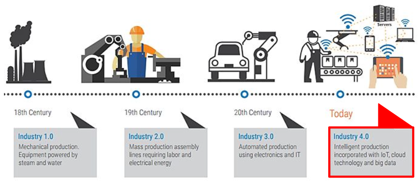
</figure>

<figure data-latex-placement="h!">
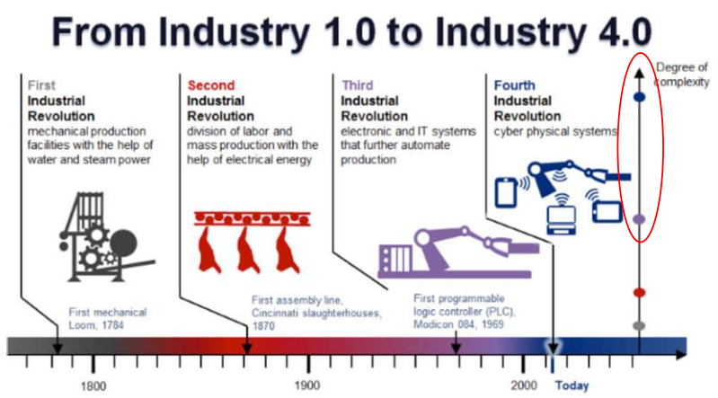
</figure>

### L’industria 4.0: l’era dell’integrazione

Con l’**Industria 4.0** (intorno al 2010) si assiste a un **cambio epocale**, che è centrato sull’**integrazione orizzontale e verticale** dei sistemi produttivi.

- L’integrazione **orizzontale** riguarda la **connessione** tra le diverse **fasi** del processo produttivo, lungo tutta la filiera aziendale. Significa che sistemi e reparti che prima lavoravano in modo separato (ordini, approvvigionamento materiali, produzione, assemblaggio, logistica) ora sono **interconnessi e coordinati in tempo reale**, permettendo un flusso continuo e coerente di informazioni.

- L’integrazione **verticale** collega invece i **livelli operativi** della produzione con i **livelli gestionali e decisionali** dell’azienda, tramite due sistemi fondamentali:

  - Il **MES** *(Manufacturing Execution System)*: sistema intermedio che supervisiona, controlla e traccia le attività produttive in fabbrica, raccogliendo dati in tempo reale dalle macchine e dagli operatori.

  - L’**ERP** *(Enterprise Resource Planning)*: sistema gestionale che coordina le risorse aziendali (finanze, acquisti, personale, magazzino) e fornisce una visione strategica complessiva.

  In un contesto di Industria 4.0, il MES dialoga direttamente con i robot e gli impianti automatizzati, mentre l’ERP utilizza queste informazioni per ottimizzare la pianificazione e le decisioni aziendali.

Un robot (es. in una fabbrica automobilistica) non è più solo una macchina automatizzata: è connesso a Internet e **controllato da remoto** da un operatore che ne imposta le attività. In questo modo, le tecnologie dell’industria 3.0 vengono **integrate** in un **ecosistema digitale connesso**.

### Digital Twin

Un **Digital Twin** è una replica virtuale di un oggetto fisico, un processo o un sistema. La sua funzione è **simulare, monitorare e analizzare in tempo reale** il comportamento dell’entità reale, permettendo di anticipare guasti, ottimizzare le prestazioni e valutare scenari alternativi senza intervenire fisicamente.  
  
Quando si progetta un sistema complesso, il Digital Twin deve essere inserito nel **modello concettuale** del prodotto. Può contenere dati di utilizzo del robot o della macchina, metriche operative (carico, cicli, tempi di lavoro), indicatori di salute e manutenzione predittiva, misure di efficacia (come la capacità del sistema di adattarsi all’ambiente, per esempio un robot aspirapolvere dotato di sensori di polvere che decide autonomamente dove passare più tempo).  
  
I dati raccolti hanno valore solo se vengono **utilizzati per migliorare** il funzionamento del sistema o l’esperienza dell’utente: senza uno scopo chiaro, il prodotto diventa soltanto "un oggetto che invia dati a un server" senza alcun beneficio reale.

### L’industria 5.0: sostenibilità e consapevolezza

Siamo già entrati nell’era dell’**industria 5.0**, che estende i principi della 4.0 integrando i temi legati all’**ESG** *(Environmental, Social, and Governance)*. L’obiettivo non è più solo produrre di più e più velocemente, ma farlo in modo **sostenibile** e **responsabile**.  
  
In particolare, si considerano i **consumi energetici**, l’uso di **acqua e risorse**, la quantità di **scarti** e le **emissioni**. Non si guarda solo ai **costi presenti**, ma anche ai **costi futuri e ambientali**. Ad esempio, la produzione di un tavolo non deve essere valutata solo in termini economici (*"quanto costa il legno?"*), ma anche in termini di **impatto ambientale** (*"quali conseguenze comporta tagliare milioni di alberi?"*).  
  
Stanno nascendo **software specifici** che permettono di mappare e monitorare questi “costi” aggiuntivi, fornendo una visione più ampia e consapevole della produzione. Ogni salto industriale ha portato con sé un aumento della **complessità dei sistemi**. Oggi, la quantità di informazioni da gestire **supera le capacità cognitive umane**, e si richiede alle persone di mantenere competenze in domini sempre più ampi e interdisciplinari.  
  
In questo contesto entra in gioco l’**intelligenza artificiale (IA)**, che aiuta a gestire, interpretare e filtrare l’enorme flusso di dati generato. Paradossalmente, i sistemi creati per aumentare la visibilità delle fabbriche hanno prodotto talmente tante informazioni da *“accecare”* gli **operatori**: prima le persone erano “al buio” perché non avevano strumenti per vedere cosa accadeva realmente nei processi produttivi, ma ora sono immerse in una “luce bianca” di dati che rende comunque difficile orientarsi.  
  
Finora, l’industria 4.0 è stata un esempio di **sustaining innovation**, un miglioramento incrementale. Il modo di produrre automobili, ad esempio, non è cambiato radicalmente: una Tesla viene assemblata secondo lo stesso principio di una vecchia Fiat 126, solo che alcune fasi manuali sono oggi svolte da robot.  
  
L’industria 5.0, invece, rappresenta una **disruptive innovation**, introducendo nuovi paradigmi e modelli produttivi. Per evolvere, occorre smettere di pensare semplicemente a “collegare tutto a Internet”. L’**IoT tradizionale è destinato a fallire** se non torna a perseguire il suo vero scopo: **semplificare** la vita delle persone, non complicarla con funzioni o notifiche inutili.  
  
Ogni progresso tecnologico comporta la perdita di alcune competenze e l’acquisizione di altre. Abbiamo eliminato lavori dannosi (come la saldatura manuale in ambienti tossici), ma resta aperta la questione sociale: come reinserire e valorizzare le persone in questo **nuovo ecosistema produttivo?** Il compito principale non è più “collegare dispositivi a Internet”, quello ormai si sa fare, ma **progettare interfacce e sistemi intelligenti** che permettano agli esseri umani di orchestrare in modo efficace ciò che è connesso.  
  
Le vere sfide del futuro industriale non riguardano più la **funzionalità** tecnica, ma l’**utilità** e l’**usabilità**. Bisogna tornare a progettare soluzioni che migliorino davvero l’esperienza e la qualità della vita delle persone, ponendo l’uomo, e non la tecnologia, al centro del sistema produttivo.

## Progettare l’IoT per l’outcome umano

Prima ancora di connettere un dispositivo a Internet, è essenziale definire quale sarà lo **scopo del prodotto**:

> *In che modo la connessione migliorerà la vita dell’utente? Quale outcome umano produce?*

Pensare a un sistema IoT significa ampliare il modello concettuale: oltre al prodotto fisico, entra in gioco tutto il mondo dei **servizi digitali**, gestione dati ecc. Realizzare un sistema di industria 4.0 non è adottare una singola tecnologia, ma avere una **visione olistica** che sfrutta molte tecnologie insieme. L’obiettivo non è la mera connettività, ma la creazione di **valore** e di un **outcome significativo per l’essere umano** coinvolto.

<figure data-latex-placement="h!">

</figure>

<figure data-latex-placement="h!">
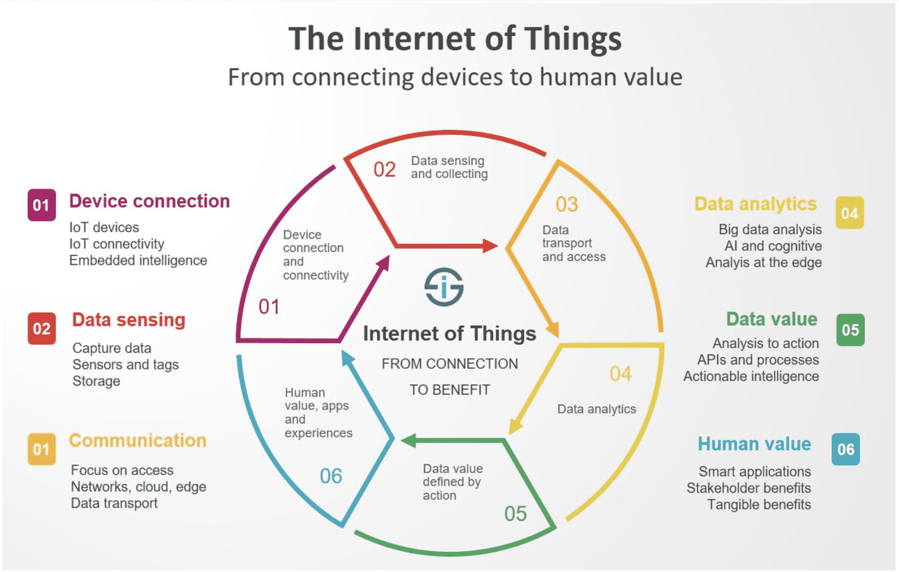
</figure>

La maggior parte delle grandi tecnologie nasce nel mondo **professionale** e solo dopo sono state sviluppate per il comune consumatore. Alcuni esempi sono l’ABS (inizialmente per la Formula 1), airbag, materiali come plexiglass o kevlar.  
  
Con l’**IoT** è avvenuto il **contrario**: la rivoluzione è partita *"dal basso"*, dalla comunità dei **maker**, dalle piattaforme come **Arduino** e **Raspberry Pi**. Questo implica che non si può progettare l’IoT ignorando l’essere umano comune che lo ha reso possibile e che ne è oggi il principale utilizzatore. L’IoT arriva prima nelle case che nelle aziende.

<figure data-latex-placement="h!">
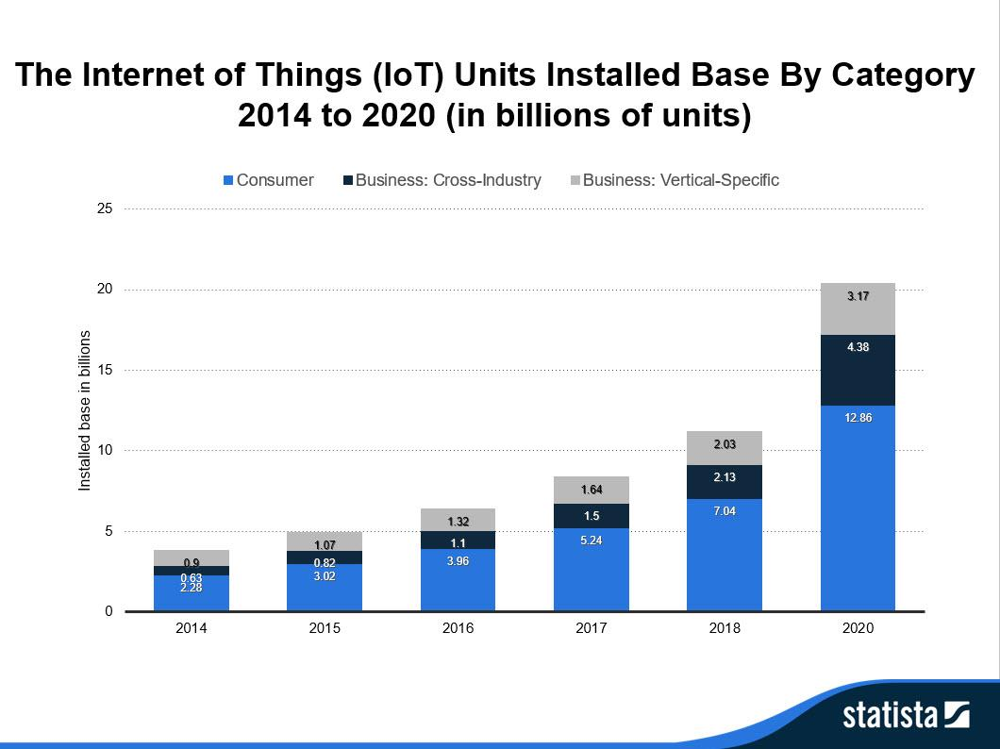
</figure>

Le smart city rappresentano casi di successo (gestione semaforica, ZTL, sensori ambientali). Tuttavia, il settore industriale è quello in cui l’IoT è più pervasivo: le industrie sono relativamente poche ma fortemente automatizzate, e si prevede che entro il 2026 **quasi ogni risorsa industriale sarà connessa**.

<figure data-latex-placement="h!">
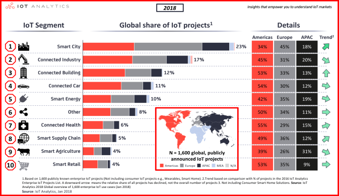
</figure>

Tuttavia, l’IoT **non** è più una **tecnologia innovativa**: già nel 2018 l’IoT aveva superato il **picco dell’hype**, e a sette anni di distanza non può essere considerato una tecnologia “nuova”. Pensarlo ancora così conduce a **overengineering**, ovvero inserire IoT nei prodotti solo perché "fa figo", senza che esista un bisogno reale.

<figure data-latex-placement="h!">
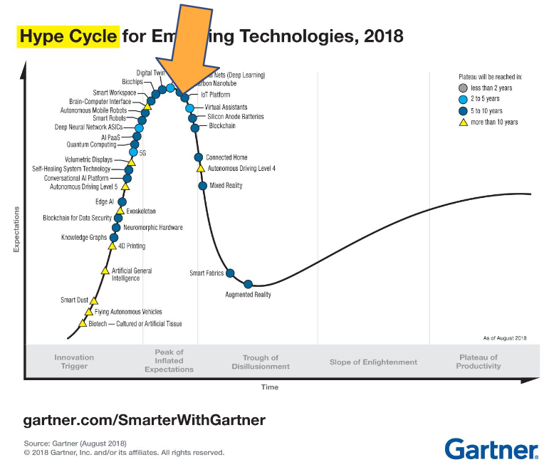
</figure>

Oggi l’IoT è una **tecnologia abilitante**, abilitante alla creazione di nuovi servizi digitali, alla manutenzione predittiva, a modelli di business basati sui dati, alla personalizzazione dell’esperienza utente e alla generazione di valore e outcome per l’essere umano. "Mettere Internet nelle cose" non deve essere più il fine, è solo un mezzo per realizzare prodotti e servizi che abbiano reale **utilità**.

<figure data-latex-placement="h!">

</figure>

### Come cambia l’esperienza UX con l’IoT

Quando aggiungiamo l’IoT ai prodotti, cambia completamente il modo in cui li percepiamo e li utilizziamo. L’**user experience** si estende infatti su tutto il ciclo di vita:

- **Prima dell’acquisto**, quando ci facciamo un’idea dell’esperienza che avremo (spesso guidata proprio dall’immaginario IoT).

- **Durante l’uso**, dove il prodotto diventa parte di un sistema di servizi.

- **Dopo l’utilizzo**, fase in cui può generare fidelizzazione oppure distanza dal prodotto.

Quando inseriamo servizi, la nostra **immagine di sistema** non riguarda più solo il modello concettuale dell’oggetto: iniziamo a immaginarci tutto il percorso d’uso e l’esperienza complessiva. Non parliamo di software come Netflix, ma di **oggetti fisici servitizzati**, cioè prodotti a cui aggiungiamo servizi veri e propri.

<figure data-latex-placement="h!">

</figure>

### Servitizzazione degli oggetti

È possibile che tra dieci anni non compreremo più la lavatrice: ci verrà consegnata a casa e pagheremo un abbonamento in base all’utilizzo. Questa è una **disruptive innovation** resa possibile dalle tecnologie IoT che già esistono, ma non viene implementata oggi solo perché il mercato non è ancora pronto.  
  
In questo scenario, sui siti non troveremmo più le "caratteristiche tecniche" della lavatrice, ma **pacchetti di lavaggio**. È come se la lavatrice a gettoni venisse portata direttamente a casa, e tramite app acquistassimo i lavaggi. La lavatrice diventerebbe quindi **un mezzo per erogare un servizio**, non più il prodotto da vendere.

### Prodotti smart e assistenti vocali

I prodotti smart e gli assistenti vocali sono una versione ridotta e semplificata dei sistemi di ricerca delle aziende, pensati per andare incontro alle capacità limitate dell’utente. Dire *"Hey Siri, fai questo"* ci semplifica la vita non perché non sappiamo fare un’azione, ma perché in quel momento stiamo gestendo molte cose insieme.  
  
Dispositivi come Amazon Echo o Google Home sono un grande esercizio di design: ci si è chiesti come portare **Google** nella **vita quotidiana delle persone**, e da lì sono nati assistenti vocali, smartwatch e altri oggetti smart.  
  
Google non guadagna dal prezzo di vendita dei dispositivi Google Mini, ma dal loro vero scopo: **vendere pubblicità**. Google non è un motore di ricerca, ma un’azienda di **advertising**. Mettere Google in casa serve a far "affezionare" l’utente, così da poter proporre inserzioni altamente personalizzate. L’obiettivo è mostrarti, tra le tante inserzioni dei clienti che pagano Google, **quella con maggiore probabilità di essere cliccata**.

<figure data-latex-placement="h!">
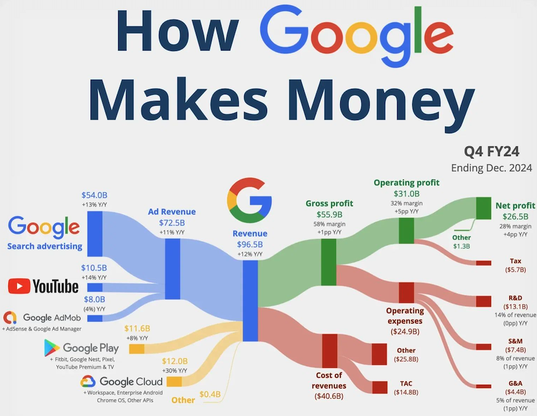
</figure>

## La complessità dei sistemi IoT

Progettare sistemi IoT è molto più complesso che progettare sistemi web: richiede una comprensione estremamente chiara del **bisogno dell’utente**, perché se il sistema non produce un impatto reale, fallirà. Un problema è sviluppare un’app con un’**interfaccia incoerente rispetto al prodotto fisico**. Nel mondo IoT il **modello concettuale** deve essere uniforme, distribuito e perfettamente corrispondente tra oggetto e applicazione. Inoltre, l’idea di “comandare tutto da app” è ormai superata, in quanto spesso l’esperienza utente è integrata direttamente nel dispositivo fisico.  
  
Fare design nell’IoT è complicato perché molti oggetti sono **verticali** e altamente **specializzati** (una lampadina è una lampadina, un termostato è un termostato). Il trucco è creare interfacce digitali che **mimino il più possibile** le interfacce fisiche. Per esempio, un’app che mostra il termostato con la stessa disposizione dei controlli reali, così che i punti in cui tocchiamo lo schermo corrispondano ai punti in cui premeremmo fisicamente. Nel mondo IoT non possiamo mai rompere la **consistenza dell’esperienza**.

<figure data-latex-placement="h">
<div class="minipage">

</div>
<div class="minipage">

</div>
</figure>

Un altro problema è che molti prodotti IoT non sono dispositivi singoli, ma **reti di dispositivi**. Un esempio è dato da termostato e valvole che comunicano tra loro: per esempio, *Netatmo* si limita a dire “collega le valvole in tutte le stanze tranne quella del termostato”, e l’utente vede semplicemente le stanze regolandone la temperatura. Noi designer non dobbiamo spiegare l’architettura ("il termostato è il main gateway...”), ma dobbiamo solo spiegare **come l’utente lo usa**.

<figure data-latex-placement="h!">
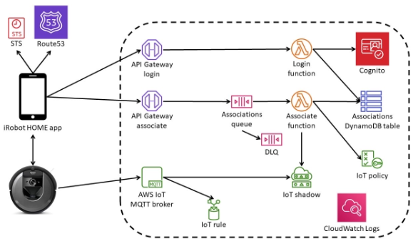
</figure>

Inoltre, gli oggetti fisici non hanno **Undo**: non esiste un “Ctrl+Z”. Quando il sistema esegue un’azione, l’effetto è reale. Per questo il comportamento deve essere coerente sia dal dispositivo fisico sia dall’app. Inoltre, la complessità aumenta enormemente quando le azioni sono eseguite da remoto: non siamo presenti e la connessione può non essere affidabile. È possibile ricevere una notifica “eseguito” sull’app anche se la rete si è interrotta e l’azione non è stata realmente compiuta. Quando si fa un prodotto IoT dobbiamo prendere in considerazione tantissime cose, e il numero di combinazioni possibili è enorme.

<figure data-latex-placement="h!">

</figure>

Nel web la rete non è quasi mai un problema: se l’utente è sulla pagina, significa che sta funzionando. Nell’IoT, invece, bisogna progettare dando per scontato che la rete **non è affidabile**. Non si parla solo della fibra di casa, ma anche la rete interna che i dispositivi creano per comunicare con il gateway e poi con il router.  
  
Come si può dare un feedback entro 100ms se non possiamo garantire che il task sia stato eseguito La soluzione è inviare **feedback multipli**: aggiornamento visivo immediato (*pulsante premuto*), conferma che la richiesta è stata inviata al dispositivo, conferma finale del dispositivo, se arriva. Senza questi livelli, l’utente potrebbe premere ripetutamente con conseguenze indesiderate.  
  
Infine, nell’IoT bisogna considerare i vincoli di **power saving**. Per esempio, le telecamere Amazon con batteria integrata registrano solo quando il sensore rileva movimento. Se volessimo uno streaming continuo, dovremmo **riprogettare l’hardware**, perché cambiano consumo, componenti e capacità della batteria. Il risparmio energetico trasforma funzioni apparentemente banali in problemi complessi a livello fisico e progettuale.

<figure data-latex-placement="h!">
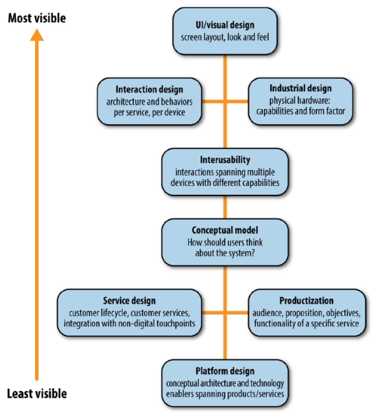
</figure>

<figure data-latex-placement="h!">
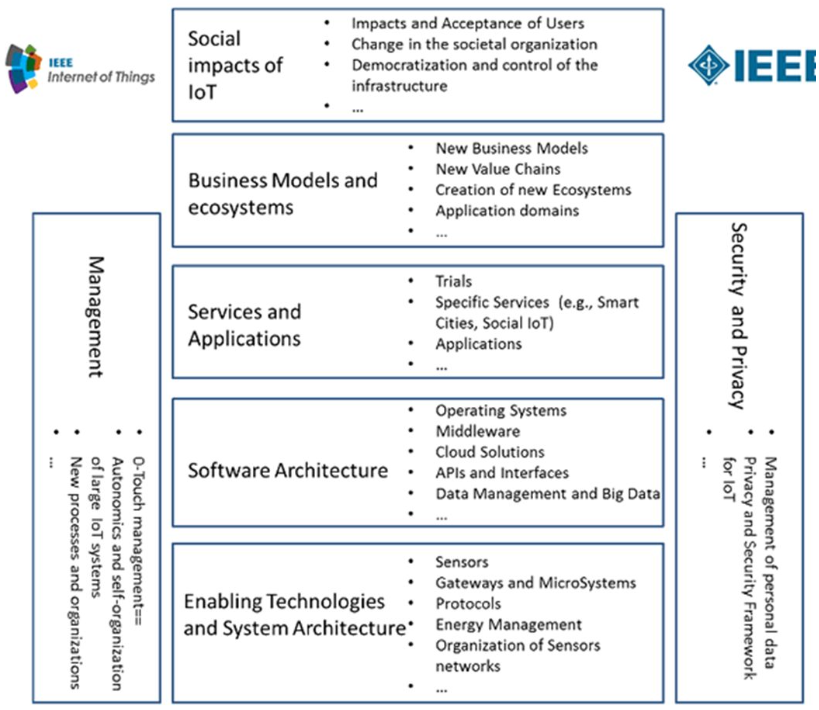
</figure>

# UX for Artificial Intelligence (AI)

L’**AI** è ormai **ovunque**: assistenti vocali, sistemi di raccomandazione, veicoli autonomi, diagnosi medica, generazione di contenuti, motori di ricerca, dispositivi smart home, assistenti virtuali, rilevamento delle frodi e via dicendo.

<figure data-latex-placement="h!">
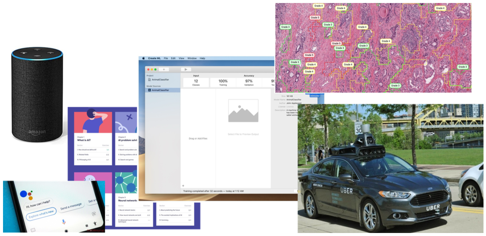
</figure>

Ma c’è un **problema**:

- Quando l’AI funziona, è incredibile.

- Quando fallisce, fallisce in modo spettacolare.

- Gli utenti non capiscono perché o come.

<figure data-latex-placement="h!">

</figure>

I sistemi di AI richiedono **approcci di UX diversi** rispetto al software tradizionale. L’obiettivo è progettare prodotti in cui gli utenti si affidino all’AI nel modo corretto, ovvero né troppo, né troppo poco.

## Cosa rende diversa l’UX dell’AI?

I sistemi AI operano sotto **incertezza**. I software tradizionali sono deterministici (stesso input restituisce stesso output), hanno un comportamento prevedibile ed una relazione causa–effetto chiara. Tuttavia, i **sistemi AI**:

- **Probabilistici**: stesso input restituisce un output potenzialmente diverso.

- Possibili **falsi positivi** e **falsi negativi**.

- Processo decisionale opaco (modelli **black box**).

- Comportamenti **imprevedibili**: possono essere confusivi, dirompenti o pericolosi.

L’AI **può essere errata**, e questo cambia radicalmente il modo in cui dobbiamo progettare l’esperienza utente.

<figure data-latex-placement="h!">
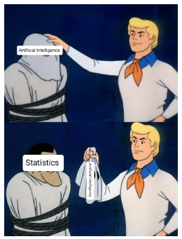
</figure>

### Appropriate Intelligence

Questo principio consiste nel progettare sistemi di AI che **funzionino** davvero nel **mondo reale**, non solo in una demo. L’AI dovrebbe essere **corretta il più spesso possibile** e, quando lo è, dovrebbe produrre risultati di **buona qualità** e **utili** per l’utente.  
  
Un aspetto fondamentale è mantenere alcune parti dell’**interfaccia** **prevedibili**, anche quando l’AI è incerta o può sbagliare. Questo permette all’utente di avere sempre una **via d’uscita sicura** e **deterministica**.  
  
Un esempio tipico è un menù adattivo: l’AI propone suggerimenti nella parte superiore, ma l’elenco completo, ordinato alfabeticamente, rimane sempre disponibile sotto. In questo modo, se l’AI fallisce, l’utente non resta bloccato.  
  
È importante ricordare che piccoli errori dell’AI, soprattutto se ripetuti o percepiti come “stupidi”, tendono a rimanere impressi e possono causare un livello di frustrazione sproporzionato rispetto all’entità dell’errore stesso.

### Paradigm Shift: Human-Centered AI

L’idea di *Human-Centered AI* è quella di progettare sistemi che amplificano, aumentano e migliorano le capacità umane, mantenendo al tempo stesso affidabilità, sicurezza e fiducia. L’AI **non sostituisce l’utente**, ma lo **supporta**.  
  
Il vecchio approccio è definito **Algorithm-First**: si concentra su algoritmi e modelli, gli utenti vengono considerati solo alla fine, e si presume che la "magia dell’AI" risolva tutto. Tuttavia, questo approccio fallisce per vari motivi:

- **Cold start**: un sistema progettato solo attorno all’algoritmo non ha abbastanza informazioni sugli utenti, obiettivi o contesto. Di conseguenza, all’inizio non sa cosa suggerire o come adattarsi, producendo risultati scarsi o irrilevanti.

- **Mancanza di controllo per l’utente**: se l’AI prende decisioni senza coinvolgere le persone, gli utenti non possono correggere errori, guidare il sistema o personalizzare il comportamento. Questo porta a frustrazione, sfiducia e uso scorretto dell’AI.

- **Il contesto è fondamentale**: un modello può essere accurato nei test, ma fallire nel mondo reale se non considera il contesto d’uso. L’AI non può generalizzare bene senza comprendere cosa l’utente sta cercando di fare.

Il nuovo approccio **Human-Centered** mette al centro le **persone**, non l’algoritmo. Invece di valutare solo l’accuratezza del modello, si misura come l’**AI contribuisce alla performance umana**: quanto facilita il compito, quanto aiuta a prendere decisioni migliori e quanto riduce errori e fatica.  
  
L’obiettivo **non** è sostituire gli umani, ma la **collaborazione** tra gli umani e i sistemi di AI. L’AI deve diventare uno strumento che amplifica le loro **capacità**, fornendo supporto nei momenti critici e **lasciando a loro** il **controllo** delle decisioni importanti.  
  
Un sistema Human-Centered deve inoltre essere **trasparente** ed **esplicabile**: l’utente deve capire perché l’AI suggerisce qualcosa o perché ha preso una certa decisione. Solo così può svilupparsi una fiducia appropriata.  
  
Questo approccio richiede di offrire all’utente livelli di controllo adeguati: la possibilità di intervenire, correggere, regolare o personalizzare il comportamento del sistema, in modo che l’AI diventi un partner collaborativo, non una “black box” che decide da sola.

<figure data-latex-placement="h!">
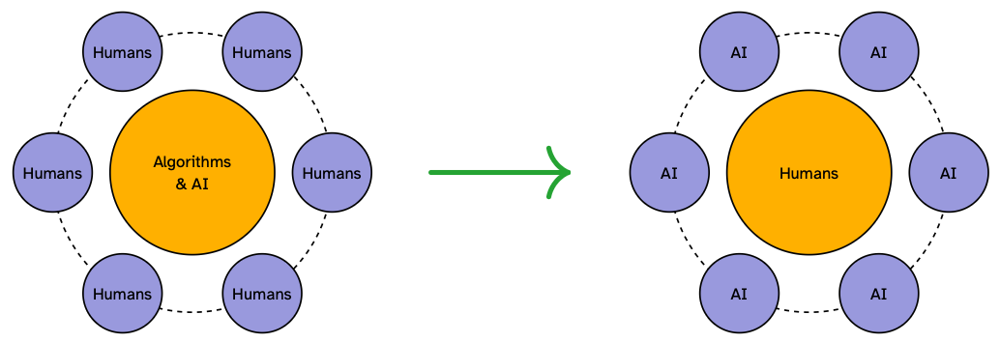
</figure>

## Building appropriate Reliance

Il termine **reliance** riguarda il modo in cui l’**utente si affida all’AI**. Si possono verificare tre situazioni:

1.  **Over-reliance**: dipende dal sistema pure quando non dovrebbe (*automation bias*).

2.  **Under-reliance**: ignora l’AI anche quando potrebbe essere utile (disuse)

3.  **Appropriate reliance**: affidamento calibrato sulla reale performance del sistema.

L’obiettivo è far sì che il **comportamento dell’utente corrisponda** alle reali **capacità effettive dell’AI**:

- Quando l’accuratezza è alta e il rischio è basso, va bene affidarsi di più al sistema.

- Quando l’accuratezza è bassa o le decisioni sono ad alto impatto, l’affidamento deve essere più cauto.

- Gli utenti devono poter capire chiaramente quando è appropriato fidarsi dell’AI e quando è preferibile verificare.

La **trust** rappresenta la credenza o la fiducia psicologica nel sistema di AI. È influenzata da aspetti emotivi, difficile da misurare e può essere una fiducia cieca e non giustificata.  
  
La **reliance**, invece, descrive quanto gli utenti **dipendono** realmente dall’AI nel loro comportamento. È osservabile, misurabile, può essere quantificata (es. pattern d’uso) e può essere calibrata alla performance reale del sistema.  
  
Il problema della fiducia da sola è che non garantisce un comportamento adeguato. È possibile che un utente si fidi di un sistema ma non lo utilizzi comunque, oppure che si fidi troppo e non noti gli errori. Ciò che conta è la *reliance*, perché è ciò che determina gli esiti concreti dell’interazione.

### Il Reliance Toolkit: Tre meccanismi

Per costruire una reliance appropriata, è necessario fornire tre meccanismi fondamentali:

1.  **Explainability**: aiutare gli utenti a capire il **perché**. Mostrare la gamma completa delle capacità del sistema, chiarire come gli input influenzano gli output e costruire una comprensione causa–effetto. È importante essere specifici sulle performance: ad esempio, “90% di accuratezza su X, 60% su Y”.

2.  **Transparency**: aiutare gli utenti a capire **quando** fare affidamento. Rendere visibili i **livelli di confidenza** delle predizioni, mostrare performance per contesto o categoria, avvisare quando le condizioni differiscono dai dati di training e indicare quando è raccomandata una verifica umana.

3.  **Control**: dare agli **utenti** la giusta dose di **autonomia**, consentendo il controllo sui dati forniti al sistema e sulle informazioni personali, offrendo possibilità di modifica o gestione dei risultati prodotti dall’AI e, soprattutto, garantendo sempre un’opzione di **override** o un’uscita alternativa.

### Augmentation vs. Automation

Il rapporto tra esseri umani e AI **non è una scelta binaria**. Esiste uno spettro continuo che va dal **potenziamento delle capacità umane** alla **completa automazione**. La sfida è **scegliere il livello appropriato** in base a compito, rischio e maturità del sistema.  
  
**Augmentation** indica che l’AI **amplifica le capacità umane** senza sostituirle. In questo scenario il sistema supporta l’utente proponendo alternative, suggerendo opzioni o eseguendo un’azione solo dopo conferma. La decisione finale rimane sempre all’umano.  
  
L’**automazione** può essere **aumentata** quando i compiti sono **ripetitivi**, noiosi o **pericolosi**, quando gli errori hanno conseguenze basse, quando l’AI raggiunge un’elevata accuratezza e quando l’utente può annullare o correggere facilmente.  
  
**Automation** indica che l’AI esegue da sola compiti o decisioni. Qui il sistema agisce autonomamente, informa quando necessario e decide quando coinvolgere l’utente. Con l’aumento dell’automazione, il ruolo umano tende a ridursi.  
  
È necessario **mantenere il controllo umano** quando le decisioni sono ad **alto impatto**, l’AI è in una fase iniziale di apprendimento, compaiono casi nuovi o ai margini del dominio, l’utente deve monitorare o imparare dal sistema.  
  
La scelta del livello di automazione deve considerare tre fattori fondamentali:

1.  Il **tipo di compito**.

2.  Le **conseguenze degli errori**.

3.  La **maturità del sistema**.

<figure data-latex-placement="h!">
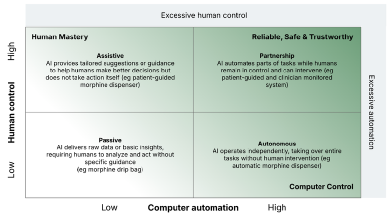
</figure>

## Feedback & Learning: come migliorano i sistemi AI

Il feedback è fondamentale perché i sistemi di AI **imparano consumando dati** e **ricevendo segnali sui loro output**. È attraverso il feedback che gli utenti "insegnano" all’AI a comportarsi nel modo desiderato.  
  
A differenza del software statico, l’AI è **dinamica**: si adatta nel tempo, corregge gli errori e migliora la qualità delle sue previsioni. Il feedback diventa quindi un canale di comunicazione bidirezionale tra utenti, prodotto e team di sviluppo.  
  
Per esempio, quando diciamo "seduto" al gatto, può o non può obbedire. Se obbedisce, riceve una ricompensa e il premio costituisce il feedback. Nel tempo, attraverso la ripetizione, il gatto impara l’associazione tra comando, azione e ricompensa. I **feedback loop** sono essenziali in qualsiasi sistema di apprendimento.

<figure data-latex-placement="h!">
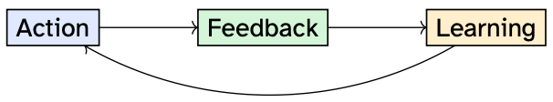
</figure>

Ci sono **tre tipi di feedback** per un sistema AI:

1.  **Feedback esplicito**: l’utente fornisce **volontariamente** un **giudizio** per migliorare il sistema (ad esempio un pollice su/giù). È diretto, intenzionale e chiaro.

2.  **Feedback implicito**: viene inferito dal **comportamento dell’utente**, come *pattern di click*, tassi di skip o tempi di permanenza. È indiretto e basato sull’osservazione.

3.  **Feedback duale**: combina segnali espliciti e impliciti. Un esempio tipico è Spotify:

    - Implicito: quanto tempo ascolti un brano.

    - Esplicito: pulsanti "like" o "skip".

    Questo approccio fornisce un segnale più ricco di ciascuna modalità da sola.

La scelta del tipo di feedback dipende dal contesto d’uso, dallo sforzo richiesto all’utente e dalla qualità del segnale necessaria al sistema. Per progettare feedback efficaci occorre seguire **tre principi pratici**:

1.  **Facilità d’uso**: ridurre al minimo lo sforzo dell’utente. Idealmente, il feedback dovrebbe richiedere un solo click e non interrompere il flusso principale dell’attività.

2.  **Mostrare l’impatto**: gli utenti devono percepire che il loro feedback ha un effetto reale. È utile rispondere immediatamente (*"Grazie per il tuo feedback!"*), mostrare miglioramenti a lungo termine, e offrire anche una vista del feedback già inviato.

3.  **Rispetto del contesto**: evitare richieste di feedback eccessive. È importante considerare le motivazioni dell’utente (ricompensa, utilità, altruismo, auto-espressione) e integrare la richiesta nel flusso naturale delle attività.

I team di esseri umani e AI, quando progettati bene, diventano collettivamente più intelligenti. Il feedback è il motore che permette questa collaborazione simbiotica.

## Principi di Design per l’interazione AI

I principi seguenti offrono strategie pratiche per progettare interazioni con l’AI che risultino chiare, affidabili e realmente utili agli utenti.

### Principio 1: Impostare aspettative chiare

- **Durante l’onboarding**: mostrare cosa il sistema può e non può fare (accuratezza e limitazioni), spiegare come apprende ed evitare promesse di "magia dell’AI".

- **Durante l’uso**: mostrare i livelli di confidenza, indicare se il sistema è incerto, spiegare i comportamenti inattesi ed informare gli utenti sui cambiamenti del sistema.

*Promettere meno e offrire di più, mai il contrario.*

<figure data-latex-placement="h!">
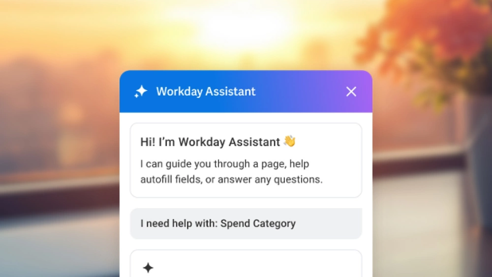
</figure>

<figure data-latex-placement="h!">
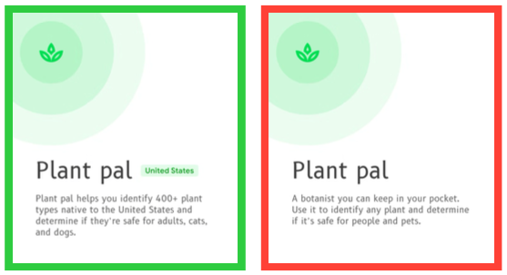
</figure>

### Principio 2: Progettare per gli errori

- **Tipi di errore dell’AI**

  - Errori di **sistema**: guasti tecnici, crash.

  - Errori del **modello**: predizioni errate, allucinazioni.

  - Errori nei **dati**: dati di training scarsi o distorti.

  - Errori di **rilevanza**: risultati corretti ma irrilevanti.

  - Errori dell’**utente**: input poco chiari, incomprensioni.

- **Strategie di gestione degli errori**: indicare quando si verifica un errore, spiegando cosa è andato storto e permettendo la correzione dell’errore.  
    
  Facilitare un recupero semplice e rapido restituendo il controllo all’utente, ed usare gli errori per migliorare il sistema tramite feedback.

*Gli errori dell’AI sono inevitabili, l’importante è progettare un fallimento elegante.*

<figure data-latex-placement="h">
<div class="minipage">
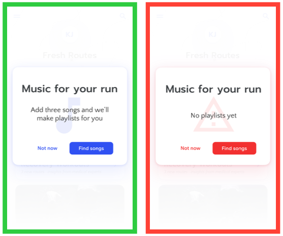
</div>
<div class="minipage">
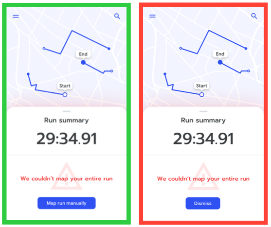
</div>
</figure>

<figure data-latex-placement="h!">
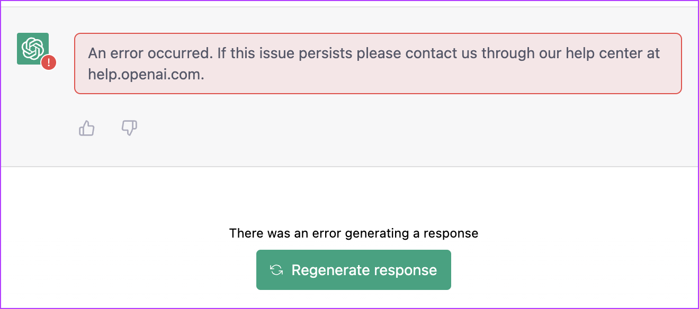
</figure>

### Principio 3: Bilanciare complessità e controllo

- **Progressive Disclosure**: iniziare **semplice**, aggiungere complessità nel tempo. Mostrare prima le funzionalità di base nascondendo la complessità iniziale all’utente, permettendogli di esplorare gradualmente mentre si costruisce modelli mentali.

- **Rispettare l’autonomia dell’utente**: fornire sempre **controllo** in modo tale che gli utenti possono ignorare o sovrascrivere le decisioni dell’AI. Dare una via d’uscita semplice e immediata dalle funzionalità AI, la possibilità di resettare o rimuovere preferenze apprese e controlli chiari sui dati (visualizzare, modificare, eliminare). Non ci deve essere alcuna automazione forzata

- **Il pattern**

  - Inizialmente: più controllo, meno automazione.

  - Con il tempo: più automazione, mantenendo il controllo.

  - Sempre: vie d’uscita chiare e comportamenti deterministici di riferimento.

*Dare all’AI il tempo di imparare, e agli utenti il tempo di sviluppare fiducia.*

<figure data-latex-placement="h!">
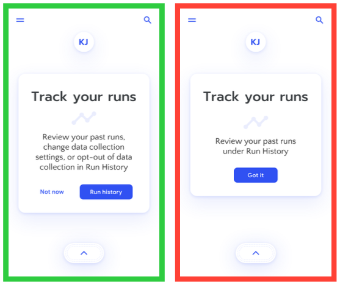
</figure>

## Contesto e Trade-offs

Le esigenze di design crescono proporzionalmente alla posta in gioco. Più sono alti gli **stakes** (ovvero quanto può andare storto se l’AI sbaglia), maggiore deve essere la qualità di trasparenza, controllo ed explainability.

- **High-stakes AI** (diagnosi medica, decisioni finanziarie, giustizia penale)

  - Richiede: **massima trasparenza**, **controllo** ed **esplicabilità**.

  - Errori: conseguenze **catastrofiche**.

  - Tolleranza dell’utente: molto bassa.

  - Approccio di design: **forte controllo umano**, AI come advisor.

- **Medium-stakes AI** (raccomandazioni lavorative, content moderation, istruzione)

  - Richiede: buona trasparenza e **controllo moderato**.

  - Errori: **significativi** ma non irreversibili.

  - Tolleranza dell’utente: moderata.

  - Approccio di design: potenziamento bilanciato.

- **Low-stakes AI** (raccomandazioni musicali, filtri fotografici, autocomplete)

  - Richiede: trasparenza di **base**.

  - Errori: **fastidiosi** ma innocui.

  - Tolleranza dell’utente: relativamente alta.

  - Approccio di design: maggiore **automazione**, mantenendo un override.

<figure data-latex-placement="h!">
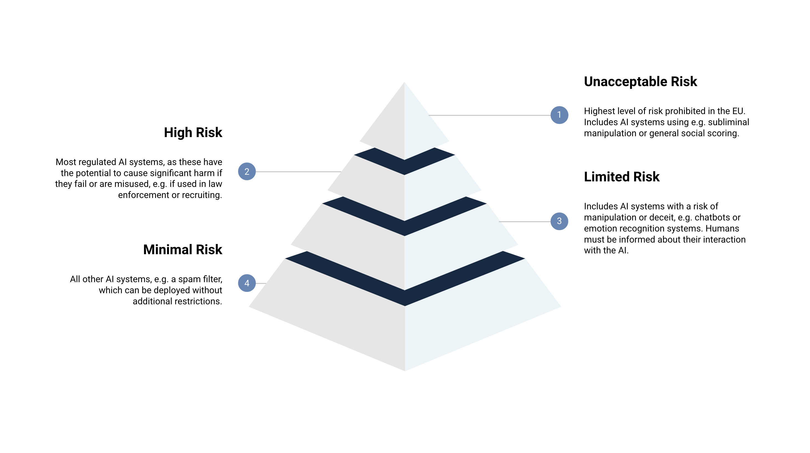
</figure>

### Precision e Recall

Per **valutare** correttamente le **prestazioni di un modello**, è fondamentale partire dalla *confusion matrix*. Da essa derivano due metriche chiave: **precision** e **recall**.

<figure data-latex-placement="h!">
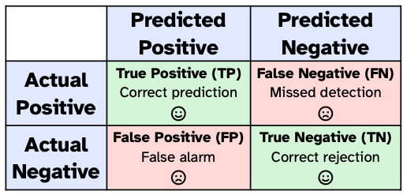
</figure>

``` math
\text{Precision} = \frac{TP}{TP + FP}, \quad \quad \quad\text{Recall} = \frac{TP}{TP + FN}
```

- Precision: *"Quando ha trovato qualcosa, quanto spesso è corretto?"*

- Recall: *"Di tutte le cose che avrebbe dovuto trovare, quante le individua davvero?"*

<figure data-latex-placement="h!">
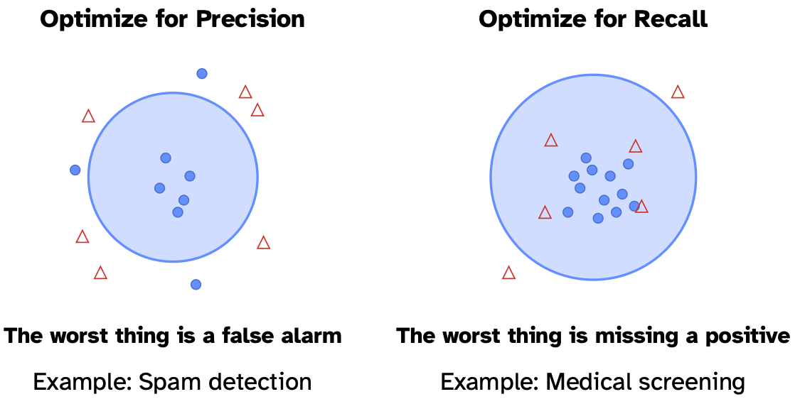
</figure>

### "To AI or Not to AI?"

Non bisogna usare l’AI solo perché è di tendenza, ma solo quando rappresenta davvero lo strumento più adatto al problema.  
  
L’AI è probabilmente la scelta migliore quando il sistema deve raccomandare contenuti diversi a utenti diversi, quando è necessario prevedere eventi futuri o quando la personalizzazione porta un miglioramento significativo dell’esperienza. È utile anche nei casi in cui l’interazione in linguaggio naturale aggiunge valore, quando occorre riconoscere pattern complessi in grandi quantità di dati, oppure quando il compito coinvolge categorie troppo ampie per poter essere enumerate manualmente.  
  
L’AI è invece probabilmente **non** la scelta migliore quando la prevedibilità è l’aspetto più importante, quando il costo di un errore è molto elevato e le conseguenze possono essere gravi, oppure quando la velocità e la semplicità sono elementi essenziali. Non è ideale nemmeno nei casi in cui gli utenti devono sapere con precisione cosa accadrà, quando il problema può essere risolto con regole chiare o euristiche, o quando ci sono restrizioni severe in termini di conformità o necessità di explainability.  
  
*Considerare prima soluzioni più semplici, introdurre l’AI solo se aggiunge valore reale.*

### AI-Inclusive Design Process

Quando si progetta con l’AI, si iterano contemporaneamente tre elementi: l’interfaccia, il modello di AI e i dati.

1.  **Comprendere i bisogni degli utenti**: la base del processo rimane la comprensione dell’utente, con attenzione al livello di controllo di cui ha bisogno, agli stakes nel caso in cui l’AI sbagli e al modo in cui costruirà fiducia nel tempo.

2.  **Prototipare presto con test “Wizard of Oz”**: prima di costruire modelli reali, simulare l’AI per valutare l’esperienza utente. Questo permette di validare i pattern di interazione senza dover implementare l’infrastruttura di machine learning.

3.  **Definire i requisiti del modello in modo collaborativo**: designer e data scientist devono concordare insieme le metriche di successo. Non si deve misurare solo l’accuratezza del modello, ma anche la performance umana, la soddisfazione dell’utente e la capacità di completare i compiti.

4.  **Testare presto con dati reali**: la qualità dei dati influenza fortemente le prestazioni dell’AI, perciò è importante testare fin da subito con dati autentici, esplorare edge case e failure mode e migliorare progressivamente le strategie di raccolta dati.

5.  **Collaborazione continua**: l’intero processo richiede un flusso costante di comunicazione tra i team di design e di machine learning. È essenziale condividere ricerche utente, non solo richieste di funzionalità, e stabilire obiettivi comuni che vadano oltre la semplice performance algoritmica.

### Testare sistemi AI

**Cosa testare?** Quando si valuta un sistema di AI, è essenziale verificare se gli utenti riescono effettivamente a raggiungere i loro obiettivi e se comprendono come funziona il sistema. Occorre anche verificare se il loro livello di affidamento è calibrato in modo appropriato, se sono in grado di recuperare facilmente dagli errori, se si sentono in controllo dell’interazione e se il sistema è capace di fallire in maniera elegante senza creare confusione o frustrazione.  
  
**Come testare?** I metodi di valutazione possono includere test “Wizard of Oz”, in cui l’AI viene simulata nelle prime fasi per esplorare l’esperienza utente, oppure protocolli think-aloud che permettono di osservare il ragionamento degli utenti in tempo reale. Sono utili anche studi di completamento dei task, studi longitudinali per analizzare come la fiducia si sviluppa nel tempo, esperimenti A/B per confrontare diverse soluzioni e misure sia di feedback esplicito che implicito.  
  
*Testare presto, testare spesso, testare con utenti reali e dati reali.*

### Riassumendo l’UX per l’AI

1.  **L’UX per l’AI è diversa**: incertezza, opacità e comportamento probabilistico richiedono approcci progettuali nuovi rispetto al software tradizionale.

2.  **L’obiettivo è un affidamento appropriato**: non fiducia cieca, non disuso, ma una dipendenza calibrata sulle reali capacità dell’AI.

3.  **L’affidamento si costruisce attraverso tre meccanismi**: explainability (perché), transparency (quando) e control (quanto controllo ha l’utente).

4.  **I feedback loop sono essenziali**: l’AI migliora tramite feedback espliciti, impliciti e duali forniti dagli utenti.

5.  **Progettare per errori e incertezza**: impostare aspettative chiare, fornire un terreno deterministico e permettere un fallimento elegante.

6.  **Il contesto guida il design**: il livello di stakes, il rapporto precision/recall e le caratteristiche del task definiscono l’approccio progettuale.

7.  **Collaborare e iterare continuamente**: lavorare a stretto contatto con i team di ML, prototipare presto con Wizard of Oz e misurare anche gli outcome umani.

*L’obiettivo della Human-Centered AI è potenziare le capacità umane mantenendo il sistema affidabile, sicuro e degno di fiducia.*

