# User Experience Design (UX)

La **UX research** comprende tutte le attività che mettono in contatto il team di sviluppo con gli utenti, per comprendere come utilizzano il sistema, quanto sono soddisfatti e quali difficoltà incontrano. Ha un impatto soprattutto nelle **fasi iniziali e finali** del processo di sviluppo.  
  
I **metodi di UX research** servono a creare rappresentazioni realistiche e affidabili degli utenti target, così da progettare soluzioni mirate ai loro bisogni. Spesso tali bisogni non sono noti agli utenti stessi e possono essere scoperti attraverso l’attività di ricerca.  
  
Le **fasi intermedie** del processo sono invece curate dallo **UX design**, che si basa sui principi dello **user-centered design**: l’utente rappresenta la componente principale attorno alla quale viene costruita l’esperienza complessiva.

<figure data-latex-placement="h!">

</figure>

## User Personas

Quando si inizia un progetto, la prima attività consiste nell’identificare le **user personas**. Una **user persona** è un personaggio fittizio che rappresenta un potenziale tipo di utente del nostro sito o applicazione. All’interno dell’**user-centered design**, le personas aiutano il team di design a concentrare le proprie scelte progettuali sugli utenti reali. Esse costituiscono quindi una parte fondamentale della fase di **UX research** nello sviluppo.  
  
Durante l’**user research**, gli UX researcher raccolgono dati relativi agli obiettivi, ai comportamenti e alle frustrazioni degli utenti, per poi creare le personas che forniscono contesto e significato a tali dati.  
  
L’obiettivo è identificare l’ambito in cui si intende operare e capire chi sono i potenziali utenti (per esempio esperti tecnologici, persone anziane, studenti, ecc.). Anche un servizio semplice può coinvolgere più di un tipo di user persona, e questa fase serve proprio a individuarli tutti. Elencare e descrivere tutti i possibili tipi di personas rappresenta una sorta di **checklist per il designer**, che aiuta il team di sviluppo a comprendere la varietà di obiettivi e bisogni degli utenti.

All’interno di una stessa categoria di utenti è possibile distinguere personas differenti. Crearne troppo poche o troppe può essere problematico: se sono poche, si rischia di non rappresentare adeguatamente la diversità dell’utenza; se troppe, si rischia di frammentare eccessivamente o di pensare che l’app sia destinata “a tutti”, generalizzando troppo.  
  
Lo sviluppo delle user personas aiuta a costruire un **ponte tra l’azienda e i suoi utenti**. Questo processo guida le decisioni di design, permettendo al team di comprendere a fondo le persone per cui sta progettando, così da realizzare un sistema che esse possano effettivamente utilizzare. Le personas favoriscono una **comunicazione condivisa** all’interno del team, poiché offrono un linguaggio comune per discutere degli utenti.  
  
Creare user personas non è un processo semplice: si parte dalla ricerca, osservando gli utenti per comprendere i loro comportamenti e motivazioni. Esistono diverse tecniche per raccogliere informazioni, tra cui:

- **Analisi delle task**: per esempio *card sorting* o *first click testing*), per capire come gli utenti categorizzano le informazioni.

- **Feedback**: interviste individuali o di gruppo per raccogliere opinioni dirette e approfondite.

- **Prototyping** o **pretotyping**: per sperimentare idee e soluzioni prima dello sviluppo vero e proprio.

A seconda della quantità e qualità dei dati raccolti, possiamo distinguere tre principali tipi di personas:

- **Proto-personas**: create in poche ore, sono versioni preliminari e leggere di personas, sviluppate senza una vera ricerca, basate su opinioni e conoscenze del team.

- **Personas qualitative**: realizzate a partire da una ricerca qualitativa solida (per esempio interviste) su un campione piccolo o medio (circa 5–30 persone), segmentando poi gli utenti in base ai risultati.

- **Personas statistiche**: basate su dati quantitativi raccolti tramite sondaggi o questionari somministrati a un grande numero di utenti, seguiti da un’**analisi statistica** per individuare cluster o pattern simili. Spesso derivano da una ricerca qualitativa ampliata con metodi quantitativi, fornendo sia il *come* che il *perché* dei comportamenti osservati.

Il numero di **user personas** da definire dipende dalla complessità del progetto, ma in generale il design delle personas dovrebbe seguire il **principio di Pareto**.  
  
Questo principio suggerisce di concentrarsi su quel **20%** della base utenti che utilizzerà o acquisterà circa l’**80%** delle funzionalità o dei prodotti, o che contribuirà per l’80% dei profitti complessivi.

*Il principio di Pareto afferma che, in molti contesti, circa l’80% degli effetti deriva dal 20% delle cause.*

È importante prestare attenzione quando si aggiungono nuove funzionalità solo per attrarre ulteriori personas: questo può aumentare la complessità del sistema e allontanare le personas principali e più fedeli già presenti sulla piattaforma.  
  
Dopo aver osservato gli utenti, i dati raccolti vengono utilizzati per costruire dei **personas templates**. I designer possono rispondere in modo efficace ai bisogni degli utenti solo dopo aver compreso a fondo quali siano tali bisogni.

### Tipi di Informazioni nelle User Personas

Ogni persona dovrebbe includere un insieme di informazioni rappresentative, tra cui:

- **Dati demografici**: età, stato civile, professione, livello di reddito, ecc.

- **Dettagli personali**: biografia, nome, fotografia o rappresentazione visiva.

- **Aspetti cognitivi o attitudinali**: modello mentale, punti critici, emozioni e atteggiamenti rispetto ai compiti da svolgere.

- **Obiettivi e motivazioni**: ragioni principali per cui l’utente utilizza il prodotto.

- **Comportamenti d’uso**: come l’utente interagisce concretamente con il prodotto.

- **Competenze tecniche**: livello di familiarità con la tecnologia, utile per distinguere tra utenti esperti e non esperti.

### Personas vs Archetypes

Una versione più astratta di una persona è un **archetipo**. Entrambi rappresentano lo stesso tipo di utente e condividono le stesse informazioni fondamentali viste in precedenza.  
  
La differenza principale è che gli **archetipi** sono descritti in modo generale e concettuale (per esempio “l’ottimista”, “il tech enthusiast”), mentre le **personas** sono concretizzate attraverso dettagli individuali e realistici (es. “Mario Rossi”, con foto e breve biografia).

<figure data-latex-placement="h!">
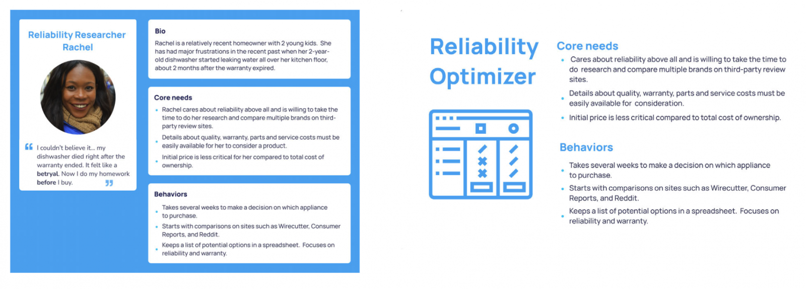
</figure>

## Requirements

Un **requisito** è un servizio, funzione o caratteristica di cui l’utente ha bisogno. Può rappresentare una funzione, un vincolo, una regola di business o altri elementi che devono essere presenti per soddisfare le necessità degli utenti previsti.  
  
Vediamo alcuni esempi:

- Il *Course Manager* ha il requisito di pianificare i corsi di formazione e prenotare le aule, per rendere visibili i corsi disponibili e garantire che si svolgano in modo efficace.

- Il *Training Centre Manager* ha il requisito di monitorare quali corsi sono in esecuzione, per assicurare una corretta assegnazione dei formatori ai corsi.

- Il *Financial Accountant* ha il requisito di massimizzare il tempo di utilizzo delle aule di formazione, per incrementare i ricavi generati dalle stesse.

Di solito i requisiti vengono classificati secondo diverse tipologie:

<figure data-latex-placement="h!">
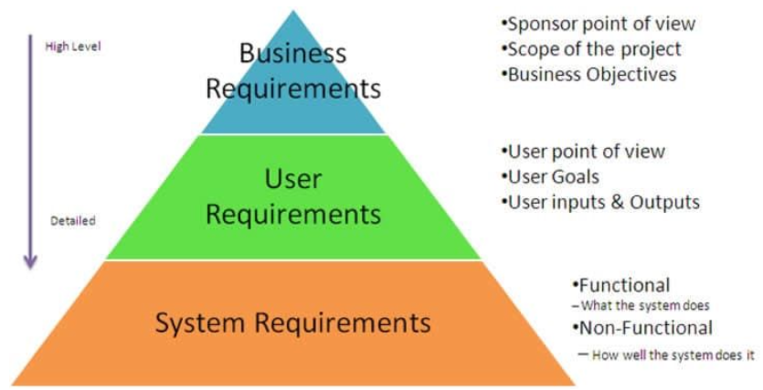
</figure>

In questo contesto, ci concentreremo principalmente sugli **user requirements**. Tuttavia, cercare di definire troppo presto una lista completa e dettagliata di requisiti può risultare controproducente, restrittivo e dispendioso in termini di tempo.  
  
L’**ambiente di business evolve nel tempo**: emergono nuovi requisiti e opportunità, e mentre il progetto avanza il team acquisisce una comprensione più profonda delle reali necessità. Definire requisiti troppo dettagliati nelle prime fasi porta a due rischi principali:

- Dover modificare successivamente le specifiche, sprecando il lavoro iniziale.

- Mantenere invariati i requisiti originali e, di conseguenza, non riuscire a soddisfare adeguatamente i bisogni effettivi del business.

Il successo di ogni soluzione dipende da due fattori fondamentali:

1.  **Cosa fa**, ovvero le sue funzionalità e caratteristiche principali.

2.  **Quanto bene lo fa**, cioè le sue prestazioni rispetto a parametri definiti (come attributi non funzionali, criteri di accettazione e livelli di servizio).

Ci sono due tipologie di requisiti:

- I **requisiti funzionali** (FRs) descrivono le funzioni o le caratteristiche che il sistema deve fornire: definiscono *che cosa* è richiesto, ma non *come* deve essere realizzato. Per esempio, “raggiungere una destinazione” è il requisito, mentre le soluzioni possibili (guidare, volare o prendere il treno) rappresentano diverse modalità di soddisfarlo.

- I **requisiti non funzionali** (NFRs) definiscono invece *quanto bene* o a quale livello una soluzione deve comportarsi. Descrivono attributi della soluzione come sicurezza, affidabilità, manutenibilità, disponibilità, performance e tempi di risposta.

  - **Trasversali** (validi per l’intera soluzione o un gruppo di requisiti funzionali):

    - Tutte le funzionalità rivolte ai clienti devono mostrare il logo aziendale.

    - Tutte le funzionalità rivolte ai clienti devono rispondere entro 2 secondi.

  - **Specifici** (associati a un particolare requisito funzionale), ad esempio:

    - Il requisito “noleggiare una sala conferenze” può includere NFR relativi ad accessibilità, sicurezza e disponibilità.

<figure data-latex-placement="h!">
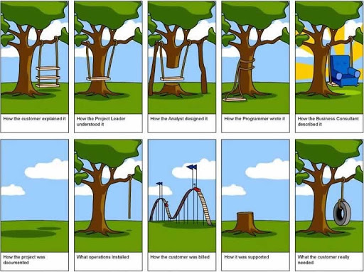
</figure>

## User Stories

Nei requisiti tradizionali spesso manca una componente importante: la prospettiva dell’utente. Una **user story** è una breve descrizione che identifica un utente e il suo bisogno, specificando *chi* è l’utente, *di cosa* ha bisogno e *perché*. Le user stories mettono al centro l’esperienza dell’utente, offrendo una visione olistica e contestualizzata piuttosto che focalizzarsi solo sull’aspetto tecnico o sull’artefatto.

*Una user story è un requisito espresso dal punto di vista dell’utente finale e dei suoi obiettivi.*

E si scrive nel seguente modo:

`Come [ruolo], voglio [funzionalità] perché [motivo].`

<figure data-latex-placement="h!">
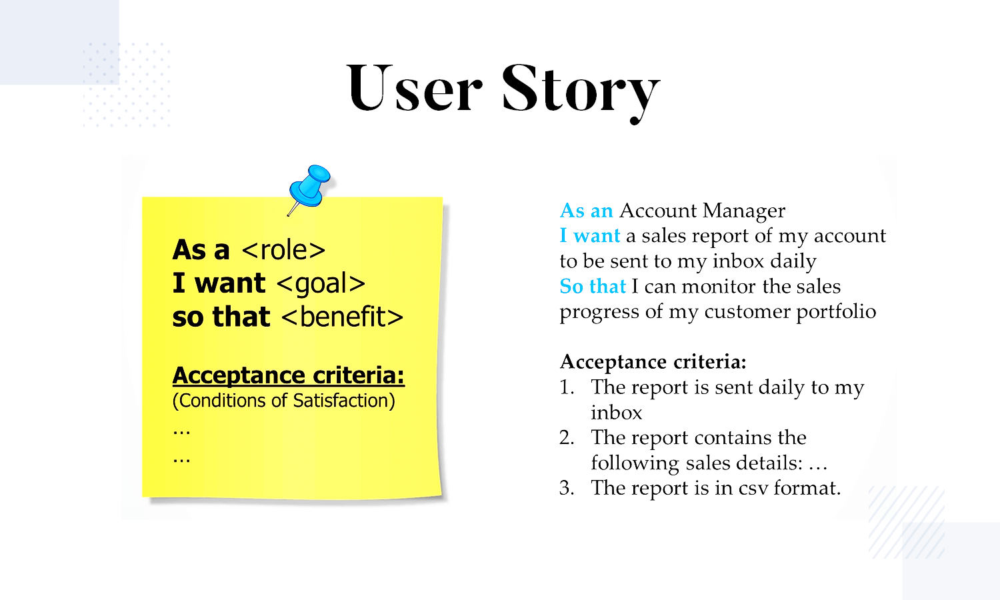
</figure>

Le user stories aiutano a documentare informazioni pratiche sugli utenti, come bisogni, motivazioni e modalità di utilizzo di un sito o un’app, e supportano il team di sviluppo nella definizione e nella stima delle attività necessarie per consegnare il prodotto finale (roadmap).

- Requisito tradizionale:

  - *“Il Course Manager ha il requisito di pianificare corsi di formazione e prenotare aule, per rendere visibili i corsi disponibili e garantire che si svolgano correttamente.”*

- User story corrispondente:

  - *“Come Course Manager, voglio poter pianificare corsi di formazione e prenotare aule, così da garantire un’organizzazione efficiente e corsi sempre visibili.”*

Non esiste un numero ideale di user stories, ma spesso ne vengono scritte diverse, una per ogni tipo di utente o scenario significativo. Il formato sintetico delle user stories consente di rappresentare più esigenze senza rendere la documentazione eccessivamente lunga.

### Livelli di Dettaglio e Epic Stories

Le user stories possono essere scritte a diversi livelli di dettaglio. Una storia molto ampia che copre un insieme di funzionalità viene detta **epica**. Esse vengono poi suddivise in tante user stories più specifiche, ognuna con le proprie condizioni di soddisfazione.

- **Epica:** “Come utente, voglio poter effettuare il backup dell’intero disco rigido.”

- **Suddivisione:**

  - “Come utente esperto, voglio poter specificare i file o le cartelle di cui fare il backup in base alla dimensione, alla data di creazione e alla data di modifica.”

  - “Come utente, voglio escludere cartelle dal backup in modo da non riempire il disco con elementi di cui non mi serve il salvataggio.”

<figure data-latex-placement="h!">
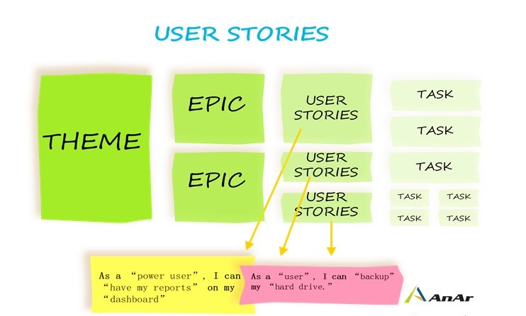
</figure>

Il dettaglio può essere aggiunto in due modi:

- **Spezzando** una user story grande in più storie più piccole;

- **Aggiungendo condizioni di soddisfazione**, ovvero criteri che definiscono quando una storia può considerarsi completata con successo.

Vediamo un esempio: *“Come responsabile marketing, voglio selezionare un periodo di festività da analizzare per valutare le campagne pubblicitarie più redditizie.”*  
  
Condizioni di soddisfazione:

- Deve funzionare con le principali festività (Natale, Pasqua, Capodanno, ecc.).

- Deve supportare festività che si estendono su due anni solari consecutivi (nessuna si estende su tre).

- Il periodo può essere impostato da una festività alla successiva.

- È possibile definire periodi basati su un numero di giorni prima di una festività.

Chiunque può scrivere una user story. La responsabilità di mantenere un **product backlog** aggiornato spetta al **product owner**, ma non è necessario che sia lui a scrivere tutte le storie. In un buon progetto agile, è normale che ogni membro del team contribuisca alla scrittura o alla discussione delle user stories. Infatti, è più importante *chi partecipa alla discussione* della storia che *chi la scrive*.  
  
Ogni user story dovrebbe essere identificata con un numero univoco e assegnata una priorità. Questo permette di pianificare in modo efficace lo sviluppo, concentrandosi prima sulle funzionalità più importanti per l’utente e per il valore complessivo del prodotto.

## User Scenarios

Uno **scenario** è una situazione che descrive come un utente svolge un compito sulla nostra applicazione o sito. Esso illustra la motivazione che spinge l’utente a utilizzare il sistema e mostra come il suo bisogno, domanda o obiettivo viene soddisfatto dall’interazione con il prodotto. Si tratta di uno sviluppo naturale della **user story**.  
  
Gli scenari possono essere suddivisi in **casi d’uso**, che descrivono il flusso di azioni che un utente fa per completare una certa funzionalità o percorso all’interno del sistema.  
  
Per esempio, uno scenario può descrivere **come** *“John utilizza un’app mobile per acquistare un biglietto per un workshop di design mentre si trova in viaggio verso il lavoro”*.  
  
Gli scenari aiutano gli *stakeholder* a visualizzare le idee del team di design, fornendo contesto all’esperienza utente desiderata e creando un ponte di comunicazione tra pensiero creativo e visione aziendale. Per il team di progettazione, invece, gli scenari servono a immaginare la soluzione ideale al problema di un utente.

*“Scenarios are the engine we use to drive our designs.”*

### Cosa considerare quando si scrive uno scenario

Gli scenari efficaci sono concisi ma rispondono a tre domande fondamentali:

- **Chi è l’utente?** Si utilizzano le personas già definite, che rappresentano i principali gruppi di utenti reali del sistema.

- **Perché l’utente accede al sito o all’app?** Si descrive la motivazione che lo porta a interagire con il sistema e le sue aspettative iniziali.

- **Quali obiettivi ha?** Attraverso la *task analysis*, è possibile capire cosa l’utente vuole ottenere e quali funzionalità il sistema deve offrire per soddisfarlo.

Alcuni scenari possono anche rispondere alla domanda: "**Come** l’utente può raggiungere i propri obiettivi?" In questo caso si identificano i diversi percorsi possibili, le scelte alternative e gli eventuali ostacoli che potrebbero incontrarsi lungo il flusso d’interazione.

La pianificazione degli scenari inizia con la fase di **scenario mapping**. Durante questa fase, il team di design, gli sviluppatori e il *product owner* collaborano per scambiarsi idee e definire una strategia basata sulle personas identificate.  
  
Una volta scelto l’utente principale, si individuano i compiti chiave che egli desidera portare a termine. Il passo successivo consiste nell’eseguire una **scenario analysis**, ossia nel contestualizzare gli obiettivi dell’utente e ripercorrere passo per passo le azioni che compirebbe per raggiungerli.

### Come scrivere uno scenario

Creare scenari richiede un approccio mentale specifico, centrato sugli obiettivi dell’utente. Bisogna chiedersi cosa l’utente cercherà di ottenere e in quale contesto agirà. È inoltre importante considerare la sua esperienza pregressa e il suo livello di conoscenza del dominio.  
  
Grazie agli scenari è possibile:

- Individuare i punti più importanti su cui concentrarsi nel processo di UX design.

- Capire in quali fasi del processo l’utente potrebbe volere supporto aggiuntivo.

- Identificare i principali bisogni e motivazioni degli utenti.

Gli scenari si basano sulle **user stories**: queste ultime descrivono cosa un certo tipo di utente ha bisogno di fare e perché. Gli scenari portano la user story al livello successivo, aggiungendo l’**interazione** concreta con il prodotto o servizio all’interno della narrazione.

<figure data-latex-placement="h!">
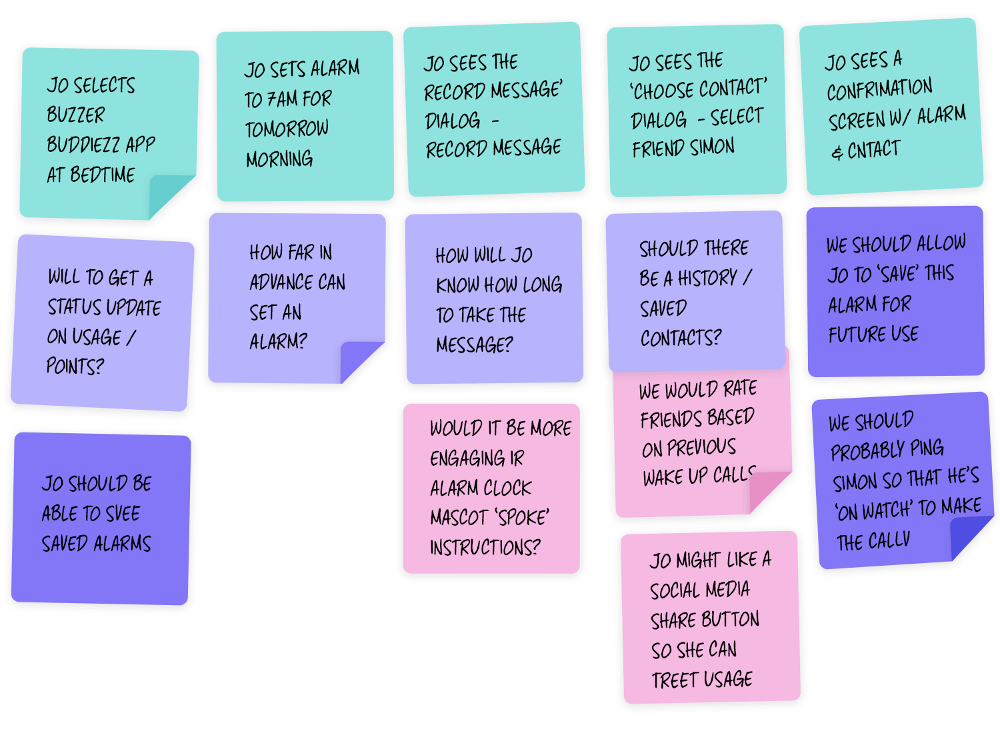
</figure>

### Altri tipi di Scenario
Si possono definire altre tipologie principali di scenario che completano il processo di design:

- **Scenari basati sugli obiettivi (Goal-based o Task-based Scenarios)**: Specificano unicamente *cosa* l'utente desidera fare, omettendo intenzionalmente i dettagli su *come* lo farà. Sono particolarmente utili per definire l'architettura delle informazioni del sito e sono ottimi da presentare agli utenti sotto forma di "task" durante i test di usabilità.
- **Scenari elaborati (Elaborated Scenarios)**: Forniscono maggiori dettagli sulla storia e sulle caratteristiche dell'utente. Aiutano il team di progettazione a comprendere a fondo le variabili di contesto che possono facilitare o ostacolare l'interazione con l'interfaccia.
- **Scenari completi (Full Scale Task Scenarios)**: Molto simili ai casi d'uso (use cases), illustrano i singoli passaggi dal punto di vista dell'utente (e non da quello del sistema), spiegando dettagliatamente la serie di interazioni con cui l'applicazione supporterà l'obiettivo iniziale.

## Casi d’uso

Un **caso d’uso** è una descrizione scritta di come un utente svolge un determinato compito all’interno di un sistema o prodotto. Mostra, dal punto di vista dell’utente, come il sistema si comporta in risposta a una richiesta.  
  
Ogni caso d’uso è rappresentato come una sequenza di passi semplici che inizia con l’obiettivo dell’utente e termina quando tale obiettivo è raggiunto.  
  
Mentre uno scenario può coinvolgere uno o più attori, un caso d’uso coinvolge **un attore specifico** e descrive il **flusso di azioni** che quel particolare attore intraprende in una determinata funzionalità o percorso. Spesso più casi d’uso vengono raggruppati in un "set" che copre tutti gli scenari possibili per una determinata situazione.  
  
La principale differenza tra **scenario** e **caso d’uso** è la prospettiva: il caso d’uso è molto più **granulare** rispetto allo scenario. Di solito si parte da uno scenario per poi identificare e definire tutti i casi d’uso che si adattano a esso.  
  
I casi d’uso aggiungono valore perché aiutano a chiarire come il sistema deve comportarsi e, in questo processo, aiutano a fare brainstorming su ciò che potrebbe andare storto. Inoltre, forniscono un elenco di obiettivi che consente di stabilire la complessità e i costi del sistema. Il team di progetto può così negoziare quali funzioni diventeranno requisiti effettivi da implementare.

### Elementi di un caso d’uso

A seconda del livello di dettaglio e complessità richiesto, un caso d’uso può includere una combinazione dei seguenti elementi:

- **Attore**: chiunque o qualsiasi cosa compia un’azione (chi utilizza il sistema).

- **Stakeholder**: qualcuno o qualcosa con un interesse acquisito nel comportamento del sistema in esame.

- **Attore primario**: lo stakeholder che avvia l’interazione con il sistema per raggiungere un obiettivo.

- **Precondizioni**: ciò che deve essere vero o verificarsi prima e dopo l’esecuzione del caso d’uso.

- **Trigger**: l’evento che innesca l’avvio del caso d’uso.

- **Scenario principale (Basic Flow)**: sequenza ideale in cui nulla va storto.

- **Percorsi alternativi (Alternative Flow)**: variazioni sul tema principale. Queste eccezioni descrivono cosa accade quando le cose vanno male a livello di sistema.

### Come scrivere un caso d’uso

Secondo la metodologia proposta da *Kenworthy (1997)*, la creazione di un caso d’uso può essere articolata nei seguenti passaggi:

1.  Identificare chi utilizzerà il sistema o il sito web.

2.  Selezionare uno di questi utenti.

3.  Definire cosa quell’utente desidera fare sul sito: **ogni cosa che l'utente fa diventa un caso d’uso**.

4.  Determinare il flusso normale degli eventi quando l’utente utilizza il sistema.

5.  Descrivere questo flusso base nella descrizione del caso d'uso, indicando cosa fa l’utente e come il sistema risponde (reazioni di cui l'utente dovrebbe essere consapevole).

6.  Considerare i percorsi alternativi e aggiungerli per "estendere" il caso d’uso.

7.  Individuare eventuali somiglianze tra casi d’uso diversi e documentarle come flussi comuni.

8.  Ripetere i passaggi da 2 a 7 per tutti gli altri utenti identificati.

<figure data-latex-placement="h!">
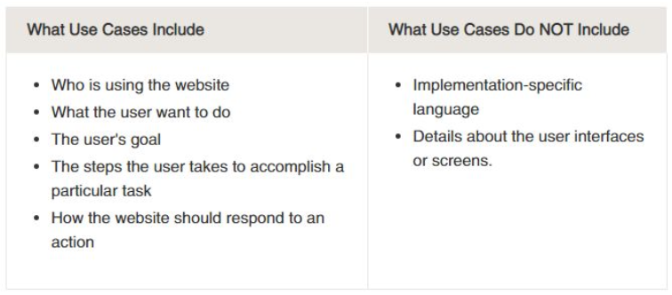
</figure>

L’attività di sviluppo di **personas**, **user stories**, **scenari** e **casi d’uso** aiuta a identificare informazioni chiave sugli utenti per progettare prodotti capaci di soddisfarli nel tempo. Ogni cosa che facciamo per avvicinarci agli utenti è un passo nella direzione giusta.

# Information Architecture

La progettazione delle Interfacce Grafiche (GUI) si concentra sull’anticipare ciò di cui gli utenti potrebbero aver bisogno e sull’assicurarsi che l’interfaccia contenga elementi facili da raggiungere, comprendere e utilizzare per facilitare tali azioni. L’UI riunisce concetti di **interaction design**, **visual design** e **information architecture**.

<figure data-latex-placement="h!">
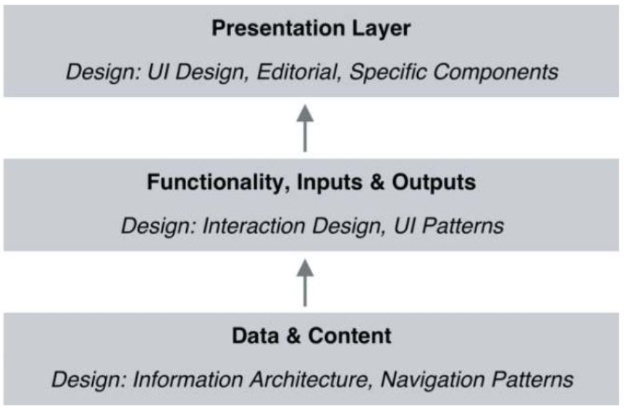
</figure>

In questa sezione ci concentriamo su dati e contenuti, quindi su **information architecture** e **modelli di navigazione**. Per progettare bene questo livello, dobbiamo prima capire come si comportano le persone.

## User Behaviours: pattern di comportamento degli utenti

Abbiamo già visto come comprendere gli utenti attraverso **personas** e **scenari**, identificando i loro bisogni, obiettivi e motivazioni. Tuttavia, quando gli utenti interagiscono con un’interfaccia, il loro comportamento segue alcuni schemi prevedibili.  
  
Questi pattern emergono indipendentemente dal tipo di interfaccia o dalle caratteristiche demografiche dell’utente. Comprendere questi pattern ci aiuta a:

- Progettare interfacce che risultino naturali per gli utenti.

- Supportare strategie e abitudini comuni.

- Evitare di opporsi ai comportamenti naturali dell’utente.

- Creare interazioni più intuitive.

Vediamo adesso alcuni pattern tipici.

### Self exploration

*"Lasciami esplorare senza perdermi o finire nei guai."*

Gli utenti sono più propensi a esplorare, imparare e sviluppare un atteggiamento positivo verso il sistema se percepiscono di essere al sicuro. Bisogna evitare che l'esplorazione comporti conseguenze negative o frustrazioni (come dover chiudere fastidiose finestre pop-up, reinserire dati accidentalmente cancellati o dover rimettere in pausa i video). È quindi fondamentale offrire percorsi di esplorazione che non "costino" nulla all’utente in termini di tempo o perdita di informazioni.

### Instant gratification

*"Voglio ottenere qualcosa ora, non più tardi."*

Le persone vogliono vedere risultati immediati dalle proprie azioni: è nella natura umana. Un’esperienza di successo porta gratificazione. L’interfaccia dovrebbe rendere la prima azione **estremamente semplice** e soddisfacente, così l’utente acquista fiducia in se stesso e nell'applicazione, e continuerà a usarla anche se in seguito diventa più complessa. Bisogna evitare che le funzionalità introduttive siano nascoste da lunghe istruzioni, schermate lente o pubblicità invadenti.

### Satisficing

*"Va bene così, non voglio perdere altro tempo per farlo meglio."*

Gli utenti spesso scelgono la prima opzione disponibile, anche se potrebbe essere sbagliata o non ottimale. Infatti, **Satisficing** = *satisfying + sufficing*: le persone accettano qualcosa di “abbastanza buono” anziché il “migliore”, se cercare l’alternativa perfetta richiede tempo o sforzo.  
  
Bisogna usare etichette brevi, chiare e facili da leggere, così che la prima intuizione sul significato da parte dell'utente sia già quella corretta. È vitale offrire sempre “vie di fuga” (*escape hatches*).  
  
Un’interfaccia complessa impone un grande carico cognitivo sui nuovi utenti, e la complessità visiva spinge i non esperti ad accontentarsi (mettendo in atto il *satisficing*). Questo spiega perché molti utenti sviluppano abitudini strane o percorsi tortuosi dopo aver usato un sistema a lungo, ignorando scorciatoie più efficienti.

### Changes in midstream

*"Ho cambiato idea su quello che stavo facendo."*

L’interfaccia deve fornire opportunità agli utenti di cambiare obiettivo durante l’interazione. Non si deve mai bloccare l’utente in un ambiente “povero di scelte” senza navigazione globale, a meno che non ci sia una buona ragione strutturale (wizard, modello hub-and-spoke, pannelli modali).  
  
Proprietà di rientranza (*reenterance*): l’utente deve poter iniziare un processo, interromperlo a metà e riprenderlo più tardi dal punto esatto in cui si era fermato.

### Deferred choices

*"Non voglio rispondere ora, lasciami finire prima."*

Gli utenti spesso saltano domande che sembrano non necessarie, rispondendo al minimo indispensabile, per poi tornarci in seguito. La maggior parte non vuole rispondere in quel momento o potrebbe non avere ancora abbastanza informazioni. È meglio mostrare una lista breve (nascondendo quella lunga) e usare buoni **valori di default**, rendendoli visibili e facilmente modificabili (“Puoi sempre cambiare questa impostazione più tardi…”).  
  
Alcuni siti salvano automaticamente moduli parzialmente compilati o altri dati persistenti. È molto più probabile che gli utenti si registrino se prima è permesso loro di sperimentare il sito — venendo coinvolti nell'esperienza — e solo successivamente viene chiesto loro chi sono.

### Incremental construction

*"Non sembra giusto, lasciami modificarlo ancora… ecco, ora sì."*

Gli utenti raramente creano tutto in una volta sola. Iniziano con piccole parti, ci lavorano, fanno un passo indietro per guardare il risultato, testano, aggiustano e poi continuano a costruire il resto. Le interfacce “a costruttore” devono supportare questo stile di lavoro:

- Mantenendo l’interfaccia reattiva a modifiche rapide e salvataggi frequenti.

- Fornendo feedback costante: mostrando costantemente all’utente l’aspetto e il comportamento complessivo mentre lavora.

Quando buoni strumenti supportano le attività creative, possono indurre un utente in uno stato di **flow**, dove il piacere dell’attività è la ricompensa stessa.

<figure data-latex-placement="h!">
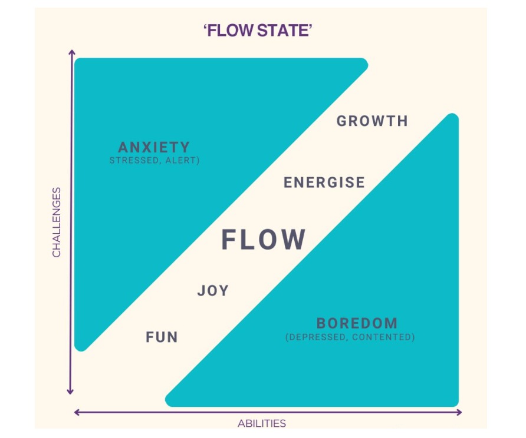
</figure>

### Habituation

*"Quel gesto funziona ovunque... perché qui no?"*

Quando un'azione diventa abituale, l’utente non deve più pensarci: questo migliora misurabilmente l’efficienza. Tuttavia, l'abitudine può creare delle trappole. Se un gesto tipico in un certo sistema non funziona o, peggio, produce un effetto distruttivo o inatteso, l'utente rischia di commettere errori critici.

### Microbreaks

*"Sto aspettando il treno, faccio qualcosa di utile per due minuti."*

Gli utenti fanno naturalmente piccole pause tra attività focalizzate. Queste brevi pause sono essenziali per l’elaborazione cognitiva e per alleviare lo stress. Il design dell’interfaccia deve supportare un’interruzione e una ripresa **fluide** (graceful interruption and resumption).  
  
Se i compiti non possono essere facilmente messi in pausa e ripresi, gli utenti si frustrano e commettono errori. Questo è un esempio di come ha avuto successo TikTok.

### Spatial Memory

*"Giuro che quel pulsante era qui un minuto fa, dov’è finito?"*

Le persone spesso ritrovano gli oggetti ricordando **dove** si trovano, non come si chiamano. Pulsanti di dialogo come “OK” e “Annulla” vanno posizionati in punti prevedibili.  
  
Questo spiega perché è utile offrire all’utente spazi organizzabili autonomamente per archiviare oggetti. Cognitivamente parlando, le **parti superiori e inferiori** di liste e menu rappresentano posizioni speciali e di facile memorizzazione.

### Prospective memory

*"Metto questo qui per ricordarmi di occuparmene più tardi."*

Se devi portare un libro a lavoro il giorno dopo, potresti lasciarlo vicino alla porta. Se devi rispondere a un’email, potresti lasciarla aperta sullo schermo come promemoria. Occorre dare alle persone gli strumenti per creare i propri sistemi di promemoria.  
  
Se un utente lascia un modulo a metà e lo chiude, il sistema potrebbe mantenere i dati inseriti. Bisogna pensare a come lasciare in giro degli **artefatti** che identifichino i compiti rimasti incompiuti.

### Streamlined repetition

*"Devo ripetere questa operazione quante volte?"*

Gli utenti spesso si trovano a dover eseguire la stessa operazione innumerevoli volte. Più è semplice per loro farlo, meglio è. Bisogna ottimizzare (streamline) i compiti ripetitivi che altrimenti richiederebbero un dispendio di tempo eccessivo.

### Keyboard only

*"Ti prego, non costringermi a usare il mouse."*

Questo pattern si ricollega ai concetti di **habituation** e **flow**: semplificare i compiti ripetitivi migliora l'efficienza. I comandi da tastiera saranno sempre più rapidi dei movimenti del mouse. Si dà per scontato che le scorciatoie (*shortcuts* come "control-s", "tab", "frecce direzionali", "invio", "spazio") siano sempre presenti.

### Other people advice

*"Cosa ne pensano gli altri di questo?"*

Il parere dei pari, diretto o indiretto, influenza le scelte delle persone. Gli utenti possono essere più efficaci se supportati da altri. Se così non fosse, potrebbero quantomeno sentirsi più soddisfatti dell'esito finale. Una **community online di supporto** è una parte preziosa per un sistema di help completo.

## Il ruolo dell'Information Architecture nel Design

Tutti questi comportamenti descritti (la tendenza al *satisficing*, il cambiare idea, il posticipare decisioni, l'affidarsi alla memoria spaziale e alle abitudini) richiedono un supporto sistematico. L'**Information Architecture** fornisce il framework per farlo, in particolare:

- **Organizzando i contenuti** in modo che gli utenti possano applicare il *satisficing* con sicurezza.
- **Strutturando la navigazione** per supportare la memoria spaziale e fornire vie di fuga (*escape routes*).
- **Etichettando (Labeling) chiaramente** gli elementi affinché l'esplorazione risulti sicura.
- **Creando strutture flessibili** in cui gli utenti possano cambiare direzione facilmente.

## Architettura dell’Informazione

Ora servono metodi sistematici per supportare questi comportamenti. L’**Information Architecture (IA)** fornisce la struttura di riferimento:

- **Organizzare** i contenuti per far “accontentare” gli utenti in modo sicuro.

- **Strutturare** la navigazione per supportare la memoria spaziale e offrire vie di fuga.

- **Etichettare** chiaramente, così che l’esplorazione appaia sicura.

- **Creare strutture flessibili** che consentano di cambiare direzione facilmente.

L’architettura dell’informazione si concentra sull’organizzare, strutturare e etichettare i contenuti in modo efficace e sostenibile. L’obiettivo è aiutare gli utenti a trovare informazioni e completare compiti. Per farlo, bisogna capire come le varie parti si incastrano per formare un insieme coerente e come gli elementi si relazionano all’interno del sistema.  
  
Perché è importante una buona IA? Secondo Peter Morville, lo scopo dell’IA è aiutare gli utenti a comprendere:

- Dove si trovano.

- Cosa hanno trovato.

- Cosa c’è intorno.

- Cosa aspettarsi dopo.

Di conseguenza, una buona IA influenza la **content strategy**, aiutando a scegliere le parole giuste e guidando il **design dell’interfaccia** e dell’interazione.

Per avere successo, è necessario comprendere gli standard del settore per la creazione, archiviazione, accesso e presentazione delle informazioni.  
  
Lou Rosenfeld e Peter Morville, nel libro *Information Architecture for the World Wide Web*, indicano i principali componenti dell’IA:

- **Schemi e strutture organizzative**: come si categorizza e struttura l’informazione.

- **Sistemi di etichettatura**: come si rappresenta l’informazione.

- **Sistemi di navigazione**: come gli utenti esplorano o si spostano tra le informazioni.

- **Sistemi di ricerca**: come gli utenti cercano le informazioni.

Per creare questi sistemi informativi, occorre comprendere la natura **interdipendente** di utenti, contenuti e contesto. Rosenfeld e Morville definiscono questa relazione “**ecologia dell’informazione**”, rappresentata come un diagramma di Venn in cui ogni cerchio rappresenta:

- **Contesto**: obiettivi aziendali, finanziamenti, politica, cultura, tecnologia, risorse, vincoli.

- **Contenuti**: obiettivi dei contenuti, tipi di documenti e dati, volume, struttura esistente, governance e proprietà.

- **Utenti**: pubblico, compiti, bisogni, comportamento nella ricerca di informazioni, esperienza.

<figure data-latex-placement="h!">
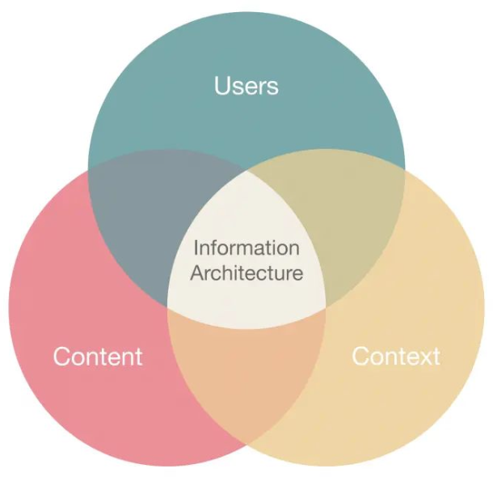
</figure>

## User Schemas: schemi di organizzazione

Gli schemi di organizzazione riguardano il modo in cui categorizzi i contenuti e crei relazioni tra le varie parti. La maggior parte dei contenuti può essere classificata in più modi. Gli schemi si dividono in due grandi categorie: **esatti** e **soggettivi**. A seconda del tipo di contenuto, un sito può combinare più schemi invece di trattarli separatamente.

### Schemi di organizzazione esatti

Gli schemi esatti dividono l’informazione in sezioni **mutuamente esclusive**. Sono più semplici da creare e gestire per gli information architect, ma possono rappresentare una sfida per gli utenti. Infatti, questo approccio richiede che l'utente conosca con esattezza cosa sta cercando e comprenda come la sua ricerca si inserisca nel modello proposto.  
  
Vediamo alcuni esempi di strutture esatte:

- **Schemi alfabetici**: usano le lettere dell’alfabeto per organizzare i contenuti. Per funzionare bene, le etichette devono corrispondere ai termini che gli utenti si aspettano. Spesso gli indici A–Z vengono usati come navigazione secondaria per supportare la ricerca dei contenuti.

  <figure data-latex-placement="h!">
  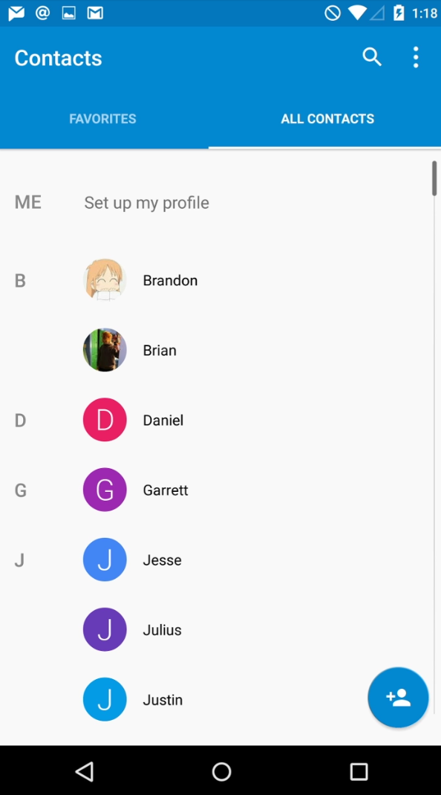
  </figure>

- **Schemi cronologici**: organizzano i contenuti per data. Per essere efficaci, deve esserci accordo su quando è avvenuto l’evento o l’argomento trattato.

  <figure data-latex-placement="h!">
  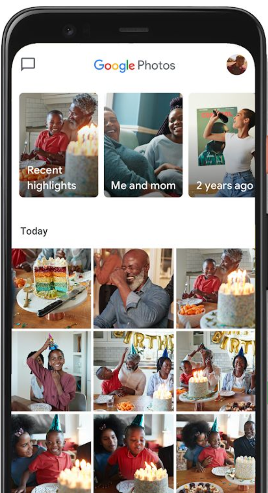
  </figure>

- **Schemi geografici**: organizzano i contenuti in base al luogo. A meno di dispute sui confini, questo tipo di schema è semplice da progettare e utilizzare.

  <figure data-latex-placement="h!">
  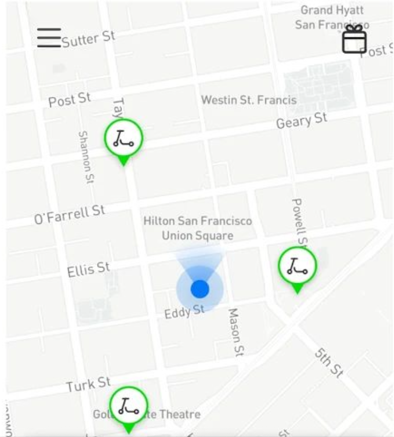
  </figure>

Spesso questi schemi vengono usati come **navigazione supplementare** per siti organizzati principalmente secondo schemi soggettivi (ad esempio, una mappa o un indice alfabetico di argomenti).

### Schemi di organizzazione soggettivi

Gli schemi soggettivi classificano le informazioni in modi specifici per un’organizzazione o un settore. Sebbene siano più difficili da progettare, sono spesso più utili di quelli esatti. Quando si tiene conto dei modelli mentali degli utenti e si raggruppano i contenuti in modi significativi, questi schemi migliorano l’efficacia, producono conversioni e facilitano l'apprendimento.

- **Task schemes**: organizzano i contenuti in base ai bisogni, alle azioni, alle domande o ai processi dell’utente.

  <figure data-latex-placement="h!">
  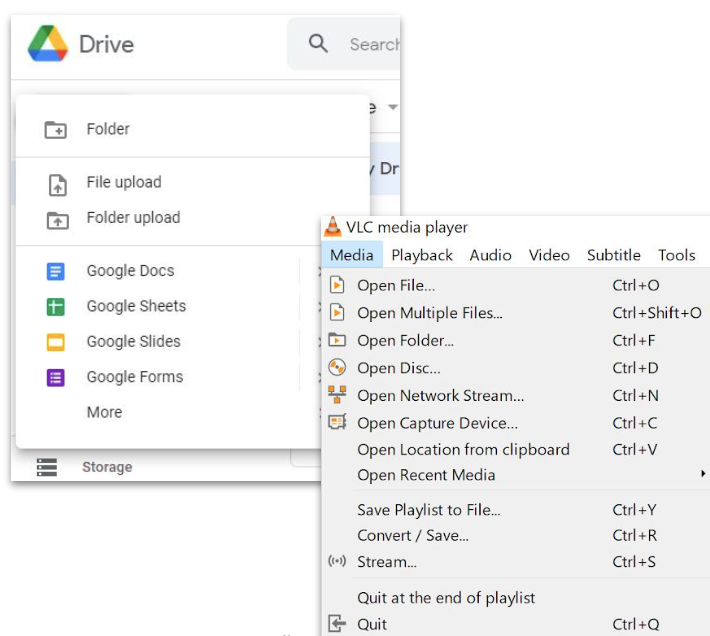
  </figure>

- **Topic schemes**: organizzano i contenuti in base allo specifico tema o argomento trattato.

  <figure data-latex-placement="h!">
  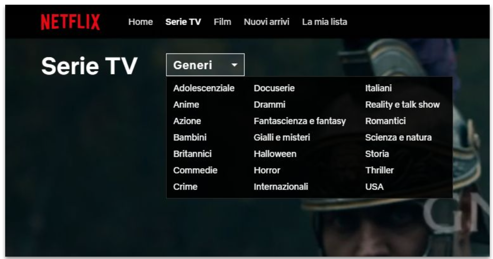
  </figure>

- **Audience schemes**: organizzano i contenuti per diversi segmenti di utenti. Possono essere chiusi o aperti, cioè permettere o meno di passare da un pubblico all’altro. Tuttavia, questo schema può creare difficoltà se gli utenti non si identificano facilmente in una sola categoria o se rientrano in profili multipli.

  <figure data-latex-placement="h!">
  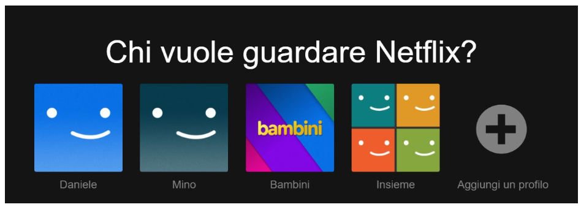
  </figure>

- **Metaphor schemes**: collegano i contenuti a concetti familiari (cartelle, cestino). Utili nel design di interfacce, ma rischiosi e problematici se usati come schema principale di organizzazione dell'intero sito.

  <figure data-latex-placement="h!">
  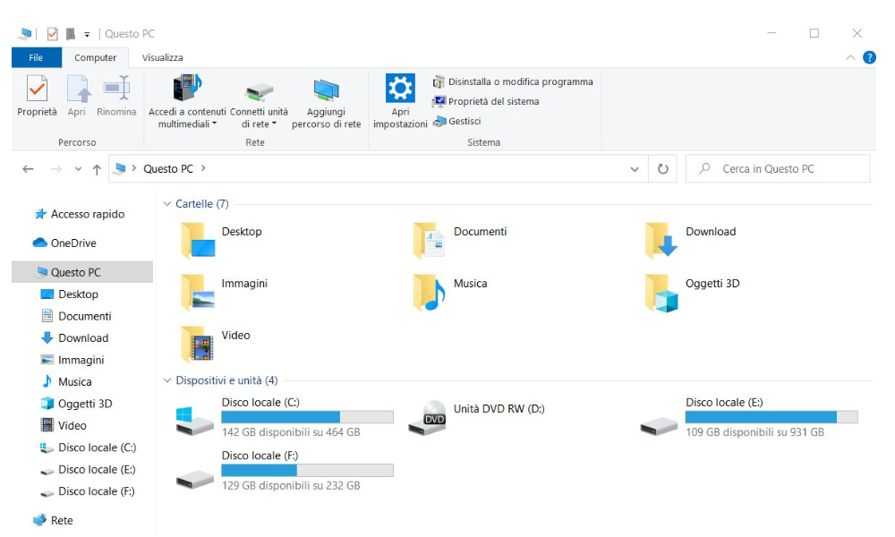
  </figure>

### Schemi ibridi

Implementare schemi indipendenti è vantaggioso perché mantiene la semplicità e consente all’utente di formarsi rapidamente un modello mentale coerente. Combinare più schemi in un ibrido può invece generare confusione. Spesso si ricorre agli schemi ibridi come compromesso quando i team di progetto non riescono a concordare su un unico criterio di categorizzazione.

## Strutture organizzative

Abbiamo esaminato i principi con cui organizziamo i contenuti. Ora vediamo quali **forme strutturali** possono assumere queste organizzazioni quando vengono implementate. Lo stesso principio organizzativo può assumere forme diverse:

- **Netflix** organizza per argomento (genere) in una struttura **gerarchica**.

- **Wikipedia** organizza per argomento in una struttura a **matrice**, con molti collegamenti interconnessi.

La scelta della struttura influenza il modo in cui gli utenti navigano e comprendono lo spazio informativo. Una struttura organizzativa definisce le **relazioni tra i vari contenuti**.  
  
Strutture efficaci permettono agli utenti di **prevedere dove trovare** le informazioni sul sito. È importante rispettare le aspettative degli utenti e adottare metodi coerenti di organizzazione e visualizzazione, in modo che possano estendere ciò che imparano da pagine familiari a quelle nuove. Le quattro principali strutture organizzative sono:

- **Gerarchica**

- **Sequenziale**

- **A matrice**

- **A modello di database**

### Strutture gerarchiche

Nelle strutture **gerarchiche** (dette anche *tree structures* o *hub-and-spoke*), le informazioni sono organizzate in un approccio dall’alto verso il basso, con relazioni **genitore/figlio**.  
  
Gli utenti partono da categorie generali e scendono verso livelli più specifici per trovare dettagli. Questo modello è familiare alla maggior parte delle persone, poiché riflette molte strutture reali: organigrammi aziendali, piani di progetto, ecc.

<figure data-latex-placement="h!">
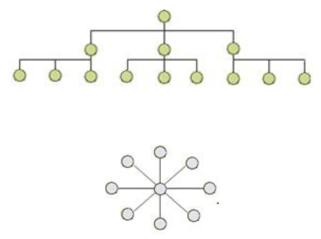
</figure>

<figure data-latex-placement="h">

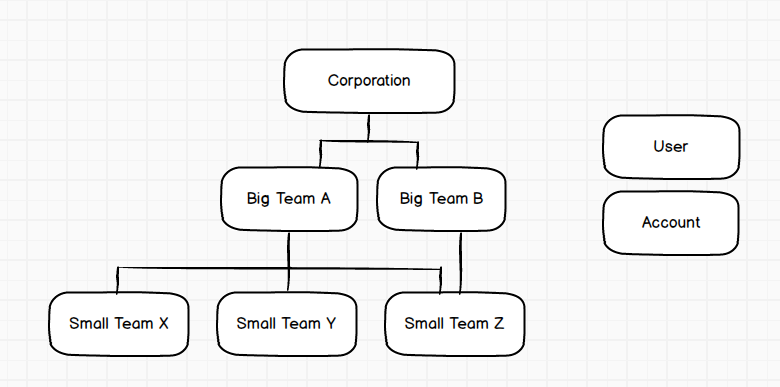

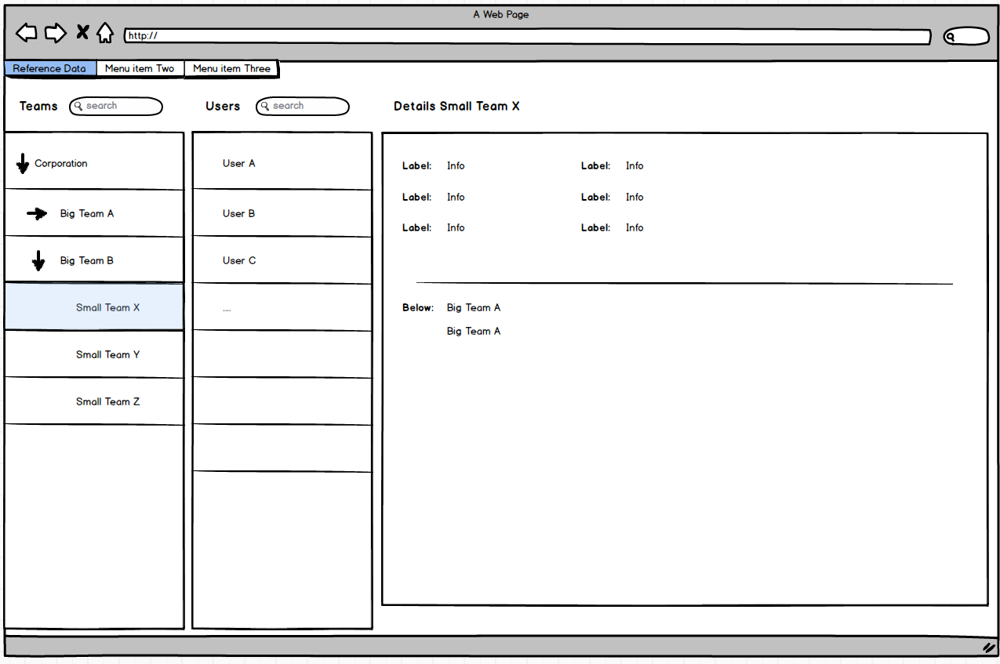

</figure>

### Strutture sequenziali

Le strutture **sequenziali** richiedono agli utenti di seguire un percorso passo per passo attraverso i contenuti, per esempio:

- Un processo di acquisto online.

- Un corso o una lezione strutturata.

Queste strutture presuppongono che esista un ordine ottimale dei contenuti, associato a una maggiore efficacia o successo nel completamento del compito.

<figure data-latex-placement="h!">
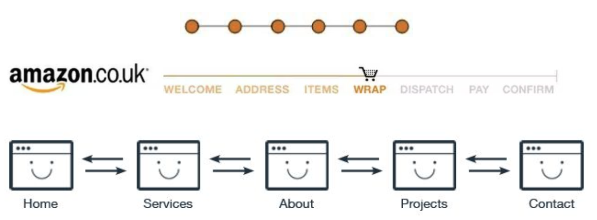
</figure>

### Strutture a matrice

Una **struttura a matrice** consente agli utenti di scegliere liberamente il proprio percorso, poiché i contenuti sono collegati in molti modi diversi.  
  
Questo tipo di struttura sfrutta appieno i principi dell’**ipertesto** (HTML). Per esempio, un utente può scegliere di navigare attraverso un set di contenuti per data, mentre un altro navigherà per argomento.

<figure data-latex-placement="h!">
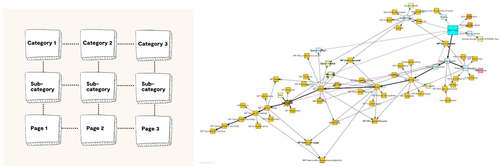
</figure>

### Modello a database

Il **modello a database** adotta un approccio dal basso verso l’alto. Il contenuto si basa fortemente sui collegamenti generati dai **metadati**. Questa struttura offre esperienze più dinamiche, consentendo **filtri avanzati**, funzioni di ricerca potenti e fornendo collegamenti automatici a informazioni correlate nel sistema che sono state opportunamente taggate.

<figure data-latex-placement="h!">
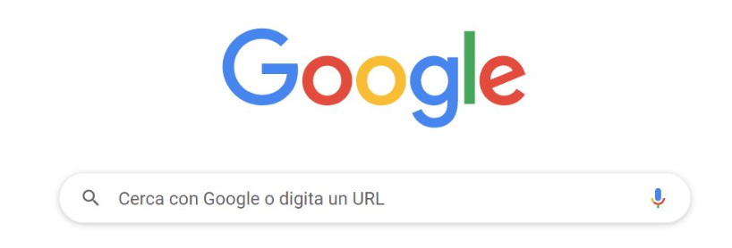
</figure>

### Creare strutture sostenibili

L’architettura di un sito o di una GUI ha un impatto a lungo termine. È importante progettare la struttura tenendo conto degli aggiornamenti futuri dei contenuti. Per questo motivo, chi gestisce il sito deve considerare:

- **Spazio per la crescita**: progettare un sito che consenta l’aggiunta di nuovi contenuti all’interno di una sezione o di intere sezioni nuove.

  <figure data-latex-placement="h!">
  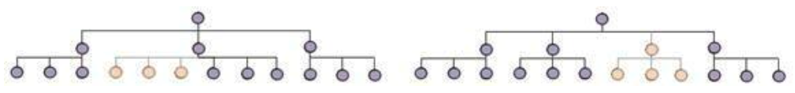
  </figure>

- **Evitare strutture troppo superficiali o troppo profonde**: trovare il giusto equilibrio è difficile ma fondamentale.

  - Strutture troppo superficiali (shallow) richiedono menu enormi.

  - Strutture troppo profonde nascondono le informazioni sotto troppi livelli, costringendo e appesantendo l’utente a navigare eccessivamente per trovare ciò che desidera.

  <figure data-latex-placement="h!">
  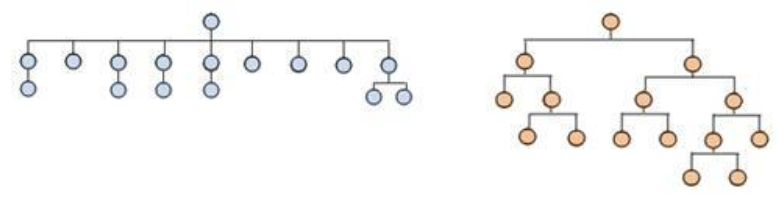
  </figure>

Gli utenti si affidano agli **information architect** per creare raggruppamenti logici che facilitino il movimento all’interno del sito.

### Navigazione

Lo studio dell’architettura dell’informazione guida il processo di progettazione della **navigazione**. La navigazione riguarda l’**orientamento dell’utente** all’interno dell’interfaccia, e il suo obiettivo principale è:

- Permettere all’utente di trovare informazioni e funzioni desiderate.

- Incoraggiare l'utente verso direzioni che potrebbero essergli utili o desiderabili.

I principi fondamentali per una buona navigazione sono:

- **Findability** (rintracciabilità)
  - L'utente **sa o si aspetta** che un certo contenuto sia disponibile.
  - Indica la capacità di raggiungere l’informazione desiderata, ossia quanto facilmente l’utente può localizzare ciò che ritiene rilevante. Per esempio, la facilità con cui si trova un libro specifico che si sta cercando in una biblioteca. Viene migliorata dalla coerenza nella disposizione degli elementi e l’uso di standard consolidati.

- **Discoverability** (scoperta)
  - L'utente **non sa** che il contenuto o la funzionalità sono presenti: deve scoprirli.
  - Si riferisce alla possibilità che l’utente scopra **nuove informazioni o funzioni** che non stava cercando specificamente. Nel caso della biblioteca, è la probabilità di notare un nuovo libro interessante che cattura l'attenzione mentre si guarda uno scaffale.

L’interfaccia fornisce spesso strumenti indiretti per favorire la scoperta, anche se questa può essere valutata solo a posteriori. Si può comunque progettare per la discoverability, posizionando le nuove funzionalità, per esempio, vicino agli elementi più visualizzati o più rilevanti.

<figure data-latex-placement="h!">
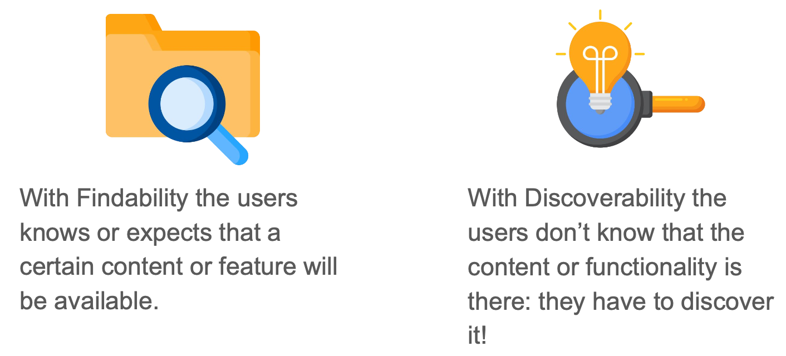
</figure>

### Componenti dell’interfaccia

Quando si progetta un’interfaccia, è importante essere **coerenti e prevedibili** nella scelta degli elementi. Che ne siano consapevoli o meno, gli utenti si abituano al fatto che determinati elementi si comportino in un certo modo: adottare elementi familiari al momento opportuno migliora il completamento del task, l'efficienza e la soddisfazione. Gli elementi dell’interfaccia includono:

- **Controlli di input**: checkbox, radio button, menu a discesa (dropdown lists), list box, pulsanti, interruttori (toggles), campi di testo e di data.

- **Componenti di navigazione**: breadcrumb, slider, barra di ricerca, paginazione, tag, icone.

- **Componenti informativi**: tooltips, icone, barre di progresso, notifiche, message boxes, finestre modali.

- **Contenitori**: accordion.

### Sintesi dei principi chiave di progettazione

- **Progetta in base ai comportamenti degli utenti**: ogni decisione di IA deve supportare il modo in cui gli utenti pensano e agiscono (satisficing, memoria spaziale, esplorazione sicura).

- **Gli schemi organizzativi definiscono i principi**, le strutture ne determinano la forma: scegli prima la logica di categorizzazione (argomento, compito, cronologia), poi decidi la forma in cui organizzarli (gerarchia, matrice, sequenza).

- **Una buona IA è invisibile**: gli utenti la notano solo quando è progettata male. L’obiettivo è una navigazione fluida e un’organizzazione intuitiva.

- **Bilancia findability e discoverability**: aiuta gli utenti a trovare ciò che cercano, ma abilitali anche a scoprire cose nuove che non sapevano di volere/avere bisogno.

- **La coerenza favorisce l’abituazione**: pattern prevedibili, etichette chiare e coerenza spaziale permettono agli utenti di costruire modelli mentali e lavorare in modo efficiente.
