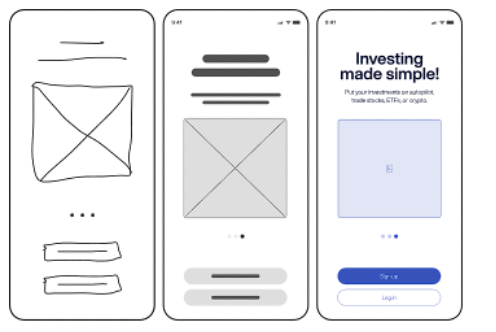
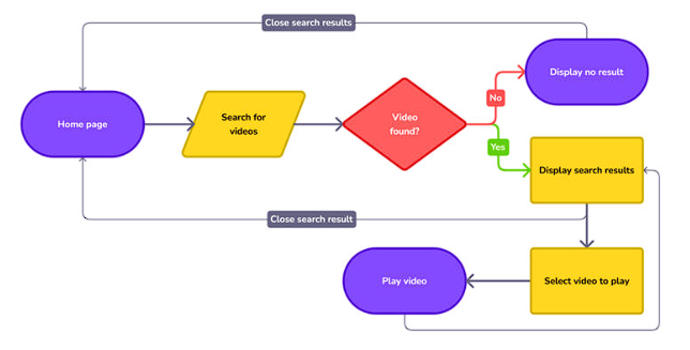
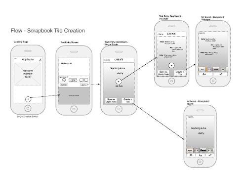
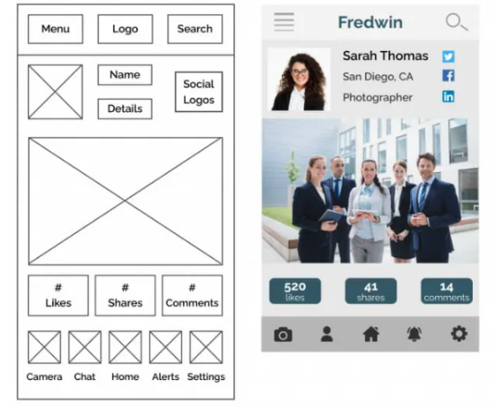
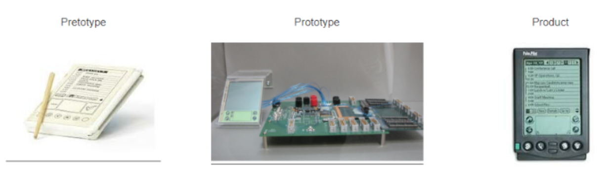
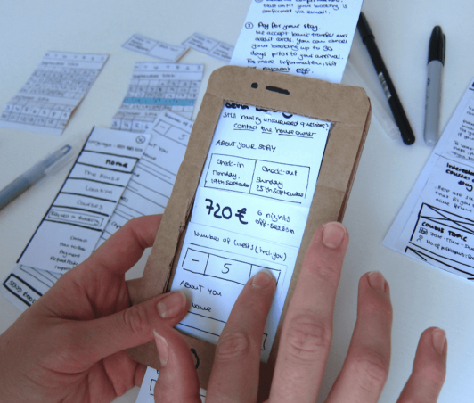
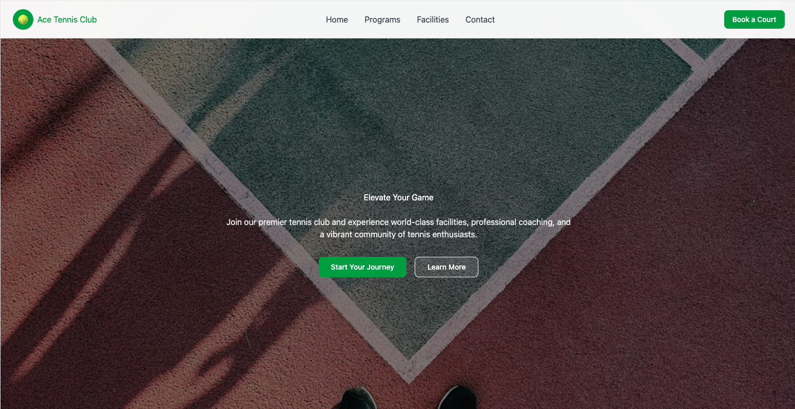

# Wireframing

Abbiamo visto quanto sia importante, nella realizzazione di un prodotto, comprendere e prevedere il comportamento degli utenti.  
Tuttavia, è ora necessario cominciare ad approcciarci alla fase di progettazione concreta del prodotto, quella in cui le nostre idee possono trasformarsi in qualcosa di tangibile e capace di rispondere realmente alle esigenze dei destinatari.  
Sarebbe un grave errore partendo da un’idea cominciare a realizzarla senza seguire gli step fondamentali del processo di design. Immaginiamo, ad esempio, di essere uno sviluppatore: vogliamo realizzare un sito web, un’applicazione oppure una nuova funzionalità da aggiungere a un prodotto già esistente. Tuttavia, invece di condividere l’idea con il team e procedere in modo strutturato, ci lanciamo direttamente nella scrittura del codice e nella realizzazione della versione finale del prodotto. A questo punto sorgono alcune domande fondamentali:

- cosa facciamo se una volta ultimato il lavoro emergono problemi o errori difficili e costosi da correggere?

- cosa facciamo se, al terminare dello sviluppo, ci accorgiamo che il prodotto non è realmente utile o non risponde ai bisogni degli utenti?

La risposta è semplice: avremmo sprecato tempo, energie e risorse che avremmo potuto risparmiare oppure impiegare diversamente.  
Il primo passo da compiere quando si comincia a progettare un prodotto è la creazione di un **wireframe**.  
Il wireframe infatti rappresenta un supporto preliminare che funge da documentazione iniziale: serve a mostrare in modo semplice e immediato come intendiamo sviluppare il progetto che abbiamo in mente, ovvero come vogliamo dare forma e struttura alla nostra idea. Il suo scopo principale è comunicare al team le nostre intenzioni progettuali offrendo una visione sintetica e chiara del prodotto. Possiamo considerarlo una prima bozza utile a facilitare la comunicazione tra designer e programmatori e che permette al team di mettere in pratica la corretta *information architecture*.  
Il modo più semplice e tradizionale per realizzare un wireframe è utilizzare carta e penna: si tratta infatti di eseguire uno schizzo rapido delle principali componenti dell’interfaccia.  
In questa fase, eventuali problemi evidenti possono essere individuati e corretti con pochissimo sforzo, evitando sprechi di tempo e risorse nelle fasi successive dello sviluppo.  
**Cosa può fare un wireframe:**

- dare una struttura visuale, cioè una prima forma, all’informazione che il prodotto deve avere.

- incoraggiare la discussione tra membri del team.

- determinare quali sono le funzioni e le caratteristiche della UI.

**Cosa non può fare un wireframe:**

- creare qualcosa di finito (non restituisce il "feeling" dell'aspetto finale).

- un wireframe non ha ’funzioni funzionanti’, cioè non è interattivo.

- non garantisce una comprensione generale da parte di tutti.

## Il contesto attuale e l’impatto sui wireframe

Viviamo in un periodo di profonda rivoluzione tecnologica.  
Questo cambiamento sta trasformando radicalmente il modo in cui i prodotti digitali vengono progettati: si passa da un approccio in cui ingegneri e sviluppatori realizzavano prodotti comprensibili soprattutto a loro stessi e ad altri esperti, a un approccio in cui il prodotto è costruito intorno all’utente con l’obiettivo di ottimizzare il più possibile la sua esperienza.  
Inoltre, i dispostivi con cui interagiamo ogni giorno si stanno moltiplicando e soprattutto diversificando: dagli schermi ultrawide delle TV, al monitor del nostro PC, allo smartphone fino ai display più piccoli come quelli degli smartwatch.  
Ovviamente, vent’anni fa tutta questa varietà non esisteva affatto ed è chiaro che tutto questo ha un forte impatto anche sul wireframing e sulla costruzione delle interfacce. La stessa applicazione, infatti, non può essere presentata nello stesso modo su uno smartphone e su uno schermo di un PC: deve adattarsi al contesto d’uso e al dispositivo. Un buon designer deve tenere conto sia dei requisiti funzionali che di quelli non funzionali, in particolare deve tenere conto dei principi di *adaptability*, *responsive design* e *accessibility*. È fondamentale ricordare che utenti diversi possono avere esigenze differenti e che il designer non progetta mai per se stesso ma per soddisfare i bisogni degli utenti finali.

L'**adattabilità (Adaptability)** è un termine ombrello che si riferisce alla capacità di un design di regolarsi e rispondere a diverse necessità degli utenti, contesti, abilità e preferenze. Generalmente copre i concetti di *Responsive Design* e *Accessibilità*.

## Tipologie di wireframes

Dal punto di vista grafico, il wireframe è qualcosa di semplice, infatti molto spesso non include font, colori, testi complessi o immagini.  
Possiamo distinguere i wireframe in base al loro grado di *fidelity*, cioè a quanto si avvicinano alla forma finale del progetto pur rimanendo schemi semplificati. Possiamo quindi avere:

- **Low fidelity wireframes:** contengono un basso grado di fedeltà, un esempio è uno schizzo dell’interfaccia su carta dove si rappresentano solamente le parti essenziali. Questo tipo di approccio contiene elementi estremamente basici, giusto per far capire al team come si vuole impostare la UI, concentrandosi su struttura e layout.

- **High fidelity wireframes:** una rappresentazione dettagliata dell’interfaccia con però ancora uno stile basico, tipografia essenziale, icone e dettagli di documentazione. All’aumentare del livello di fidelity vengono aggiunte anche altre caratteristiche come informazioni più precise sul layout, spacing e testi.

Spesso può succedere di produrre più versioni dello stesso wireframe, migliorandolo progressivamente partendo da un wireframe molto low-fidelity e arricchendolo di volta in volta, oppure realizzarne uno per ogni pagina di un sito o per ogni diversa schermata di un’applicazione.

<figure id="fig:placeholder">

<figcaption>da sinistra verso destra, incremento del grado di fidelity nel wireframe.</figcaption>
</figure>

## Responsive Design

Con l'esplosione del mercato dei dispositivi mobili, garantire che i siti siano facilmente leggibili e usabili su un'ampia gamma di schermi è diventato fondamentale.
Il **Responsive Design** è un metodo di progettazione e sviluppo che permette a pagine web o app di adattarsi fluidamente alla dimensione e alla risoluzione dei diversi dispositivi. Questo garantisce un'esperienza utente coerente e facilita alle aziende la manutenzione del sito (essendoci una sola versione da gestire).

Le principali tecniche utilizzate includono:
- **Flexible grid (Griglie flessibili)**: permettono agli elementi di riadattarsi dinamicamente in base alle dimensioni dello schermo.
- **Flexible images**: le immagini si ridimensionano e si scalano automaticamente.
- **Media queries & breakpoints**: permettono di applicare stili differenti in base alle specifiche caratteristiche hardware del dispositivo (es. larghezza della finestra).

### Mobile First vs Graceful Degradation

Il **Mobile-first** è una filosofia di design che dà priorità alla progettazione per dispositivi mobili rispetto al desktop. Questo garantisce che i contenuti e le funzionalità più importanti siano facilmente accessibili su schermi piccoli e che l'interfaccia sia ottimizzata per i controlli touch, favorendo anche caricamenti più rapidi e migliorando la SEO.
L'approccio mobile-first permette un design basato sul **“progress advancement”**: si parte dalle funzioni minime e dalle interazioni di base per smartphone, per poi costruire e aggiungere progressivamente interazioni ed effetti più complessi per il desktop.

Questo si contrappone alla **“graceful degradation”**, un approccio più obsoleto in cui si parte da un design completo e complesso pensato per dispositivi desktop avanzati, per poi tagliare o nascondere funzionalità al fine di adattarlo a dispositivi più piccoli o meno potenti.

### Best Practices per il Responsive Design
- **Keep it simple**: evitare layout complessi e mantenere un design minimalista.
- **Prioritize the content**: il contenuto è l'elemento primario e deve essere facilmente leggibile ovunque.
- **Design for touch**: assicurarsi che bottoni e link siano abbastanza grandi da essere tappati con un dito.
- **Optimize for load time**: ridurre il peso di immagini e file per non rallentare l'esperienza mobile.
- **Test, test, test**: testare il prodotto su una varietà reale di dispositivi (possibilmente al di fuori del proprio "laboratorio").

## Adaptive Design e Adaptive UX

Oltre al design responsivo, esiste il **Design Adattivo (Adaptive Design)**. Mentre il responsive adatta l'interfaccia in modo fluido e flessibile allo schermo, il design adattivo prevede la creazione di *layout multipli e distinti*, specifici per ogni singolo dispositivo. È una soluzione spesso più costosa, ma talvolta necessaria (es. per le grandi aziende che vogliono ottimizzare un sito per il mobile senza dover ricostruire da zero la vecchia versione desktop).

Tuttavia, l'adattabilità non riguarda solo il dispositivo, ma anche il **contesto d'uso dell'utente**. Qui entra in gioco l'**Adaptive UX**: il sistema si adatta alle caratteristiche specifiche dell'utente (usando dati come la posizione GPS, o modelli utente derivati dagli analytics). Due metodi classici per adattare l'esperienza ai gusti dell'utente sono:
- **Collaborative filtering**: se all'utente A piacciono i contenuti X e Y, e all'utente B piace X, il sistema deduce che B potrebbe essere interessato anche a Y.
- **Content-based filtering**: il sistema suggerisce contenuti simili in base alle caratteristiche del contenuto stesso, indipendentemente dagli altri utenti.

## Accessibilità (Accessibility)

L'accessibilità nell'UX Design è cruciale perché assicura che **tutti gli utenti**, indipendentemente dalle loro abilità fisiche, cognitive o tecnologiche, possano accedere e interagire con i prodotti digitali.
In un mondo sempre più digitalizzato, considerare l'accessibilità fin dall'inizio non è solo la cosa eticamente corretta da fare, ma rende il prodotto intrinsecamente più usabile per l'intero spettro del pubblico.
La regola fondamentale è: **l'accessibilità aiuta tutti!**

# Dai wireframes ai wireflows

Fino ad ora abbiamo accennato che i wireframe vengono impiegati per descrivere visivamente l’interfaccia utente tramite degli schemi statici e non interattivi. Le azioni che l’utente compirà su quell’interfaccia, però, nella realtà non sono statiche. Servono quindi degli strumenti capaci di descrivere quelle che sono le azioni che un utente può compiere su quella determinata pagina o applicazione.

## Userflows

Gli **userflow** aiutano a descrivere possibili azioni disponibili per un particolare utente all’interno della nostra interfaccia.  
Servono quindi a mappare tutti i passaggi e i movimenti possibili dell’utente all’interno della nostra applicazione o sito web.  
Per definire un flusso nel modo migliore, la pratica ideale è quella di partire dalle **personas**, dai **requisiti**, dagli **scenari** e (ancora meglio) dallo **user journey**. Riflettendo quindi sui possibili punti di contatto (touchpoints) che l’utente avrà con il sistema, possiamo definire un diagramma di flusso astratto.  
Uno userflow, quindi, non è altro che una mappa dei passaggi che un utente compie per raggiungere un obiettivo all’interno di un’interfaccia digitale. In altre parole, è il percorso completo che l’utente segue dal momento in cui entra nel sistema fino a quando completa un’azione (per esempio: fa un login, acquista un prodotto, invia un modulo). L’obiettivo è quello di capire e progettare la sequenza di interazioni in modo logico, semplice e fluido eliminando ostacoli o confusioni. Questo aiuta i designer a costruire delle esperienze coerenti.  
Per avere un quadro generale fino ad ora, possiamo dire che il wireframe mostra come è fatta graficamente l’interfaccia mentre lo userflow ci mostra come può l’utente muoversi all’interno di essa.

<figure id="fig:placeholder">

<figcaption>Esempio di userflow.</figcaption>
</figure>

## Wireflows

<figure id="fig:placeholder">

<figcaption>Esempio di wireflow</figcaption>
</figure>

Un **wireflow** è una combinazione tra uno userflow e una serie di wireframe. Si tratta di un diagramma di flusso che anziché utilizzare simboli astratti come rettangoli o rombi, impiega dei wireframe di vere schermate dell’interfaccia. Mentre uno userflow rappresenta esclusivamente i passaggi logici compiuti dall’utente, il wireflow mostra anche come queste schermate appaiono visivamente e come l’utente si muove tra di esse. Per costruire quindi un wireflow occorre prima disegnare i wireframe per ogni schermata dell’interfaccia e successivamente collegare queste schermate tramite frecce che indicano cosa accade quando l’utente compie una certa azione che può essere il click di un bottone o l’inserimento di dati. Il risultato finale è uno strumento estremamente utile per comprendere e comunicare in modo chiaro il funzionamento di un flusso utente.

## Mockup

Un **mockup** è la rappresentazione ad alta fedeltà di un’interfaccia o di un prodotto digitale. Tale strumento serve per mostrare come apparirà visivamente il design finale del prodotto pur non essendo interattivo. Possiamo considerare il mockup come un’evoluzione del wireframe: alla struttura essenziale vengono aggiunti numerosi elementi di design come colori, font, immagini reali e altri dettagli grafici. Essi vengono creati esclusivamente in formato digitale utilizzando software di design come **Sketch, Adobe XD o Figma**. Il mockup viene dunque utilizzato in una fase più avanzata del processo di progettazione e risulta utile per:

- rifinire e mostrare l’aspetto visivo finale dell’interfaccia.

- comunicare in modo chiaro il design a stakeholder e clienti.

- evidenziare lo stile del prodotto e magari anche compiere un confronto tra diverse versioni dello stesso mockup da presentare ad un cliente.

- supportare il dialogo tra designer e sviluppatori.

L’osservazione finale riguarda il fatto che, nonostante la somiglianza al prodotto finale, il mockup manca delle funzionalità interattive necessarie per condurre test di usabilità completi e raccogliere feedback profondi sul *comportamento* del sistema. Tuttavia, i mockup sono estremamente utili per condurre **specifici studi di usabilità** in cui è necessario ricevere feedback sull'aspetto generale (*look and feel*) del design, come ad esempio il **5-seconds test** e il **first-click test**. Per raccogliere feedback concreti sulle interazioni complesse è invece necessario comprendere i concetti di *pretotipo* e *prototipo*.

<figure id="fig:placeholder">

<figcaption>Evoluzione da wireframe a mockup</figcaption>
</figure>

# Pretotyping

Il concetto di pretotipo nasce da un’idea di Alberto Savoia, ex ingegnere di Google, il quale si ispira alla legge di Fallimento del Mercato. Secondo questa legge, circa l’80-90% dei nuovi prodotti lanciati sul mercato ogni anno finisce per fallire. Dunque, anche se un prodotto è ben progettato non implica che le persone siano disposte ad utilizzarlo o a pagarlo.  
Il **pretotipo** di un prodotto nasce proprio per verificare rapidamente se un’idea ha davvero potenziale di mercato, prima di investire tempo, energie e denaro nello sviluppo di un prototipo completo.  
L’unico modo per contrastare la legge del fallimento del mercato è testare il mercato stesso. Per farlo è necessario creare un esperimento che simuli il prodotto in modo abbastanza realistico da permettere l’osservazione del comportamento delle persone che lo utilizzeranno.  
Savoia sottolinea che un’idea, finché rimane nella mente (nella cosiddetta **Thoughtland** o "Terra delle Idee", dove si riscontrano frequenti problemi di predizione e di incomunicabilità), non vale nulla: *"i pensieri senza dati sono solo opinioni"*. Deve uscire e trasformarsi in qualcosa di concreto, anche se imperfetto, per essere mostrata agli utenti e capire se funziona davvero. Sostanzialmente, i prototipi devono aiutare a “fallire in fretta” ma spesso non ci riescono: la loro realizzazione richiede tempo e denaro, e talvolta i team finiscono per affezionarsi al prototipo stesso. Questo porta a non accettarne il fallimento e a continuare ad aggiungere funzionalità inutili, con un conseguente spreco di risorse.  
Per ovviare a questo problema, Savoia propone questa soluzione chiamata pretotipo che si colloca tra le idee astratte e il prototipo. Il pretotipo consiste in una forma più rapida, semplice ed economica del prodotto da testare e ci aiuta a capire se vale la pena o meno realizzarlo veramente. Serve a raccogliere dati concreti sul reale interesse delle persone prima di investire in un prototipo più tecnico.  
Grazie al pretotyping, possiamo ottenere risposte sull’efficacia o sull’interesse verso il nostro prodotto in ore o giorni, anziché settimane o mesi.  
Poiché un pretotipo può fallire molto rapidamente, il team può correggere velocemente gli errori o decidere senza esitazioni se abbandonare l’idea e investire in alternative più promettenti. Infine, vediamo quali sono i sette pilastri su cui si basa il concetto di pretotyping:

1.  Obbedire alla legge di Fallimento del Mercato.

2.  Assicurarsi di star costruendo il prodotto giusto (*the right it*).

3.  Non perdersi in chiacchiere, idee e opinioni.

4.  Fidarsi solo dei propri dati, trust your own data!

5.  Fare pretotyping.

6.  Parlare con i numeri e con i fatti.

7.  Pensare globalmente e non localmente.

<figure id="fig:placeholder">

<figcaption>Pretotipo, Prototipo, Prodotto</figcaption>
</figure>

## Approfondimento sulla legge di Fallimento del Mercato

Ogni anno vengono progettati e prodotti quasi 25000 nuovi prodotti, l’80% dei quali non vedrà mai la luce o non arriverà mai nelle case delle persone. Circa il 27% falliscono nel percorso di crescita dell’azienda, il 16% non raggiunge le aspettative degli utenti, trattasi quindi di fallimento di mercato, e per ben il 37% vengono cancellati durante la fase di lancio. Del 20% rimanente, il 14% sono prodotti che raggiungo il mercato e ci rimangono ma non hanno successo.  
Solo il 6% ha veramente successo.  
La legge di Fallimento del Mercato sostiene che la maggior parte dei nuovi prodotti fallirà nel mercato anche se la progettazione e lo sviluppo vengono eseguite in maniera corretta e competente.  
In legge, una persona è considerata innocente fino a prova contraria, mentre nella legge di mercato, bisogna considerare ogni prodotto come fallito fino a prova contraria.  
Due fenomeni interessanti che possiamo trovare nella realtà del mercato riguarda i prodotti etichettati come falsi positivi e quelli etichettati come falsi negativi. I primi sono tutti quei prodotti che all’apparenza sembravano perfetti, capaci di avere un grandissimo successo sul mercato ma che in realtà, nonostante i molti investimenti si sono rivelati un flop. I secondi invece sono tutti quei prodotti giudicati fallimentari ma che in realtà hanno avuto un successo eclatante. Twitter, Google, Tesla sono tutti esempi di falsi negativi.

## Come realizzare un pretotipo

Per realizzare un pretotipo è necessario seguire il cosiddetto *Pretotyping Flow* attraverso questi 5 step:

1.  **Isolare l'Assunzione Chiave (Key Assumption):** Chiedersi qual è quell'unica assunzione sulla propria idea che, se si rivelasse falsa, significherebbe che non si sta assolutamente costruendo il prodotto giusto.

2.  **Scegliere il Tipo di Pretotipo:** Selezionare il tipo di pretotipo che permetterà di isolare e testare in modo mirato l'assunzione chiave.

3.  **Formulare un'Ipotesi di Coinvolgimento del Mercato (Market Engagement Hypothesis):** Quantificare il coinvolgimento atteso per eliminare supposizioni e opinioni dal test. L'ipotesi dovrebbe seguire la struttura formale: *l'X% di Y farà Z*. 

4.  **Testare il Pretotipo:** Inserire il pretotipo nel mondo reale e osservare come le persone interagiscono con esso. Si inizia sempre in piccolo: un luogo, un momento alla volta.

5.  **Imparare, Perfezionare, "Hypozoom":** Valutare i risultati e affinare il pretotipo con i nuovi dati. Se l'ipotesi regge, bisogna decidere in quali altre situazioni testare il prodotto per avere un quadro completo (tecnica chiamata *hypozooming*).

## Tipologie di pretotipo

Analizziamo adesso i diversi tipi di pretotipo che possiamo implementare in base al prodotto finale che vogliamo realizzare.

- **Fake door:** si tratta di una simulazione di un prodotto o servizio che ancora non esiste e viene utilizzata per misurare il reale interesse delle persone verso quell’ipotetico prodotto. Per realizzare una fake door è sufficiente, come suggerisce il nome, creare una porta d’ingresso finta che sia una pagina web, oppure un banner pubblicitario che invita l’utente a scoprire il prodotto non ancora sviluppato. Viene calcolato poi il numero di click sul banner pubblicitario per comprendere se l’idea può piacere o meno, oppure il numero di registrazioni sul sito web. Se i numeri dovessero essere bassi allora forse è meglio abbandonare l’idea. È chiaro però che questo metodo ci evita la creazione di un prototipo evitando un possibile spreco di risorse.

- **Mechanical Turk (Wizard of Oz):** si tratta di un esperimento in cui una persona reale simula manualmente le funzioni di un sistema automatizzato (o algoritmico), dando all’utente l’illusione che in realtà quella tecnologia già esiste. Serve a capire se una funzione ‘intelligente’ è davvero utile prima di svilupparla nella realtà risparmiando così costi molto elevati in caso di mancato interesse da parte degli utenti. Un esempio è un chatbot o un sistema SMS che sembra automatizzato ma che in realtà dietro ad esso vi è un operatore umano nascosto.

- **Impersonator (The re-label):** questo tipo di pretotipo consiste nell’utilizzare un servizio già esistente facendolo passare per qualcosa di nuovo semplicemente cambiandone l’etichetta oppure il nome. Serve per testare un’idea senza costruire nulla da zero. Un esempio di questo metodo è applicare un diverso front-end a una API già esistente oppure, in altri campi, come per esempio quello farmaceutico: prendo un prodotto già esistente e ci metto una nuova etichetta sopra per vedere se gli utenti sono interessati o no.

- **Pinocchio:** si tratta di una versione fisica ma non funzionante del prodotto: un modello inanimato che agisce come *proxy* e permette di testare forma, dimensione e interazione fisica senza nessuna funzionalità reale. Questo tipo di pretotipo è il mezzo perfetto per incoraggiare le persone a testare il prodotto tramite giochi di ruolo (*role play design*). Un esempio celebre è il modello in legno del PDA *Palm Pilot*.

- **One night stand:** consiste nell’offrire una versione completa ma temporanea del servizio che si vuole testare senza costruire un’infrastruttura definitiva. Serve per ridurre i costi e valutare se il servizio ha valore per gli utenti, puntando su una fetta di popolazione ben conosciuta e circoscritta. Nello spirito del "fallire in fretta", se questo esperimento non ha successo in un ambiente amichevole, significa che probabilmente si sta progettando il prodotto sbagliato. Un esempio è testare l’interesse nei confronti di un ristorante affittando magari un locale per un breve periodo e testare l’interesse delle persone in base all’affluenza.

- **Facade (the pretend-to-own):** in questo tipo di pretotipo simuliamo di avere risorse costose, affittandole o prendendole in prestito. Serve per testare l’interesse del pubblico per un qualche tipo di servizio che magari in quel momento non può essere sostenuto economicamente. Per esempio, un’idea è quella di aprire un servizio di noleggio di auto di lusso ma invece di comprarne una flotta ne viene affittato un certo numero e viene simulato l’intero servizio con applicazione per prenotazioni, consegna e tutti gli altri servizi annessi. Questo tipo di pretotipo lavora molto sull’immagine dell’azienda più che sul prodotto stesso.

Dopo aver sperimentato tramite l’impiego del pretotyping e aver raccolto prove sufficienti che l’idea possa generare reale interesse nel pubblico, possiamo passare ad una possibile strada successiva che è quella della costruzione del **Minimum Viable Product**.  
Questo rappresenta una prima versione funzionante, seppur ridotta, del prodotto finale. Il Minimum Viable Product contiene solamente le funzioni essenziali, cioè quelle che sono state ampiamente testate nelle fasi precedenti. In sostanza non abbiamo tra le mani qualcosa di definitivo ma abbiamo qualcosa di vendibile da cui è possibile ottenere del ricavo e dell’utile da sfruttare nella produzione definitiva del prodotto.

# Prototyping

Un **prototipo** è una versione sperimentale e preliminare di un progetto.  
In particolare, è l’oggetto più vicino in assoluto al prodotto finale e ci permette di avere una rappresentazione tangibile ed interattiva di esso.

## Aspetti fondamentali e multidimensionalità

In primis, dobbiamo sottolineare che esistono diversi tipi di prototipi che possono essere più o meno complessi sotto diversi aspetti e punti di vista.  
Tuttavia, il processo fondamentale alla base del prototyping consiste nel selezionare le caratteristiche chiave da testare e analizzare, attraverso il feedback degli utenti. Possiamo quindi analizzare i prototipi secondo diversi parametri ed il primo di questi è la *fidelity*.

<figure id="fig:placeholder">

<figcaption>Low fidelity prototype.</figcaption>
</figure>

- **Low fidelity prototypes:** si tratta di prototipi molto economici, veloci da realizzare e da modificare. Permettono interazioni rapide ed incoraggiano il design thinking. Lo svantaggio di questo tipo di prototipo è che sono poco realistici, quindi difficili da valutare dagli utenti poichè semplificano troppo l’esperienza reale.

- **High fidelity prototypes:** sono realizzati in maniera più complessa, spesso programmati con software appositi. Offrono un’esperienza molto simile al prodotto finale producendo risultati di test accurati e realistici. Lo svantaggio è che per realizzarli è richiesto molto tempo e risorse, inoltre, i designer sono spesso riluttanti a compiere modifiche dopo ore/giorni di lavoro. Può capitare anche che gli utenti possano confondere il prototipo col prodotto reale creando bias nei feedback.

- **Mid fidelity prototypes:** questi si trovano a metà strada tra i due prima citati. Mantengono spesso la semplicità tipica dei low fidelity prototypes ma integrano elementi visivi e interattivi tipici dei high fidelity.

Come accennato precedentemente, la *fidelity* del prodotto è relativa (dipende dalla fase del design) e si muove principalmente su **6 dimensioni**:

- **Realismo visivo/fisico (Visual/Physical realism):** quanto il prototipo assomiglia al prodotto finale in termini di design visivo ed estetica.

- **Scope:** questo parametro indica l’ampiezza e la profondità del design rappresentato, cioè quanto del sistema è incluso nel prototipo e quanto è dettagliatamente sviluppato. In altre parole definisce quanto l’utente potrà vedere, esplorare e testare del prodotto. Lo scope può essere *orizzontale*, offre quindi una visione ampia ma superficiale del prodotto. Ad esempio un e-commerce in cui si può navigare, aggiungere prodotti al carrello senza però completare l’acquisto. Oppure lo scope può essere *verticale* e qui si concentra su una singola funzionalità sviluppata nel dettaglio e pienamente funzionale. Ad esempio, vogliamo testare esclusivamente il flusso completo di checkout per verificare se il sistema di acquisto funziona correttamente.

- **Functionality:** quanto il prototipo funziona davvero, ad esempio i pulsanti, i link o le azioni simulano davvero il comportamento reale?

- **Data:** il prototipo utilizza dati reali o dati fittizi?

- **Autonomy:** il prototipo può funzionare da solo oppure richiede l’intervento di qualcuno per simulare le azioni?

- **Platform:** indica il tipo di implementazione su cui si basa il prototipo ovvero se essa rappresenta una versione temporanea/intermedia oppure una versione più definitiva del prodotto, chiaramente più la versione è definitiva e più il prototipo si avvicina al prodotto finale e reale.

## Tecniche di Prototipazione

Esistono diverse tecniche per realizzare un prototipo in base all'obiettivo e alla fase del design in cui ci si trova:

- **Paper prototypes:** prototipi a bassa fedeltà creati su carta o cartone che rappresentano il layout e le funzionalità di base. Sono un modo rapido ed economico per testare e perfezionare la UI prima di investire risorse. L'utente interagisce manipolando fisicamente i fogli.
- **Wireframe prototypes (Mid-fi):** prototipi digitali che mostrano la struttura di base del prodotto utilizzando forme semplici e simboli, senza dettagli visivi. Utili per testare l'architettura e la navigazione.
- **Wizard of Oz (o Mechanical Turk) prototypes:** simulano il comportamento di un prodotto usando un operatore umano al posto della tecnologia reale (es. interazioni dal vivo o risposte scriptate). L'obiettivo è testare la UX prima di sviluppare il back-end tecnologico.
- **Functional prototypes:** includono funzionalità reali (interamente o parzialmente funzionanti) scritte tramite codice o tool interattivi. Utili nelle fasi finali per perfezionare gli aspetti tecnici e la reattività del sistema.
- **Non-Functional prototypes:** prototipi che sembrano e restituiscono il "feel" di un prodotto reale, ma mancano di funzionalità operative profonde (es. navigazione funzionante ma senza database reale). Sono usati per testare specificamente la **User Experience (UX)** e il **Visual Design** (estetica, layout, brand identity).

## Wireframes vs. Mockup vs. Prototipi

Spesso queste tre parole vengono confuse, ma in realtà indicano fasi diverse del processo di design. Per ricapitolare ciò che abbiamo visto finora:

- **Wireframe:** il wireframe è il disegno iniziale, la bozza strutturale del prodotto. Serve a rappresentare l’organizzazione degli elementi, la gerarchia delle informazioni e il flusso generale dell’interfaccia (wireflow). È uno strumento per far capire al team come funziona l’idea, senza concentrarsi ancora sull’aspetto estetico.

- **Mockup:** arricchendo il wireframe con colori, tipografie, immagini e dettagli visivi, otteniamo il mockup. Il mockup mostra come apparirà la UI, ma non è interattivo: rappresenta l’aspetto finale del prodotto, non il suo comportamento.

- **Prototype:** a partire da wireframe e mockup, si realizzano poi pretotipi e prototipi. Questi ultimi simulano l’esperienza utente e il funzionamento del prodotto, aggiungendo navigazione e funzionalità, permettendo di testare flussi, interazioni e comportamenti reali. Di solito, se il pretotipo dà esito positivo, si procede con la creazione di un prototipo completo, che viene testato per individuare eventuali problemi, correggere gli errori e rifinire l’esperienza prima di passare alla fase di sviluppo effettivo.

# Introduzione a Figma

I design team utilizzano vari software di settore per passare dai wireframe ai prototipi interattivi, tra cui **Sketch, Adobe XD, InVision e Figma**.

Figma, in particolare, è una web application molto popolare tra i designer, utilizzata per creare wireframe, mockup e prototipi di interfacce digitali, come siti web o applicazioni.  
Uno dei suoi principali vantaggi è la disponibilità di un piano gratuito per studenti, che lo rende facilmente accessibile anche in ambito accademico.  
Un altro punto di forza è la collaborazione in tempo reale: più persone possono lavorare contemporaneamente sullo stesso progetto, commentare, modificare e proporre idee, in modo simile a quanto avviene su un documento condiviso di Google o su una repository GitHub. Questo rende Figma particolarmente utile per i team di design che vogliono lavorare in modo coordinato ed efficiente.  
La piattaforma è supportata da una vasta comunità di utenti e da una ricca libreria di plugin che permettono di estendere le funzionalità del programma. Questi strumenti consentono, ad esempio, di generare icone, creare palette di colori personalizzate o automatizzare operazioni ripetitive.  
Per quanto riguarda l’organizzazione del lavoro, Figma utilizza un sistema di livelli (layers) che, pur differendo leggermente da quello di software come Photoshop, rimane intuitivo:

- ogni oggetto presente sulla tela è considerato un layer;

- raggruppare più oggetti insieme permette la realizzazione di un layer;

- inserire degli oggetti in un frame fa sì che il frame diventi un livello principale che contiene al suo interno altri sotto-livelli.

Questo sistema aiuta a mantenere i progetti ordinati e facilmente gestibili. Inoltre, Figma permette di utilizzare pagine multiple, ideali per suddividere zone diverse del lavoro, ad esempio tra wireframe, mockup e prototipi. Di recente è stata introdotta anche una funzionalità basata su LLM e AI, chiamata Figma Make, che consente di generare prototipi e diversi tipi di design a partire da un semplice prompt testuale.

<figure id="fig:placeholder">

<figcaption>Risultato del prompt "tennis website" generato da Figma Make</figcaption>
</figure>

