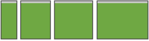
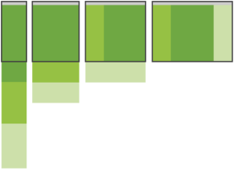
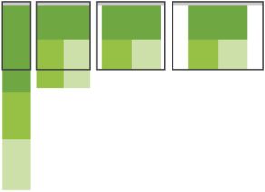
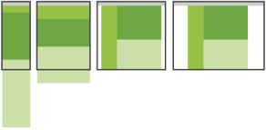
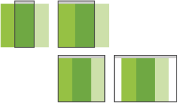
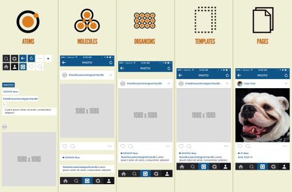
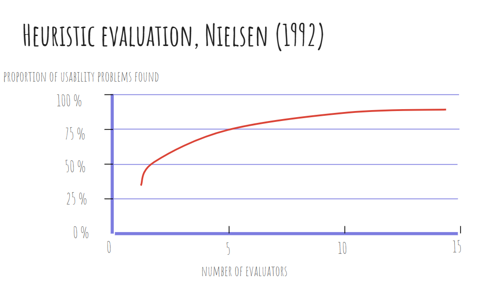
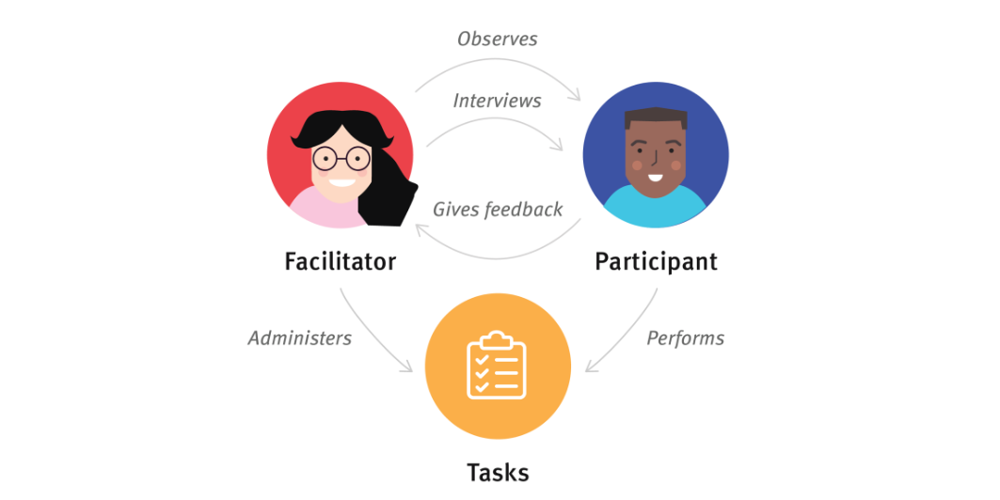

# 1 | Design For Everyone and Everywhere

Le interfacce digitali odierne devono affrontare sfide complesse e interconnesse. I prodotti digitali moderni devono funzionare:

- **Per tutti**: utenti con abilità e necessità diverse.
- **Ovunque**: smartphone, tablet, desktop, dispositivi indossabili.
- **In modo coerente**: attraverso team, prodotti e nel corso del tempo.

Per affrontare queste sfide, il design su larga scala si basa su **tre pilastri fondamentali**:

1. **Accessibilità (Accessibility)**: standard per progettare interfacce utilizzabili da tutti, incluse le persone con disabilità.
2. **Responsive Design**: tecniche per creare interfacce che si adattino a qualsiasi dispositivo o dimensione dello schermo.
3. **Design Systems**: framework per mantenere la coerenza visiva e funzionale.

L'obiettivo finale è costruire interfacce che siano accessibili e responsive "by design", e mantenute in modo coerente attraverso sistemi strutturati.

## 1. Accessibilità (Accessibility)

Progettare per l'accessibilità significa progettare per tutti. Circa il **15% della popolazione globale** ha una qualche forma di disabilità. Inoltre, i deficit temporanei o situazionali (come un braccio rotto, la luce del sole accecante o un ambiente rumoroso) colpiscono chiunque. In molti Paesi (inclusi USA e UE) l'accessibilità è anche un rigoroso **requisito legale**. 

*Un buon design accessibile è semplicemente un buon design.*

### WCAG e i Principi POUR
Le **WCAG** (Web Content Accessibility Guidelines) sono gli standard internazionali definiti dal W3C per rendere accessibili i contenuti web. La versione attuale è la WCAG 2.2 (Ottobre 2023). Le linee guida si basano su 4 principi fondamentali, noti con l'acronimo **POUR**:

1. **Perceivable (Percepibile)**: le informazioni devono essere presentate in modi che gli utenti possano percepire (es. testo alternativo per le immagini, sottotitoli per i video).
2. **Operable (Operabile)**: i componenti della UI devono essere utilizzabili (es. navigazione completa tramite tastiera, tempo sufficiente per leggere, assenza di elementi che possano scatenare crisi epilettiche).
3. **Understandable (Comprensibile)**: le informazioni e le operazioni devono essere chiare (es. navigazione coerente, prevenzione e spiegazione degli errori).
4. **Robust (Robusto)**: il contenuto deve poter essere interpretato in modo affidabile da un'ampia varietà di user agent, comprese le tecnologie assistive (uso di HTML semantico, attributi ARIA).

I livelli di conformità WCAG sono tre:

- **Livello A**: Minimo indispensabile (senza di esso, alcuni utenti sono completamente bloccati).
- **Livello AA**: Baseline raccomandata (la maggior parte dei requisiti legali punta a questo livello).
- **Livello AAA**: Avanzato (non sempre realizzabile per tutti i tipi di contenuto).

### Linee Guida Essenziali (Livello AA) e Testing
Per raggiungere la conformità AA, i requisiti essenziali includono:

- **Contrasto cromatico**: rapporto di 4.5:1 per il testo e 3:1 per i componenti della UI.
- **Accessibilità da tastiera**: tutte le funzionalità devono essere raggiungibili via tastiera, con indicatori di focus sempre visibili.
- **Alt text (Testo alternativo)**: descrizioni significative per le immagini (l'attributo `alt` va lasciato vuoto per le immagini puramente decorative).
- **HTML Semantico**: gerarchia corretta delle intestazioni (H1 → H2 → H3), etichette (`<label>`) per gli input dei form, e uso di ARIA solo quando strettamente necessario.
- **Coerenza**: navigazione mantenuta nello stesso ordine e funzioni identiche etichettate allo stesso modo.
- **Testo ridimensionabile**: l'interfaccia deve funzionare correttamente anche con uno zoom del 200% senza perdita di funzionalità.

Il **Testing** deve essere un mix tra:

- *Automatizzato* (che copre solo il 30-40% dei problemi): tool come WAVE, axe DevTools, Lighthouse.
- *Manuale* (fondamentale): navigazione solo da tastiera, uso di screen reader (NVDA, JAWS, VoiceOver) e test di zoom.

## 2. Responsive Design

Gli utenti accedono alle interfacce da una moltitudine di dispositivi, dagli smartphone (320px di larghezza) ai monitor desktop (1920px+). Il **Responsive Design** è l'approccio progettuale in cui le interfacce adattano layout, contenuti e funzionalità in base alle caratteristiche del dispositivo, in particolar modo alla dimensione dello schermo.

Si basa su tecniche chiave come griglie fluide, immagini/media flessibili e **media queries** (regole CSS basate sulle proprietà del dispositivo).

### L'Approccio Mobile-First
Progettare partendo dal mobile ("Mobile-First") è fondamentale perché:
- **Forza la prioritizzazione**: lo spazio limitato obbliga a concentrarsi sull'essenziale.
- Facilita la **Progressive Enhancement**: è più facile partire con funzionalità base per poi aggiungere miglioramenti per dispositivi più performanti, piuttosto che il contrario (Graceful Degradation).
- Garantisce **vantaggi in termini di performance** (gli utenti mobile hanno spesso connessioni più lente).

### Strategia dei Breakpoint e Grid Systems
I breakpoint indicano i punti in cui il layout ha bisogno di adattarsi. I più comuni sono 320px, 375px, 768px (tablet portrait), 1024px (tablet landscape), 1280px (laptop), 1920px (desktop).
**Regola d'oro**: *Non progettare per i dispositivi, progetta per i contenuti.* Inserisci un breakpoint quando il layout "si rompe".

Alla base dell'adattamento ci sono i **Grid Systems**, che dividono la pagina in colonne (solitamente 12). Gli elementi possono estendersi su un numero variabile di colonne a seconda del breakpoint (es. su desktop un contenuto occupa 8 colonne e la sidebar 4; su mobile si impilano occupando 12 colonne ciascuno).

### I 5 Pattern del Responsive Design
1. **Tiny Tweaks**: il layout rimane per lo più invariato a tutte le dimensioni. Cambiano solo font, spaziature e margini (ideale per articoli e form lineari).
<figure >

</figure>

2. **Column Drop**: il pattern più comune. Parte come colonna singola su mobile e aggiunge colonne affiancate su schermi più larghi (es. blog, siti di news).
<figure >

</figure>

3. **Mostly Fluid**: simile al Column Drop ma con margini che aumentano su schermi grandi e una larghezza massima (*max-width*) per evitare che le righe di testo diventino troppo lunghe (es. client email).
<figure >

</figure>

4. **Layout Shifter**: il più flessibile e complesso. Prevede una riorganizzazione fondamentale degli elementi, non un semplice impilamento (es. dashboard complesse).
<figure >

</figure>

5. **Off Canvas**: contenuti secondari (come la navigazione) vengono nascosti fuori dallo schermo su mobile (es. menu hamburger) e rivelati in modo permanente su schermi più grandi.
<figure >

</figure>

### Touch vs Mouse e Ottimizzazione delle Performance
L'interazione mobile porta nuovi paradigmi:

- **Assenza di hover**: gli schermi touch non hanno uno stato "hover"; azioni critiche non devono mai essere nascoste solo all'interno di hover states.
- I target tattili devono essere ampi (minimo consigliato **44x44px**).
- Vanno considerati i gesti (swipe, pinch) e le *thumb zones* (la parte inferiore dello schermo è più facile da raggiungere con il pollice).

Per le performance e i media:

- L'invio di immagini desktop su mobile spreca banda. Si usano attributi come `srcset` e `<picture>` per servire dimensioni diverse.
- Vettoriali (SVG) e caricamento ritardato (`loading="lazy"`) sono raccomandati.
- Sul piano CSS, strumenti moderni come **Flexbox** (layout monodimensionale) e **CSS Grid** (layout bidimensionale) permettono di gestire l'adattabilità facilmente in ottica mobile-first.

## 3. Design Systems

All'aumentare delle dimensioni dei progetti, designer diversi prendono decisioni diverse, creando inconsistenze, degradando la qualità, minando l'accessibilità e complicando la manutenzione.

Un **Design System** è molto più di una libreria di componenti: è un linguaggio condiviso, una collezione di componenti riutilizzabili, guidata da standard chiari. Comprende: librerie di componenti, design tokens, linee guida, pattern e implementazioni di codice.
I benefici sono molteplici: **Coerenza, Efficienza, Qualità** (accessibilità integrata), **Scalabilità** e **Manutenzione** centralizzata.

### Metodologia Atomic Design
Sviluppata per creare sistemi scalabili, divide le interfacce in 5 livelli gerarchici:

1. **Atomi (Atoms)**: i blocchi base indivisibili (es. un pulsante, un campo di input, un'icona).
2. **Molecole (Molecules)**: combinazioni semplici di atomi (es. un form di ricerca = label + input + pulsante).
3. **Organismi (Organisms)**: componenti complessi formati da molecole/atomi (es. un header del sito).
4. **Template (Templates)**: layout di pagina che mostrano la struttura dei contenuti.
5. **Pagine (Pages)**: istanze specifiche dei template con contenuti reali.

<figure >

</figure>

### Design Tokens e Living Documentation
I **Design Tokens** sono le decisioni di design nominate e memorizzate come dati (la fondazione del sistema). Esempi: `color-primary-500: #3B82F6` o `spacing-md: 16px`.
Permettono di avere una "singola fonte di verità" agnostica rispetto alla piattaforma (da essi si genera CSS, codice iOS, Android) e una denominazione semantica.

Le **Front-End Style Guides** e la **Living Documentation** (strumenti come *Storybook* o *Figma*) documentano non solo il *cosa*, ma il *perché* e il *come*:

- Mantengono documentazione e codice uniti.
- Mostrano esempi interattivi e gli stati dei componenti (default, hover, disabled).
- Includono istruzioni rigide sull'accessibilità e pattern di "Do's and Don'ts".

### Esempi di Sistemi Notevoli

- **Material Design (Google)**: eccellente per linee guida chiare, cross-platform e accessibilità integrata.
- **Human Interface Guidelines (Apple)**: fortemente focalizzato sulla coerenza dell'ecosistema Apple.
- **Carbon (IBM)** e **Ant Design**: orientati ad applicazioni enterprise e data visualization.
- **Polaris (Shopify)**: specializzato in pattern per l'e-commerce.

 
 

# 2 | Usability and Evaluation Techniques

Quando si dispone di un prototipo, l'azione fondamentale da intraprendere è **testarlo con gli utenti**.
Questo processo consente di valutare un prodotto o servizio testandolo direttamente con i suoi utenti finali. Attraverso il testing è possibile identificare la maggior parte (seppur non la totalità) dei problemi di usabilità, scoprire opportunità di miglioramento e comprendere a fondo i comportamenti e le preferenze degli utenti.

**Perché fare Usability Testing?**

- **Scoprire problemi** nel design.
- **Individuare opportunità** per migliorare la progettazione.
- **Imparare a conoscere gli utenti**, i loro comportamenti e le loro preferenze.

## Che cos'è l'Usabilità?

Esistono due definizioni principali di usabilità, che si concentrano su aspetti leggermente diversi. La definizione che si sceglie di adottare influenzerà il tipo di test e di esperimento che verrà costruito.

### 1. La definizione di Nielsen
Jakob Nielsen definisce l'usabilità come un *attributo di qualità* che valuta quanto sia facile utilizzare le interfacce utente. Essa è definita da **5 componenti di qualità**:

1. **Learnability (Apprendibilità):** Quanto è facile per gli utenti compiere i task basilari la prima volta che incontrano il design?
2. **Efficiency (Efficienza):** Una volta che gli utenti hanno appreso il design, quanto velocemente riescono a compiere i task?
3. **Memorability (Memorabilità):** Quando gli utenti tornano ad utilizzare il design dopo un periodo di inutilizzo, quanto facilmente riescono a ristabilire la loro competenza?
4. **Errors (Errori):** Quanti errori commettono gli utenti, quanto sono gravi e con quanta facilità riescono a rimediare?
5. **Satisfaction (Soddisfazione):** Quanto è piacevole utilizzare il design?

### 2. La definizione ISO 9241-11

- **Idea centrale:** L'usabilità è il grado in cui un sistema/prodotto/servizio permette a specifici utenti di raggiungere specifici obiettivi con *efficacia, efficienza e soddisfazione* in un determinato *contesto d'uso* (utenti, obiettivi/task, risorse, ambienti).
- **Risultato dell'uso (Outcome-of-use):** L'ISO sottolinea che l'usabilità è un *risultato* dell'interazione con il sistema; non è una proprietà intrinseca del prodotto.
- **Revisione del 2018:** Rispetto alla versione del 1998, ha ampliato il campo d'azione includendo sistemi e servizi, ha legato l'efficienza ai risultati ottenuti e ha chiarito il concetto di soddisfazione per includere una gamma più ampia di aspetti.

Le tre metriche fondamentali della norma ISO 9241-11 sono:

- **Efficacia (Effectiveness):** L'accuratezza e la completezza con cui gli utenti raggiungono obiettivi specifici.
  - *Come si misura:* Task-success rate (% di completamento corretto), Error rate (tasso di errore), Accuratezza delle decisioni (es. precision/recall), Completezza del risultato (es. tutti i campi richiesti compilati).
- **Efficienza (Efficiency):** Le risorse impiegate in relazione ai risultati ottenuti (tempo, sforzo umano, costi, materiali).
  - *Come si misura:* Time on task (tempo impiegato), Throughput (task all'ora o numero di click/passaggi), Sforzo umano (misurato tramite scale validate come NASA-TLX), Costo per risultato corretto.
- **Soddisfazione (Satisfaction):** La misura in cui le risposte fisiche, cognitive ed emotive degli utenti derivanti dall'uso soddisfano i loro bisogni e aspettative.
  - *Come si misura:* **SUS** (System Usability Scale) per l'usabilità percepita, **UMUX-Lite**, o scale specifiche come la CUS per i chatbot.
  - *Suggerimento per il reporting:* Separare la soddisfazione (dato soggettivo) dall'efficacia/efficienza (dati oggettivi), ma analizzarle insieme per spiegare eventuali divergenze (es. un sistema veloce ma frustrante).

## Usability vs. Utility (Usabilità e Utilità)

Oltre all'usabilità, un altro concetto chiave nello UX design è l'**utilità**, che si riferisce alla funzionalità del design: *fa quello di cui gli utenti hanno bisogno?*
Usabilità e utilità sono ugualmente importanti e determinano insieme se qualcosa è **utile (Useful)**:
- Non serve a nulla che un sistema sia facile da usare se non fa ciò che desideri.
- Allo stesso modo, non serve a nulla che il sistema abbia le funzionalità che desideri se l'interfaccia è troppo difficile da utilizzare.

<b>Utility</b> (funzionalità necessarie) + <b>Usability</b> (facilità e piacevolezza d'uso) = <b>Useful</b> (Utile)

*Nota:* Spesso nel settore si sente parlare solo di "usability testing". Concettualmente non è del tutto esatto (poiché si testa anche l'utilità), ma viene usato per comodità per riferirsi alla fase di testing in generale. Testare con utenti reali è fondamentale nello Human-Centered Design per migliorare la User Experience e, in ultima analisi, guidare il successo aziendale.

## Heuristics Evaluation (Valutazione Euristica)

Prima di effettuare i test con utenti reali, esiste un altro metodo per scoprire problemi di usabilità: la **valutazione euristica**.
Si tratta di un metodo di ispezione dell'interfaccia utente basato su principi di usabilità consolidati, chiamati appunto "euristiche". 
Questa valutazione viene tipicamente condotta da un piccolo team di valutatori esperti, poiché è difficile per una singola persona individuare tutti i problemi. Coinvolgere più valutatori (idealmente da 3 a 5) migliora notevolmente l'accuratezza dell'analisi.
Sebbene non fornisca un approccio sistematico per correggere i problemi, è un metodo molto conveniente (*cost-effective*) per guidare la riprogettazione basandosi sulla violazione dei principi dei buoni sistemi interattivi.

<figure >

</figure>

### Le 10 Euristiche di Usabilità di Nielsen

Jakob Nielsen ha definito 10 principi generali (euristiche) per l'interaction design:

1. **Visibilità dello stato del sistema (Visibility of System Status):** Il design deve sempre tenere informati gli utenti su cosa sta accadendo attraverso un feedback appropriato e tempestivo (es. indicare la posizione su una mappa interattiva).
2. **Corrispondenza tra sistema e mondo reale (Match between System and the Real World):** Il design deve parlare la lingua dell'utente. Utilizzare parole, frasi e concetti familiari, evitando il gergo tecnico interno.
3. **Controllo e libertà dell'utente (User Control and Freedom):** Gli utenti compiono spesso azioni per errore. Hanno bisogno di un'"uscita di emergenza" chiaramente contrassegnata per abbandonare l'azione indesiderata (es. pulsante "Annulla").
4. **Coerenza e standard (Consistency and Standards):** Gli utenti non devono chiedersi se parole, situazioni o azioni diverse abbiano lo stesso significato. È necessario seguire le convenzioni della piattaforma.
5. **Prevenzione degli errori (Error Prevention):** I buoni messaggi di errore sono importanti, ma i design migliori prevengono accuratamente l'insorgere dei problemi (es. inserire vincoli o conferme).
6. **Riconoscimento anziché ricordo (Recognition Rather Than Recall):** Minimizzare il carico cognitivo dell'utente rendendo visibili elementi, azioni e opzioni. Evitare di costringere gli utenti a memorizzare informazioni da una schermata all'altra.
7. **Flessibilità ed efficienza d'uso (Flexibility and Efficiency of Use):** Le scorciatoie — spesso nascoste agli utenti inesperti — possono accelerare l'interazione per l'utente esperto, permettendo al sistema di soddisfare entrambi i target.
8. **Design estetico e minimalista (Aesthetic and Minimalist Design):** Le interfacce non devono contenere informazioni irrilevanti. Ogni unità extra di informazione entra in competizione con quelle rilevanti.
9. **Aiutare gli utenti a riconoscere, diagnosticare e recuperare dagli errori (Recognize, Diagnose, and Recover from Errors):** I messaggi di errore devono essere espressi in linguaggio semplice (nessun codice di errore incomprensibile), indicare con precisione il problema e suggerire in modo costruttivo una soluzione.
10. **Aiuto e documentazione (Help and Documentation):** Anche se è preferibile un design che non necessiti di spiegazioni, può essere necessario fornire della documentazione. Questa deve essere facile da cercare, focalizzata sul task dell'utente e non troppo prolissa.# Usability and Evaluation Techniques

Quando si dispone di un prototipo, l'azione fondamentale da intraprendere è **testarlo con gli utenti**.
Questo processo consente di valutare un prodotto o servizio testandolo direttamente con i suoi utenti finali. Attraverso il testing è possibile identificare la maggior parte (seppur non la totalità) dei problemi di usabilità, scoprire opportunità di miglioramento e comprendere a fondo i comportamenti e le preferenze degli utenti.

**Perché fare Usability Testing?**

- **Scoprire problemi** nel design.
- **Individuare opportunità** per migliorare la progettazione.
- **Imparare a conoscere gli utenti**, i loro comportamenti e le loro preferenze.

 
 

# Metodi di Valutazione e Usability Testing

## Cognitive Walkthrough

Il **Cognitive Walkthrough** è un metodo di valutazione dell'usabilità basato sull'idea che:

- L'utente impara a utilizzare l'interfaccia in modo esplorativo.
- L'utente ha degli obiettivi precisi da raggiungere.
- L'utente applica un semplice ragionamento di tipo "mezzi-fini" (means-ends reasoning).

Questa valutazione viene condotta da un **esperto**, il quale esegue una serie di task imitando le performance e i comportamenti di un utente reale.

### Preparazione
Per condurre un Cognitive Walkthrough sono necessari quattro elementi fondamentali:

1. **User description (Descrizione dell'utente):** Include il livello di esperienza con i computer e qualsiasi assunzione fatta dal designer sul target.
2. **System description (Descrizione del sistema):** Include le operazioni e le performance del sistema (può essere applicato anche su prototipi cartacei/paper design).
3. **Task description (Descrizione del task):** Specifica il compito che l'esperto deve portare a termine, visto dalla prospettiva dell'utente.
4. **Action sequence (Sequenza di azioni):** Descrive le schermate del sistema e le azioni dell'utente necessarie per completare il task. *Una schermata del sistema unita a un'azione dell'utente costituiscono un singolo "step".*

### Il Processo

1. Il designer/sviluppatore prepara il prototipo, la descrizione dell'utente, del sistema, del task e la lista delle azioni.
2. Il designer consegna questi documenti all'esperto.
3. L'esperto legge attentamente le descrizioni.
4. L'esperto esegue il task seguendo rigorosamente la lista delle azioni.

### Le 4 Domande del Cognitive Walkthrough
Durante il processo, per **OGNI step** della lista di azioni, l'esperto deve porsi le seguenti quattro domande critiche:

1. L'obiettivo successivo è chiaro in questa fase?
2. L'azione appropriata da compiere è ovvia?
3. È chiaro che questa specifica azione porterà all'obiettivo?
4. Quali problemi si riscontrano nell'eseguire l'azione?

---

## Elementi dello Usability Testing

Nelle metodologie di *user research*, definiamo una sessione di usability testing quando un ricercatore (chiamato "facilitatore" o "moderatore") chiede a un partecipante di eseguire determinati task, solitamente utilizzando una o più interfacce utente specifiche. Mentre il partecipante completa ogni task, il ricercatore osserva il suo comportamento e ascolta i suoi feedback.

I tre elementi cardine dello usability testing sono:

1. **Il Facilitatore (The Facilitator)**
   Guida il partecipante attraverso il processo di test. Fornisce le istruzioni, risponde alle domande del partecipante e pone domande di approfondimento (*follow-up*). L'obiettivo cruciale del facilitatore è garantire che il test produca dati validi e di alta qualità, **senza influenzare accidentalmente il comportamento del partecipante**. Raggiungere questo equilibrio è complesso e richiede un training specifico.

2. **I Task (The Tasks)**
   Sono attività realistiche che il partecipante potrebbe effettivamente compiere nella vita reale. Possono essere molto specifici o aperti, a seconda delle domande di ricerca.
   *Esempi:* "La tua stampante mostra l'Errore 5200. Come fai a rimuovere questo messaggio di errore?" oppure "Trova articoli che usano tecnologie Cloud per la gestione del magazzino. Riesci a trovarli? Come?".
   * Importanza del *Wording*: La formulazione del task è vitale. Piccoli errori di formulazione possono far fraintendere la richiesta o influenzare le azioni del partecipante (un fenomeno psicologico noto come **priming**).
   * Le istruzioni possono essere fornite verbalmente o per iscritto. Se fornite per iscritto, è utile chiedere al partecipante di leggerle ad alta voce per assicurarsi che vengano comprese interamente e per aiutare i ricercatori a prendere appunti, sapendo sempre quale task è in esecuzione.

3. **Il Partecipante (The Participant)**
   Deve essere un utente realistico del prodotto o servizio (spesso selezionato in base alle **Personas** sviluppate). Può essere un utente attuale oppure una persona con un background e bisogni simili al target di riferimento.
   * **Think-aloud method:** Durante i test, ai partecipanti viene spesso chiesto di "pensare ad alta voce", narrando le loro azioni e i loro pensieri mentre eseguono i task. L'obiettivo è comprendere in profondità i comportamenti, gli obiettivi, i pensieri e le motivazioni.

<figure data-latex-placement="h!">

<figcaption>Interazione tra Facilitatore, Task e Partecipante</figcaption>
</figure>

---

## Tipi di Usability Testing: Qualitativo vs Quantitativo

Esistono due macro-categorie di test di usabilità in base ai dati che si desidera raccogliere. Entrambi sono fondamentali nell'UX design e si completano a vicenda: i test qualitativi spiegano il "perché" dei comportamenti, mentre i test quantitativi offrono una visione oggettiva e su larga scala.

### Testing Qualitativo (Qual)
Raccoglie dati osservazionali che identificano quali caratteristiche del design siano facili o difficili da usare. Si basa su domande aperte, osservazioni dirette e interviste per capire sentimenti, opinioni e interazioni. 
È molto utilizzato nelle fasi iniziali del design per comprendere bisogni e *pain points*, ma serve anche a validare le scelte progettuali sui prototipi prima del lancio.

### Testing Quantitativo (Quant)
Raccoglie dati numerici (metriche) come il tasso di completamento dei task o i tempi di esecuzione, per misurare oggettivamente comportamenti e attitudini. Si avvale di sondaggi, analytics e A/B testing.
L'obiettivo è fornire dati statisticamente significativi per prendere decisioni informate, individuando pattern e trend in modo oggettivo. È particolarmente utile per misurare l'efficacia dei miglioramenti iterativi nel tempo.

### Tabella Comparativa: Ricerca Qualitativa vs Quantitativa

| | **Ricerca Qualitativa (Qualitative Research)** | **Ricerca Quantitativa (Quantitative Research)** |
| :--- | :--- | :--- |
| **Domande a cui risponde** | Perché? (*Why?*) | Quanti e quanto? (*How many and how much?*) |
| **Obiettivi** | **Sia formativi che summativi:** - Informare le decisioni di design. - Identificare problemi di usabilità e trovare soluzioni per essi. | **Principalmente summativi:** - Valutare l'usabilità di un sito esistente. - Tracciare l'usabilità nel tempo. - Confrontare il sito con i competitor. - Calcolare il ROI. |
| **Quando si usa** | In qualsiasi momento: durante il redesign, o quando si ha un prodotto finale funzionante. | Quando si ha un prodotto funzionante (all'inizio o alla fine di un ciclo di design). |
| **Risultato (*Outcome*)** | Scoperte basate sulle impressioni, le interpretazioni e le conoscenze pregresse del ricercatore. | Risultati statisticamente significativi che hanno alta probabilità di essere replicati in studi diversi. |
| **Metodologia** | - Pochi partecipanti. - Condizioni di studio flessibili, adattabili ai bisogni del team. - Utilizzo del protocollo *Think-aloud*. | - Molti partecipanti. - Condizioni di studio ben definite e strettamente controllate. - Solitamente NON si usa il *think-aloud*. |

 
 

# Come pianificare e condurre Test di Usabilità

## Pianificare un test (Planning a test)

Per condurre uno usability test efficace, è fondamentale seguire una fase di pianificazione strutturata. Di seguito sono riportati i passaggi chiave per organizzare al meglio la ricerca.

### 1. Definire l'obiettivo (The goal)
Prima di tutto, è necessario definire lo scopo della ricerca. Cosa si vuole testare? Qual è l'obiettivo finale che spinge a condurre il test? Rispondere a queste domande aiuterà a capire immediatamente se c'è bisogno di una ricerca di tipo **qualitativo** o **quantitativo**.

### 2. Scegliere il formato (The format)
Bisogna stabilire le modalità di esecuzione del test valutando tre dimensioni:

- **In lab o in field:** Considerare la location. Il test si svolgerà in sede (nel proprio laboratorio) o presso la sede/abitazione del partecipante?
- **Moderato o non moderato:** 
  - Gli studi *moderati* (con facilitatore) forniscono insight più ricchi e un migliore accesso a commenti aperti, ma sono più costosi e difficili da organizzare.
  - Gli studi *non moderati* sono più economici, veloci e facilitano il reclutamento di partecipanti difficili da raggiungere.
- **Di persona (In-person) o da remoto:** Gli studi di persona sono sempre raccomandati in quanto permettono un'interazione più personale e la capacità di cogliere segnali non verbali sottili. Tuttavia, i test da remoto possono risultare necessari per limiti di budget, logistica o accessibilità.

### 3. Numero di partecipanti
Quanti tester servono? La risposta dipende dal tipo di studio:

- **Studi qualitativi:** Jakob Nielsen evidenzia che **5 persone** sono un numero ideale; testare con più utenti generalmente non garantisce un aumento significativo di nuovi insight (si raggiunge la saturazione).
- **Studi quantitativi:** La regola dei 5 utenti non si applica. Per ottenere dati statisticamente rilevanti, il numero raccomandato è di **almeno 20 partecipanti**.

### 4. Reclutare i partecipanti giusti
Per ottenere insight di valore, è vitale utilizzare partecipanti rappresentativi che corrispondano ai dati demografici e ai comportamenti degli utenti target. 
Bisogna **evitare i proxy users** (utenti sostitutivi a cui viene chiesto di "fingere" o immaginare scenari), poiché questo porta a risultati non validi. Questo aspetto è cruciale soprattutto per siti specializzati, piattaforme B2B o siti ricchi di contenuti complessi.

### 5. Scrivere i task corretti
Nello usability testing, i task vengono scritti sotto forma di scenari e devono allinearsi agli obiettivi dello studio. Possono essere di due tipi:

- **Task esplorativi:** Sono aperti e servono a capire come le persone esplorano le informazioni (non sono adatti per la ricerca quantitativa).
- **Task specifici:** Sono mirati e prevedono una risposta corretta o un punto di arrivo preciso (utilizzabili sia in test qualitativi che quantitativi).
*Attenzione: il wording (la scelta delle parole) è fondamentale per non alterare i risultati.*

### 6. Condurre un Pilot Study (Rehearse it first)
Prima di avviare le sessioni ufficiali, è necessario eseguire uno studio pilota per affinare il testo dei task, determinarne l'ordine e la quantità, e assicurarsi di aver reclutato il target giusto. Questo passaggio è vitale nei test *non moderati* online, dove non ci sarà modo di intervenire per chiarire dubbi. Intercettare i problemi in questa fase previene il fallimento della sessione reale.

### 7. Decidere le metriche

- Negli **studi qualitativi**, la priorità è ottenere insight sul design (tramite interviste semi-strutturate o strutturate) piuttosto che misurare l'usabilità con metriche rigide, dato che un campione ristretto non è statisticamente rappresentativo.
- Negli **studi quantitativi**, la misurazione è centrale. Le metriche comuni includono: *Time on task* (tempo impiegato), rating di soddisfazione, *Success rate* (tasso di successo) ed *Error rate* (tasso di errore).
Se si raccolgono misurazioni soggettive (tramite questionari), bisogna decidere preventivamente quando somministrarli: dopo ogni task, alla fine dell'intera sessione, o in entrambi i momenti.

### 8. Redigere il Test Plan
Una volta definita la strategia, è essenziale documentare l'approccio in un *Test Plan* e condividerlo col team. Serve come strumento di comunicazione e come storico per studi futuri. Non deve essere prolisso, ma deve contenere:

- Nome del prodotto/sito testato.
- Obiettivi dello studio.
- Logistica (orari, date, luogo, formato).
- Profili dei partecipanti.
- Task da eseguire.
- Metriche e questionari scelti.
- Descrizione del sistema (es. impostazioni computer, mobile/desktop).

### 9. Non condurre il test da soli
Durante un test (specialmente qualitativo) non si riuscirà mai a cogliere ogni singolo dettaglio o a prendere nota di tutto. È fortemente consigliato farsi affiancare da altri osservatori/ricercatori per non perdere informazioni preziose.

## 10 Cose da evitare quando si creano i Task (10 things to avoid when testing)

La formulazione dei task può determinare il successo o il fallimento di un test. Ecco 10 errori comuni da evitare:

1. **Dire agli utenti dove andare:** Per evitare il *priming* (influenzamento psicologico), bisogna rimuovere dal testo del task qualsiasi parola che compare visivamente nell'interfaccia (es. etichette dei bottoni). Bisogna dare agli utenti la possibilità reale di orientarsi da soli.
2. **Dire agli utenti cosa fare:** Non anticipare o avvertire i partecipanti sui passaggi che dovranno compiere (es. "registrati per scaricare il file"), altrimenti si perderanno feedback preziosi su eventuali frizioni in quegli step.
3. **Creare task obsoleti:** Se il task richiede di cercare un volo per il 20 Febbraio, non si può condurre il test il 22 Febbraio. Le date e le notizie devono essere aggiornate al giorno stesso del test per risultare coerenti.
4. **Rendere i task troppo semplici:** L'obiettivo non è creare task banalizzati, ma scenari realistici che richiedano elaborazione cognitiva, non un semplice "trova l'informazione".
5. **Creare scenari troppo elaborati:** Gli scenari forniscono contesto, ma se troppo lunghi o complessi aumentano inutilmente il carico cognitivo (*cognitive load*). Devono essere semplici e non servire a giustificare azioni irrealistiche.
6. **Scrivere un annuncio pubblicitario anziché un task:** Non usare gergo di marketing ("scopri la nostra nuova fantastica feature"), acronimi aziendali o frasi fatte. Usa un linguaggio *user-centric*, non *maker-centric*.
7. **Rischiare reazioni emotive:** Chi conduce il test è responsabile del benessere del partecipante. Negli scenari, limitarsi a inserire relazioni vaghe e innocue (es. "un amico", "un collega").
8. **Cercare di essere divertenti:** Evitare battute o l'uso di nomi famosi per alleggerire l'atmosfera. Potrebbe ritorcersi contro, mettendo a disagio il partecipante o facendolo sentire preso in giro.
9. **Offendere il partecipante:** Evitare accuratamente temi sensibili nei task, come questioni sociali, politica, salute, religione, età o denaro.
10. **Chiedere un'ipotesi anziché l'azione reale:** Non chiedere mai "Come faresti per completare questo task?". Lo scopo dello usability testing è vedere *cosa fanno* concretamente gli utenti sull'interfaccia, non ascoltare la teoria di cosa *farebbero*.