
# UX for IOT

## Introduzione

Internet nasce storicamente con l’obiettivo di semplificare la comunicazione e fornire un mezzo per trasferire contenuti digitalizzabili, mettendo in comunicazione le persone. Nel contesto odierno, l'interazione con i dati segue una scala di trasformazioni fondamentale per l'HCI: i **dati** diventano **informazioni** quando si conosce il linguaggio con cui sono espressi; le informazioni si trasformano in **conoscenza** quando si è in grado di interpretarle correttamente; infine, la conoscenza evolve in **consapevolezza** quando si comprende l’impatto che tale informazione ha sul contesto o sugli individui.

Quando si parla di progettazione per prodotti connessi, l’attenzione tende a concentrarsi sugli elementi più visibili e tangibili: il design industriale dei dispositivi fisici e le interfacce utente presenti su applicazioni mobile, web o integrate nell’oggetto stesso. Sebbene questi aspetti influenzino in maniera significativa l’esperienza dell’utente finale, essi rappresentano solo una parte dell’intero ecosistema di interazione. L’Internet of Things (IoT) introduce infatti un insieme di sfide che rendono la progettazione dell’esperienza utente più complessa rispetto ai servizi digitali tradizionali. 

L’IoT è composto da dispositivi eterogenei, dotati di capacità hardware e software specifiche, in grado di comunicare autonomamente attraverso la rete e di operare in contesti fisici reali. I sensori raccolgono dati dal mondo fisico, mentre attuatori consentono l’esecuzione di azioni che hanno conseguenze tangibili e non sempre reversibili. Per questi motivi, l’interazione non può essere considerata solo come un momento puntuale, ma come parte di un sistema distribuito che coinvolge oggetti, servizi cloud, infrastrutture di rete e applicazioni remote. 

Progettare per l’IoT significa adottare un approccio olistico all’esperienza utente. Un’interfaccia utente ben realizzata o un hardware esteticamente curato non garantiscono, da soli, un’esperienza coerente e soddisfacente. Le connessioni di rete possono introdurre ritardi o discontinuità; i dispositivi possono avere capacità di input e output limitate; i sistemi possono essere composti da molteplici componenti che devono cooperare tra loro. Ignorare questi fattori porta spesso a esperienze frammentate o incoerenti, soprattutto quando ogni elemento del sistema viene progettato come se fosse indipendente. Inoltre, l’IoT si colloca all’interno di un contesto più ampio che coinvolge modelli di servizio, infrastrutture digitali, ecosistemi di prodotto e interazioni distribuite nel tempo e nello spazio. Molti prodotti connessi non sono più solo oggetti, ma vere e proprie piattaforme che richiedono aggiornamenti, assistenza continua e servizi integrati. L’utente, di conseguenza, non interagisce più soltanto con un dispositivo, ma con una rete di attori, touchpoint e servizi, ciascuno dei quali contribuisce alla qualità complessiva dell’esperienza. 

Questa dispensa introduce i concetti fondamentali dell’UX per l’IoT, analizzando le principali differenze rispetto al design tradizionale, le sfide progettuali emergenti e la necessità di un pensiero sistemico capace di integrare dimensioni tecniche, fisiche e di servizio.

## Il valore per l'utente: Output vs. Outcome

Il termine Internet of Things può essere tradotto più fedelmente come *"le cose su Internet"*. Non si tratta puramente di oggetti che comunicano tra loro, ma di dispositivi connessi che devono generare un impatto reale per gli utenti finali. In ambito UX, è fondamentale distinguere tra due concetti:
- **Output:** il risultato tecnico di un sistema (es. i dati grezzi prodotti da un sensore di temperatura).
- **Outcome:** l’impatto reale e il beneficio che quel risultato ha sull’utente o sulla società (es. il risparmio energetico e il comfort abitativo derivanti da un termostato intelligente).

Collegare un oggetto a Internet ha senso solo se genera un **vantaggio concreto per l’utente** (*Outcome*). Se un dispositivo si limita a scambiare dati senza creare valore percepibile, il suo impatto umano è nullo. La domanda guida della progettazione deve essere: *"Quale vantaggio offro all’utente collegando questo oggetto a Internet?"*. 

Ogni miglioramento tecnologico comporta un bilancio tra vantaggi e svantaggi. La connettività espone a rischi legati alla **sicurezza** (attacchi informatici), alla **dipendenza da infrastrutture** (il crash di un server cloud può bloccare migliaia di dispositivi contemporaneamente) e all'aumento della **complessità nella manutenzione**. Se il vantaggio percepito è minimo (come nel caso di una lavatrice connessa che mostra semplicemente il tempo rimanente), il valore aggiunto non compensa il costo, la complessità e i rischi introdotti, portando l'utente a non adottare la tecnologia.

# L’Internet of Things

**Definizione 1** (Internet of Things). *L’Internet of Things (IoT) è un sistema di dispositivi fisici, macchine digitali, oggetti o persone dotati di identificatori univoci e capaci di scambiare dati senza intervento umano diretto. La connessione tra sensori, attuatori e servizi cloud consente la raccolta di informazioni dal mondo reale e la loro trasformazione in azioni concrete.*

## Componenti fondamentali dell’IoT

Un sistema IoT è costituito da un insieme di componenti eterogenei che collaborano tra loro per raccogliere dati dal mondo reale, elaborarli e tradurli in azioni o servizi digitali. Anche se ciascuna applicazione può differire per architettura o complessità, è possibile identificare alcuni elementi comuni che caratterizzano la maggior parte delle soluzioni IoT, elencati in seguito.

### Sensori
I sensori rappresentano l’interfaccia primaria tra il mondo fisico e quello digitale. Essi misurano variabili ambientali o di stato, come temperatura, movimento, umidità, posizione, luminosità o pressione, trasformando grandezze fisiche in informazioni digitali. I dati raccolti costituiscono la base informativa su cui si fondano servizi, analisi e automazioni.

### Attuatori
Gli attuatori svolgono la funzione inversa dei sensori: ricevono comandi digitali e generano azioni fisiche. Possono muovere componenti meccaniche, attivare motori, aprire o chiudere dispositivi, regolare intensità luminosa o produrre segnali acustici. Il loro impiego permette ai sistemi IoT di "modificare l’ambiente" in maniera diretta.

### Dispositivi embedded
I dispositivi IoT includono spesso nodi di elaborazione embedded, dotati di CPU, memoria e firmware ottimizzati per compiti specifici. Questi nodi gestiscono la logica di base, filtrano i dati, implementano protocolli di comunicazione e assicurano un funzionamento stabile anche in presenza di connessione instabile. A differenza dei computer generici, sono progettati per essere energeticamente efficienti, compatti e affidabili.

### Moduli di comunicazione e protocolli
La comunicazione tra dispositivi e servizi può avvenire attraverso diverse tecnologie: Wi-Fi, Bluetooth, reti cellulari o protocolli IP-based. La scelta della tecnologia influisce su consumi, portata, latenza e affidabilità del sistema.

### Gateway e edge computing
In molte applicazioni, i dispositivi non comunicano direttamente con il cloud, ma attraverso gateway locali. Questi elementi svolgono funzioni di:
- Aggregazione e filtraggio dei dati;
- Traduzione tra protocolli differenti;
- Elaborazione in locale per ridurre latenza e consumo energetico;
- Gestione della connettività verso la rete esterna.

L’edge computing può inoltre supportare algoritmi avanzati, migliorando resilienza e prestazioni del sistema.

### Piattaforme cloud e servizi remoti
Il cloud rappresenta il livello centrale dell’architettura IoT. Qui avvengono:
- La raccolta e conservazione dei dati;
- L’esecuzione di algoritmi e modelli predittivi;
- La gestione delle automazioni;
- L’orchestrazione dei dispositivi;
- L’erogazione dei servizi agli utenti finali.

Questo livello consente al sistema di scalare, aggiornarsi e integrarsi con servizi esterni.

### Applicazioni e interfacce utente
Infine, l’utente interagisce con il sistema attraverso interfacce che possono essere app mobili, web dashboard o interfacce fisiche sul dispositivo. Questi strumenti permettono di monitorare lo stato dei dispositivi, configurare parametri, ricevere notifiche e controllare le automazioni. L’efficacia dell’IoT dipende in larga misura dal modo in cui tali interfacce rendono comprensibile il comportamento di un ecosistema complesso.

## IoT come tecnologia abilitante

L’Internet of Things è opportuno descriverlo non come una tecnologia autonoma, ma come una tecnologia abilitante. Il suo valore emerge infatti quando dispositivi, dati e servizi digitali vengono integrati per creare funzionalità che non sarebbero possibili con componenti isolati. L’IoT abilita nuovi modelli di interazione e servizi, trasformando prodotti tradizionali in piattaforme capaci di evolvere nel tempo. In questo senso, l’IoT non si limita a connettere oggetti, ma permette di ripensare processi, attività e servizi attraverso l’uso combinato di sensori, attuatori e analisi dei dati. La disponibilità continua di informazioni sullo stato del mondo fisico consente di prendere decisioni più informate, automatizzare attività ripetitive e migliorare l’efficienza di sistemi complessi. Nel contesto industriale, questa capacità abilitante si manifesta nella transizione verso modelli di produzione più intelligenti, dove i macchinari possono monitorare autonomamente il proprio funzionamento, prevedere anomalie e coordinarsi con altri sistemi. L’IoT abilita dunque l’evoluzione dall’oggetto al servizio: un prodotto non è più definito solo dalle sue caratteristiche fisiche, ma dall’insieme dei servizi digitali che può attivare e integrare. Questa prospettiva è coerente con una visione dell’IoT come ecosistema, in cui ciascun dispositivo diventa parte di una rete più ampia. Il valore dell’innovazione non risiede nel singolo elemento, ma nella relazione tra più attori del sistema: dispositivi fisici, piattaforme cloud, algoritmi, interfacce e utenti. L’IoT abilita così l’emergere di soluzioni distribuite, autonome e continuamente aggiornabili, capaci di evolvere nel tempo.

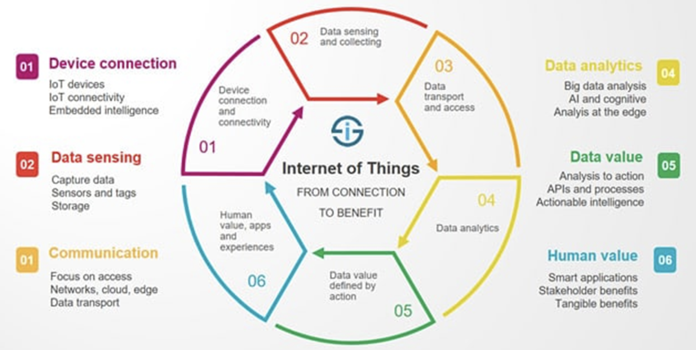

## Sfide introdotte dall’IoT

L’adozione dell’IoT introduce una serie di sfide strutturali che derivano dalla natura distribuita dei sistemi e dalla necessità di integrare in modo coerente dispositivi, servizi e reti. A differenza dei servizi digitali tradizionali, l’IoT opera in ambienti fisici complessi e dipende da componenti eterogenei, ciascuno caratterizzato da vincoli specifici. Una delle principali difficoltà riguarda l’*affidabilità della rete*. I dispositivi IoT non possono assumere una connettività continua e stabile: la comunicazione può essere intermittente, soggetta a ritardi o a perdita di pacchetti. Queste condizioni si riflettono direttamente sull’esperienza dell’utente, che può percepire incoerenze nello stato del sistema o ritardi nell’esecuzione dei comandi. Un’ulteriore sfida è la *sincronizzazione dei dati* tra dispositivi diversi. In un ecosistema distribuito, i nodi possono essere attivi in momenti differenti o disporre di informazioni non aggiornate. Ciò può generare comportamenti imprevedibili, difficili da comprendere per l’utente e complessi da gestire dal punto di vista progettuale. Anche la *gestione dell’energia* rappresenta un elemento critico, poiché molti dispositivi IoT operano su batterie o devono limitare al massimo il consumo energetico. Questo comporta capacità di calcolo ridotta e comunicazioni brevi, che impongono vincoli specifici sulle modalità di progettazione dell’interazione. Infine, la *presenza di dispositivi fisici* introduce nuove responsabilità: errori, ritardi o connessioni instabili possono avere conseguenze nel mondo reale e non sempre reversibili. Progettare sistemi IoT significa quindi considerare non solo la robustezza tecnica, ma anche la sicurezza, l’affidabilità e la chiarezza del modello mentale che il sistema comunica all’utente.

# Le rivoluzioni industriali

L’evoluzione dei sistemi produttivi negli ultimi due secoli è stata caratterizzata da una serie di trasformazioni radicali, note come rivoluzioni industriali. Ognuna di esse è stata guidata dall’introduzione di nuove tecnologie che hanno modificato profondamente i processi produttivi, l’organizzazione del lavoro e il rapporto tra esseri umani e macchine. Le rivoluzioni industriali non sempre rappresentano semplici avanzamenti tecnologici, ma cambiamenti sistemici (disruptive) che hanno ridisegnato l’economia, la società e la cultura. Dalla meccanizzazione dell’energia nella prima rivoluzione industriale, alla produzione di massa nella seconda, all’automazione elettronica della terza, fino ai sistemi cyber-fisici e all’integrazione digitale dell’Industria 4.0, ogni fase ha progressivamente ampliato il ruolo delle tecnologie nel governo dei processi produttivi. In questo contesto, comprendere l’evoluzione storica delle rivoluzioni industriali permette di interpretare meglio la natura dell’Industria 4.0 e il ruolo che tecnologie come l’Internet of Things svolgono nella trasformazione digitale contemporanea.

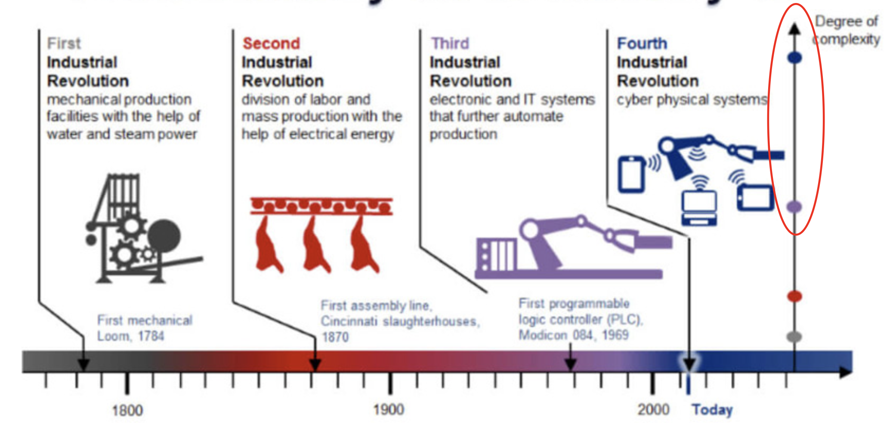

## Industria 1.0: La Prima Rivoluzione Industriale

La *Prima Rivoluzione Industriale*, comunemente indicata come *Industria 1.0*, rappresenta il passaggio da un modello produttivo artigianale e manuale a un sistema basato sulla meccanizzazione. Questo processo ebbe inizio nella seconda metà del XVIII secolo nel Regno Unito e si diffuse progressivamente in Europa e negli Stati Uniti. Il fattore tecnologico abilitante centrale dell’Industria 1.0 fu l’introduzione della macchina a vapore e dei sistemi meccanici azionati da energia termica, affiancati dallo sviluppo delle ferrovie. Questa innovazione rese possibile automatizzare molte attività che fino ad allora erano state svolte esclusivamente a mano o con la forza animale. Il settore tessile fu uno dei primi a trasformarsi profondamente: l’introduzione di telai meccanici e filatoi automatizzati aumentò drasticamente la capacità produttiva e ridusse i tempi necessari alla lavorazione. Parallelamente, anche il settore metallurgico si sviluppò grazie a nuove tecniche di fusione e lavorazione del ferro. Dal punto di vista socioeconomico, l’Industria 1.0 segnò il passaggio dalla produzione artigianale dispersa sul territorio alla concentrazione in fabbriche, favorendo la nascita di nuovi modelli di organizzazione del lavoro e dei primi sistemi di produzione su larga scala. Questo periodo vide inoltre lo sviluppo delle prime infrastrutture di trasporto moderne, come ferrovie e navi a vapore, che migliorarono la distribuzione delle merci e facilitarono la crescita dei mercati. In altre parole, l’Industria 1.0 introduce tre elementi chiave che caratterizzeranno tutte le successive rivoluzioni industriali:

- La sostituzione del lavoro umano con macchine motorizzate;
- La concentrazione delle attività produttive in fabbrica;
- La nascita di nuovi modelli economici basati sulla produzione seriale.

## Industria 2.0: La Seconda Rivoluzione Industriale

La *Seconda Rivoluzione Industriale*, solitamente collocata tra la fine del XIX secolo e l’inizio del XX secolo, rappresenta l’evoluzione del modello industriale introdotto con l’Industria 1.0. In questa fase, l’elemento tecnologico fondamentale fu l’introduzione dell’energia elettrica e l’adozione di nuovi sistemi di produzione basati sulla standardizzazione e sulla divisione del lavoro. L’elettricità permise di superare i limiti imposti dai macchinari a vapore, offrendo una fonte di energia più efficiente, flessibile e adattabile. Le fabbriche poterono adottare layout produttivi più complessi e introdurre macchinari specializzati, non più vincolati alla trasmissione meccanica dell’energia. Questo facilitò la crescita di nuovi settori industriali. Una delle innovazioni più influenti di questa fase fu la catena di montaggio, resa popolare dal modello produttivo fordista, la nota casa automobilistica. La produzione non era più organizzata intorno all’operaio, ma attorno al flusso del prodotto: ogni lavoratore o reparto eseguiva un compito estremamente specializzato (chi produce ruote, chi telai, ecc.), riducendo tempi, costi e variabilità del processo. Questa forma di produzione di massa rese i beni industriali più accessibili e segnò la nascita del consumo di larga scala. Dal punto di vista organizzativo, l’*Industria 2.0* introdusse nuovi modelli gestionali, tra cui il taylorismo, basati sull’analisi scientifica dei tempi e dei metodi. L’obiettivo era ottimizzare l’efficienza attraverso la razionalizzazione del lavoro. L’impatto socioeconomico fu significativo: la produzione aumentò drasticamente, si svilupparono grandi conglomerati industriali, si intensificò la specializzazione del lavoro e si consolidarono nuove forme di urbanizzazione. L’Industria 2.0 pose così le basi per i modelli di produzione standardizzati e scalabili che caratterizzeranno gran parte del XX secolo.

## Industria 3.0: La Terza Rivoluzione Industriale

La *Terza Rivoluzione Industriale*, collocata a partire dagli anni Settanta del XX secolo, segna l’introduzione massiva dell’elettronica, dell’informatica e dei sistemi automatici all’interno dei processi produttivi. Rispetto ai modelli standardizzati dell’Industria 2.0, questa fase rappresenta una trasformazione profonda del modo in cui le imprese gestiscono informazioni, produzione e controllo delle operazioni. L’elemento tecnologico abilitante principale fu la diffusione dei microprocessori e dell’elettronica digitale, che resero possibile l’automazione programmabile. Sistemi come i controllori logici programmabili (PLC) permisero di controllare macchine, linee di produzione e impianti industriali in modo flessibile, affidabile e con una riduzione significativa degli errori. Un altro elemento centrale dell’Industria 3.0 è l’automazione robotica. Nascono le celle robotiche in grado di eseguire compiti specifici (es. forgiatura o saldatura automatizzata). I robot industriali si diffusero in molte aree produttive grazie alla loro capacità di eseguire compiti ripetitivi, pericolosi o ad alta precisione, contribuendo a incrementare la qualità e la continuità dei processi. Dal punto di vista organizzativo, la Terza Rivoluzione Industriale portò a un modello produttivo più flessibile rispetto alla catena di montaggio fordista. La capacità di programmare e riprogrammare macchinari e robot consentì la produzione di lotti più variabili, aprendo la strada a configurazioni produttive meno rigide. Sul piano socioeconomico, l’introduzione dell’automazione contribuì alla trasformazione del lavoro: da mansioni prevalentemente manuali a ruoli caratterizzati da competenze tecniche, informatiche e di supervisione. Questa transizione rese necessaria una maggiore formazione specialistica e una diversa organizzazione dei compiti.

### Stack del modello 3.0

Nel modello produttivo dell’Industria 3.0, i sistemi di automazione industriale sono organizzati secondo una struttura fortemente gerarchica, nota come *piramide dell’automazione*. Questa architettura separa in modo netto i diversi livelli funzionali del sistema produttivo, definendo responsabilità in modo abbastanza rigido.

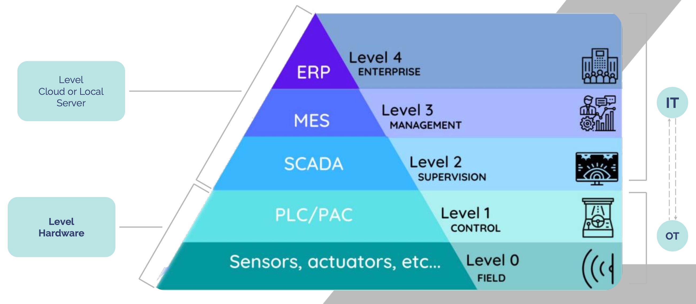

Alla base si colloca il livello dei *sensori* e degli *attuatori*, responsabili della raccolta delle grandezze fisiche e dell’esecuzione delle azioni sul campo.  
Subito al di sopra si trova il livello del *controllo*, tipicamente realizzato attraverso PLC e sistemi di automazione locale, che garantiscono il coordinamento delle operazioni di macchina con requisiti di affidabilità e determinismo temporale.  
Il livello successivo è rappresentato dai *sistemi di supervisione*, come SCADA, che consentono agli operatori di monitorare lo stato dell’impianto, gestire gli allarmi e intervenire sui parametri.  
Al di sopra di essi si colloca il livello *MES (Manufacturing Execution System)*, dedicato alla gestione operativa della produzione, alla pianificazione delle risorse e al controllo delle performance.  
All’apice della piramide si trovano i *sistemi gestionali ERP*, orientati alla gestione aziendale complessiva, alla logistica, alla contabilità e alla pianificazione di "alto livello".  
  
Questi sistemi ricevono informazioni aggregate provenienti dai livelli inferiori e forniscono obiettivi e direttive ai processi produttivi. Questa struttura è caratterizzata da un modello di comunicazione prevalentemente verticale: i dati vengono raccolti al livello più basso, elaborati localmente e trasmessi ai livelli superiori. Ogni livello è progettato per assolvere un insieme specifico di funzioni e comunica principalmente con il livello immediatamente adiacente.

## Industria 4.0: La Quarta Rivoluzione Industriale

L’*Industria 4.0* (emersa intorno al 2010) rappresenta la quarta grande trasformazione dei sistemi produttivi ed è caratterizzata dall’integrazione tra processi fisici e digitali. Questa fase introduce sistemi cyber-fisici capaci di monitorare, analizzare e controllare la produzione in modo autonomo, favorendo modelli altamente flessibili, adattivi e interconnessi. Il nucleo concettuale dell’Industria 4.0 è basato su macchine e sistemi intelligenti che monitorano i processi fisici, comunicano tra loro e prendono decisioni decentralizzate (ad esempio, un robot non è più solo automatizzato come nella 3.0, ma è connesso in rete, integrato nell'ecosistema digitale e controllato da remoto). 

Un aspetto distintivo è la capacità degli impianti di adattarsi dinamicamente alle variazioni, riconfigurando processi e linee produttive in risposta a nuove condizioni o esigenze. L’Industria 4.0 introduce inoltre una duplice e fondamentale integrazione dei sistemi produttivi:

- **Integrazione orizzontale:** riguarda la connessione lungo l'intera filiera aziendale e tra le diverse fasi del processo produttivo. Reparti che prima lavoravano a compartimenti stagni (ordini, logistica, produzione, assemblaggio) sono ora interconnessi e coordinati in tempo reale, permettendo un flusso informativo continuo.
- **Integrazione verticale:** collega i livelli operativi della produzione con i livelli gestionali e decisionali, sovvertendo la rigidità dello stack 3.0. Questo avviene tramite il dialogo diretto tra due sistemi chiave:
  - Il **MES (Manufacturing Execution System)**, che supervisiona, controlla e traccia le attività in fabbrica raccogliendo dati in tempo reale da macchine e operatori.
  - L’**ERP (Enterprise Resource Planning)**, che fornisce la visione strategica coordinando le risorse aziendali (finanze, HR, acquisti).
  In questo contesto, il MES dialoga direttamente con l'hardware connesso, e l'ERP utilizza questi dati istantanei per ottimizzare le decisioni di business.

In questo contesto, lo *smart product* assume un ruolo centrale. Un prodotto non è più soltanto un oggetto fisico, ma incorpora sensori, connettività e servizi digitali in grado di estendere la sua funzionalità. L’oggetto diventa parte di un ecosistema in cui produzione, utilizzo e manutenzione sono connessi attraverso dati e servizi cloud. L’IoT diventa quindi l’infrastruttura di base che permette ai sistemi cyber-fisici di funzionare, costituendo uno dei pilastri tecnologici centrali di questa attuale rivoluzione industriale.

### Convergenza IT/OT e il ruolo dell’Industrial IoT

La trasformazione digitale dei sistemi produttivi richiede una progressiva integrazione tra Information Technology (IT) e Operational Technology (OT), due domini che storicamente hanno operato in modo indipendente. L’IT comprende infrastrutture, reti e sistemi informativi orientati alla gestione del dato, alla scalabilità e ai servizi digitali. L’OT, al contrario, riguarda macchinari, sensori, attuatori e sistemi di controllo industriale che devono garantire continuità, determinismo temporale e sicurezza. Nel modello industriale tradizionale questi due mondi sono separati da barriere tecniche, culturali e organizzative. I sistemi OT utilizzano protocolli proprietari e architetture chiuse, non progettati per l’interconnessione estesa, mentre l’IT opera con tecnologie aperte, dinamiche e basate su servizi distribuiti. La mancata interoperabilità tra i due livelli limita la possibilità di sfruttare in modo efficace il patrimonio informativo generato dagli impianti produttivi, ostacolando la transizione verso modelli decisionali basati sui dati. La convergenza IT/OT rappresenta quindi un elemento strategico dell’Industria 4.0. Essa non consiste nella semplice connessione dei sistemi, ma nella costruzione di un ecosistema unificato in cui dati tecnici, informazioni gestionali e capacità di elaborazione collaborano in modo integrato. Per realizzare questa integrazione è necessario introdurre tecnologie capaci di tradurre, aggregare e normalizzare informazioni eterogenee provenienti da macchinari, linee produttive e sistemi informativi. In questo contesto, l’Industrial Internet of Things (IIoT) svolge un ruolo centrale. Dispositivi intelligenti, nodi di raccolta dati e piattaforme IoT industriali fungono da ponte tra OT e IT, rendendo possibile la comunicazione bidirezionale tra macchine e sistemi digitali. L’IIoT abilita l’acquisizione in tempo reale dei dati operativi, la loro trasmissione verso servizi di elaborazione locali o remoti e l’integrazione con applicazioni gestionali, analitiche o decisionali. Un’infrastruttura IIoT efficace si basa tipicamente su architetture distribuite in cui cooperano diversi livelli funzionali:

- **Device layer**: composto da sensori, attuatori e macchinari connessi che raccolgono dati e generano eventi legati al processo produttivo;

- **Processing layer**: costituito da nodi edge o gateway industriali incaricati di interpretare, filtrare e normalizzare i dati provenienti dal campo, riducendo il carico e permettendo risposte a bassa latenza;

- **Application layer**: ospita piattaforme cloud, sistemi gestionali, servizi analitici e strumenti decisionali basati su modelli predittivi o tecniche di intelligenza artificiale.

Questa architettura rende possibile un flusso di informazione continuo e coerente tra il livello operativo e quello informativo, favorendo processi decisionali rapidi, accurati e data-driven. Questa convergenza IT/OT armonizza queste conoscenze e permette di sfruttare le rispettive competenze in modo complementare.

### Limiti del modello 3.0

Nonostante la piramide dell’automazione abbia rappresentato per lungo tempo un riferimento stabile per l’organizzazione dei sistemi produttivi, essa mostra limiti significativi nel contesto industriale contemporaneo. Il primo limite riguarda la *rigidità dei flussi informativi*: la comunicazione verticale tra livelli immediatamente adiacenti impedisce di sfruttare appieno la ricchezza dei dati generati dai processi, ostacolando la condivisione orizzontale e l’integrazione tra i vari macchinari.  
Un secondo limite è legato all’*isolamento dei sistemi OT*. PLC, SCADA e sistemi di controllo non sono progettati per interagire con applicazioni esterne, servizi digitali o infrastrutture cloud. La mancanza di connettività rende complessa la raccolta dei dati operativi e limita la possibilità di introdurre meccanismi avanzati di monitoraggio, manutenzione predittiva o ottimizzazione dei processi.  
La piramide riflette inoltre una forte *eterogeneità tecnologica*: i macchinari presenti negli impianti industriali appartengono spesso a generazioni differenti e utilizzano protocolli proprietari non intercambiabili, dando origine a fenomeni di *vendor lock-in*. Anche questo rende difficoltosa la scalabilità dei sistemi e ostacola la possibilità di integrare dispositivi e applicazioni innovative.  
Un ulteriore limite riguarda la *separazione tra IT e OT*. I due domini operano con logiche, priorità e strumenti differenti: l’OT privilegia affidabilità, determinismo e sicurezza fisica, mentre l’IT si concentra sulla gestione dei dati, la scalabilità e i servizi applicativi più ad alto livello. L’assenza di un’integrazione nativa impedisce di trasformare il dato industriale in conoscenza utile ai processi decisionali del reparto management.  
Infine, la piramide 3.0 non è progettata per gestire modelli produttivi flessibili, personalizzati o basati sull’analisi real-time. L’architettura gerarchica e statica contrasta con le esigenze di adattabilità, collaborazione e reattività richieste dalle industrie moderne. Questi limiti evidenziano la necessità di superare il modello tradizionale dell’Industria 3.0, adottando architetture più aperte e flessibili, in linea con i principi dell’Industria 4.0.

## Colmare il divario tra IT e OT

L’evoluzione verso l’Industria 4.0 richiede un cambiamento profondo nel modo in cui i sistemi informativi e i sistemi operativi industriali interagiscono tra loro. I tradizionali modelli di integrazione, basati su comunicazioni verticali e protocolli proprietari, come abbiamo detto, non sono più sufficienti per supportare le esigenze dei sistemi contemporanei.  
Il nuovo approccio dell’Industrial Internet of Things (IIoT) nasce per rispondere a questa sfida, ponendosi come elemento di connessione tra i domini IT e OT. Esso introduce un insieme di tecnologie e metodologie capaci di superare la storica separazione tra sistemi di controllo locale e sistemi informativi aziendali, abilitando una comunicazione fluida e bidirezionale.  
Alla base di questo modello vi è la capacità dei dispositivi IIoT di rendere accessibili i dati provenienti dal campo in modo standardizzato e interoperabile. Sensori, attuatori, macchinari e PLC vengono integrati attraverso gateway intelligenti o nodi di edge computing che estraggono, filtrano e normalizzano le informazioni, trasformandole in flussi dati utilizzabili dai servizi digitali e dalle applicazioni di analisi. Questo nuovo paradigma permette di superare il tradizionale schema gerarchico della piramide, introducendo meccanismi di comunicazione orizzontale e servizi distribuiti. I sistemi produttivi non sono più strutturati secondo livelli rigidamente separati, ma diventano ecosistemi aperti in cui il dato può fluire tra macchinari, piattaforme cloud, sistemi gestionali e strumenti decisionali.  
L’approccio IIoT consente inoltre l’adozione di architetture flessibili basate su microservizi, in cui le funzionalità operative e informative sono suddivise in componenti indipendenti, facilmente aggiornabili e scalabili. Questo modello favorisce l’integrazione di nuove tecnologie, riduce il legame con i fornitori originari dei macchinari e permette una rapida evoluzione dei sistemi senza interventi invasivi sull’infrastruttura esistente.  
Attraverso la convergenza delle informazioni provenienti dal dominio OT con le capacità analitiche e di orchestrazione tipiche dell’IT, il sistema industriale acquisisce maggiore reattività. L’IIoT diventa così un elemento chiave nella trasformazione dell’impianto produttivo, consentendo di costruire processi data-driven e di ottimizzare in modo continuo le prestazioni, l’efficienza e la qualità.

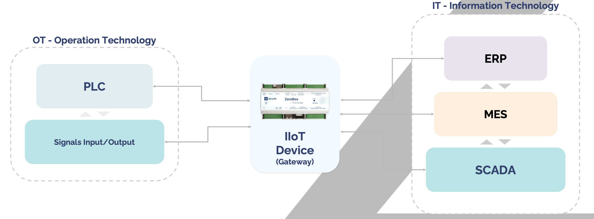

All’interno delle architetture Industrial IoT, il *gateway* svolge una funzione fondamentale di integrazione tra OT e IT. Esso agisce come punto di raccolta e mediazione dei dati provenienti da sensori, attuatori, macchinari e sistemi di controllo, traducendo protocolli eterogenei e formati proprietari in flussi informativi standardizzati e interoperabili. Il gateway non si limita a trasferire i dati verso il livello superiore, ma esegue operazioni essenziali quali filtraggio, aggregazione, normalizzazione e, quando necessario, elaborazione locale. Queste capacità riducono il carico di comunicazione verso il cloud, migliorano la qualità del dato e permettono risposte a bassa latenza direttamente vicino alla sorgente.

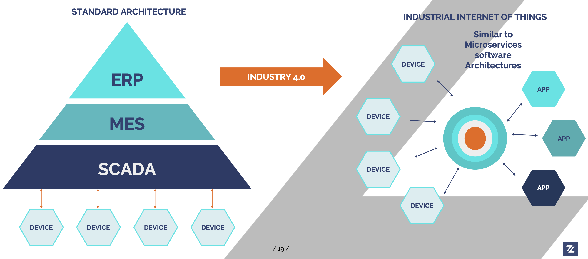

### Digital Twin

Un elemento centrale dell’Industria 4.0 è il concetto di *Digital Twin*, ovvero la rappresentazione digitale di un oggetto fisico, di un processo o di un intero sistema produttivo. Il Digital Twin integra dati provenienti dai dispositivi IoT, dai sensori e dai sistemi di controllo, costruendo un modello virtuale aggiornato in tempo reale che rispecchia il comportamento del sistema fisico. Attraverso questa replica digitale è possibile monitorare lo stato operativo dell’impianto, simulare scenari futuri, prevedere guasti e ottimizzare le prestazioni prima di intervenire nel mondo reale.  
Il Digital Twin consente di ridurre costi e rischi, poiché interventi e modifiche possono essere testati virtualmente prima di essere implementati. Nel contesto di una industria moderna, il Digital Twin diventa uno strumento strategico per la manutenzione predittiva, la pianificazione della produzione e l’adattamento dinamico dei processi. Integrato con l’IoT e con i sistemi cyber-fisici, permette di creare un ciclo continuo di aggiornamento tra modello digitale e sistema reale, abilitando tecniche di ottimizzazione autonoma e decision making data-driven.

## Edge Computing

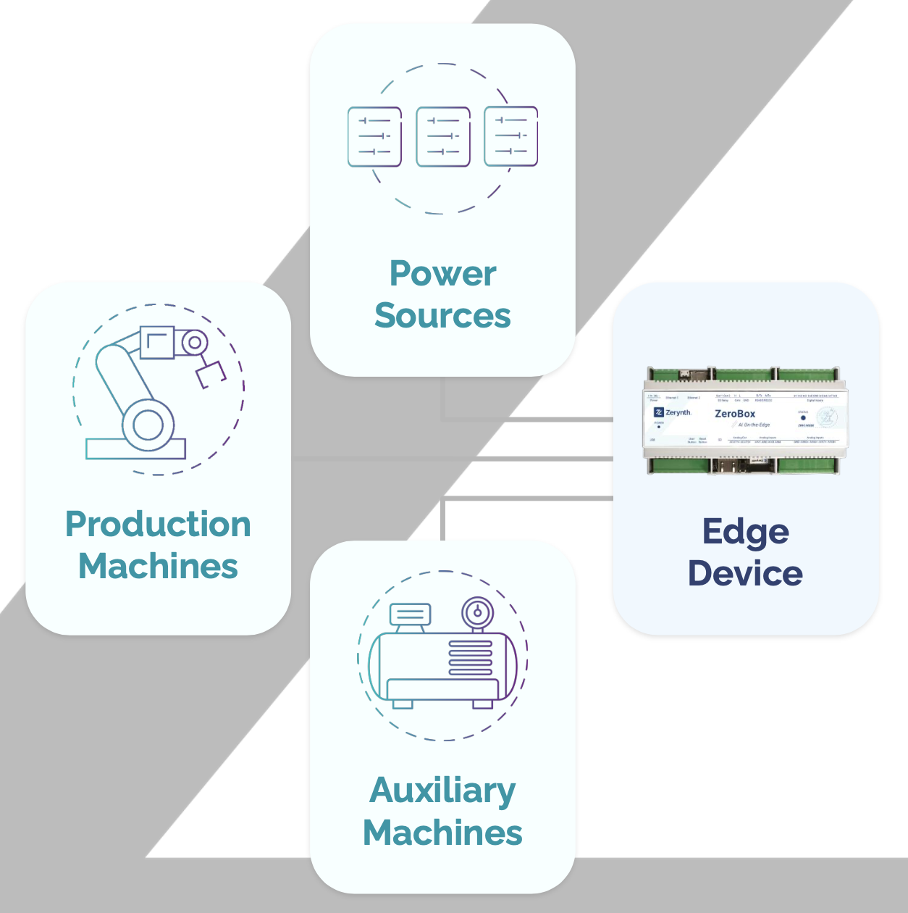

L’aumento del numero di dispositivi connessi, la necessità di risposte in tempo reale e la crescente complessità dei sistemi produttivi rendono insufficiente un modello di elaborazione interamente centralizzato. L’*Edge Computing* nasce per rispondere a questa esigenza, introducendo un livello di calcolo distribuito. Nel contesto industriale, i nodi edge sono dispositivi o gateway dotati di capacità computazionali che operano all’interno dell’impianto, elaborando localmente i dati provenienti da macchinari, sensori e sistemi di controllo. Questa prossimità riduce la latenza, permette reazioni rapide e consente di delegare funzioni critiche senza dipendere dalla stabilità della connessione verso il cloud. L’elaborazione locale consente di filtrare, aggregare e normalizzare i dati, riducendo il volume di informazioni da inviare ai sistemi centrali e aumentando l’efficienza complessiva. Inoltre, i nodi edge possono ospitare modelli di intelligenza artificiale o algoritmi di manutenzione predittiva, permettendo di individuare anomalie o condizioni critiche in tempo reale. L’adozione dell’Edge Computing contribuisce anche a migliorare la resilienza del sistema produttivo: in caso di interruzioni della connettività, l’impianto può continuare a funzionare autonomamente, mantenendo operative le funzioni locali e sincronizzando i dati non appena la connessione viene ripristinata.

## Cloud Computing

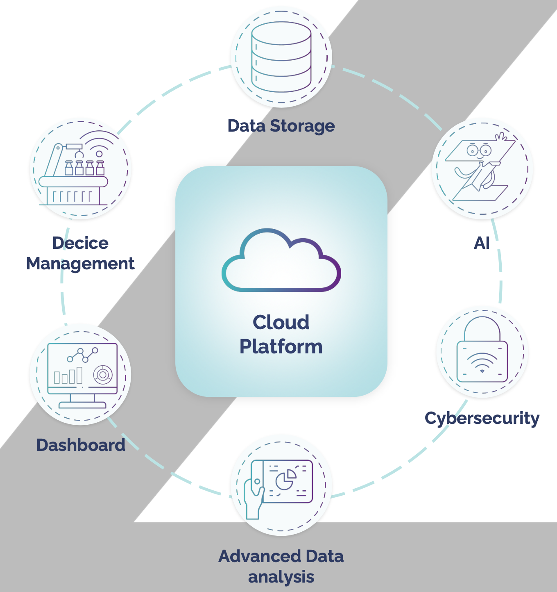

Accanto ai meccanismi di elaborazione locale, il *Cloud Computing* riveste un ruolo centrale nell’architettura dell’Industria 4.0. Il cloud fornisce un ambiente scalabile, flessibile e altamente disponibile in cui è possibile ospitare applicazioni, servizi analitici e modelli di machine learning che richiedono capacità computazionali significative. Il cloud permette di archiviare grandi quantità di dati storici provenienti dagli impianti produttivi, consentendo l’analisi di lungo periodo, la definizione di indicatori di performance e lo sviluppo di strategie predittive. Tale capacità è essenziale per individuare pattern, ottimizzare processi e supportare decisioni strategiche basate su informazioni affidabili. Grazie alla sua natura distribuita, il cloud favorisce l’integrazione con sistemi gestionali, applicazioni aziendali e strumenti di orchestrazione. I servizi possono essere aggiornati, riconfigurati o estesi senza interferire con il funzionamento delle linee produttive, riducendo i tempi di sviluppo e migliorando la flessibilità organizzativa. Un ulteriore vantaggio del cloud consiste nella possibilità di creare architetture ibride che combinano funzioni locali e funzioni centralizzate. In questo modello, i nodi edge eseguono l’elaborazione immediata, mentre il cloud gestisce l’analisi avanzata, l’aggregazione dei dati e la sincronizzazione tra impianti diversi. Il cloud non sostituisce quindi i livelli locali dell’automazione industriale, ma li completa, abilitando una visione globale dei processi e fornendo strumenti per il miglioramento delle prestazioni. La sua integrazione con l’Edge Computing rappresenta uno dei cardini dell’Industria 4.0, permettendo di costruire sistemi produttivi scalabili e intelligenti.

# Panorama attuale dell’IoT

L’Internet of Things non rappresenta soltanto un insieme di tecnologie emergenti, ma costituisce un fenomeno in rapida diffusione che coinvolge numerosi settori produttivi, infrastrutture pubbliche e ambiti applicativi. Comprendere lo stato attuale dell’IoT significa analizzarne sia la distribuzione nei progetti reali sia il livello di maturità delle sue componenti tecnologiche. Questa prospettiva consente di collocare correttamente l’IoT nel contesto dell’Industria 4.0, distinguendo tra tecnologie consolidate e tecnologie ancora in fase di crescita o sperimentazione.

## Distribuzione globale dei progetti IoT

Il grafico sottostante mostra la distribuzione globale dei progetti IoT, evidenziando come l’adozione dell’Internet of Things sia generalmente uniforme, ma in particolare concentrata in alcuni ambiti applicativi specifici.

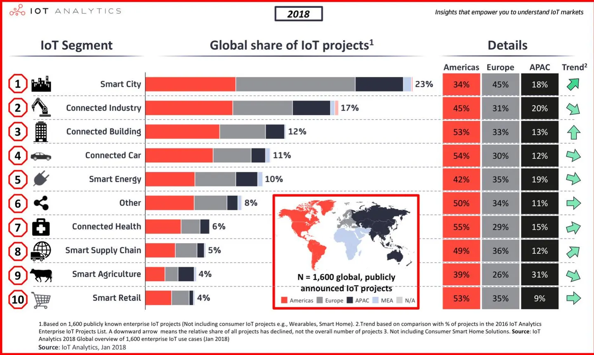

La classificazione proposta distingue le cinque principali categorie:

- **Smart City**: rappresenta la quota più ampia dei progetti IoT a livello globale. Include soluzioni per illuminazione intelligente, gestione del traffico, monitoraggio ambientale, mobilità connessa e ottimizzazione dei servizi pubblici. L’obiettivo è migliorare l’efficienza urbana e la qualità della vita;

- **Connected Industry**: comprende applicazioni industriali come monitoraggio di macchinari, manutenzione predittiva, robotica connessa e sistemi produttivi automatizzati. È il segmento che più riflette la trasformazione abilitata da Industria 4.0;

- **Connected Building**: include edifici intelligenti con sistemi domotici, controllo energetico, monitoraggio della sicurezza, gestione degli accessi e automazione degli impianti;

- **Connected Car**: riguarda veicoli connessi, telemetria, assistenza alla guida, diagnostica predittiva e servizi smart per mobilità privata e condivisa;

- **Smart Energy**: include reti energetiche intelligenti, smart metering, gestione distribuita dell’energia, integrazione con rinnovabili e ottimizzazione dei consumi.

L’analisi della distribuzione rivela che i progetti IoT sono maggiormente concentrati nei settori che presentano una forte componente infrastrutturale e che traggono benefici immediati dall’ottimizzazione dei processi e dalla disponibilità continua di dati. La dimensione urbana, industriale ed energetica costituisce dunque il nucleo dell’adozione attuale dell’IoT.

## Gartner Hype Cycle

Oltre a comprendere dove l’IoT viene applicato, è essenziale analizzare il livello di maturità delle tecnologie che lo compongono. Un modello ampiamente utilizzato per interpretare la diffusione delle tecnologie emergenti è l’*Hype Cycle* di *Gartner*, che descrive le fasi attraverso cui una tecnologia passa dalla sua introduzione alla piena adozione.

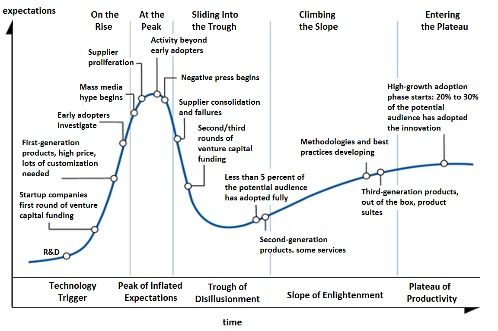

L’Hype Cycle identifica *cinque fasi* principali:

1.  **Technology Trigger**: la tecnologia viene introdotta e genera interesse, spesso senza applicazioni solide;

2.  **Peak of Inflated Expectations**: aumentano le aspettative, accompagnate da casi d’uso sperimentali e narrazioni ottimistiche;

3.  **Trough of Disillusionment**: la tecnologia non soddisfa le aspettative e l’interesse diminuisce, mentre sopravvivono solo le applicazioni più fondate;

4.  **Slope of Enlightenment**: emergono utilizzi realistici, competenze più consolidate e una migliore comprensione del valore effettivo;

5.  **Plateau of Productivity**: la tecnologia raggiunge la maturità e viene adottata su larga scala, con un ecosistema stabile di strumenti e standard.

Alcune tecnologie IoT, come i sensori avanzati, il digital twin, le piattaforme cloud per dispositivi connessi in rete o i sistemi edge, si collocano oggi in fasi diverse dell’Hype Cycle. Questo modello è utile per interpretare la dinamicità del settore e per comprendere perché alcune soluzioni maturino rapidamente mentre altre richiedano tempi più lunghi per una piena integrazione industriale.

## Interpretazione e connessione con l’Industria 4.0

La combinazione tra distribuzione dei progetti IoT e maturità tecnologica consente di tracciare un quadro trasparente dello stato dell’IoT nel contesto dell’Industria 4.0. I settori che presentano una maggiore quota di progetti appartengono tipicamente a contesti in cui i benefici dell’automazione, del monitoraggio e della connettività sono immediati e misurabili. Parallelamente, la posizione delle tecnologie lungo l’Hype Cycle suggerisce che molte delle componenti dell’IoT sono ancora in fase di sviluppo e consolidamento, mentre altre hanno raggiunto una maturità sufficiente per una diffusione su larga scala. L’insieme di questi elementi mostra un ecosistema in continua evoluzione, in cui la crescita dell’IoT non dipende solo dalla disponibilità della tecnologia, ma anche dalla sua integrazione nei processi quotidiani.
### Quando connettere a Internet i dispositivi?

Un aspetto fondamentale nella progettazione di soluzioni IoT è evitare la tentazione di collegare un prodotto a Internet semplicemente perché la tecnologia lo rende possibile. L'IoT **non è più una tecnologia innovativa**: già nel 2018 aveva superato il picco dell’hype, e pensarla ancora come una "novità" conduce al fenomeno dell'**overengineering**, ovvero inserire l'IoT nei prodotti solo perché "fa tendenza", senza che esista un bisogno reale.

<figure data-latex-placement="h!">

</figure>

Come mostrano le analisi delle sfide dell’IoT, la connettività introduce complessità significative: problemi di rete, sincronizzazione imperfetta tra dispositivi, vincoli energetici e potenziali conseguenze nel mondo reale. Integrare l’IoT in un prodotto ha quindi senso solo quando abilita funzionalità concrete, produce un reale **outcome umano** e migliora la qualità della vita dell’utente. 

Oggi l’IoT è una **tecnologia abilitante** per la creazione di nuovi servizi digitali, manutenzione predittiva e modelli di business basati sui dati. "Mettere Internet nelle cose" non deve essere il fine, ma solo un mezzo per realizzare ecosistemi utili.

<figure data-latex-placement="h!">
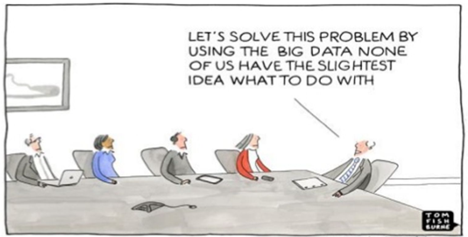
</figure>

## Dai prodotti ai servizi

La maggior parte delle grandi tecnologie (come l'ABS, l'airbag o il kevlar) nasce in ambito professionale o militare (top-down) e solo in seguito viene adattata per il consumatore comune. Con l’IoT è avvenuto l'esatto contrario: la rivoluzione è partita *"dal basso"*, dalla comunità dei **maker** e da piattaforme open-hardware come **Arduino** e **Raspberry Pi**. L'IoT è entrato prima nelle case delle persone e solo in un secondo momento si è consolidato nelle aziende. Questo implica che la progettazione non può ignorare l'essere umano comune, che ne è stato il pioniere e resta il principale utilizzatore.

<figure data-latex-placement="h!">

</figure>

<figure data-latex-placement="h!">

</figure>

L’avvento dell’Internet of Things ha trasformato la natura dei prodotti. Gli oggetti non sono più elementi isolati, ma parte di ecosistemi di servizi digitali. Il valore non risiede soltanto nel dispositivo fisico, ma nelle capacità, nei dati e nelle relazioni abilitate dai servizi che lo circondano.

### Cambiamento dell’esperienza e Servitizzazione

Quando aggiungiamo l’IoT ai prodotti, cambia completamente il modo in cui li percepiamo. L'esperienza utente si estende su tutto il ciclo di vita, definendo tre fasi fondamentali tipiche del service design:

- **Anticipated use**: l’esperienza prima dell’uso, guidata dall'immaginario dell'IoT, fatta di aspettative e interpretazione del valore promesso.
- **Actual use**: l’esperienza durante l’interazione, in cui il prodotto fisico diventa un touchpoint all'interno di un sistema di servizi.
- **Digested use**: l’esperienza dopo l’uso, che comprende la memoria, le valutazioni e la relazione (fidelizzazione o distacco) con il brand.

Un prodotto connesso viene descritto come un *service avatar*, ovvero un'interfaccia fisica verso servizi cloud in continua evoluzione. Questo apre le porte al concetto di **servitizzazione degli oggetti**: una vera e propria *disruptive innovation*. In futuro, potremmo non comprare più una lavatrice per le sue caratteristiche hardware, ma sottoscrivere un abbonamento per "pacchetti di lavaggio". La lavatrice diventa un mezzo fisico per erogare un servizio digitale.

<figure data-latex-placement="h!">
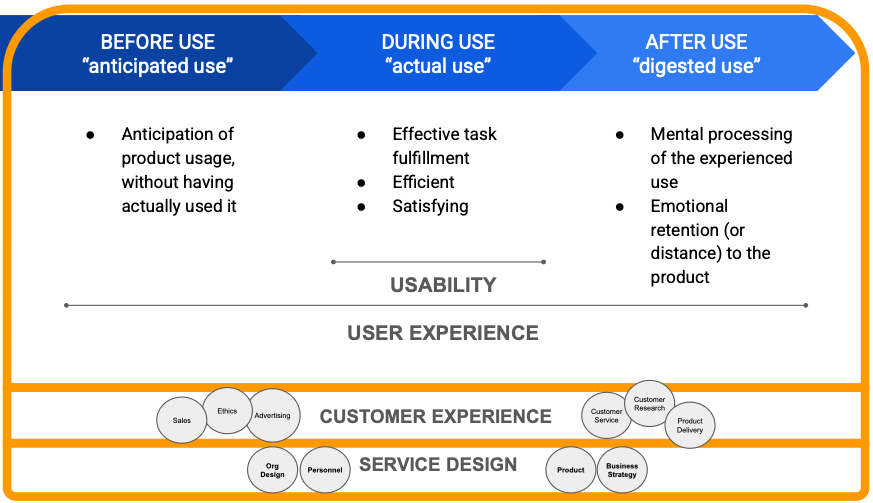
</figure>

### Prodotti smart e assistenti vocali: il vero modello di business

I prodotti smart e gli assistenti vocali (es. Amazon Echo, Google Home) sono un grande esercizio di design cognitivo: rappresentano una versione semplificata dei sistemi di ricerca, pensati per supportare l’utente in contesti multitasking (es. *"Hey Siri, fai questo"* mentre si hanno le mani occupate). 
Tuttavia, il modello concettuale dietro questi dispositivi nasconde un obiettivo di business più ampio. Aziende come Google non guadagnano dall'hardware, ma dal loro vero scopo: l'**advertising**. Introdurre un assistente in casa serve ad "affezionare" l'utente e raccogliere dati comportamentali, al fine di proporre inserzioni altamente personalizzate e con la massima probabilità di conversione.

<figure data-latex-placement="h!">

</figure>

### Service design: progettare ecosistemi

Nel contesto dell’Internet of Things, la progettazione non può limitarsi al singolo dispositivo, ma deve estendersi all’insieme dei servizi, dei processi e delle interazioni. Il service design assume un ruolo centrale per coordinare infrastrutture cloud, app, dispositivi e processi di onboarding. Il passaggio da prodotto a servizio implica che il valore emerga dalla capacità dell’intero ecosistema di rispondere ai bisogni dell’utente, garantendo affidabilità e trasparenza lungo l’intero ciclo di vita.

## Smart products: oggetti fisici con un cuore digitale

Un dispositivo ben progettato dal punto di vista industriale fallirà se l’infrastruttura di servizio che lo sostiene non è adeguata. Problemi come l'indisponibilità del cloud o aggiornamenti mal gestiti compromettono l’esperienza. In un modello orientato ai servizi, il valore percepito dipende dalla continuità del ciclo operativo; un buon prodotto, isolato da un servizio incoerente, non garantisce prestazioni adeguate. Se si progetta un sistema complesso, il modello concettuale deve prevedere fin dall'inizio il **Digital Twin** (la replica virtuale del prodotto): i dati raccolti sul carico di lavoro, i cicli o la manutenzione hanno valore solo se utilizzati per generare un ritorno positivo sull'esperienza dell'utente.

# Usabilità per l’IoT

La progettazione dell’esperienza utente per l’IoT presenta caratteristiche peculiari. L’UX deve essere concepita come la progettazione di un ecosistema distribuito per garantire continuità, intelligibilità e coerenza, riducendo la complessità intrinseca dei sistemi connessi.

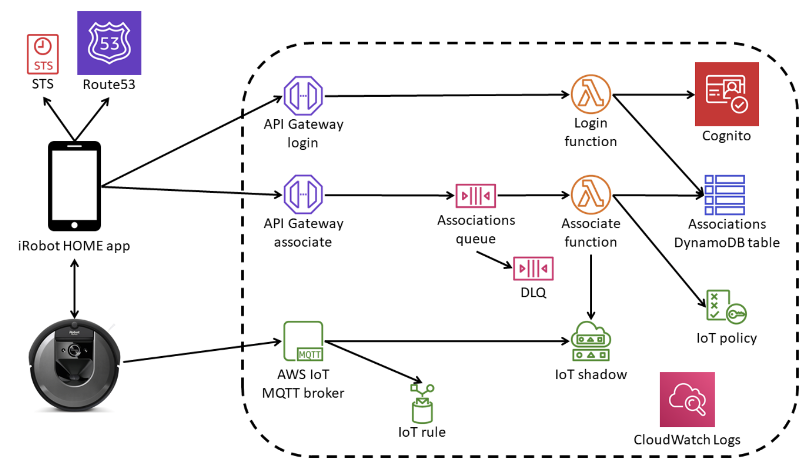

## Ecosistemi multi-dispositivo e interusabilità

Il principio di *interusabilità* garantisce che il sistema mantenga coerenza quando l’utente si sposta tra touchpoint diversi (app, dispositivo fisico, web). Nel mondo IoT, il modello concettuale deve essere perfettamente corrispondente: un'app per un termostato dovrebbe mimare la disposizione dei controlli fisici reali. 
Inoltre, molti prodotti IoT sono reti di dispositivi (es. gateway, termostato, valvole). Il ruolo del designer è nascondere la complessità architetturale: l'utente non deve capire come comunicano i nodi, ma solo visualizzare e gestire l'interfaccia finale (es. la temperatura nelle singole stanze).

<figure data-latex-placement="h!">

</figure>

## Autonomia, invisibilità e trasparenza

Molti sistemi IoT agiscono in autonomia in base a regole programmabili. La UX deve garantire la giusta trasparenza: l’utente deve comprendere le decisioni prese dal sistema ed essere in grado di intervenire, mantenendo un equilibrio tra automazione e controllo umano.

## Interazione nel mondo reale: L'assenza di "Undo"

A differenza dei prodotti digitali, i sistemi IoT influenzano oggetti tangibili. Nel mondo fisico **non esiste un "Undo" (Ctrl+Z)**: quando un'azione viene eseguita, l'effetto è reale e spesso irreversibile. Inoltre, l'interazione da remoto amplifica la complessità. È possibile che un'app mostri lo stato "eseguito" mentre la rete si è interrotta e il comando non è mai giunto al dispositivo. Il design deve considerare questi vincoli fisici e comunicativi.

<figure data-latex-placement="h!">
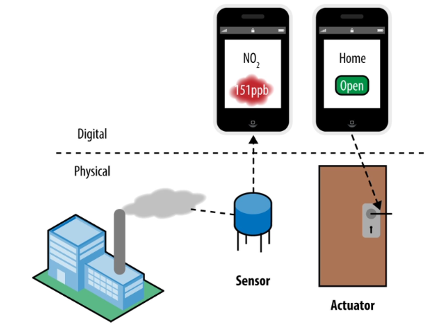
</figure>

## Temporalità e continuità dell’esperienza

L’esperienza nell’IoT include momenti di preparazione, uso quotidiano, manutenzione e aggiornamenti. La progettazione deve supportare l'utente attraverso tutte queste fasi temporali senza generare interruzioni impreviste.

## Affordance e progettazione fisica

L’oggetto fisico rimane centrale. La progettazione deve coordinare la dimensione fisica e quella digitale, evitando discrepanze. La presenza di componenti fisiche introduce temi come ergonomia e visibilità dei comandi.

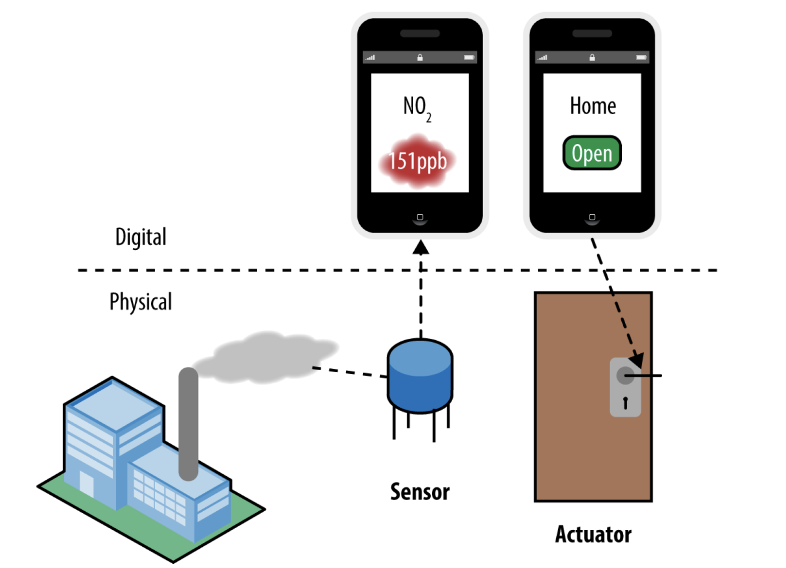

## Gestione dell’incertezza: Il problema dei feedback

Nel web, se una pagina è caricata, la rete funziona. Nell'IoT, la progettazione deve dare per scontato che **la rete non è affidabile** (latenze tra dispositivo, gateway, router e cloud).
In un'interfaccia standard l'utente si aspetta un feedback entro 100ms. Nell'IoT questo è impossibile da garantire. La soluzione UX consiste nel fornire **feedback multipli**: 
1. Aggiornamento visivo immediato sull'interfaccia (es. *pulsante premuto*).
2. Conferma che la richiesta è in transito.
3. Conferma finale dallo stato del dispositivo.
Senza questa stratificazione, l’utente rischierebbe di premere ripetutamente un comando, innescando conseguenze fisiche indesiderate.

<figure data-latex-placement="h">

</figure>

## Coerenza, Personalizzazione e Modelli di controllo

L'esperienza deve allineare il modello concettuale al modello mentale dell'utente. Il sistema IoT può adattarsi al contesto d'uso (Personalizzazione) attraverso vari modelli di controllo:
- **Controllo diretto** (interazione fisica)
- **Controllo remoto** (via cloud/app)
- **Automazione** (regole autonome)
- **Controllo delegato** e **Modelli ibridi**.

## Risparmio energetico nei sistemi IoT

La gestione dell’energia è uno degli aspetti più critici, non solo tecnicamente, ma per l'impatto sulla UX.

### Vincoli energetici e implicazioni hardware

I vincoli di batteria impongono compromessi progettuali severi. Ad esempio, una telecamera smart a batteria registra solo quando il sensore rileva movimento. Se l'utente desiderasse uno streaming continuo, non basterebbe un aggiornamento software: bisognerebbe riprogettare l'hardware per supportare i nuovi consumi. Il risparmio energetico trasforma funzioni banali in problemi complessi.

<figure data-latex-placement="h!">

</figure>

<figure data-latex-placement="h!">

</figure>

### Cicli di comunicazione e strategie di riduzione del consumo

La comunicazione è l'operazione più onerosa. Per ridurre l'impatto si usano il *campionamento adattivo*, la *trasmissione su evento* e la *trasmissione intermittente*. 

### Stati di sonno e funzionamento intermittente

I dispositivi alternano fasi di attività a profondi stati di inattività. Questo significa che il sistema potrebbe non essere istantaneamente reattivo. La UX deve gestire questa latenza comunicando all'utente che un comando è "in coda" per il risveglio del dispositivo.

# Verso l'Industria 5.0: Sostenibilità e Consapevolezza

Se l'Industria 4.0 ha rappresentato un esempio di *sustaining innovation* (ottimizzando e interconnettendo processi esistenti in maniera incrementale), l'**Industria 5.0** rappresenta una *disruptive innovation*. Essa estende i principi del 4.0 integrando i parametri **ESG** (Environmental, Social, and Governance).
L'obiettivo non è più solo produrre più velocemente, ma farlo in modo sostenibile. Le metriche di valutazione si spostano dai soli costi economici immediati ai **costi futuri e ambientali** (consumi energetici, spreco d'acqua, emissioni, impatto sulle risorse naturali). 

<figure data-latex-placement="h!">
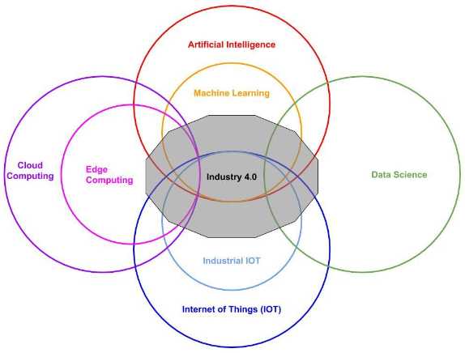
</figure>

Inoltre, l'estrema interconnessione della 4.0 ha portato a un paradosso cognitivo: gli operatori, prima "al buio" per mancanza di dati, oggi sono accecati da una "luce bianca" di informazioni eccedenti le loro capacità cognitive. Qui interviene l'Intelligenza Artificiale come filtro semantico e decisionale.
Le sfide del futuro non riguardano più la *funzionalità* della connessione (il "come" connettere è un problema risolto), ma l'**utilità**, l'**usabilità** e la valorizzazione del ruolo umano. L'uomo torna al centro del sistema per *orchestrare* la tecnologia, non per esserne sovrastato.

<figure data-latex-placement="h!">

</figure>

# Conclusioni

L’evoluzione tecnologica degli ultimi anni ha trasformato in profondità il modo in cui i sistemi produttivi, i servizi digitali e i prodotti interagiscono tra loro. L’Internet of Things si configura come una tecnologia abilitante centrale, capace di connettere oggetti, processi e persone attraverso un ecosistema distribuito. 

La transizione verso modelli flessibili, dal cloud all'edge computing, unita alla convergenza IT/OT, permette di costruire ecosistemi interoperabili. Parallelamente, la crescente centralità della servitizzazione impone un ripensamento del service design e della User Experience, che deve gestire l'incertezza (feedback multipli), l'irreversibilità fisica (assenza di Undo) e i vincoli energetici.

L’insieme di questi temi dimostra che collegare un dispositivo a Internet non è un traguardo, ma un mezzo. La vera sfida dell'Industria moderna, che guarda ormai ai paradigmi della 5.0, è costruire architetture in grado di generare valore reale, sostenibile ed ergonomico, ponendo l'essere umano al centro dell'innovazione tecnologica.