**Interazione Uomo-Macchina 2025/2026**

7 – UX for AI

Sara Pagliarecci

# **Indice**

[UX for Artificial Intelligence [2](#_Toc215319748)](#_Toc215319748)

[Introduzione [2](#introduzione)](#introduzione)

[1 Cosa rende l’UX dell’AI diversa dalla tradizionale? [3](#cosa-rende-lux-dellai-diversa-dalla-tradizionale)](#cosa-rende-lux-dellai-diversa-dalla-tradizionale)

[1.1 Paradigm Shift: Human-Centered AI [4](#paradigm-shift-human-centered-ai)](#paradigm-shift-human-centered-ai)

[1.2 Appropriate Intelligence [5](#appropriate-intelligence)](#appropriate-intelligence)

[2 Building Appropriate Reliance [6](#building-appropriate-reliance)](#building-appropriate-reliance)

[2.1 Il Reliance Toolkit: i tre meccanismi fondamentali per costruire una reliance appropriata [7](#il-reliance-toolkit-i-tre-meccanismi-fondamentali-per-costruire-una-reliance-appropriata)](#il-reliance-toolkit-i-tre-meccanismi-fondamentali-per-costruire-una-reliance-appropriata)

[2.2 Augmentation vs. Automation [8](#augmentation-vs.-automation)](#augmentation-vs.-automation)

[3 Il Ruolo del Feedback nell'Apprendimento dell'AI [10](#il-ruolo-del-feedback-nellapprendimento-dellai)](#il-ruolo-del-feedback-nellapprendimento-dellai)

[3.1 Le tre tipologie di Feedback [10](#le-tre-tipologie-di-feedback)](#le-tre-tipologie-di-feedback)

[4 I Principi di Design per l’AI [12](#i-principi-di-design-per-lai)](#i-principi-di-design-per-lai)

[5 Contesto e Trade-offs [16](#contesto-e-trade-offs)](#contesto-e-trade-offs)

[5.1 Classificazione dei Rischi (Stakes) [16](#classificazione-dei-rischi-stakes)](#classificazione-dei-rischi-stakes)

[5.2 Valutazione delle Prestazioni: Precision e Recall [17](#valutazione-delle-prestazioni-precision-e-recall)](#valutazione-delle-prestazioni-precision-e-recall)

[5.3 “To AI or Not to AI?” [19](#to-ai-or-not-to-ai)](#to-ai-or-not-to-ai)

[6 Linee Guida Microsoft per l’interazione uomo-AI [21](#_Toc215042009)](#_Toc215042009)

[7 Caso Studio: *Google Clips* [22](#caso-studio-google-clips)](#caso-studio-google-clips)

[8 Lo stato dell'AI nel 2025 [24](#lo-stato-dellai-nel-2025)](#lo-stato-dellai-nel-2025)

[8.1 AI nelle aziende [24](#ai-nelle-aziende)](#ai-nelle-aziende)

[8.2 Oltre l'efficienza: Impatto reale e strategia di crescita [26](#oltre-lefficienza-impatto-reale-e-strategia-di-crescita)](#oltre-lefficienza-impatto-reale-e-strategia-di-crescita)

[8.3 Impatto sulla forza lavoro: tra tagli e nuove competenze [26](#impatto-sulla-forza-lavoro-tra-tagli-e-nuove-competenze)](#impatto-sulla-forza-lavoro-tra-tagli-e-nuove-competenze)

# UX for Artificial Intelligence

## Introduzione

L’Intelligenza Artificiale (AI) è sempre più importante ed ormai onnipresente. Le funzionalità dell’AI si trovano all’interno di moltissime applicazioni e questo conferisce grande rilevanza al settore; si possono trovare in:

- assistenti vocali

- sistemi di raccomandazione

- veicoli autonomi

- dispositivi smart home

- filtraggio e-mail (spam o no), etc.

> 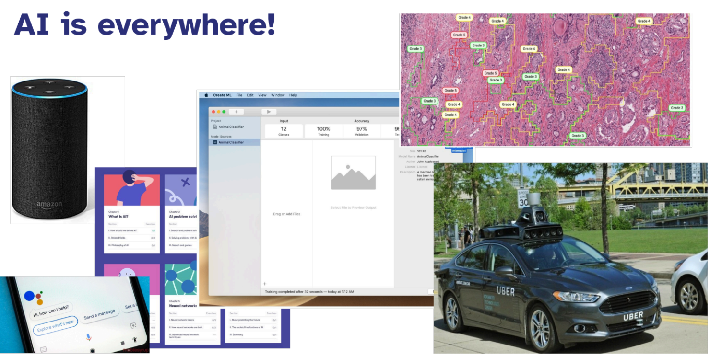

Ma c’è un **problema**:

• Quando l’AI funziona, è incredibile.

• Quando fallisce, fallisce in modo spettacolare.

• Gli utenti non capiscono perché o come.

I sistemi di AI richiedono **approcci di UX diversi** rispetto al software tradizionale. L’obiettivo è progettare prodotti in cui gli utenti si affidino all’AI nel modo corretto, ovvero né troppo, né troppo poco.

## 1 Cosa rende l’UX dell’AI diversa dalla tradizionale?

Nei **software tradizionali** il comportamento dei sistemi è **deterministico**: agli stessi input corrispondono gli stessi output. Questo permette di formare un modello mentale corretto; il loro comportamento è prevedibile e si riescono a legare facilmente cause ed effetti.

Nell’AI ci troviamo spesso di fronte a **sistemi probabilistici** (basati sulla statistica), il che comporta diverse problematiche:

- **Difficoltà di comprensione:** Tanti studi dimostrano che il pensiero probabilistico non è intuitivo per le persone; per il grande pubblico non è facile comprendere la natura statistica dietro questi sistemi.

- **Output variabili:** A differenza dei software tradizionali, dallo stesso input possono potenzialmente scaturire output diversi.

- **Gestione dell'errore:** Questa variabilità implica la necessità di gestire la presenza di falsi positivi e falsi negativi.

- **Decisioni opache (Black Box):** I modelli moderni sono spesso "scatole nere" che non spiegano il processo decisionale. Di conseguenza, non ci dicono come arrivano a una risposta, rendendo difficile capire se il risultato sia giusto o sbagliato.

- **Imprevedibilità:** I comportamenti del sistema possono risultare confusi, dirompenti e, in alcuni casi, persino pericolosi.

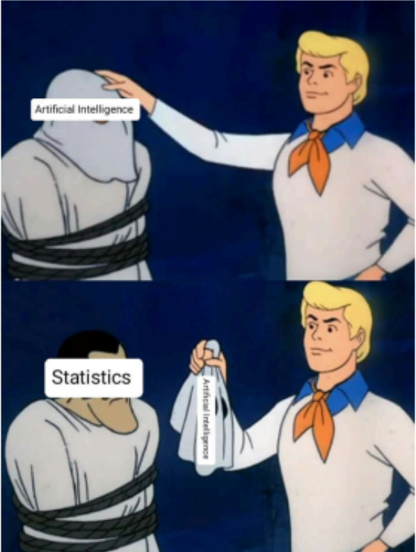

**L’AI può essere errata**, e questo cambia radicalmente il modo in cui progettare l’esperienza utente. Dobbiamo infatti disegnare delle esperienze utente anticipando questa evenienza: **dobbiamo anticipare che le risposte del modello possono essere sbagliate**.

### 1.1 Paradigm Shift: Human-Centered AI

Quale può essere un modo sano e salutare per usare l’AI? Una soluzione sta nel cercare di abbandonare l’approccio "vecchio stampo". Quest’ultimo si focalizza sul modello per aumentarne la confidenza e la precisione, sperando di eliminare il problema alla radice. Questo è un approccio che non funziona perché, per quanto si possa sistemare un modello, questo è comunque basato su equazioni statistiche; pertanto, non avremo mai una probabilità di correttezza al 100%. La precisione può essere dell’80-90% (molto alta), ma anche in questa situazione almeno 1 caso su 10 sarà sbagliato.

Questo vecchio approccio è definito **Algorithm-First**: si concentra su algoritmi e modelli, mentre gli utenti vengono considerati solo alla fine, presumendo che la “magia dell’AI” risolva tutto. Tuttavia, questo approccio fallisce per diversi motivi:

- **Cold start:** Un sistema progettato solo attorno all’algoritmo non ha abbastanza informazioni sugli utenti, sugli obiettivi o sul contesto iniziale. Di conseguenza, all’inizio non sa cosa suggerire o come adattarsi, producendo risultati scarsi o irrilevanti.

> *Es. Se ci iscriviamo a Netflix, all’inizio non ha dati su di noi; quindi, non ha un algoritmo preciso adatto; si decide cosa mostrare all’inizio tramite il design, non tramite l'algoritmo.*

- **Mancanza di controllo per l’utente:** Se l’AI prende decisioni senza coinvolgere le persone, gli utenti non possono correggere errori, guidare il sistema o personalizzare il comportamento. L’approccio *algorithm-first* non funziona bene perché gli utenti hanno bisogno di sentire il controllo; l’assenza di questo porta a frustrazione, sfiducia e un uso scorretto dell’AI.

- **Il contesto è fondamentale:** Un modello può essere accurato nei test, ma fallire nel mondo reale se non considera il contesto d’uso. L’AI non può generalizzare bene senza comprendere cosa l’utente sta cercando di fare.

È necessario fare un cambio di paradigma e passare a un approccio **Human-Centered AI** che mette al centro le persone, non l’algoritmo.

**L’obiettivo è una AI che amplifica, aumenta e migliora le performance umane mentre realizza sistemi che rimangono affidabili, sicuri e degni di fiducia (*reliable, safe and trustworthy*).**

Invece di valutare solo l’accuratezza del modello, **si misura** **come l’AI contribuisce alla performance umana:** quanto facilita il compito, quanto aiuta a prendere decisioni migliori e quanto riduce errori e fatica**.** Si cerca di migliorare le performance delle persone, non di sostituirle, e si cerca di fornire un livello di controllo appropriato:

**Il goal è creare una sinergia tra esseri umani e intelligenza artificiale.**

L’idea della Human-Centered AI è passare da una visione in cui al centro ci sono gli algoritmi a un approccio con gli esseri umani al centro, per capire quali sono i loro bisogni e cosa serve loro, cercando poi varie soluzioni AI. Non cerco di arrivare all’algoritmo migliore in assoluto, ma ad algoritmi diversi per situazioni diverse, con l'obiettivo di migliorare la vita delle persone.

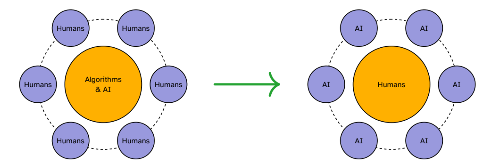

Un sistema Human-Centered deve inoltre essere **trasparente** ed **esplicabile:** l’utente deve capire perché l’AI suggerisce qualcosa o perché ha preso una certa decisione, solo così può svilupparsi una fiducia appropriata. Questo richiede di offrire all’utente livelli di controllo adeguati: la possibilità di intervenire, correggere, regolare o personalizzare il comportamento del sistema, in modo che l’AI diventi un partner collaborativo, non una “black box” che decide da sola.

### 1.2 Appropriate Intelligence

All’acronimo AI spesso viene associato il termine **Appropriate Intelligence**, principio che consiste nel progettare sistemi di AI che **funzionino** davvero nel **mondo reale**, non solo in una demo. L’AI dovrebbe essere corretta il più spesso possibile e, quando lo è, dovrebbe produrre risultati di buona qualità e utili all’utente.

È facile offrire una demo carina, ma è meglio rendere l’AI più deterministica possibile. Non può essere precisa al 100%, però possiamo cercare di ottimizzare il maggior numero di volte in cui ha ragione. Per fare questo si può scegliere strategicamente quanto sfruttare l’AI: magari **qualche parte dell’interfaccia è meglio mantenerla prevedibile**, in questo modo gli utenti hanno l’aiuto dell’AI ma anche qualcosa di deterministico su cui appoggiarsi quando l’AI sbaglia.

Un esempio rappresentativo è il **menu adattivo**: in alto ho mostrate le 3 azioni che forse andrò a fare, suggerite dall’AI, ma l’elenco completo, ordinato alfabeticamente, rimane sempre disponibile sotto. Così, quando le 3 suggerite non funzionano, gli utenti hanno una soluzione alternativa immediata.

Il problema sta qui: piccoli errori dell’AI rimangono impressi e possono causare un livello di frustrazione sproporzionato rispetto all’entità stessa dell’errore.

## 2 Building Appropriate Reliance

Un tema importante riguarda la necessità di promuovere un uso responsabile dell’AI e questo si collega al concetto di **Appropriate Reliance** (affidamento appropriato). Il termine *reliance* riguarda il modo in cui l’utente si affida all’AI.

**Reliance e Trust** sono concetti differenti: la trust è un sentimento difficile da misurare, un qualcosa che io sento, psicologico ed emotivo, che può essere una fiducia cieca e non giustificata (ad esempio: quanta fiducia ho in OpenAI?). La reliance è invece quanto mi affido a un sistema, è una **questione comportamentale**, è osservabile e misurabile (ad es. se devo scrivere una tesi uso ChatGPT o no? Se devo scrivere una ricetta lo chiedo a ChatGPT?).

La differenza fondamentale è che **la reliance la posso misurare**, **molto più della trust** e può essere calibrata alla performance reale del sistema.

Il problema della fiducia da sola è che non garantisce un comportamento adeguato. È possibile che un utente si fidi di un sistema ma non lo utilizzi comunque, oppure che si fidi troppo e non noti gli errori. Ciò che conta è la reliance, perché è ciò che determina gli esiti concreti dell’interazione.

Ci sono due situazioni problematiche legate a un affidamento non appropriato:

1.  **Over-reliance:** Gli utenti dipendono dall’AI anche quando non dovrebbero. Si affidano totalmente anche in momenti in cui non dovrebbero (fenomeno conosciuto anche come *automation bias*).

2.  **Under-reliance:** Gli utenti si affidano troppo poco; i suggerimenti dell’AI vengono ignorati anche quando potrebbero essere di aiuto. L’AI potrebbe aiutarmi ma io scelgo di non utilizzarla (*disuse*).

Quello che dovremmo cercare è disegnare AI che propongano una **appropriate reliance,** calibrata alle reali performance del sistema. L’obiettivo è far combaciare la *reliance* con le capacità effettive dell’AI:

- **Alta accuratezza + Basso rischio (low stakes):** In questo caso è corretto affidarsi di più al sistema (es. suggerimento canzoni).

- **Bassa accuratezza + Decisioni ad alto impatto (high stakes):** In questo caso è meglio essere più cauti e affidarsi meno al sistema (es. diagnosi medica).

Gli utenti devono poter capire quando fare affidamento sull’AI e quando è preferibile verificare. Un affidamento appropriato si costruisce attraverso la spiegabilità, la trasparenza e il controllo (*explainability, transparency, control*).

*Esempio***:** Immaginiamo un sistema AI con un livello di confidenza e precisione dell’80%. In teoria, questo significa che gli utenti dovrebbero fare affidamento sui suoi suggerimenti circa 8 volte su 10 (pur considerando sempre il contesto d'uso). Tuttavia, la natura statistica del sistema rende impossibile anticipare a priori quali saranno i casi corretti e quali quelli errati: sapere che il modello ha ragione l'80% delle volte non ci dice in quale specifico momento sbaglierà. Di conseguenza, gli utenti devono essere messi nelle condizioni di discernere autonomamente quando il suggerimento è valido e quando, invece, è necessario effettuare una verifica manuale.

### 2.1 Il Reliance Toolkit: i tre meccanismi fondamentali per costruire una reliance appropriata

**1. Explainability – Aiuta gli utenti a capire il “perché”**

Esistono tecniche di *explainability* che hanno l'obiettivo di "aprire la black box", ovvero rendere trasparente il processo decisionale dell'AI (ad esempio, capire in base a quali criteri un sistema classifica un paziente come "sano" o "non sano").

Un modo efficace per visualizzare questi processi è l'utilizzo di **modelli ad albero decisionale** (Decision Trees).

Osservando un albero decisionale, l'algoritmo diventa comprensibile perché possiamo seguire la logica passo dopo passo. Nella pratica, le tecniche di explainability possono seguire due strade:

1.  Utilizzare direttamente modelli intrinsecamente spiegabili (come gli alberi decisionali).

2.  Quando si usano modelli complessi di tipo "black box", si cerca di abbinarvi modelli più semplici (come quelli ad albero) per approssimare e spiegare il funzionamento della scatola nera.

**Promuovere l'uso corretto dell'AI**

Rendere l'AI spiegabile è fondamentale per incentivarne un uso appropriato. Capire in cosa un’AI eccelle permette di usarla dove è davvero efficiente. Ad esempio, gli **LLM** (Large Language Models) funzionano benissimo per manipolare il linguaggio, ma non sono lo strumento migliore per altri compiti, come l'interpolazione matematica di una curva (per la quale esistono modelli specifici).

Per permettere all'utente di comprendere il sistema, l’explainability deve raggiungere quattro obiettivi principali:

- Mostrare la gamma completa delle capacità: L'utente deve avere chiaro fin da subito cosa il sistema è in grado di fare (e cosa no), per evitare false aspettative.

- Far capire come il cambiamento dell'input influenza l'output.

- Costruire una corretta comprensione del rapporto causa-effetto.

- Essere specifici e trasparenti sulle performance del sistema: ad esempio, “90% di accuratezza su X, 60% su Y”.

**2. Transparency (Trasparenza)** L'obiettivo della trasparenza è aiutare gli utenti a capire **quando fare affidamento** sul sistema. Per raggiungere questo scopo, è necessario rendere visibili i meccanismi di incertezza dell'AI attraverso diverse strategie:

- **Score di confidenza:** È fondamentale mostrare il livello di certezza per ogni singola previsione.

> *Esempio:* Se l'AI diagnostica che un utente è malato, non deve limitarsi al risultato, ma deve specificare il grado di sicurezza (es. "Risultato: Patologia X rilevata con una **confidenza del 50%**").

- **Performance contestuali:** Bisogna mostrare le performance divise per contesto e categoria, chiarendo che l'accuratezza non è uniforme ovunque (es. "Accuratezza alta per immagini diurne, bassa per notturne").

- **Dati fuori dal training set:** Il sistema deve avvisare l'utente quando sta lavorando con dati o condizioni che differiscono significativamente da quelli usati durante l'addestramento, poiché in questi casi l'affidabilità cala.

- **Richiesta di verifica:** Il sistema deve indicare esplicitamente quando è raccomandata una verifica umana, specialmente se la confidenza è bassa o il contesto è critico.

**3. Control (Controllo)** L'obiettivo è fornire agli utenti la giusta dose di autonomia rispetto al sistema. Questo controllo si esercita su due fronti:

- **Controllo sui dati:** L'utente deve poter gestire i dati forniti al sistema e le proprie informazioni personali.

- **Controllo sugli output:** Deve essere garantita la possibilità di modificare, gestire o rifiutare i risultati prodotti dall'AI. È fondamentale prevedere sempre un'opzione di **override** o un'uscita alternativa, permettendo all'utente di intervenire manualmente e scavalcare la decisione dell'algoritmo se necessario.

### 2.2 Augmentation vs. Automation

Il rapporto tra esseri umani e AI non è una scelta binaria, ma esiste uno spettro continuo che va dal **potenziamento delle capacità umane** alla **completa automazione**. Spesso si immaginano queste due dimensioni come opposte su un'unica linea, ma in realtà sono concetti multidimensionali che si possono mescolare. Esistono vari livelli di automazione (spesso descritti in scale da 5 o anche 10 livelli):

- **Livelli bassi (Augmentation):** L'AI agisce come assistente. Offre alternative e suggerimenti, ma esegue l'azione solo se il comportamento viene approvato dall'utente. In questa fase, l'essere umano mantiene l'approvazione finale e il controllo decisionale.

- **Livelli alti (Automation):** L'AI opera in modo autonomo. Il sistema prende decisioni, le esegue e si limita a informare l'utente a fatto compiuto.

La sfida è scegliere il livello appropriato in base al compito, al rischio e alla maturità del sistema.

**1. Augmentation**

L'Augmentation indica che l’AI amplifica le capacità umane senza sostituirle. In questo scenario:

- L'AI assiste l'utente offrendo alternative o suggerendo opzioni.

- Il sistema esegue un’azione solo dopo aver ricevuto conferma (l'approvazione finale rimane sempre all’umano).

**È necessario mantenere il controllo umano (Augmentation) quando:**

- Le decisioni sono ad alto impatto (*high stakes*).

- L’AI è in una fase iniziale di apprendimento.

- Compaiono casi nuovi o ai margini del dominio (casi non previsti dal training).

- L’utente deve monitorare il processo o imparare dal sistema.

**2. Automation**

L'Automation indica che l’AI esegue da sola compiti o decisioni. In questo scenario:

- Il sistema agisce autonomamente.

- L'AI informa l'utente quando necessario e decide autonomamente quando coinvolgerlo.

- Con l’aumento dell’automazione, il ruolo umano tende a ridursi.

**L’automazione può essere aumentata quando:**

- I compiti sono ripetitivi, noiosi o pericolosi.

- Gli errori hanno conseguenze basse.

- L’AI raggiunge un’elevata accuratezza.

- L’utente può annullare o correggere facilmente l'azione dell'AI.

**I Fattori di Scelta**

La scelta del corretto livello di automazione non è casuale, ma deve considerare tre fattori fondamentali:

1.  **Il tipo di compito.**

2.  **Le conseguenze degli errori.**

3.  **La maturità del sistema.**

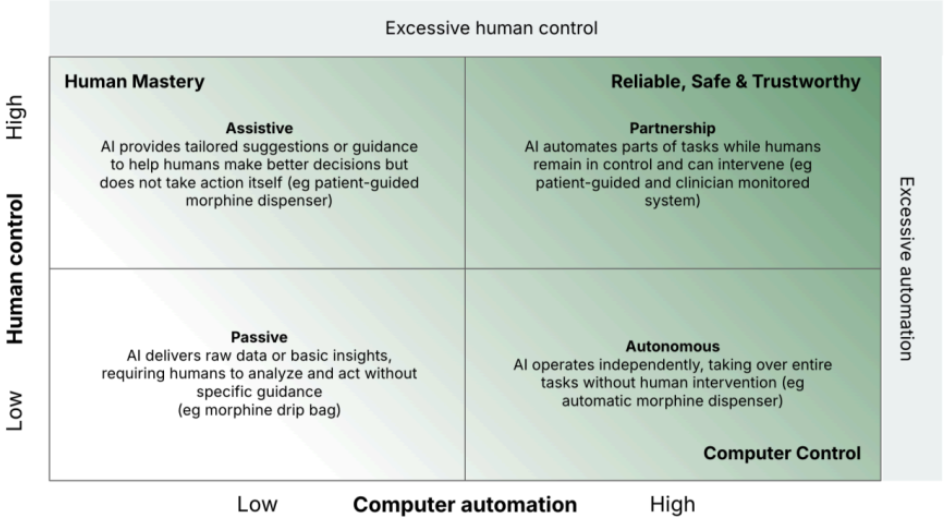

** **

 

## 3 Il Ruolo del Feedback nell'Apprendimento dell'AI

I sistemi di Intelligenza Artificiale (in particolare quelli basati sul Machine Learning) imparano, si evolvono e utilizzano in modo massiccio il feedback. **È proprio** **il feedback il mezzo fondamentale attraverso il quale l’AI apprende grazie agli utenti.**

Un esempio classico è **Netflix**: appena aperto, l'algoritmo può sembrare "pessimo" o generico, ma col tempo si adatta e diventa dinamico. A differenza del software statico, **l’AI è dinamica** e il feedback è il meccanismo con cui corregge i propri errori e aggiusta il tiro: l’utente fornisce informazioni sui propri gusti (tramite le sue azioni) e l’AI utilizza questi dati per calibrare il proprio comportamento futuro.

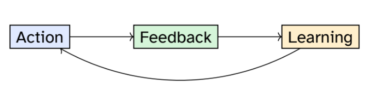

Per esempio, quando diciamo “seduto” al gatto, può o non può obbedire. Se obbedisce, riceve una ricompensa e il premio costituisce il feedback. Nel tempo, attraverso la ripetizione, il gatto impara l’associazione tra comando, azione e ricompensa.

I **feedback loop** sono essenziali in qualsiasi sistema di apprendimento.

### 3.1 Le tre tipologie di Feedback

Esistono tre modalità principali per raccogliere questi dati: **Explicit**, **Implicit** e **Dual Feedback**.

1.  **Explicit Feedback (Esplicito):** L'utente sa che sta fornendo un feedback. Include azioni volontarie come mettere "Like" o "Dislike", compilare questionari o inviare correzioni dirette.

2.  **Implicit Feedback (Implicito):** Il feedback viene assunto o dedotto dal comportamento e dall'interazione dell'utente, senza una sua azione diretta di valutazione.

> *Esempi:* Su TikTok, quanto tempo un utente si sofferma a guardare un video; i click effettuati; il comportamento d’acquisto etc.
>
> *(Nota: L’implicito implica uno sforzo di natura diversa rispetto all'esplicito, spesso maggiore in termini di interpretazione dei dati).*

3.  **Dual Feedback (Duale):** È una combinazione di feedback implicito ed esplicito.

> *Esempio:* Spotify utilizza sia i "Like" (esplicito) sia il comportamento di ascolto, monitorando ad esempio quante volte una canzone viene skippata o se viene ascoltata fino alla fine (implicito).

**Come progettare la raccolta del feedback?**

Per rendere efficace la raccolta del feedback, bisogna seguire alcuni **principi di design**:

1.  **Minimizzare l’effort dell’utente (make it easy):** Richiedere il minor sforzo possibile per fornire l'input.

2.  **Mostrare l’impatto (show impact):** gli utenti devono percepire che il loro feedback ha un effetto reale, magari facendo vedere quale è il guadagno che ricevono nel dare feedback. È utile rispondere immediatamente (“Grazie per il tuo feedback!”), mostrare miglioramenti a lungo termine, e offrire anche una vista del feedback già inviato. È importante anche **comunicare la trasparenza:** Spiegare chiaramente come viene utilizzato quel feedback.

> *Esempio:* Quando si mette un "Like" a una canzone, il sistema dovrebbe confermare con un messaggio tipo: *"Ok, ne mostreremo più come questa"*.

3.  Infine, è fondamentale **rispettare il contesto** e considerare le motivazioni dell'utente, integrando la richiesta di feedback nei *workflow* (flussi di lavoro) esistenti in modo naturale.

> *Esempio:* L'Apple Watch che rileva un movimento e chiede: *"Sembra che tu stia iniziando un workout, vuoi registrarlo?"*. Questo è un feedback contestuale e integrato, non interruttivo.

*  *

## 4 I Principi di Design per l’AI

I principi seguenti offrono strategie pratiche per progettare interazioni con l’AI che risultino chiare, affidabili e realmente utili agli utenti.

**Principio 1: Set Clear Expectations (Impostare aspettative chiare)**

Il primo passo fondamentale è "maneggiare" le aspettative per calibrare il giudizio dell'utente. Le aspettative sono insidiose: se l'utente si aspetta la perfezione, ogni piccolo errore sembrerà un fallimento enorme. La regola d'oro è **promettere meno e offrire di più** **(*under-promise and over-deliver*), mai il contrario**. Bisogna evitare di vendere la "magia dell'AI" come soluzione infallibile a tutto.

Per gestire correttamente le aspettative, bisogna agire in due momenti distinti:

**Durante l’Onboarding:**

- Bisogna chiarire subito cosa il sistema può fare, ma soprattutto **cosa non può fare** (limiti e accuratezza).

- È necessario spiegare come il sistema apprende, come cambia e come migliora nel tempo, evitando di creare false speranze.

> *Esempio:* I *disclaimer* degli LLM (come ChatGPT) che avvisano esplicitamente l'utente dei limiti del modello e della possibilità di errori, ridimensionando l'idea di onnipotenza dell'AI.

**Durante l’Uso:**

- La **trasparenza** deve continuare durante l'interazione quotidiana. Bisogna mostrare i **livelli di confidenza** e indicare chiaramente se il sistema è incerto su una risposta.

- Se l'AI ha un comportamento inaspettato, questo va spiegato.

- È importante informare costantemente gli utenti sui cambiamenti o aggiornamenti del sistema, affinché non si trovino spiazzati da nuove funzionalità o comportamenti diversi dal solito.

> 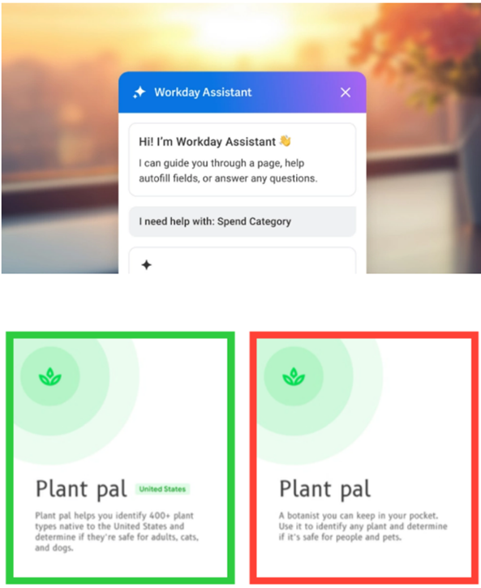
>
> 

**Principio 2: Design for Failure (Progettare per l'Errore)**

Il presupposto fondamentale è che **gli errori ci sono sempre**. Quando si progettano soluzioni di AI, bisogna accettare che il fallimento è inevitabile, ma la chiave sta nel disegnare il sistema affinché fallisca in maniera "graziosa" ed elegante (*fail gracefully*).

**Tipi di Errore dell'AI**

Quando si verificano problemi, questi possono appartenere a diverse categorie:

- **Errori di sistema:** Sono i classici guasti tecnici, crash o interruzioni del servizio.

- **Errori del modello:** Includono predizioni errate o "allucinazioni" (l'AI inventa informazioni).

> *Nota sui limiti diagnostici:* È importante capire che esistono limiti strutturali: non si può costruire un sistema di AI perfetto per diagnosticare gli errori di un altro sistema di AI. Ad esempio, non è possibile creare un'AI che identifichi con certezza assoluta se un testo è stato generato da ChatGPT o meno. Se esistesse un discriminatore perfetto, il modello generativo (OpenAI) potrebbe usarlo nel proprio addestramento per imparare ad aggirarlo.

- **Errori nei dati:** Derivano da dati di training scarsi, incompleti o distorti (*bias*).

- **Errori di rilevanza:** Si verificano quando il sistema fornisce risultati tecnicamente corretti, ma irrilevanti o inutili per l'utente in quel momento.

- **Errori dell’utente:** Causati da input poco chiari, incomprensioni o utilizzo improprio dello strumento.

**  **

**Strategie di Gestione degli Errori**

Come si gestiscono questi inevitabili errori? Non bisogna mai perdere l'occasione per essere trasparenti con l'utente:

1.  **Indicare e Spiegare:** Quando si verifica un errore, bisogna indicarlo chiaramente e spiegare *cosa* è andato storto. L'utente non deve rimanere con il dubbio.

2.  **Facilitare la Recovery (Recupero):** Bisogna permettere un recupero semplice e rapido. La strategia migliore è restituire il controllo all’utente, permettendogli di correggere manualmente o scegliere un'altra strada.

3.  **Usare gli errori per migliorare:** Ogni errore è un'opportunità di apprendimento per il sistema. Attraverso il feedback (esplicito o implicito) sui fallimenti, l'AI può aggiustare il tiro.

*Esempio pratico (Playlist):* Immaginiamo un sistema che genera una playlist musicale. Se l'AI sbaglia e inserisce una canzone heavy metal in una playlist rilassante (Errore di rilevanza/modello), il sistema deve permettere all'utente di "saltare" o rimuovere facilmente la traccia (*recovery*). Questo feedback negativo segnala all'AI che quella canzone era fuori contesto, permettendole di non ripetere l'errore in futuro (*miglioramento*).

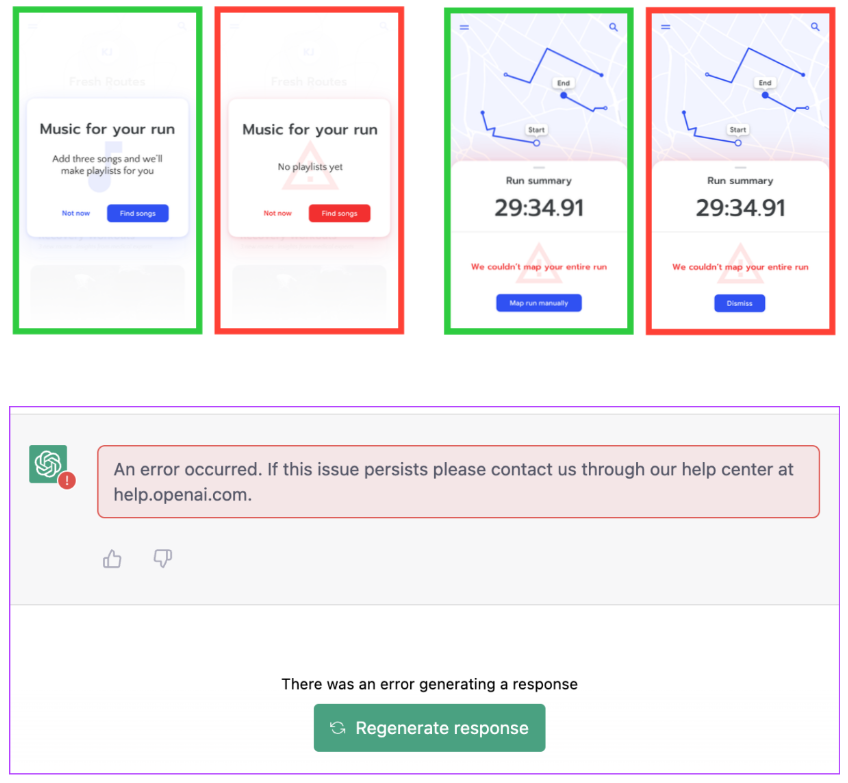

**Principio 3: Bilanciare Complessità e Controllo**

L'obiettivo fondamentale è gestire il delicato rapporto tra la **potenza dell'AI** (che porta complessità) e la **necessità umana di controllo**. Un eccesso di controllo può sopraffare l'utente, mentre un eccesso di automazione può erodere la fiducia.

La soluzione risiede in un approccio graduale e rispettoso dell'autonomia.

**1. Progressive Disclosure (Svelamento Graduale)**

Non mostrare tutto subito. L'interfaccia deve adattarsi alla curva di apprendimento dell'utente.

- **Iniziare con semplicità:** Presenta inizialmente solo le funzionalità di base essenziali, nascondendo la complessità sottostante. Questo evita il sovraccarico cognitivo.

- **Costruire modelli mentali:** Permetti all'utente di esplorare le funzioni avanzate gradualmente. Man mano che l'utente comprende come "ragiona" l'AI e costruisce il proprio modello mentale, puoi introdurre opzioni più complesse.

**2. Rispetto Assoluto dell'Autonomia dell’utente**

L'automazione deve essere un "potenziamento" su richiesta, mai un obbligo. L'utente deve sentirsi sempre al comando.

- **Nessuna automazione forzata:** L'intervento dell'AI deve essere un'opzione preceduta dal consenso, mai l'unica via percorribile.

- **Sovrascrittura e Vie d'uscita:** Fornisci sempre meccanismi semplici ("Escape Hatches") per ignorare i suggerimenti dell'AI, tornare a una modalità manuale o disattivare le funzioni intelligenti.

- **Controllo sui Dati:** Garantisci trasparenza e gestione totale sulle preferenze apprese. L'utente deve poter: visualizzare cosa l'AI ha imparato, modificare le preferenze, resettare o eliminare i dati per far "dimenticare" all'AI comportamenti passati.

**3. Il Pattern Evolutivo: Fiducia e Tempo**

Il rapporto tra utente e AI non è statico, ma cambia nel tempo seguendo un pattern preciso che permette a entrambe le parti di adattarsi.

– Inizialmente: più controllo, meno automazione.

– Con il tempo: più automazione, mantenendo il controllo.

– Sempre: vie d’uscita chiare e comportamenti deterministici di riferimento.

***Dare all’AI il tempo di imparare, e agli utenti il tempo di sviluppare fiducia.***

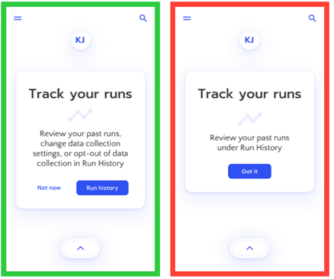

## 5 Contesto e Trade-offs

Le esigenze di design crescono proporzionalmente alla posta in gioco. Più sono alti gli **stakes** (ovvero le conseguenze negative se l’AI sbaglia), maggiore deve essere la qualità in termini di trasparenza, controllo ed *explainability*. Questa distinzione tra livelli di rischio non è solo teorica, ma ricalca spesso le divisioni legali (es. il Regolamento Europeo sull'AI).

### 5.1 Classificazione dei Rischi (Stakes)

Il design deve adattarsi al livello di rischio e alla tolleranza dell'utente verso l'errore.

- **High-stakes AI** (es. diagnosi medica, decisioni finanziarie, giustizia penale)

  - **Richiede:** Massima trasparenza, controllo ed esplicabilità.

  - **Errori:** Conseguenze catastrofiche.

  - **Tolleranza utente:** Molto bassa.

  - **Approccio di design:** Forte controllo umano, l'AI funge solo da *advisor*.

- **Medium-stakes AI** (es. raccomandazioni lavorative, content moderation, istruzione)

  - **Richiede:** Buona trasparenza e controllo moderato.

  - **Errori:** Significativi ma non irreversibili.

  - **Tolleranza utente:** Moderata.

  - **Approccio di design:** Potenziamento bilanciato.

- **Low-stakes AI** (es. raccomandazioni musicali, filtri fotografici, auto-complete)

  - **Richiede:** Trasparenza di base.

  - **Errori:** Fastidiosi ma innocui.

  - **Tolleranza utente:** Relativamente alta.

  - **Approccio di design:** Maggiore automazione, mantenendo la possibilità di *override* (sovrascrittura).

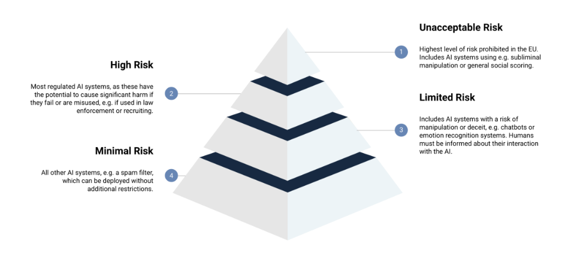

### 5.2 Valutazione delle Prestazioni: Precision e Recall

Per valutare un modello è fondamentale partire dalla Confusion Matrix (Matrice di Confusione).

Finché siamo nei quadranti dei Veri Positivi (TP) e Veri Negativi (TN), il sistema funziona. I problemi sorgono con gli errori:

- **Falsi Positivi (FP):** L'AI rileva qualcosa che non c'è (es. dice che sono malato, ma sono sano).

- **Falsi Negativi (FN):** L'AI non rileva qualcosa che c'è (es. dice che sono sano, ma sono malato).

Da questa matrice derivano due metriche chiave, spesso in contrasto tra loro:

- **Precision** (TP / (TP + FP)): "Quando il sistema ha trovato qualcosa, quanto spesso è corretto?"

- **Recall** (TP / (TP + FN)): "Di tutte le cose che avrebbe dovuto trovare, quante ne individua davvero?"

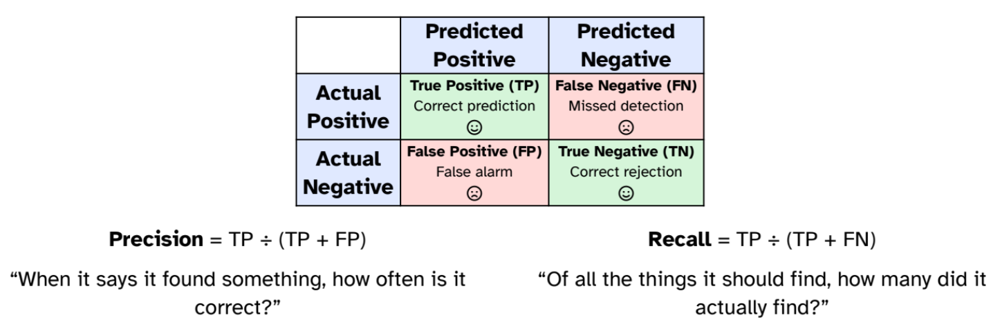

**Precision vs Recall**

Precision e Recall sono solitamente l'opposto l'una dell'altra: migliorare una tende a peggiorare l'altra. La scelta su cosa ottimizzare dipende dal **contesto** e dal **caso peggiore** che siamo disposti a tollerare.

- **Ottimizzare la Precision (Evitare i Falsi Positivi)**

  - *Esempio:* Filtri anti-spam nelle e-mail.

  - *Caso peggiore:* L'AI classifica una mail importante come spam (Falso Positivo).

  - *Strategia:* L'importante è che le e-mail valide vengano viste. Si accetta di avere qualche spam nella posta in arrivo pur di non perdere messaggi importanti.

- **Ottimizzare la Recall (Evitare i Falsi Negativi)**

  - *Esempio:* Diagnosi di malattie gravi / Screening.

  - *Caso peggiore:* Non diagnosticare una malattia a una persona malata (Falso Negativo).

  - *Strategia:* L'importante è individuare tutti i casi reali. Si accetta di dare qualche falso allarme (dire a un sano che potrebbe essere malato) pur di non lasciarsi sfuggire nessuno che ha bisogno di cure.

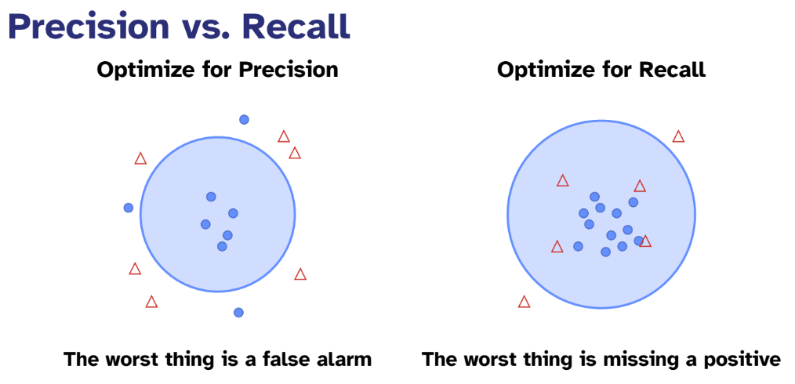

### 5.3 “To AI or Not to AI?”

Non bisogna usare l’AI solo perché è di tendenza, ma solo quando rappresenta davvero lo strumento più adatto al problema. Considerare prima soluzioni più semplici, introducendo l’AI solo se aggiunge valore reale.

L’AI è probabilmente la scelta migliore quando il sistema deve raccomandare contenuti diversi a utenti diversi, quando è necessario prevedere eventi futuri o quando la personalizzazione porta un miglioramento significativo dell’esperienza. È utile anche nei casi in cui l’interazione in linguaggio naturale aggiunge valore, quando occorre riconoscere pattern complessi in grandi quantità di dati, oppure quando il compito coinvolge categorie troppo ampie per poter essere enumerate manualmente.

L’AI è invece probabilmente non la scelta migliore quando la prevedibilità è l’aspetto più importante, quando il costo di un errore è molto elevato e le conseguenze possono essere gravi, oppure quando la velocità e la semplicità sono elementi essenziali. Non è ideale nemmeno nei casi in cui gli utenti devono sapere con precisione cosa accadrà, quando il problema può essere risolto con regole chiare o euristiche, o quando ci sono restrizioni severe in termini di conformità o necessità di explainability.

Considerare prima soluzioni più semplici, introdurre l’AI solo se aggiunge valore reale.

**AI-Inclusive Design Process**

Quando si progetta con l’AI, si iterano contemporaneamente tre elementi: **l’interfaccia, il modello di AI e i dati**.

1.  **Comprendere i bisogni degli utenti:** La base del processo rimane la comprensione dell’utente, con attenzione al livello di controllo di cui ha bisogno, agli *stakes* nel caso in cui l’AI sbagli e al modo in cui costruirà fiducia nel tempo.

2.  **Prototipare presto con test “Wizard of Oz”:** Prima di costruire modelli reali, simulare l’AI per valutare l’esperienza utente. Questo permette di validare i pattern di interazione senza dover implementare l’infrastruttura di machine learning.

3.  **Definire i requisiti del modello in modo collaborativo:** Designer e Data Scientist devono concordare insieme le metriche di successo. Non si deve misurare solo l’accuratezza del modello, ma anche la performance umana, la soddisfazione dell’utente e la capacità di completare i compiti.

4.  **Testare presto con dati reali:** La qualità dei dati influenza fortemente le prestazioni dell’AI; perciò, è importante testare fin da subito con dati autentici, esplorare *edge case* e *failure mode* e migliorare progressivamente le strategie di raccolta dati.

5.  **Collaborazione continua:** L’intero processo richiede un flusso costante di comunicazione tra i team di design e di machine learning. È essenziale condividere ricerche utente (non solo richieste di funzionalità) e stabilire obiettivi comuni che vadano oltre la semplice performance algoritmica.

**Testare sistemi AI**

**Cosa testare?** Quando si valuta un sistema di AI, è essenziale verificare se gli utenti riescono effettivamente a raggiungere i loro obiettivi e se comprendono come funziona il sistema. Occorre anche verificare se il loro livello di affidamento è calibrato in modo appropriato, se sono in grado di recuperare facilmente dagli errori, se si sentono in controllo dell’interazione e se il sistema è capace di fallire in maniera elegante senza creare confusione o frustrazione.

**Come testare?** I metodi di valutazione possono includere test “Wizard of Oz”, in cui l’AI viene simulata nelle prime fasi per esplorare l’esperienza utente, oppure protocolli think-aloud che permettono di osservare il ragionamento degli utenti in tempo reale. Sono utili anche studi di completamento dei task, studi longitudinali per analizzare come la fiducia si sviluppa nel tempo, esperimenti A/B per confrontare diverse soluzioni e misure sia di feedback esplicito che implicito.

*Testare presto, testare spesso, testare con utenti reali e dati reali.*

**Riassumendo l’UX per l’AI**

1.  **L’UX per l’AI è diversa:** Incertezza, opacità e comportamento probabilistico richiedono approcci progettuali nuovi rispetto al software tradizionale.

2.  **L’obiettivo è un affidamento appropriato:** Non fiducia cieca, non disuso, ma una dipendenza calibrata sulle reali capacità dell’AI.

3.  **L’affidamento si costruisce attraverso tre meccanismi:** *Explainability* (perché), *Transparency* (quando) e *Control* (quanto controllo ha l’utente).

4.  **I feedback loop sono essenziali:** L’AI migliora tramite feedback espliciti, impliciti e duali forniti dagli utenti.

5.  **Progettare per errori e incertezza:** Impostare aspettative chiare, fornire un terreno deterministico e permettere un fallimento elegante.

6.  **Il contesto guida il design:** Il livello di *stakes*, il rapporto *precision/recall* e le caratteristiche del task definiscono l’approccio progettuale.

7.  **Collaborare e iterare continuamente:** Lavorare a stretto contatto con i team di ML, prototipare presto con Wizard of Oz e misurare anche gli outcome umani.

*L’obiettivo della Human-Centered AI è potenziare le capacità umane mantenendo il sistema affidabile, sicuro e degno di fiducia.*

## 6 Linee Guida Microsoft per l’interazione uomo-AI

(<https://www.microsoft.com/en-us/research/project/guidelines-for-human-ai-interaction/>)

Microsoft ha definito delle linee guida per l'interazione uomo-AI, frutto di oltre vent'anni di ricerca, per stabilire le migliori pratiche di comportamento dei sistemi intelligenti in ogni fase di utilizzo. Queste regole orientano i designer dall'interazione iniziale alla gestione degli errori, offrendo un riferimento essenziale per creare esperienze utente efficaci e validate scientificamente.

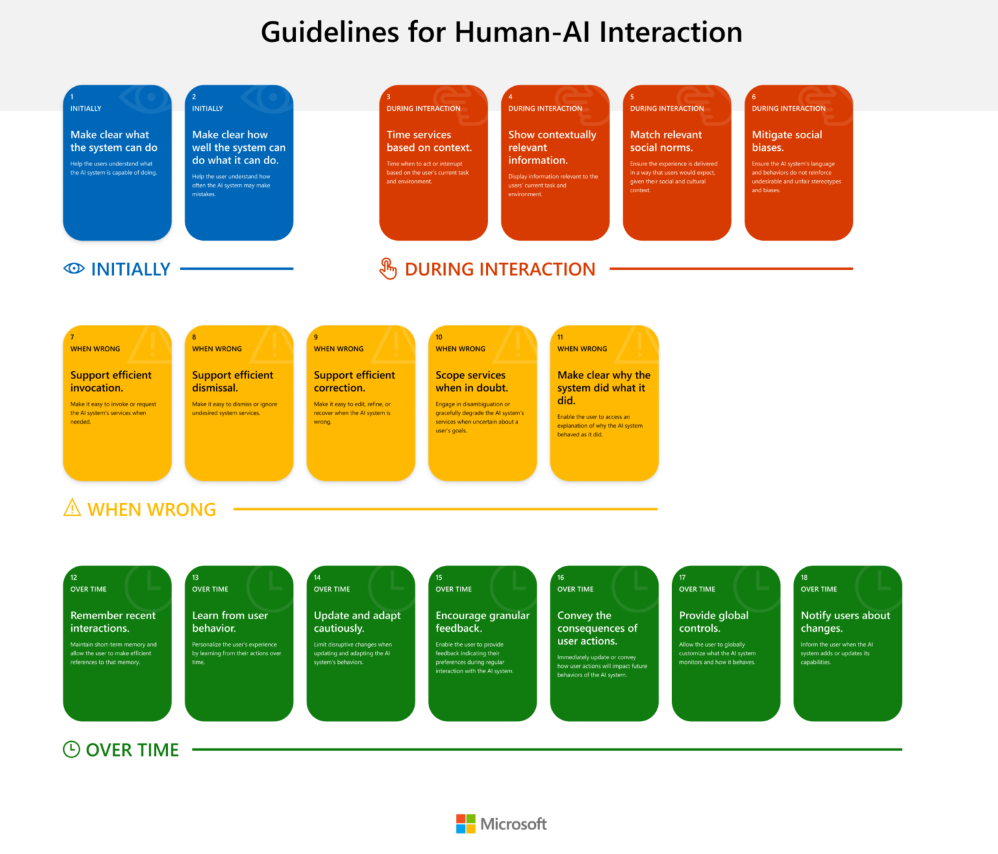

## 7 Caso Studio: *Google Clips* 

**(**[https://.google/ design library/ux-ai](https://design.google/library/ux-ai)**)**

Per capire come progettare una buona esperienza utente nell'era dell'intelligenza artificiale, Google ci offre un caso studio perfetto con il progetto **Google Clips**.

L'idea di base era risolvere un problema molto umano: i neo-genitori passano così tanto tempo a cercare di fotografare i figli da perdersi il momento reale, finendo spesso con migliaia di foto quasi identiche o imperfette. Google ha quindi ideato una fotocamera autonoma che, grazie al Machine Learning, impara a scattare da sola i momenti "belli".

Tuttavia, **la lezione principale per la UX non è tecnologica, ma umana**. Tutto parte da una verità fondamentale: **“Se non sei allineato con un bisogno umano, creerai solo un sistema molto potente per affrontare un problema molto piccolo, o forse inesistente”.** Questo significa che l'AI non sa quali problemi risolvere; sono i designer a dover identificare una necessità reale (in questo caso, "voglio godermi il momento senza perdere il ricordo") prima di scrivere una sola riga di codice.

Ma come si insegna a una macchina cosa è "bello"? Qui entra in gioco il secondo pilastro del design per l'AI. Google non ha usato dati a caso, ma ha collaborato con documentaristi e fotografi d'arte per definire la "verità di base" (Ground Truth).

Hanno scoperto che **“Se un essere umano non può svolgere un compito, allora non può farlo nemmeno un'intelligenza artificiale”.** Se un esperto umano non sa spiegare perché una foto è emozionante, la macchina non potrà mai impararlo. Hanno dovuto insegnare all'AI non solo cosa cercare (sorrisi, interazioni), ma anche cosa ignorare (mani davanti all'obiettivo, fotocamera in tasca), **trattandola quasi come un bambino a cui si insegna a leggere: con coerenza e pazienza**.

“La coerenza è la parola chiave quando si cerca di insegnare qualcosa. È per questo che aspettiamo il più a lungo possibile prima di scatenare la follia di OUGH (ad esempio, tough, through, thorough) sui bambini quando insegniamo loro a leggere e parlare inglese. Scrivere e pronunciare parole come cat, bat e sat, con i loro prevedibili suoni "at", è molto più coerente!”.

Infine, c'è il tema cruciale della fiducia. Avere una telecamera sempre accesa in casa può essere inquietante. Per superare questa barriera, il design ha dovuto garantire all'utente il **controllo totale**, seguendo il principio secondo cui **“L'hardware, l'intelligenza e il contenuto appartengono in ultima analisi a te e solo a te”.**

Per la UX questo ha significato evitare interfacce fantascientifiche in stile "Minority Report" che confondono l'utente, preferendo controlli familiari e assicurando che i dati rimanessero sul dispositivo, senza andare sul cloud.

L'obiettivo finale non era sostituire il genitore, ma **"aumentarne" le capacità**, permettendogli di vivere il momento mentre l'AI si occupava di catturarlo.

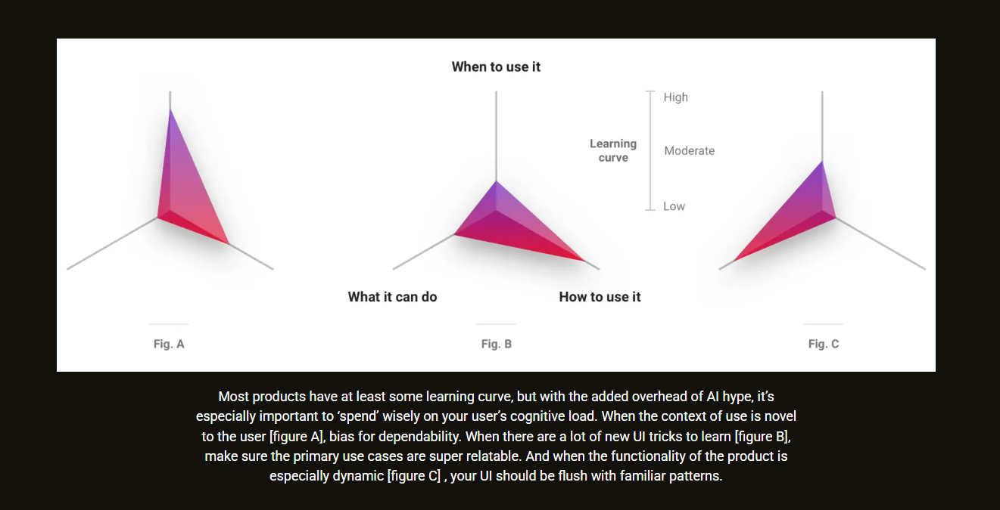

Questo grafico illustra la gestione del 'carico cognitivo' dell'utente quando si progetta un nuovo prodotto. L'idea di base è che **l'innovazione ha un 'costo' di apprendimento**: non si può chiedere all'utente di imparare tutto in una volta.

**Le tre figure mostrano come bilanciare questo budget:**

**Fig. A:** Se il contesto d'uso è completamente nuovo (come un'AI che scatta foto da sola), l'interfaccia deve essere minimale.

**Fig. B:** Se l'interfaccia richiede nuovi apprendimenti (es. nuovi gesti), l'utilità del prodotto deve essere ovvia.

**Fig. C:** Se la tecnologia è complessa e dinamica, il design deve usare pattern familiari.

**In sintesi: per avere successo, bisogna scegliere un solo asse su cui innovare e mantenere gli altri semplici e prevedibili.**

## **8 Lo stato dell'AI nel 2025**

(https://www.mckinsey.com/capabilities/quantumblack/our-insights/the-state-of-ai)

### 8.1 AI nelle aziende

Secondo il report *The State of AI* pubblicato da McKinsey & Company questi sono stati i risultati chiave ottenuti da un sondaggio svolto durante il 2025 per conoscere gli sviluppi e la diffusione dell’uso dell’AI nel mondo del lavoro:

**1. Adozione diffusa, ma superficiale**

> L'**88%** delle aziende usa l'AI in almeno una funzione, ma quasi due terzi sono ancora fermi alla fase di **sperimentazione o "pilota"**. Solo un terzo ha iniziato a scalare la tecnologia a livello dell'intera azienda.

**2. Il nuovo trend: Agenti AI**

> C'è grande curiosità verso gli **agenti di intelligenza artificiale** (sistemi autonomi che eseguono compiti), con il **62%** delle aziende che sta già sperimentando il loro utilizzo.

**3. Impatto economico e Valore**

> **Innovazione:** Il 64% afferma che l'AI sta abilitando l'innovazione.
>
> **Profitti:** I vantaggi si vedono su casi specifici, ma l'impatto sull'EBIT (utile operativo) a livello aziendale è ancora basso (**39%**).

**4. Strategia: Efficienza vs. Crescita**

> Tutti usano l'AI per l'efficienza (taglio costi), ma le **aziende più performanti** la usano anche per generare **nuova crescita e innovazione**. Il segreto del successo non è solo adottare il tool, ma **ridisegnare i flussi di lavoro**.

**5. Impatto sul Lavoro**

> Le previsioni sono divise: il **43%** non prevede variazioni, il **32%** prevede una diminuzione e il **13%** un aumento.

 La quota di intervistati che afferma che le proprie organizzazioni utilizzano l'AI in almeno una funzione aziendale è aumentata rispetto alla ricerca dell'anno scorso: **l'88% dichiara un utilizzo regolare dell'AI in almeno una funzione aziendale, rispetto al 78% di un anno fa.** Tuttavia, a livello aziendale, la maggior parte è ancora in fase di sperimentazione o pilotaggio.

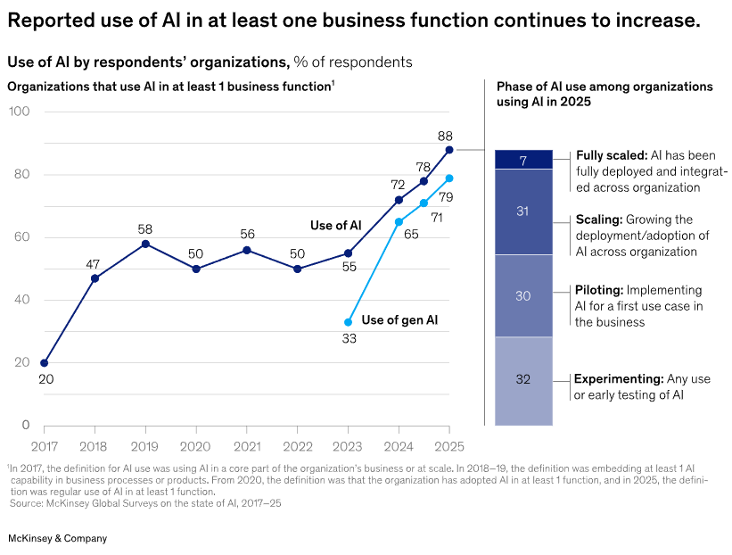

Per settore, l’utilizzo dell’AI è più ampiamente segnalato nei **settori della tecnologia, della sanità e dei media e delle telecomunicazioni.**

Sebbene l'adozione dell'intelligenza artificiale si stia espandendo "orizzontalmente" — con la metà delle aziende che la utilizza ormai in almeno tre diverse funzioni operative — la capacità di integrarla in profondità e su larga scala rimane limitata.

Esiste infatti un netto divario legato alle dimensioni aziendali: mentre quasi la metà delle grandi imprese (con fatturato superiore ai 5 miliardi di dollari) è riuscita a scalare l'AI nell'intera organizzazione, le aziende più piccole (sotto i 100 milioni) faticano a uscire dalla fase pilota, riuscendoci solo nel 29% dei casi.

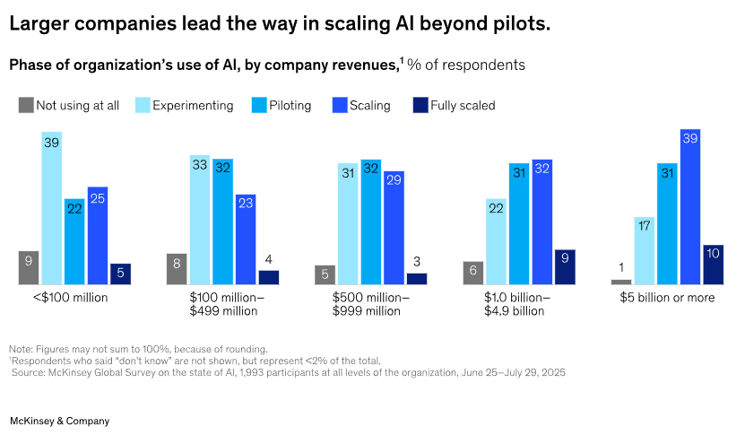

### 8.2 Oltre l'efficienza: Impatto reale e strategia di crescita

Oltre ai dati puramente finanziari, **l'utilizzo dell'AI sta generando significativi benefici qualitativi**: la maggioranza delle aziende segnala un impulso all'innovazione, mentre quasi la metà riscontra miglioramenti nella soddisfazione del cliente e nella propria competitività di mercato.

Sul fronte economico, sebbene l'impatto sull'utile operativo (EBIT) complessivo resti ancora limitato, emergono vantaggi specifici a livello di singole funzioni. Si registrano riduzioni dei costi soprattutto nell'ingegneria del software, nella produzione e nell'IT, mentre gli aumenti di fatturato — confermando i trend degli anni passati — si concentrano principalmente nelle aree marketing, vendite e sviluppo prodotto.

Ciò che distingue davvero le aziende più performanti è **l'ambizione**: non si limitano a cercare piccoli guadagni di efficienza, ma utilizzano l'AI per **ripensare radicalmente il proprio business**, ridisegnando flussi di lavoro ed esperienze cliente.

Focalizzarsi solo sul taglio dei costi limita l'impatto dell'AI. Al contrario, presentare l'AI come motore di **crescita e innovazione** funziona meglio anche per la gestione del cambiamento interno. I dipendenti, infatti, sostengono più volentieri una visione basata su nuove opportunità piuttosto che sulla sola efficienza; questo approccio rende più facile scalare l'adozione della tecnologia e, in ultima analisi, permette di raggiungere risultati migliori anche sul fronte della produttività. Inoltre, c'è una correlazione diretta tra budget e successo: oltre un terzo delle aziende "top performer" investe più del 20% del proprio budget digitale in AI.

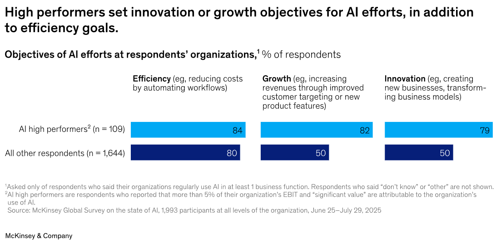

### 8.3 Impatto sulla forza lavoro: tra tagli e nuove competenze

Mentre finora l'uso dell’AI ha avuto effetti minimi sul numero dei dipendenti, le prospettive per il prossimo anno indicano un cambio di passo. Sebbene la maggioranza relativa (43%) preveda stabilità, cresce notevolmente la quota di chi si aspetta una **riduzione della forza lavoro (32%)**, una previsione più frequente tra le grandi imprese. I "high performers" si confermano i più propensi al cambiamento radicale, aspettandosi o forti tagli o significative espansioni.

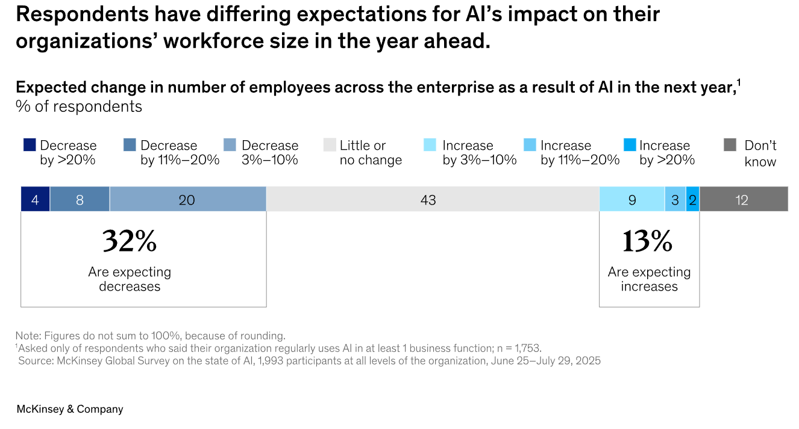

Tuttavia, emerge un paradosso fondamentale: la previsione di una riduzione complessiva non ferma la caccia ai talenti. Le aziende stanno infatti continuando ad **assumere attivamente profili specializzati per sostenere l'evoluzione tecnologica**, con una forte richiesta specifica per ingegneri del software e ingegneri dei dati.
