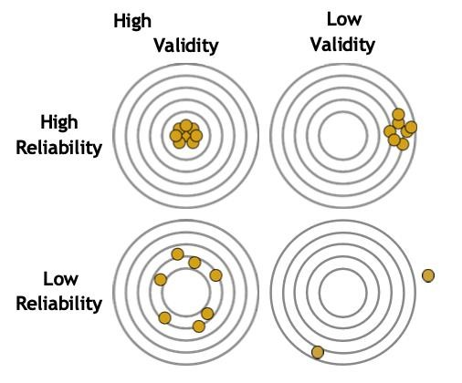
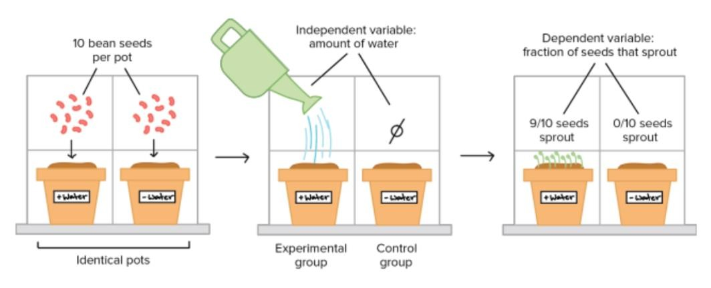
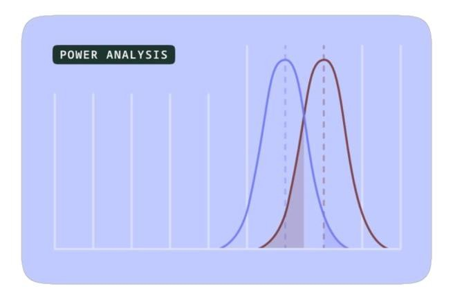
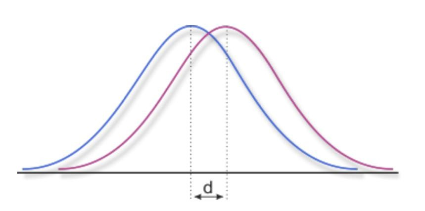

# Metodi di Ricerca in HCI 

## 1 La Ricerca Qualitativa 

#### 1.1 Quando usare la ricerca qualitativa? 

Come in psicologia e in scienza cognitiva, si intervistano gli utenti per capire come e perché usano certe tecnologie e per capire perché si comportano in un certo modo.

Questo ci aiuta molto a capire il contesto e l’utilizzo nel mondo reale. Tutti gli esperimenti fatti in ricerca quantitativa, solitamente, vengono fatti in laboratorio: se si vuole osservare come le persone si comportano, il punto è chiederglielo, fare un sondaggio, o andare a vedere come si comportano realmente. Anche solo, per esempio, capire quanti caffè prende al giorno un utente: un discorso è stare a contarli, un discorso è chiedere direttamente.

La **parte contestuale** nella ricerca qualitativa traspare molto di più, è molto più legata al contesto rispetto a quella quantitativa: l’esempio classico di un questionario, per quanto le domande possano essere chiare, che poi non si rivela molto realistico è il classico sondaggio politico. Un discorso è dire “io voto X”, un altro discorso è poi andare a votare realmente nel giorno delle elezioni. Richiede un *effort* diverso. E, appunto, quello che esce fuori dalla ricerca qualitativa rivela molte più sorprese rispetto a quella quantitativa.

Alcuni **esempi in HCI**: come le persone gestiscono le password in pratica (cioè come se le scrivono, come le gestiscono, qual è la loro routine) potrebbe essere un esempio da investigare, innanzitutto qualitativamente, e una volta scoperte le varie alternative, si può anche fare un’analisi quantitativa. Oppure: che sfide affrontano gli utenti con gli assistenti vocali? Perché le persone abbandonano l’applicazione mobile? Come i social media hanno effetto sul lutto e sulla perdita?

Il punto fondamentale è che si usano questi metodi qualitativi quando si deve investigare in profondità una domanda: cercare di capire e farsi un’idea (depth) rispetto a misurare cose precise e avere delle misure esatte (breadth).

#### 1.2 Caratteristiche generali 

**Investigazione naturalistica**: il termine “naturalistica” indica lo studiare le persone nei loro veri contesti, non nei contesti simulati in laboratorio.

**Prospettiva olistica**: si cerca di capire tutta la situazione nel suo insieme, non se ne individua solo una fetta.

**Punto di vista dei partecipanti**: la ricerca qualitativa è molto “empatica”, si cerca di capire il punto di vista dei partecipanti, ovvero vedere il mondo attraverso gli occhi degli utenti.

**Flessibilità**: per questo viene utilizzata spesso all'inizio del processo, perché all’inizio chi ricerca non sa bene nemmeno le sfide che ha davanti o cosa sta cercando, e questo aspetto permette di adattare l'approccio man mano che la comprensione cresce.

**Descrizioni ricche**: offre descrizioni ed esperienze molto più ricche e dettagliate rispetto alle risposte di un questionario.

**Processo iterativo**: si collezionano i dati, si analizzano (spesso l'analisi inizia già durante la raccolta dati), e poi magari si fa un altro studio, oppure si fa un altro studio quantitativo per zoomare su alcune cose scoperte in uno studio qualitativo. Questo senso di iterazione c’è sempre.

Una delle grosse differenze è che non stiamo testando una specifica ipotesi: es. assumo che gli utenti usino di più il trackpad rispetto al mouse. Di solito non si testa l’ipotesi fin da subito, ma si cerca di costruire una comprensione del contesto per poi formulare l’ipotesi che andrò a testare con la ricerca **quantitativa**.

## 2 Interviste 

#### 2.1 Perché intervistare gli utenti? 

Il primo metodo, quello più utilizzato, sono le interviste, che ovviamente aiutano a capire le esperienze degli utenti, le loro prospettive, i loro comportamenti nel contesto, le motivazioni, i loro bisogni e i *pain point*, trasformando il tutto in formato di narrativa/storia.

Non sono molto utili per raccogliere informazioni statistiche, cioè per esempio non ha molto senso chiedere “quante volte fai un'azione specifica” per avere un dato oggettivo. A tal proposito, esiste un test famosissimo, il **test della mamma**, che offre delle dritte su come gestire un’intervista in maniera che non introduca bias e che abbia senso fare: con le interviste non otterrete quasi mai dati oggettivi di performance, ma le esperienze personali di quella persona, permettendovi di vedere il mondo attraverso la sua prospettiva. Farlo tante volte permette di ricostruire una visione più completa.

Le interviste rivelano il "perché" e il "come" che non si possono osservare direttamente: ci sono interviste in cui si può **chiedere** il perché di una certa cosa, e l’intervistato può offrire un insight che solo osservando non si vedrebbe. Ci sono infatti aspetti che non risultano dalla sola osservazione.

#### 2.2 Tipi di Interviste 

Ci sono tre tipi di interviste: strutturate, semi-strutturate e non strutturate.

> a\. **Interviste strutturate**:

Sono le più rigide, hanno delle domande preparate e fisse, in ordine predeterminato, che vengono poste a tutti i partecipanti nello stesso ordine e formulate nello stesso modo.

Possono essere utilizzate anche a livello quantitativo, visto che sono quasi come un questionario verbale. Tutto questo le rende facili da analizzare e da comparare, sono molto **reliable** (cioè **affidabili**), perché possono anche essere condotte da persone diverse mantenendo lo stesso script; insomma sono molto efficienti da questo punto di vista.

Sono **poco flessibili**: a prescindere dalla risposta alla domanda n.1, vado alla domanda n.2 e non posso deviare in base a quello che succede. A volte una risposta può toccare il cuore della questione, ma con le interviste strutturate chiaramente non si può deviare dallo script (potendo perdere topic importanti).

Questo approccio si usa quando **si sa esattamente cosa chiedere**; non è adatto per l'esplorazione pura, ma è utile quando la comparabilità tra le risposte è l'aspetto più importante.

> b\. **Interviste semi-strutturate (o open-ended**):

Sono le più comuni, soprattutto in HCI. Si prepara una guida dell'intervista a livello di *topic* che si vogliono toccare, quindi c’è una struttura, ma è una traccia libera in cui può cambiare il modo o l’ordine in cui si pongono le domande, perché magari rispondendo a una domanda l’utente sta già coprendo i punti successivi.

Questa modalità è un ottimo bilanciamento tra avere una struttura e mantenere la flessibilità; garantisce che i *topic* principali vengano toccati con tutti i partecipanti, ma permette anche di deviare il corso o esplorare risposte interessanti.

Richiede più capacità, anche per riformulare le domande: ogni volta che si pone la domanda in maniera diversa, si potrebbero introdurre bias. Ad esempio, un conto è chiedere “parlami del tuo consumo di caffè” e un altro è “ma hai bevuto tanti caffè ieri?”. In quest'ultimo modo, sto inserendo già un giudizio (leading question).

Sono un po' più difficili da comparare rispetto a quelle strutturate, ma generano dati molto ricchi.

> c\. Le **interviste non strutturate**:

Sono le più aperte e più flessibili di tutte: non ci sono domande predeterminate o un ordine fisso, la conversazione fluisce in modo naturale. C’è massima flessibilità per ottenere insight inaspettati, ma sono difficilissime da analizzare e richiedono molta esperienza da parte dell'intervistatore. Si usano principalmente in lavori etnografici ed esplorativi.

#### 2.3 Pianificare uno Studio basato su Intervista 

Per pianificare uno studio basato su delle interviste si seguono alcuni passaggi:

- **Si definiscono le domande di ricerca**:

Va definito chiaramente cosa si sta cercando di capire. Si deve stabilire se le interviste sono davvero il metodo giusto per investigare quella specifica domanda (es. capire il "perché"). Se la domanda è “quanto aumenta la produttività del mouse rispetto alla tastiera?”, questa è più adatta a una ricerca quantitativa.

- **Si identificano i partecipanti**:

Chi può rispondere alle vostre domande, quanti ne servono (solitamente si parla di **8-15 partecipanti** per le interviste) e come reclutarli. Quest’ultima parte può essere complessa se servono utenti di un dominio specifico (a volte si usa il metodo *snowball*).

- **Si sviluppa una guida dell’intervista**:

Si sviluppano i temi principali da coprire e delle domande di esempio (soprattutto per le semi-strutturate), con l'aggiunta di *probes* (domande di *follow-up*). I *probes* aiutano ad approfondire e a far argomentare maggiormente le persone che tendono a dare risposte brevi.

- **Si effettua un pilot dell’intervista**:

Si testa l'intervista con un collega o un amico per affinare le domande, valutare il proprio approccio come intervistatore e controllare le tempistiche (solitamente un'intervista dura dai 45 ai 90 minuti).

#### 2.4 Condurre Interviste Efficaci 

Ci sono altri accorgimenti utili:
Prima dell'intervista bisogna preparare i moduli di consenso informato, testare l'equipaggiamento di registrazione e creare un ambiente confortevole per instaurare un buon rapporto (*build rapport*) con l'utente.

Durante l'intervista: è utile iniziare con domande aperte e facili. Bisogna ascoltare attivamente senza interrompere, per poi fare alla fine *follow-up questions* o domande di riflessione per approfondire (evitando assolutamente le domande suggestive o *leading questions*, che introducono bias). Di solito si prendono anche delle note molto brevi (anche se si sta registrando) per annotare il linguaggio non verbale o concetti chiave.

Tecniche chiave di interrogazione:
- Domande aperte (*Open-ended*): "Raccontami di..."
- *Probing*: "Cosa è successo dopo? Puoi dirmi di più?"
- Chiarificazione: "Cosa intendevi con..."
- Riflessione: "Quindi ti sei sentito..."

Da evitare: domande che portano a una risposta attesa (*leading questions*), domande sì/no (quando possibile evitarle), fare più domande contemporaneamente, usare gergo tecnico, o riempire i silenzi troppo in fretta.
Il goal è creare uno spazio in cui i partecipanti si sentano a loro agio nel condividere le loro esperienze.

#### 2.5 Special case: Indagine Contestuale (Contextual Inquiry)

Un caso particolare che combina l’intervista con l’osservazione dell’utente nel suo ambiente naturale è la *contextual inquiry*.

I principi base sono:
1. **Contesto**: andare nel luogo di lavoro/ambiente dell'utente.
2. **Partnership**: l'intervistatore agisce come un apprendista, l'utente come il maestro.
3. **Interpretazione**: creare significato insieme.
4. **Focus**: andare in profondità sui topic chiave.

Si osserva l’utente effettuare un task reale e poi si fanno delle domande su quello che sta facendo. Si alternano momenti di osservazione a momenti di dialogo per discutere il ragionamento e il processo decisionale dietro alle loro azioni (*withdrawal and return*).

È molto più utile dell’intervista decontestualizzata per capire le reali pratiche di lavoro e l’utilizzo di *tool* nel mondo reale. Le persone non devono sforzarsi di ricordare cosa è successo in passato, ma lo mostrano sul momento.

#### 2.6 Esempi dalla Ricerca 

1. **Voida, A., Harmon, E., & Al-Ani, B. (2011). Homebrew Databases: Complexities of Everyday Information Management in Nonprofit Organizations.**
Questo paper racconta un esempio di studio che ha utilizzato le interviste semi-strutturate per investigare la creazione di database *homebrew* (sistemi improvvisati "fatti in casa" o messi insieme alla meno peggio) nel contesto delle organizzazioni no-profit, che poi risultano impossibili da mantenere. Mostra come le interviste rivelino la complessa realtà dietro l'uso della tecnologia.

2. **Raven, M. E., & Flanders, A. (1996). Using Contextual Inquiry to Learn About Your Audiences.**
Un esempio di *Contextual Inquiry*, dove i ricercatori sono diventati loro stessi "apprendisti" di *technical writers*. Osservandoli e intervistandoli nel loro contesto mentre faticavano con i sistemi di documentazione, i ricercatori hanno scoperto di cosa gli utenti avessero *realmente* bisogno, rispetto a ciò che *dicevano* di volere.

## 3 Osservazioni & Etnografia 

#### 3.1 Ricerca Osservazionale 

Il secondo tipo di ricerca qualitativa è quella osservazionale, quindi meno soggettiva perché state direttamente osservando gli utenti.

Quali benefici ha? Innanzitutto, le persone non sempre fanno quello che dicono di fare: possono dire che impareranno un certo programma e poi non lo fanno. A volte non sanno nemmeno di star mentendo, quindi si potrebbero scoprire dei comportamenti non noti nemmeno agli utenti stessi osservandoli (spesso sono comportamenti inconsci o abitudinari). Si comprendono anche il contesto sociale e ambientale: osservando le persone nel loro contesto, si vede come interagiscono e qual è il loro ruolo all’interno dell'ambiente lavorativo, sociale, con i loro amici o tra colleghi.

> I **tipi di osservazione** sono diversi:

- **Osservazioni dirette**, in cui il ricercatore è presente e prende nota di quello che succede;

- **Registrazioni video**, quindi si registrano i partecipanti fare alcune cose per un'analisi dettagliata successiva. Per esempio, una ricercatrice che lavorava per un progetto di Google aveva reclutato partecipanti che avevano installato una *dash cam* sul loro cruscotto in macchina per registrare sempre il loro tragitto casa-lavoro: questo per capire le loro abitudini e studiare come supportare gli utenti nel mondo dell’auto e nel percorso di rientro a casa;

- **Diary studies**, questi sono una sorta di *journal*, perché si chiede agli utenti di tenere un diario dove ogni giorno riportano autonomamente le osservazioni (auto-osservazione): ad esempio, “Oggi ho preso otto caffè”. Questo si usa spesso anche in medicina.

- **Etnografia (immersione estesa)**, cioè il metodo più costoso e complesso perché esteso in un lungo periodo, che consiste nell'immergersi nel mondo degli utenti (es. andare al loro posto di lavoro per mesi).

Le osservazioni rivelano quello che le interviste potrebbero omettere, poiché le interviste si basano su ricordi (*recollection*) individuali e soggettivi.

#### 3.2 Appunti sul campo: catturare le osservazioni 

Le *field notes* sono le registrazioni che si fanno sul campo. Ma come si catturano le osservazioni? Cosa si registra in queste note?

- Cosa è successo (attività, interazioni);

- Chi era coinvolto;

- Quando e dove è successo;

- L’ambiente fisico e gli artefatti utilizzati: l’interazione con un’interfaccia potrebbe essere mediata da altri oggetti, in un ambiente diverso, o mentre l’utente sta facendo un’altra cosa;

- Dinamiche sociali e di relazione;

- Le proprie interpretazioni e domande (che sorgono durante l'osservazione);

- *Quotes*: ovvero le citazioni e frasi chiave dette dagli utenti.

Tra le *best practices* si consiglia di scrivere le note il prima possibile, perché i dettagli svaniscono in fretta. Quindi, negli studi osservazionali, bisogna prendere nota subito delle cose. Un altro consiglio è essere descrittivi e non solo interpretativi: nel momento dell’osservazione si cerca di descrivere l'evento nel modo più oggettivo possibile. Si annotano a parte le proprie reazioni e i propri bias. Durante l'osservazione si può usare la stenografia/abbreviazioni per poi espandere gli appunti in seguito. Si può arricchire il tutto con diagrammi, sketch, e foto quando appropriato.

Questo porta a una *thick description* (descrizione densa): resoconti dettagliati e ricchi che trasmettono l'intero contesto.

#### 3.3 Etnografia nella HCI 

Gli studi etnografici sono quelli più complicati e costosi: sono studi in cui si ha un *engagement* esteso con una comunità per capirne la prospettiva. Non è una semplice intervista, o un’osservazione puntuale in un luogo di lavoro, ma è **un’osservazione prolungata nel tempo** per immergersi davvero nella cultura che stiamo studiando.

Ci sono quattro fasi:

1.  **Avere accesso (Getting access)**: trovare un modo per accedere e approcciare i partecipanti. Ad esempio, un ricercatore ha fatto un grosso studio etnografico sull’equipe medica che sta sulle ambulanze per capire come prendono le decisioni in situazioni critiche. Ha lavorato ed è stato sulle ambulanze per mesi, con vari turni e vari *team*, osservando innumerevoli situazioni.

2.  **Sviluppare una membership**: costruire fiducia e familiarità per non farsi più vedere solo come l'intervistatore estraneo. Osservare un lavoratore in fabbrica introduce un bias (l'utente è consapevole di essere osservato). L’obiettivo è che il ricercatore si integri all’interno del *team*, creando fiducia, in modo che i comportamenti siano meno alterati dalla sua presenza. 

3.  **Collezionare i dati**: tramite osservazioni, interviste e artefatti.

4.  **Analizzare i dati**: dare un senso a tutto e trovare pattern.

I principi chiave sono l’*engagement* a lungo termine (si parla di mesi, a volte anche anni), una prospettiva olistica, l'osservazione partecipante e la comprensione culturale. Ci si approccia come apprendisti, seguendo le piste fornite dai partecipanti e cercando di rendere "strano" ciò che è familiare (*defamiliarizzazione*).

#### 3.4 Esempi dalla Ricerca 

Ci sono tanti studi etnografici (pur essendo meno numerosi rispetto alle interviste perché più costosi dal punto di vista del tempo).

> 1\. Heath, C., & Luff, P. (1992). Collaboration and Control: Crisis Management and Multimedia Technology in London Underground Line Control Rooms. Computer Supported Cooperative Work (CSCW), 1(1–2), 69–94.

Questo è un esempio di paper del ‘92. Questo studio etnografico è stato fatto nella metropolitana di Londra, nelle stanze di controllo durante le crisi, per capire come i controllori coordinassero i treni e i passeggeri durante le emergenze. Ha catturato decisioni prese in frazioni di secondo e conoscenze tacite impossibili da ottenere solo tramite interviste.

## 4 Analizzare Dati Qualitativi 

Cosa comporta analizzare tutti questi dati qualitativi (che possono essere testi, audio o video)?

#### 4.1 La sfida dell’analisi 

L’analisi qualitativa prevede un ciclo simile a quello del diamante visto in UX, basato su **espansione e condensazione**. C’è una parte di espansione, in cui si esplorano i significati e le interpretazioni dei dati, e poi si cerca di condensarli riducendoli a pattern e temi comuni.

Ci sono due approcci principali: 
- **Approccio induttivo (bottom-up)**: i temi emergono direttamente dai dati (si prendono le interviste, si codificano e si vede cosa emerge in comune).
- **Approccio deduttivo (top-down)**: si applicano teorie o framework esistenti ai dati per categorizzarli.

**I due approcci non sono mutualmente esclusivi**, e spesso vengono combinati. Inoltre, è sempre un’analisi iterativa: si passa continuamente avanti e indietro tra i dati grezzi e l'interpretazione.

#### 4.2 Trascrizione: il primo passo 

Innanzitutto, bisogna convertire i dati in formato testo (come per le registrazioni audio/video delle interviste).

I livelli di dettaglio possono essere diversi: **basic** (solo le parole, testo ripulito), **verbatim** (ogni singola parola, pause, riempitivi come “um”, “uh”), **detailed** (include intonazione, sovrapposizioni vocali, tempistiche).

Oggi esistono software di trascrizione che, pur potendo commettere errori, accorciano drasticamente i tempi (considerando che 1 ora di audio richiede circa 4-6 ore per essere trascritta manualmente). La trascrizione vale già come prima fase dell'analisi, poiché si iniziano a notare i pattern mentre si digita.

#### 4.3 Coding: alla base dell’analisi 

Il secondo step è il *coding* (codifica), fondamentale nell’analisi, dove si assegnano delle etichette (codici) a segmenti di dati.

Che cosa catturano i codici? Catturano attività o comportamenti, emozioni o attitudini, concetti e temi, processi o strategie, relazioni e interazioni.

I codici possono essere:

- **Descrittivi**: descrivono cosa sta succedendo (es. "sta riutilizzando la password").
- **Interpretativi**: si concentrano sul significato (es. "frustrazione", "attitudine negativa").
- **Pattern**: raggruppano in tipi o categorie specifiche.

Alcuni esempi di codici, per un estratto di intervista sull'utilizzo delle password, potrebbero essere:

- “riutilizzo delle password”

- “frustrazione per i requisiti di complessità”

- “soluzione alternativa (*workaround*): annotare le password”

- “compromesso sicurezza/convenienza”

- “mancanza di comprensione del rischio”

Il processo varia da etichette molto specifiche (descrittive) a più astratte (concettuali). Inizialmente si consiglia di essere generosi con le etichette: i codici simili possono sempre essere uniti o collassati in fasi successive.

Ci sono due metodi specifici per strutturare questo processo: l’*affinity diagramming* e l’*analisi tematica*.

#### 4.4 Metodo 1: affinity diagramming 

Il primo metodo, utilizzato ampiamente in UX, è l’*affinity diagramming* (o Metodo KJ). È un **metodo collaborativo e bottom-up per raggruppare i dati**, spesso condotto in team.

Trattando dati qualitativi, c’è sempre il rischio di bias o di eccessiva soggettività da parte del singolo ricercatore. Per mitigare questo rischio e favorire il *sensemaking* del team, si adotta questa analisi collaborativa.

Si utilizzano i post-it (fisici o digitali) per spezzare i dati in piccole unità di significato. Poi, dal basso verso l'alto (*bottom-up*), si raggruppano insieme le note correlate. Si cerca di dare una logica e un nome esplicativo a ogni cluster creato.

In sintesi, si suddivide in quattro fasi:

1.  **Creare note**: suddividere i dati in unità piccole e significative (i post-it funzionano bene).

2.  **Raggruppare note**: mettere insieme le note correlate, spiegando la logica del raggruppamento.

3.  **Walk the wall**: revisionare l’organizzazione globale, unire o dividere i cluster, aggiungere o raffinare le note.

4.  **Documentare**: trasferire l’organizzazione in formato digitale e dare un nome definitivo ai cluster.

È un metodo molto rapido, tattile e visivo, ideale per *workshop* o analisi di team.

#### 4.5 Metodo 2: analisi tematica 

Il secondo metodo è la *Thematic Analysis* (Analisi Tematica): un'identificazione e organizzazione sistematica dei temi presenti nei dati. È considerato il *gold standard* per un'analisi qualitativa rigorosa in HCI.

Si compone di sei step:

1.  **Familiarizzare**: leggere le trascrizioni, annotare i pensieri iniziali.

2.  **Generare codici**: etichettare sistematicamente le caratteristiche interessanti dei dati.

3.  **Cercare i temi**: raggruppare i codici in potenziali temi.

4.  **Revisionare i temi**: controllare i temi confrontandoli con i dati originali per vedere se reggono, e in caso affinarli.

5.  **Definire i temi**: dare un nome chiaro e descrivere accuratamente ogni singolo tema.

6.  **Redigere il rapporto (*Write up*)**: intrecciare i temi in una narrazione coerente e supportata da evidenze.

> **Cosa rende buono un tema?**

- Cattura un pattern importante nei dati.
- È rilevante rispetto alla domanda di ricerca.
- Ha evidenze sostanziali (ci sono più istanze/citazioni a supporto nei dati).
- È coerente al suo interno.
- È distinto (chiaramente separato e non sovrapposto ad altri temi).

Tra i consigli pratici: fare più passaggi sui dati, tenere dei *memo* delle proprie interpretazioni, usare le parole esatte dei partecipanti per dare il nome ai temi, confrontare e verificare i temi incrociandoli (*cross-check*) con il team o i partecipanti, e mostrare sempre l'evidenza (citazioni) a supporto di ogni tema.

> **Un esempio di coding:**
> Estratto di *transcript*: “Uso la stessa password per tutto tranne che per la mia banca. So che non dovrei, ma non riesco a ricordare password diverse per ogni sito. Una volta ho provato un gestore di password, ma era troppo complicato.”
>
> Possibili codici potrebbero essere:

- password_reuse — Usa la stessa password su più siti

- security_awareness — Sa che la pratica non è l’ideale

- memory_burden — Difficoltà a ricordare più password 

- exception_for_high_stakes — Password diversa per la banca

- tool_rejection — Ha provato un gestore di password, lo ha trovato troppo complesso

- convenience_priority — Preferisce la facilità alla sicurezza

Questi codici potrebbero poi contribuire a definire **Temi** più ampi come: “Compromesso sicurezza/convenienza”, “Percezione del carico cognitivo”, o “Pratiche di sicurezza differenziate (a livelli)”.

#### 4.6 Esempi dalla Ricerca 

1.  Lucero, A. (2015). Using Affinity Diagrams to Evaluate Interactive Prototypes. IFIP Conference on Human-Computer Interaction, 231–248.

> Questo paper ha usato l’*affinity diagramming* in modo molto simile a quello che si fa in UX per le valutazioni dei prototipi.

2.  Cooper, N., Horne, T., Hayes, G. R., Heldreth, C., Lahav, M., Holbrook, J., & Wilcox, L. (2022). A Systematic Review and Thematic Analysis of CommunityCollaborative Approaches to Computing Research. Proceedings of the 2022 CHI Conference on Human Factors in Computing Systems.

> Questo paper è un esempio di *Thematic Analysis* usato per analizzare non solo dati qualitativi classici, ma anche la letteratura scientifica stessa, codificando approcci e pattern negli studi di ricerca.

## 5 Qualità nella Ricerca Qualitativa 

Una delle critiche più comuni alla ricerca qualitativa è che "non sia davvero ricerca" perché più incline ai bias, e che quindi dipenda troppo da come si conducono le interviste, con quali domande, a chi vengono poste e da qual è il campione (*sample*).

Come garantire che questa ricerca sia valida, cioè che i risultati siano credibili e verificabili in qualche modo?

#### 5.1 Validity (Validità)

Ci sono molti problemi o minacce alla validità, tra cui l’**observer bias** (uno dei più problematici), legato al fatto che il ricercatore sia presente ad osservare o intervistare qualcuno: le persone potrebbero non sentirsi mai davvero libere di agire naturalmente (*participant reactivity*). C’è anche un **élite bias**: studiare solo le persone a cui il ricercatore può accedere facilmente, ignorando altre fasce o culture. Ci sono altri bias a livello metodologico: per esempio, c’è il **cherry-picking evidence**, cioè selezionare solo le evidenze che confermano le proprie idee (essendo umani, si introducono bias e si filtrano le cose che si preferiscono), o il *going native* (perdere l'obiettività immedesimandosi troppo).

> **Come si ovvia ad alcuni di questi bias? (Strategie per migliorare la validità)**

- **Triangolazione** — Fonti/metodi di dati multipli: si usano più sorgenti di dati e più metodi. Anziché analizzare solo le interviste, si incrociano con le osservazioni. Anziché intervistare tre persone dello stesso gruppo, si cerca variazione intervistando utenti di gruppi diversi.
- **Verifica con i partecipanti** — *Member checking*: convalidare i temi emersi dalla ricerca confrontandosi con i partecipanti stessi (per assicurarsi di aver interpretato bene il loro pensiero).
- **Debriefing tra pari** — *Peer debriefing*: discutere e moderare i propri codici e le proprie interpretazioni con l’aiuto di un collega.
- **Analisi casi negativi** — *Negative case analysis*: cercare attivamente evidenze che smentiscano o contraddicano i temi e le conclusioni trovate, per evitare di cadere nel bias di conferma.
- **Audit trail** — Documentare le decisioni: documentare sempre il motivo per cui si è usato un certo codice, mantenere un approccio rigoroso, documentare le decisioni, descrivere bene il contesto e le scelte metodologiche.
- **Descrizione ricca** (*Rich description*) — Fornire un contesto dettagliato in modo che chi legge possa comprendere la situazione nella sua interezza.

La validità in ricerca qualitativa si basa molto sulla **trustworthiness** (essere degni di fiducia e credibili), non sulla dimostrazione statistica matematica.

#### 5.2 Reliability (Affidabilità/Ripetibilità)

La *reliability* è un altro problema: se un altro ricercatore negli Stati Uniti esegue lo stesso studio che ho fatto io, arriva alle stesse conclusioni? Non è sempre scontato, perché l’interpretazione è soggettiva, il contesto è diverso e il ricercatore stesso funge da "strumento di misura" (prepara l’intervista, fa le domande, analizza).

> **Come ovviare a questo problema?**

- **Documentare bene il protocollo di ricerca**, cosicché lo studio sia il più ripetibile possibile;
- **Documentare in maniera dettagliata i metodi**, cercando di essere rigorosi e sistematici;
- Utilizzare procedure di codifica (*coding*) sistematiche;
- **Più persone che applicano i codici**: questo aspetto si valuta misurando l'**inter-rater reliability** (affidabilità inter-giudice), ovvero quanto i vari ricercatori concordano nell'assegnare gli stessi codici agli stessi dati. Si codificano i dati indipendentemente e poi si confrontano per misurare l'accordo (*agreement*);
- Creare un **manuale di codifica con definizioni ed esempi** di ciascun codice, così che se si volesse ripetere la stessa codifica su un altro set di dati, sia possibile farlo in modo coerente;
- Organizzare **meeting di calibrazione** regolari, cioè incontri con il team di ricerca per allinearsi e assicurarsi di interpretare i codici nella stessa direzione.

La parte fondamentale resta comunque quella di documentare il processo, in modo che altri possano capire e criticare in modo costruttivo il lavoro.

Questo grafico è un po’ la rappresentazione di cosa si intende per *validity* e *reliability*:

> 

La **validity** di una ricerca è alta quando la ricerca sta davvero misurando quello che vorrebbe misurare (ha centrato l’obiettivo, il "centro del bersaglio"). 
La **reliability** invece indica quanto è ripetibile o coerente questa misurazione: se ho un’alta reliability, ripetendo il mio studio (i vari punti sul bersaglio) otterrò sempre risultati molto simili tra loro (alta concentrazione). Se ho una reliability bassa, ripetendo l'osservazione otterrò dati sparsi e incosistenti.

#### 5.3 Transparency (Trasparenza)

Trasparenza = *open science*, cioè rendere ispezionabile il processo di ricerca. Questo è particolarmente importante per la parte qualitativa: la documentazione deve permettere ad altri di comprendere come si è arrivati ai risultati.

Nel caso di studi qualitativi, i materiali da condividere possono includere: protocolli delle interviste, guide utilizzate, schemi e manuali di codifica, memo di analisi, trascrizioni (*transcript*) de-identificate/anonimizzate (solo previo consenso), e l'audit trail delle decisioni.

I **benefici** di questa trasparenza non sono lo schermarsi dalle critiche, ma al contrario l'**abilitare lo scrutinio e la critica costruttiva** da parte della comunità scientifica, oltre ad aumentare la credibilità e facilitare l’estensione o la replicazione dello studio da parte di altri ricercatori.

#### 5.4 Considerazioni etiche 

Le considerazioni etiche sono cruciali e si applicano a tutto il processo, non solo alla fase di approvazione formale:

- **Consenso informato**:
Si devono spiegare lo scopo, i metodi e i rischi, garantendo il diritto di ritirarsi in qualsiasi momento. Alcune volte il consenso dettagliato iniziale è limitato perché spiegando tutto subito si potrebbe influenzare (*prime*) il comportamento degli utenti. Negli studi come il *Wizard of Oz* (in cui si finge che esista un’AI per testare le reazioni), si comunica la realtà solo alla fine tramite una sessione di **debriefing**, ottenendo il consenso per l'uso dei dati a posteriori.
- **Privacy e riservatezza**:
Bisogna garantire il diritto di vedere i *transcript* e anonimizzare (o pseudo-anonimizzare) i dati. Spesso non basta cancellare i nomi: bisogna prestare molta attenzione a dettagli contestuali o citazioni (*quotes*) che potrebbero ricondurre all’identificazione indiretta di una persona.
- **Dinamiche di potere**:
Bisogna porre attenzione alla dinamica di potere tra ricercatore e intervistati, ad esempio quando un professore fa studi sui propri studenti (popolazioni vulnerabili). La partecipazione non deve mai essere percepita come coercitiva e la compensazione per il tempo speso deve essere equa.
- **Rappresentazione**:
Rappresentare i partecipanti in modo accurato ed equo, evitando stereotipi e considerando l'impatto che la pubblicazione potrebbe avere su di loro.

#### 5.5 Errori da evitare (Common Pitfalls)

1.  **Bias di conferma** — Vedere solo ciò che ci si aspetta di vedere.
2.  **Andare nativi (Going native)** — Perdere la prospettiva critica e l'obiettività per essersi immedesimati troppo.
3.  **Analisi superficiale** — Fermarsi alla mera descrizione, senza passare all'interpretazione approfondita.
4.  **Quote mining (Selezione delle citazioni)** — *Cherry-picking* di citazioni che supportano la propria tesi, ignorando il resto.
5.  **Sovra-generalizzazione** — Fare affermazioni generali che vanno oltre ciò che i dati possono realmente dimostrare.
6.  **Prove insufficienti** — Identificare temi senza un supporto empirico adeguato nei dati.
7.  **Ignorare i casi negativi** — Non affrontare o omettere evidenze che contraddicono i propri risultati.
8.  **Metodi poco chiari** — Rendere impossibile capire come il ricercatore sia giunto a determinati risultati.

#### 5.6 Presentazione dei risultati qualitativi 

1.  **Introduzione** — Domanda di ricerca, perché si è scelto un approccio qualitativo.
2.  **Lavori correlati (Related work)** — Contestualizzare lo studio nella letteratura esistente.
3.  **Metodi** — Partecipanti, procedure, approccio analitico (essere estremamente dettagliati!).
4.  **Risultati (Findings)** — Temi individuati supportati da evidenze dirette (citazioni, esempi).
5.  **Discussione** — Interpretazione dei risultati, implicazioni e collegamenti con la teoria.
6.  **Limitazioni** — Essere onesti e chiari sui vincoli: ammettere le limitazioni del proprio studio non è una sconfitta, ma un atto di rigore scientifico e trasparenza.

### 5.7 Qualitativa + Quantitativa = Power (Mixed Methods)

L'unione di metodi qualitativi e quantitativi è estremamente potente per ottenere insight ricchi e completi (*Mixed Methods*). I pattern comuni sono:

- **Sequenziale**: Qualitativo → Quantitativo (prima esplorare qualitativamente un fenomeno sconosciuto, poi misurarlo su larga scala).
- **Sequenziale**: Quantitativo → Qualitativo (prima rilevare i numeri/problemi tramite *analytics*, poi usare le interviste per spiegare il *perché*).
- **Concorrente**: Entrambi contemporaneamente (utilizzati per triangolare i risultati nello stesso momento).

 
 

<!-- SEPARATORE PER RICORDARE CHE E' UN'ALTRA SLIDE!!! -->

# 6 La Ricerca Quantitativa 

La parte di ricerca quantitativa utilizza numeri per prendere decisioni, quindi misurare, comparare le alternative in maniera oggettiva – non che la parte qualitativa compari in maniera soggettiva, ma inteso riguardo alle misure esatte e sperimentali.

### 6.1 L’approccio Quantitativo 

Qual è l'approccio quantitativo? In generale si parla di ricerca quantitativa quando ci si occupa di **collezionare e analizzare dati numerici**, e forse è anche riduttivo dire solo numerici, per:

- Misurare delle variabili

- Testare delle ipotesi

- Identificare dei pattern, dei comportamenti nei dati

- Fare previsioni

- Generalizzare i risultati

Dunque, si misurano i dati su un campione della popolazione e poi si generalizzano ad un’intera popolazione.

> **Caratteristiche principali**:

A differenza dell’approccio qualitativo, qui parliamo di un approccio molto più **strutturato**, ma comunque sia l’approccio usato, il test specifico o la misura effettuata deve essere giustificata. È un approccio più predeterminato: si può sbagliare a selezionare un test rispetto a un altro, perché i dati potrebbero non essere giusti per essere analizzati con un determinato test.

Collezionare i **dati più standardizzati**: dati oggettivi e molto basati su statistiche. I campioni ovviamente devono essere più larghi, cioè non si parla più dei campioni di quelli di cui parlavamo ieri, 8-15 persone. Se si sceglie di fare una ricerca quantitativa con un questionario o un esperimento e ci sono solo venti persone, di solito si usa un approccio misto, così che si fa una triangolazione per capire se quei pochi dati quantitativi hanno una loro conferma anche qualitativa.

Si usano anche **procedure più replicabili** dal punto di vista dell’analisi, cioè una volta che si pubblicano i dati raccolti dai questionari, l’analisi statistica si può rifare ed è molto più ripetibile.

### 6.2 Quando usare la ricerca quantitativa 

La ricerca quantitativa è ideale quando si tratta di:

- **Testare ipotesi specifiche**: per esempio, l’ipotesi che utilizzare un mouse renda più efficiente lavorare rispetto a usare solo una tastiera. Dopodiché testo la mia ipotesi: disegno un esperimento e la testo.

- **Misurare le performance**: come misuro le performance? La performance potrebbe essere la velocità, l'accuratezza, il numero di errori, o tutti questi insieme; è una parola che contiene al suo interno diverse metriche.

- **Comparare alternative**: cioè disegnare un esperimento che ha due o più alternative e analizzare statisticamente qual è la migliore alternativa secondo la misura scelta.

- **Identificare pattern statistici**

- **Generalizzare alla popolazione**

- **Stabilire la causalità**: il punto forte degli esperimenti che andiamo a disegnare è stabilire se il cambio di un certo fattore influenza davvero un altro. È il motivo per cui si fanno gli esperimenti, non solo in HCI, ma anche in medicina, ad esempio: se un farmaco ha un effetto sul miglioramento dell’aspettativa di vita o no, si cerca di capire se esiste un effetto di causalità (cioè se è stato davvero prendere il farmaco a migliorare l'aspettativa di vita) o se è dovuto a un effetto random.

- **Tracciare i cambiamenti nel tempo**

> **Esempi in HCI**:

- Il touch typing è più veloce dell’hunt-and-peck (scrivere pigiando i tasti sulla tastiera uno a uno)?

- La dark mode riduce lo sforzo visivo?

- Che percentuale di utenti completa l’onboarding?

- Quale organizzazione del menu porta a un più veloce completamento dei task?

Queste sono domande di ricerca su cui si può disegnare un esperimento quantitativo per misurare; in generale si utilizzano i metodi quantitativi quando bisogna misurare, comparare o testare su scala per una popolazione.

Quindi la differenza dal qualitativo è che quest'ultimo spinge più sul *perché*, sul *come*, con un'analisi iniziale, flessibile, open-ended e con piccoli campioni che ci danno risposte in profondità. Qui si parla di grandi campioni (*breadth*) che ci danno molta meno flessibilità: una volta distribuito il questionario, non lo si può cambiare, mentre le interviste sono flessibili (se si nota che manca qualcosa, si può modificare la rotta).

Comunque, sono entrambi metodi validi e non sono da vedere in modo alternativo: solitamente si mettono insieme per una comprensione più completa.

### 6.3 Due metodi quantitativi principali in HCI 

La parte di ricerca quantitativa si divide principalmente in questionari ed esperimenti.

I **questionari (Surveys)** sono la raccolta di dati auto-riportati (*self-reported*); quindi, sono le persone del campione che individualmente li riempiono. Solitamente con questi si raccolgono preferenze, comportamenti e attitudini su larga scala, ma ovviamente sono misure soggettive.

Pur garantendo un buon grado di oggettività e soprattutto di *reliability* (ripetibilità) rispetto all’intervista, sono strutturati, fissi, con risposte chiuse. Le risposte aperte si tende a evitarle per la difficoltà di analisi, e rimane il problema intrinseco del **bias di self-reporting**, perché anche analizzando le risposte non si ha la certezza matematica che quello sia il comportamento reale delle persone. **Non possono stabilire causalità**, perché non si sta manipolando attivamente una variabile in un ambiente controllato per vederne l'effetto.

Gli **esperimenti** permettono comparazioni controllate. Solitamente si stanno trattando due o più varianti (trattamenti) in un esperimento; si assegna ciascun trattamento ai partecipanti e si indaga se quelli assegnati al primo trattamento hanno avuto performance migliori rispetto a quelli assegnati al secondo, nel tentativo di stabilire una vera causalità.

Alcuni limiti ci sono anche per gli esperimenti: c’è sempre il limite dell’**ambiente artificiale**, poiché spesso il setup sperimentale non corrisponde a quello reale. Si tratta di un metodo **time-intensive**, nel senso che non è rapido come distribuire un questionario online, ma richiede la moderazione dello sperimentatore (fare 100 o 1000 esperimenti fa variare enormemente il tempo richiesto). Di conseguenza, si hanno **campioni più piccoli**.

# 7 Ricerca tramite Questionari 

### 7.1 Per cosa sono utili i questionari? 

La maggior parte dei questionari cattura le attitudini e le opinioni delle persone; si utilizzano spesso per raccogliere comportamenti (sempre *self-reported*), soddisfazione, preferenze e il livello di conoscenza (*awareness*) delle persone su un dato argomento. Si possono usare anche per catturare dati demografici e caratteristiche oggettive delle persone, come avviene nei censimenti.

Ci sono due tipi di questionari:

- **Descrittivi**: utilizzati per descrivere qual è la distribuzione di un fenomeno, ovvero quanto è comune una certa cosa;

- **Analitici**: utili per capire che relazione esiste fra alcune variabili, oppure che cosa predice un'altra variabile, cercando di trovare dei link e delle relazioni (pur non potendo stabilire la causalità rigorosa).

I questionari forniscono dati strutturati auto-riportati da campioni potenzialmente molto ampi.

### 7.2 Pianificare uno studio con questionari 

Le fasi da attraversare sono 5:

1. **Definire il focus della ricerca**:
Si parte sempre dal definire che cosa si vuole catturare con il *survey* e quale costrutto si misura. Quando si prende ad esempio la performance, si parla di “spacchettare” il termine e capire che cosa si intende. Può essere soddisfazione, usabilità, fiducia. Quando si stabilisce un costrutto da misurare, è necessario ricercare in letteratura le definizioni teoriche. Ad esempio, se mi interessa misurare la fiducia nell’intelligenza artificiale, bisogna dichiarare in base a quale framework o costrutto la si sta misurando.

2. **Scegliere i questionari**:
Poi si misura il costrutto scegliendo un questionario adeguato. È sempre preferibile **utilizzare un questionario esistente e validato**, per garantire l'affidabilità della misurazione e poter comparare i propri risultati con la letteratura. Se il questionario di interesse non c’è, si disegna un nuovo questionario, ma questo richiede molta attenzione e test rigorosi prima dell'uso effettivo.

3. **Pianificare il campione (Sampling)**:
Una volta scelto o disegnato il questionario, si pianifica il campione: a chi si distribuisce, quanti rispondenti servono (analisi di potenza) e come si raggiungono.

4. **Test pilota**:
Prima di distribuirlo su larga scala, si testa il questionario con un piccolo gruppo per verificare le tempistiche, la chiarezza delle domande, la comprensione del vocabolario e l'assenza di ambiguità.

5. **Raccogliere e analizzare**:
Infine si somministra il questionario. I dati raccolti andranno puliti (eliminando questionari incompleti o compilati palesemente a caso) e analizzati per trarre conclusioni.

### 7.3 Progettare le domande: le basi 

Disegnare le domande necessita attenzione: devono essere chiare e non ambigue, contenere una sola idea per domanda, essere neutrali (non *leading*), usare un vocabolario appropriato ed essere effettivamente "rispondibili" dall'utente. Bisogna evitare gergo, termini vaghi e domande doppie (*double-barreled*).

Ci possono essere due tipi di domande: **domande chiuse** (*closed-ended*, es. a scelta multipla) e **domande aperte** (*open-ended*, a testo libero, da usare con parsimonia perché molto difficili da analizzare).

Per misurare le attitudini si usano molto le scale: le più diffuse in HCI sono le **scale di Likert**, di solito a punti dispari (cinque o sette risposte possibili) per indicare il livello di *agreement* su un'affermazione. Ad esempio: “Il sistema era facile da usare” -> 1 = Fortemente in disaccordo, 2 = In disaccordo, 3 = Neutrale, 4 = D'accordo, 5 = Fortemente d'accordo. Il punto medio serve per garantire un'opzione di neutralità.

### 7.4 Campionamento per questionari (Sampling)

La terminologia del campionamento:
- **Popolazione (Population)**: Tutti i potenziali utenti. Se l’interesse è sapere se i medici hanno fiducia in un sistema di AI, la popolazione sono *tutti* i medici. Poiché non si può contattarli tutti, è necessario campionare.
- **Sampling frame (Cornice di campionamento)**: Quelli che possono effettivamente essere contattati (es. iscritti a un determinato forum o network).
- **Campione (Sample)**: Quelli che vengono concretamente invitati a compilare il questionario.
- **Rispondenti (Respondents)**: Coloro che effettivamente completano il questionario.

**Strategie di campionamento**: per fare campionamento si possono adottare quattro strategie principali:

- **Random (Casuale)**: Ogni membro ha un'uguale probabilità di essere scelto;
- **Stratificato (Stratified)**: Assicura un'equa rappresentazione dei sottogruppi (es. stratificazione per genere o per fascia d’età);
- **Convenienza (Convenience)**: Utilizzare le persone a cui si ha facile accesso. È il metodo più comune ma anche il più problematico, in quanto genera un campione non rappresentativo della popolazione generale;
- **Snowballing (A valanga)**: I partecipanti reclutano altri partecipanti (es. chiedo a tre persone di girare il questionario ad altre tre persone, e così via).

**Sample size in HCI**: La media dei rispondenti su studi di HCI è di circa 371 rispondenti, ma varia enormemente (da 6 a 50.000).
L'obiettivo finale è ottenere un campione rappresentativo che permetta di generalizzare i risultati.

*Nota pratica (Attention checks)*: Esistono tecniche per capire se le risposte sono state date “a caso”. Si inseriscono degli *attention check* (es. "Seleziona 'Fortemente d'accordo' a questa domanda per dimostrare che stai leggendo"). È utile anche analizzare i tempi di completamento: se un questionario richiede mediamente 10 minuti, le risposte completate in 30 secondi vanno probabilmente scartate durante la pulizia dei dati.

### 7.5 Tasso di risposta e bias 

Il ***response rate*** (tasso di risposta) è spesso un problema nei questionari: per i questionari online si attesta tipicamente su valori bassi, intorno al 10-30%. Per i questionari condivisi per e-mail il tasso sale leggermente al 20-40%. I questionari somministrati di persona hanno un tasso di risposta più alto.

Un basso tasso di risposta introduce il **Non-response bias**: chi decide di rispondere potrebbe avere caratteristiche e opinioni molto diverse da chi sceglie di ignorare il questionario, diminuendo la generalizzabilità dei risultati.

Strategie per **migliorare il *response rate***:
- Mantenere i questionari brevi (sotto i 10 minuti);
- Creare un invito chiaro e convincente;
- Spiegare perché è importante partecipare;
- Offrire un incentivo (ma che non risulti coercitivo);
- Inviare dei *reminder*;
- Rendere il questionario *mobile-friendly*;
- Mostrare un indicatore di progresso per prevenire l'abbandono a metà compilazione.

### 7.6 Esempi dalla ricerca 

1.  Herbert, F., Becker, S., Schaewitz, L., Hielscher, J., Kowalewski, M., Sasse, A., Acar, Y., & Dürmuth, M. (2023). A World Full of Privacy and Security (Mis)conceptions? Findings of a Representative Survey in 12 Countries. CHI ‘23, Article 582.

C’è uno studio su circa 10.000 persone, incentrato su Security and Privacy Misconception, Digital Testing.

2.  Davis, F. D. (1989). Perceived Usefulness, Perceived Ease of Use, and User Acceptance of Information Technology. MIS Quarterly, 13(3), 319-340.

Questo studio è famoso e riguarda lo sviluppo di questionari validati. Ci sono molti studi in letteratura il cui scopo è proprio validare un nuovo questionario affinché possa essere utilizzato in modo affidabile da altri ricercatori.

# 8 Design Sperimentale 

### 8.1 Perché fare esperimenti? 

Gli esperimenti permettono di: comparare alternative, controllare fattori esterni, stabilire in un certo modo relazioni di causa-effetto, fare delle misurazioni precise e capire i meccanismi di interazione.

Gli esperimenti sono il **metodo scientifico**: nell’immagine sopra c’è la rappresentazione di un esperimento. Con due vasi identici seminati, si innaffia uno solo dei due – che sarebbe il gruppo sperimentale – e l’altro no, per vedere quali semi germogliano. Se uno germoglia e uno no, si può concludere che per crescere necessitano di acqua.

> **Quando usare gli esperimenti?**

- Quando si vuole testare un’ipotesi specifica;

- Quando si vogliono comparare due cose, due alternative (es. due diversi design d’interfaccia);

- Quando si vogliono misurare le performance (la velocità, l’accuratezza, …); 

- Quando si vogliono capire le tecniche di interazione; 

- Quando si vogliono valutare degli algoritmi.

Ovviamente gli esperimenti si possono fare in interazione (HCI) con le persone, ma anche tramite simulazioni o in altri ambiti.

### 8.2 Variabili: i building blocks 

> Si parla di **variabili indipendenti** (IV) e **variabili dipendenti** (DV).

Le **variabili indipendenti** (IV) sono quello che voi manipolate, cioè la *causa*, quello che si ha sotto controllo.

Per esempio, potrebbe essere il <u>metodo di input</u> (se si vuole comparare la performance di input touch vs. mouse) o il <u>font size</u> (per vedere se con dimensioni diverse migliora la leggibilità).

La **variabile dipendente** (DV) è l’*effetto*, cioè quello che va misurato, l’*outcome* di interesse. Per esempio, il tempo di completamento di un task, il *error rate* (percentuale di errori), il *rating* di soddisfazione, il numero di click per completare un task e così via.

I livelli della **variabile indipendente** saranno spesso dei valori discreti (es. mouse vs. touchpad), mentre la variabile dipendente (quella che si misura), spesso ma non sempre, è un valore continuo (es. il tempo in secondi).

Ad esempio, se interessa misurare il costrutto della fiducia verso il sistema, bisogna capire quali sono le variabili dipendenti che lo misurano al meglio: ci può essere un questionario validato oppure no. In ambito di performance, questa potrebbe essere misurata tramite una combinazione di tempo di completamento, numero di errori, soddisfazione, numero di click, ecc.

Le ipotesi solitamente prevedono che **la variabile indipendente abbia un effetto sulla variabile dipendente**, ad esempio: "l'input touch sarà più veloce dell'input tramite mouse" (a livello di performance).

### 8.3 Design sperimentale: Between vs. Within 

Un'altra cosa importante quando si disegna un esperimento è la scelta del modo in cui suddividere i partecipanti. I due *experimental design* possibili sono quello tra soggetti (*between-subjects*) e intra-soggetto (*within-subjects*).

Il **between-subjects** prevede che ogni partecipante sia sottoposto a **una sola condizione**. Per esempio, per l'ipotesi "touch input will be faster than mouse input", ad alcuni dei partecipanti si farà usare solo il mouse, ad altri solo il touch, separatamente. Si tratta di avere **diversi gruppi per ogni condizione**.

Il **within-subjects** (o a misure ripetute) prevede invece che tutti i partecipanti vedano **tutte le condizioni**; quindi, la stessa persona userà sia il touch che il mouse.

> – **Perché ci sono questi due stili?**

Uno dei **vantaggi del between-subjects** è che non ci sono ***learning effects*** (effetti di apprendimento). Se un utente completa lo stesso task prima con il mouse e poi con il touch (come avverrebbe nel within-subjects), la prima volta farà da "allenamento" su come svolgere il task. L’utente ricorderà come svolgerlo, inficiando la misurazione successiva. Non c’è neanche **affaticamento** (*fatigue*), che si può verificare se un utente deve ripetere lo stesso task per tutte le condizioni. Nel between-subjects ognuno vede una sola condizione, quindi i test sono più brevi. Inoltre, l’**analisi è più semplice**, perché le misurazioni sono indipendenti.

Però quali sono gli **svantaggi**? Servono **molti più partecipanti**. Ad esempio, per comparare touchpad e mouse coinvolgendo 10 misurazioni totali nel between-subjects, servono 10 persone (cinque lo vedranno col mouse e cinque col trackpad). C’è anche il problema delle **differenze individuali** (*confounds*): come si assegnano le persone può avere un effetto. Per esempio, se per caso tutti quelli a cui si assegna il mouse sono mancini e il mouse non è ergonomico per loro, i dati sono compromessi; saranno più lenti non per colpa del mouse in sé, ma per la particolarità del gruppo. Infine, si ha **meno potere statistico**.

I **vantaggi del within-subjects** sono speculari: servono **molti meno partecipanti**, perché ogni persona fornisce un dato per tutte le condizioni. Si ha un **controllo totale sulle differenze individuali**, perché si osserva la variazione della *stessa* persona al variare della condizione. Questo permette di isolare l'effetto dell'interfaccia dalle capacità innate dell'utente. Di conseguenza, si ha anche **più potere statistico**.

Tra gli **svantaggi del within-subjects** troviamo i già citati *learning effects* e l'**affaticamento**. Per mitigarli, si applicano strategie come la randomizzazione dell’ordine delle condizioni o il controbilanciamento. Se i task sono troppi, si può usare un piano fattoriale incompleto dove i partecipanti provano un sottoinsieme bilanciato di condizioni.

È **fondamentale controbilanciare l’ordine**: se tutti partissero con il task più difficile, o se la condizione "mouse" venisse sempre per prima, l'ordine stesso diventerebbe una variabile di disturbo. 

I design *within-subjects* sono molto comuni in HCI proprio per abbattere la grande variabilità individuale delle performance umane, anche se ultimamente c’è un uso frequente del *between-subjects* in studi online su larga scala (dove è facile reclutare molti partecipanti).

### 8.4 Confounds e controlli 

Una grande sfida degli esperimenti è progettarli in maniera da isolare l'effetto desiderato, eliminando le **variabili di confusione** (*confounding variables*). Una variabile di confusione è un fattore che ha un effetto sulla variabile dipendente (l'esito), ma che non coincide con la variabile indipendente da noi manipolata.

Degli esempi di variabili di confusione potrebbero essere:

- **Esperienze pregresse**: gli utenti potrebbero avere già molta esperienza con interfacce simili. Per questo è buona norma chiedere in un *pre-screener* il livello di esperienza pregressa con la tecnologia in esame.

- **Ora del giorno**: far fare il task la mattina o la sera porta a risultati diversi a causa della stanchezza.

- **Rumore nell’ambiente**: distrazioni esterne possono inficiare i tempi di reazione o l'accuratezza.

- **Differenze individuali**: età, expertise di dominio, limitazioni fisiche.

> Come si controllano e si limitano queste variabili di confusione?

- **Randomizzazione**: assegnare casualmente i partecipanti alle varie condizioni (fondamentale nel between-subjects).

- **Controbilanciamento**: variare l’ordine delle condizioni per bilanciare gli effetti di apprendimento e affaticamento (fondamentale nel within-subjects).

- **Standardizzazione**: mantenere costanti tutti gli altri fattori ambientali e di setup, diminuendo il rumore di fondo.

- **Blocking**: raggruppare per la variabile di confusione. Ad esempio, raggruppare e analizzare i dati separandoli per fasce d'età, in modo da isolare quell'effetto. Ovviamente, bisogna sapere in anticipo quali potrebbero essere i *confounds*.

- **Controllo Statistico**: misurare la variabile di disturbo e tenerne conto durante l'analisi statistica (es. tramite co-variate).

Gli esperimenti ben progettati minimizzano i confounds in modo che si possa essere fiduciosi riguardo al rapporto causa-effetto.

### 8.5 Ipotesi: fare predizioni 

Le ipotesi si formulano esplicitamente prima di eseguire un esperimento. Si definiscono due tipi di ipotesi:

1.  **Ipotesi Nulla (H0)**: Afferma che non c’è nessun effetto o nessuna differenza tra le condizioni testate (es. "Non c’è differenza nel tempo di completamento del task tra mouse e touch input").

2.  **Ipotesi Alternativa (H1)**: Afferma che c'è un effetto o una differenza (es. "Il tempo di completamento del task è diverso tra mouse e touch input").

L'ipotesi alternativa può anche essere **direzionale**, cioè prevedere già la direzione dell'effetto (es. "Il touch input sarà *più veloce* del mouse").

**Perché si definiscono queste ipotesi?** L'analisi statistica aiuta a determinare se abbiamo sufficienti evidenze per **rigettare l’ipotesi nulla**. L'obiettivo è proprio cercare di rigettare l'ipotesi nulla in favore dell'ipotesi alternativa, con un certo livello di confidenza statistica.

### 8.6 Dimensione del campione e potenza statistica 

La *power analysis* (analisi di potenza) aiuta a **determinare il sample size**, cioè quanti partecipanti sono necessari per l’esperimento. Si basa su:

- **Effect size (Dimensione dell'effetto) atteso**: quanto ci si aspetta che la differenza sia grande. Se si comparano due mouse quasi identici, la differenza di performance sarà molto piccola, richiedendo molti più partecipanti per essere rilevata.
- **Potenza statistica desiderata**: tipicamente si mira all'80% di potenza.
- **Livello di significatività (α)**: lo standard è solitamente 0,05 (5%).
- **Design dello studio**: se è un *between-subjects* (richiede più persone) o un *within-subjects* (richiede meno persone).

Esistono software (come G*Power) per calcolare l'analisi di potenza, inserendo i parametri desiderati. 

**Tipici studi di HCI**: spesso in letteratura si vedono studi con 12 partecipanti in media (soprattutto in passato per valutazioni qualitative/eutistiche), oppure 20 partecipanti per gli esperimenti controllati in laboratorio (tipicamente within-subjects).

In un design between-subjects, per rilevare un *effect size* medio con una potenza dell’80%, servirebbero circa 64 partecipanti **per gruppo**. Nella realtà, molti studi HCI tradizionali risultano **underpowered** (non hanno sufficiente potenza statistica). Avere studi "sottodimensionati" è un limite noto, perché si rischia di non rilevare effetti reali (falsi negativi) o di sovrastimare gli effetti trovati.

### 8.7 Esempi dalla ricerca 

> 1\. MacKenzie, I. S., Sellen, A., & Buxton, W. (1991). A comparison of input devices in elemental pointing and dragging tasks. CHI ’91, 161–166.

Un esempio di esperimento controllato in ambito HCI, con 12 partecipanti, che comparava il mouse con il trackpad e la tavoletta grafica (design within-subjects), misurando le performance (velocità, accuratezza) attraverso diversi task di puntamento e trascinamento secondo la Legge di Fitts.

# 9 Analisi Statistica 

### 9.1 Perché l’analisi statistica? 

In questo contesto si utilizzano due branche della statistica: 
1. **Statistica descrittiva**: serve per riassumere e descrivere i dati raccolti (media, mediana e moda come misure di tendenza centrale; deviazione standard, range, range interquartile come misure di dispersione) e per visualizzarli graficamente (es. box plot, bar chart). 
2. **Statistica inferenziale**: serve per fare il salto logico; non si limita a riassumere i dati del campione, ma usa quei dati per trarre conclusioni valide per l'intera popolazione di riferimento.

Come nei sondaggi politici (dove si chiede a un campione per stimare l'opinione della popolazione generale), la statistica inferenziale mappa i dati del campione sul trend generale. Ovviamente, lo fa calcolando un certo **grado di incertezza** e tenendo conto della variabilità.

### 9.2 Testare le ipotesi e il p-value

La logica del test di ipotesi è la seguente:

1.  **Si assume che l’ipotesi nulla (H0) sia vera**, quindi che *non* ci sia nessuna differenza reale. Ad esempio, misurando le performance, assumiamo che le variazioni registrate tra gli utenti col mouse e quelli col touch siano puramente casuali.

2.  **Si calcola con test statistici** la probabilità di ottenere i risultati che abbiamo misurato (o risultati ancora più estremi) *se* l'ipotesi nulla fosse effettivamente vera.

3.  Se questa probabilità (**p-value**) è "molto bassa", tipicamente sotto la soglia di **0,05 (cioè il 5%)**, allora si **rigetta H0**. Il ragionamento è: "È altamente improbabile che io abbia ottenuto una differenza così netta solo per puro caso; quindi, deve esserci un effetto reale (significatività statistica)". 

4.  Se invece il p-value è superiore alla soglia (p > 0,05), **non si riesce a rigettare l'ipotesi nulla**. Attenzione: questo non "dimostra" in modo assoluto che l'effetto non esista, ma significa semplicemente che non abbiamo evidenze statistiche sufficienti per escludere che la differenza sia dovuta al caso.

**Il p-value cosa rappresenta in sintesi?** Rappresenta la probabilità di ottenere risultati così estremi (o più estremi) *assumendo* che l'ipotesi nulla sia vera.

Ottenere p < 0,05 non significa avere la "certezza assoluta" (prova matematica), ma significa che è molto improbabile che la differenza osservata sia solo rumore statistico. 

### 9.3 Test statistici comuni 

Il test statistico base per comparare le medie di due gruppi è il **T-test**. Esistono diverse varianti di T-test in base a come è disegnato l’esperimento:
- *Independent samples t-test* (T-test a campioni indipendenti) per design between-subjects.
- *Paired samples t-test* (T-test a campioni appaiati) per design within-subjects.

Per confrontare tre o più gruppi contemporaneamente, si utilizza l'**ANOVA** (Analysis of Variance).

I test come T-test e ANOVA sono **parametrici**, ovvero assumono che i dati seguano una certa distribuzione (solitamente la distribuzione normale/gaussiana) e abbiano varianze simili.
Quando queste assunzioni matematiche non sono soddisfatte (i dati **non** sono distribuiti normalmente), l'uso del T-test è matematicamente scorretto. In questi casi si devono usare alternative **non parametriche**, come il test *Mann-Whitney U* (alternativa al t-test indipendente) o il *Wilcoxon signed-rank* (alternativa al t-test appaiato). Scegliere il test giusto è fondamentale.

### 9.4 Effect size: quant’è grande la differenza? 

Il *p-value* ci dice se è molto probabile che esista una differenza reale, ma l’**effect size** (dimensione dell'effetto) ci indica *quanto è grande* questa differenza. Questo è un dato fondamentale e va sempre riportato insieme al p-value.

Infatti, con un campione di migliaia di persone, anche una differenza minuscola e inutile all'atto pratico potrebbe risultare statisticamente significativa (p < 0,05). L'effect size ci dà la misura della rilevanza pratica.

Ci sono varie misure per l'effect size: la più famosa per il confronto tra due medie è la **Cohen's d** (dove convenzionalmente 0.2 indica un effetto piccolo, 0.5 un effetto medio, 0.8 un effetto grande).

# 10 Qualità & Etica 

### 10.1 Validità negli esperimenti 

Anche in questo caso, c’è lo stesso problema della ricerca qualitativa sulla validità. Però qui la validità si può valutare e definire in maniera molto più precisa:

- **Internal validity (Validità interna)**: davvero la variabile indipendente ha causato la variabile dipendente?
  È minacciata dalle variabili di confusione (*confounds*) e si controlla attraverso la randomizzazione e la standardizzazione. In questo caso è molto interessante guardare il concetto delle *spurious correlations*. Ci sono analisi statistiche su dati per cui il test è quello giusto e la statistica del test è assolutamente corretta, ma sono correlazioni spurie perché il fatto che due dati siano correlati (cioè che il test statistico dica che c’è un effetto) non implica la **causalità**.

- **External validity (Validità esterna)**: quanto i miei risultati generalizzano? (es. ad altre persone, contesti, tempi).
  Spesso c'è un *trade-off* (compromesso) con la validità interna: il controllo rigoroso in laboratorio va a discapito del realismo. Non c’è una soluzione perfetta, è bene esserne consapevoli e capire quanto il proprio esperimento sia generalizzabile e realistico.

### 10.2 Minacce comuni alla validità 

- **Bias di selezione** — Campione non rappresentativo.
- **Caratteristiche di domanda (Demand characteristics)** — I partecipanti indovinano lo scopo dello studio e si comportano di conseguenza assecondandolo.
- **Effetti dell’esperimentatore** — Il ricercatore influenza inconsciamente i risultati.
- **Effetto Hawthorne** — Il comportamento cambia solo per il fatto di essere osservati.
- **Effetti di pratica** — Apprendimento nel corso di prove ripetute.
- **Effetti di fatica** — Calo delle prestazioni nel tempo.
- **Regressione alla media** — I punteggi estremi diventano meno estremi in misurazioni successive.

### 10.3 Considerazioni Etiche negli esperimenti

Come suggerisce il titolo del capitolo, l'etica è una responsabilità continua, non solo una formalità di approvazione (IRB):
- **Consenso informato** — Spiegare chiaramente scopo, procedure e rischi. La partecipazione è volontaria ed esiste il diritto di ritirarsi in qualsiasi momento.
- **Nessun danno (No harm)** — Evitare danni fisici, mentali o emotivi, minimizzando il disagio dell'utente e monitorandolo.
- **Privacy e riservatezza** — Anonimizzare i dati e conservarli in modo sicuro, condividendo solo il necessario.
- **Compenso equo** — Il compenso deve essere adeguato per il tempo speso, ma non così alto da risultare coercitivo.

### 10.4 Riportare la ricerca quantitativa 

La regola base è la trasparenza: riportare tutto il necessario per permettere la replicazione dello studio!
1.  **Introduzione** — Domande di ricerca, ipotesi, motivazione (rationale);
2.  **Lavori correlati** — Risultati precedenti, contesto teorico;
3.  **Metodo**:
    - Partecipanti (numero, dati demografici, reclutamento)
    - Materiali (interfacce, questionari)
    - Procedure (step-by-step, incluse le istruzioni)
    - Design (Variabili indipendenti, dipendenti, between/within)
4.  **Risultati**:
    - Statistiche descrittive
    - Test inferenziali
    - Effect size
    - Visualizzazione (grafici)
5.  **Discussione** — Interpretazione dei risultati, limitazioni, implicazioni.

### 10.5 Errori comuni e consigli pratici 

Ci sono molti altri problemi nella ricerca quantitativa, che non ne è esente:

- **p-hacking** — Provare molte analisi fino a ottenere p < 0.05 (es. provando ad analizzare i dati levando o inserendo determinati outliers).
- **HARKing** — *Hypothesizing After Results are Known* (Formulare ipotesi dopo aver conosciuto i risultati).
- **Cherry-picking** — Riportare solo i risultati che risultano significativi.
- **Ignorare le assunzioni** — Usare determinati test quando le loro assunzioni matematiche non sono soddisfatte.
- **Campioni piccoli** — Studi sottopotenziati (*underpowered*).
- **Confondere correlazione e causalità** — Regressione ≠ causalità.
- **Sovra-interpretare i p-value** — p < 0.05 non significa “provato in assoluto”.
- **Confronti multipli** — Portano all'aumento dell’*error rate* di Tipo I (falsi positivi).
- **Dati mancanti** — Non gestiti appropriatamente.

*Consigli pratici per evitare questi errori*: condurre sempre **test pilota**, pre-registrare gli studi prima di raccogliere i dati, documentare ogni passaggio per favorire la replicazione e usare misurazioni già validate.

### 10.6 Qualitativa + Quantitativa 

I metodi **misti** offrono:
- Ampiezza quantitativa + profondità qualitativa
- “Cosa” e “quanto” + “perché” e “come”
- Misurazione + comprensione

**Esempio**: Valutazione di una nuova interfaccia
- **Quantitativa**: Misurare tempi dei task, tasso di errore, soddisfazione
- **Qualitativa**: Intervistare gli utenti su esperienza, frustrazioni
- **Risultato**: Sapere che è più lenta (numeri) e spiegare il *perché* (es. navigazione confusa scoperta tramite interviste).

### 10.7 Punti chiave 

1.  La ricerca quantitativa fornisce **misurazioni e generalizzazione** — Testare ipotesi con rigore statistico.
2.  Due metodi principali: **questionari ed esperimenti** — Questionari per attitudini/comportamenti; esperimenti per la causalità.
3.  Esistono **questionari validati** — Usarli quando possibile.
4.  Gli esperimenti richiedono **progettazione accurata** — Controllare i fattori confondenti, avere potenza adeguata, usare misure appropriate.
5.  **Le variabili sono fondamentali** — Indipendenti (manipolate) e dipendenti (misurate).
6.  **La statistica gestisce l’incertezza** — Descrittiva, poi inferenziale; riportare p-value **E** *effect size*.
7.  **La validità è importante** — Interna (causalità) ed esterna (generalizzazione).
8.  **La dimensione del campione conta** — Fare analisi di potenza; studi tipici di HCI potrebbero essere sottopotenziati.
9.  **L’etica è prioritaria** — Consenso informato, nessun danno, privacy, compenso equo.
10. **La trasparenza consente la verifica** — Documentare e condividere metodi, dati e analisi.