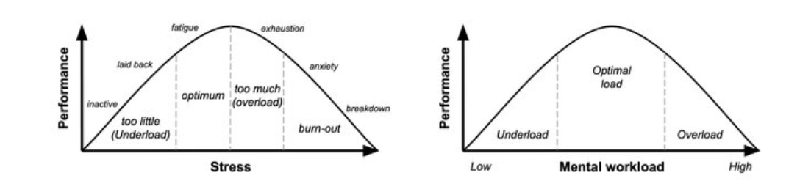

# **1. HUMAN FACTORS - FATTORI UMANI**

Lo studio dei Fattori Umani (Human Factors) è una delle discipline da cui trae origine la Human-Computer Interaction (HCI).

L'approccio principale dei Fattori Umani consiste nella comprensione del **comportamento**, delle **capacità** e dei **limiti** degli esseri umani (siano essi fisici, sociali, cognitivi, ecc.) al fine di progettare sistemi che siano a loro ben **adattabili**.

Gli "Human Factors" analizzano, quindi: **come gli esseri umani percepiscono, pensano, si muovono, prendono decisioni e commettono errori (falliscono)**. Questi sono tutti aspetti che concorrono all'utilizzo del sistema.

L'HCI richiede anche una **misurazione**. Se vogliamo sapere quanto bene un sistema si adatta a una persona, abbiamo bisogno di un metodo per stabilire **se** funziona, **quanto** è efficace e **in che modo** opera.

Durante l'analisi, si utilizzano i **test qualitativi** che ci permettono di raccogliere fatti e dati descrittivi.

I **test quantitativi**, invece, ci permettono di sapere *esattamente* il *perché* di un risultato; da soli, però, non riescono a cogliere appieno se c'è un riscontro soggettivo o meno (come invece fanno i qualitativi)🡪

Per chiarire questo concetto: immaginiamo di testare un medicinale.

1.  **Valutazione Qualitativa:** Chiedere alle persone **come si sentono** (l'esperienza soggettiva).
2.  **Valutazione Quantitativa:** Verificare se le persone sono **effettivamente guarite** dalla malattia (il risultato oggettivo).

Se un medicinale non funziona, ovvero non cura la malattia, probabilmente richiede ulteriori indagini, anche se i riscontri qualitativi sono positivi (cioè, se le persone dicono di sentirsi meglio, ma la malattia non è sconfitta). Per questo, **non possiamo scegliere di usare solo un tipo di test**.

Al contrario, se un medicinale mostra ottimi risultati quantitativi (è statisticamente efficace), ma le persone non si sentono a proprio agio con il metodo di somministrazione o l'esperienza complessiva, questo fornisce indicazioni importanti per valutare se e in quali contesti debba essere utilizzato.

Il nostro obiettivo qui è l'aspetto **quantitativo**. Senza misurazioni, la ricerca e il design rischierebbero di basarsi principalmente su opinioni, abitudini o semplice estetica. Ci servono invece **dati e fatti concreti** per giustificare le decisioni e le soluzioni che adottiamo nella fase di design.

Se consideriamo la Human-Computer Interaction (HCI) come una scienza sociale, essa presenta due aspetti fondamentali:

1.  **L'Aspetto Descrittivo**
2.  **L'Aspetto Normativo**

**1. Aspetto Descrittivo**

Nell'aspetto descrittivo, andiamo a verificare e comprendere:

- Se le cose esistono e se ci sono effetti.
- Come si strutturano le interazioni.
- Come funzionano i sistemi, ecc.

**2. Aspetto Normativo**

Nell'aspetto normativo, andiamo oltre la semplice descrizione. Questo è il momento in cui facciamo design: specifichiamo come dovrebbe essere fatto il nostro sistema.

Quando prendiamo una certa decisione di design, stiamo applicando quello che per noi è il **"dover essere"** di quel sistema. Tuttavia, se questo sistema funzioni o meno, lo possiamo scoprire solo andandolo a verificare effettivamente.

Come ogni buona scienza che si rispetti, dovremmo far precedere **l'aspetto normativo da quello descrittivo**.

- **Prima** andiamo a vedere **se** una cosa può funzionare (Descrizione).
- **Poi** cerchiamo di applicarla (Normativa).

Ovviamente, nel processo reale, le cose non procedono sempre in maniera così lineare. Spesso il design iniziale è una scommessa (un'ipotesi normativa): pensiamo che possa funzionare.

## **1.1 PERCHE’ MISURIAMO?**

Alla luce di quello che scopriremo in questa fase, decideremo **quanto, come e in che caso**, il sistema potrebbe funzionare, perché disporremo di evidenze basate su **fatti e dati concreti.**

Perché misuriamo? Vogliamo delle prove (evidenze) su:

1.  **Performance:** ad esempio il tempo di completamento di un task, il tasso di errore, il *throughput* e la curva di apprendimento.
2.  **Esperienza:** come l'usabilità percepita, il carico mentale (*mental workload*), la fiducia nel sistema (*reliance*) e il controllo percepito.
3.  **Sicurezza:** analizzando i quasi-incidenti (*near-misses*), gli incidenti critici e le capacità di recupero dall'errore.
4.  **Soddisfazione** (qui intesa come una misura latente).

Questa esigenza di misurazione si mappa perfettamente sulla definizione di usabilità (di Nielsen) e sugli standard internazionali (ISO) ad essa correlati. Non è un caso che questi standard provengano non solo dagli studi sulla qualità, ma anche dall'ergonomia e dagli human factors.

Nelle performance andiamo a vedere metriche come:

- Il **tempo per completare un task**.
- Il numero di **errori** commessi.
- Il livello di **difficoltà** percepita dagli utenti.

Questo si allinea bene con i concetti di efficienza e **apprendibilità** (*learnability*) di un'innovazione.

Una volta che andiamo a misurare queste cose, i dati ci permettono di:

1.  **Comparare soluzioni diverse:** Attraverso l'analisi statistica, possiamo comparare diverse azioni di design o diverse tecnologie (ad esempio, un chatbot rispetto a un'interfaccia grafica) per vedere quale sia la migliore.
2.  **Diagnosticare Problemi:** A seconda della tipologia e della qualità dei dati, possiamo diagnosticare **dove e perché** gli utenti hanno problemi in uno specifico design.
3.  **Costruire Conoscenza Generalizzabile:** Questo è fondamentale. Ci permette di generalizzare e di **distillare conoscenze cumulative** sul comportamento umano.

Questa conoscenza ci aiuta a capire come solitamente gli esseri umani si comportano in determinati contesti e, di conseguenza, come possiamo **informare il prossimo design**.

Pensando all'**Information Architecture**, sappiamo che gli esseri umani tendono a comportarsi in modi specifici in certi contesti. Questo significa che abbiamo identificato i **pattern** che ci permettono di assecondare quei comportamenti tipici, e quei comportamenti tipici devono essere riscontrati nel sistema progettato.

## **1.2 DAI COSTRUTTI AGLI INDICATORI**

Quando parliamo di queste caratteristiche, ci riferiamo a dei **<u>costrutti latenti</u>**.

Ad esempio, l'usabilità non è qualcosa che esiste come una proprietà fisica e oggettiva; l'usabilità è un concetto che emerge nella relazione tra una persona e un sistema. Possiamo dire che una cosa è *più* usabile di un'altra in media, ma non è sempre vero per tutti. Non è una proprietà intrinseca dell'oggetto, né una proprietà fissa del sistema o della persona.

Lo stesso vale, per esempio, per l'apprendimento del sistema, il coinvolgimento (*engagement*) o la sua stabilità. Pensiamoci: che cos'è l'apprendimento? Ci sono tantissime definizioni diverse di cosa sia l'apprendere.

Quando definiamo queste caratteristiche, dunque, le consideriamo dei **costrutti** che noi **postuliamo** (o ipotizziamo) come *latenti* (nascosti), rispetto a ciò che è davvero misurabile. Sono dei **costrutti che abbiamo costruito** a livello di ricerca.

A seconda delle diverse definizioni che adottiamo, avremo bisogno di misurare degli **aspetti diversi**. Questi aspetti misurabili sono gli **<u>indicatori</u>** di quel costrutto.

Noi, quindi, **non osserviamo direttamente il costrutto latente**. Non osserviamo l'usabilità o l'apprendimento in sé. Osserviamo invece delle **caratteristiche che fungono da indicatori** e che possono segnalarci se e quanto apprendimento c'è stato.

Per esempio, come indicatori possiamo:

- Chiedere alle persone **come si sentono** (con questionari, *self-report*).
- Vedere **quanto tempo** ci hanno messo a completare un compito.
- Registrare **quanti errori** hanno fatto.
- Contare **quanti clic** hanno eseguito.
- Analizzare il **movimento degli occhi** (tramite *eye-tracking*).
- Misurare le **caratteristiche fisiologiche** (*ad esempio*, il battito cardiaco, l'attivazione).

Tutte queste cose possono essere **indicative** di un costrutto latente (come l'usabilità o l'apprendimento).

**Problema di mappatura🡪**

Il problema principale è che il costrutto, essendo qualcosa di **latente** (nascosto/astratto), **non ha una mappatura uno a uno con un indicatore**.

- **Un costrutto può essere rappresentato da molti indicatori:** Un singolo costrutto, come l'usabilità, è particolarmente complicato e sfumato e può essere misurato attraverso diversi metodi. Per questo, un solo indicatore non è sufficiente.
- **Un indicatore è influenzato da diversi costrutti:** Lo stesso indicatore può essere influenzato da diversi costrutti (ci possono essere spiegazioni alternative). Ad esempio, il fatto che una persona impieghi molto tempo a completare un *task* non è necessariamente legato solo a una cattiva usabilità del sistema. Potrebbe anche essere collegato a caratteristiche personali dell'utente (come l'esperienza pregressa o la scarsa familiarità).

Quindi, è difficile collegare in modo univoco gli indicatori a un solo costrutto.

**Requisiti per una Buona Misurazione🡪**

In generale, per effettuare una buona misurazione (o "configurazione"), dobbiamo soddisfare tre requisiti fondamentali:

1.  **Chiara Definizione del Costrutto:** Dobbiamo prima di tutto avere una chiara definizione del costrutto che stiamo studiando (es. "cosa intendiamo esattamente per apprendimento?"). Questo è fondamentale, ma viene spesso dato per scontato. Nella ricerca, è necessario essere **molto precisi** e indicare quale definizione teorica si sta adottando, anche specificando le teorie che ne sono alla base.
2.  **Rapporto Plausibile tra Costrutto e Indicatori:** Dobbiamo avere un rapporto **plausibile** (credibile e teoricamente fondato) tra il costrutto e gli indicatori che si intendono utilizzare. Questo è un problema specialmente quando non esiste una letteratura scientifica consolidata che dimostri il *link* tra i due. Ad esempio, ci si chiede: l'apprendimento può essere misurato con il solo tempo di esecuzione del *task*? O è più efficace un questionario specifico? E cosa cambia se le domande o le scale di misurazione sono leggermente diverse?
3.  **Consapevolezza delle Limitazioni:** Essendo dei costrutti latenti, dobbiamo essere sempre consapevoli delle loro limitazioni e delle possibili spiegazioni alternative. Non possiamo stabilire con certezza dei **nessi causali** (causa-effetto) assoluti basandoci solo su queste misurazioni.

C'è sempre una certa probabilità che:

- Lo strumento di misura scelto non sia efficace.
- La teoria che è alla base del costrutto o dell'indicatore non sia sufficientemente forte.

Molto spesso, soprattutto in una materia relativamente giovane come questa, ci troviamo a utilizzare **il meglio che abbiamo**, che non è necessariamente il metodo ideale. Questo, comunque, è un aspetto caratteristico dell'evoluzione di qualsiasi campo scientifico e non è un problema limitato solo a questa disciplina.

Dimostriamo la differenza con la scienza fisica. Nella fisica, concetti come **forza** o **lavoro** hanno una **definizione unica** e sono espressi in maniera chiara e spesso con formule matematiche precise. C'è una diretta corrispondenza tra il concetto e la sua misurazione.

Qui, invece, **non abbiamo questa diretta corrispondenza**.

In HCI (e nelle scienze sociali in generale):

- **Non abbiamo** una definizione universale e chiara dei costrutti.
- **Non abbiamo** un legame diretto e lineare tra costrutti e misurazioni.
- Spesso, anche le **misurazioni** stesse non sono semplici o immediatamente oggettive.

Di conseguenza, **tutto rimane in parte soggettivo**.

Questa complessità comporta il dover essere **il più rigorosi possibile**. Se il **rigore metodologico** viene meno, allora l'intero lavoro di ricerca perde di validità e significato.

# **2. FONDAMENTI DI PSICOMETRIA**

Vediamo adesso come misurare questi costrutti, attingendo ai fondamenti della **Psicometria**.

La **Psicometria** è la scienza che studia come si progettano, si valutano e si interpretano le misure psicologiche.

Viene solitamente citata per la progettazione di **questionari** (come quelli utilizzati in psicologia) che devono essere costruiti e interpretati seguendo specifiche tecniche psicometriche.

**Obiettivi della Psicometria:**

Uno degli obiettivi principali della psicometria è assicurarsi che gli strumenti di misura siano:

1.  **Affidabili:** Lo strumento deve essere **stabile** e **fornire risultati coerenti.** Se applico lo stesso strumento a persone diverse in condizioni simili, devo ottenere risultati che non siano casuali. Se i risultati sembrano completamente casuali ("background noise"), probabilmente lo strumento non è affidabile.
2.  **Validi:** Questo si ricollega al concetto di *link* affermato prima. Dobbiamo assicurarci che lo strumento stia **effettivamente misurando ciò che intendiamo misurare**, e che i risultati non siano dovuti a un altro costrutto latente.
3.  **Sensibili all'Errore:** Bisogna conoscere il potenziale **errore di misurazione** e l'impatto che tale errore può avere sulle conclusioni ottenute.

Perché la psicometria è importante in HCI?

Tutti i **questionari** e le scale che utilizziamo o adattiamo (come la **SUS - System Usability Scale**, o il **NASA-TLX** per il carico mentale) sono strumenti che devono sottostare a queste leggi psicometriche. A volte, inoltre, vengono create nuove scale per tecnologie o contesti emergenti.

Poiché operiamo in un campo dove non sempre esiste una teoria solida di riferimento per i costrutti latenti (la materia è "giovane"), se non applichiamo un rigore psicometrico:

- **Non sappiamo** se uno strumento di misura è davvero **affidabile**.
- **Non sappiamo** se misura davvero ciò che dobbiamo misurare (**validità**).
- **Non sappiamo** come interpretare e valutare i dati in modo appropriato, specialmente **quale test statistico** applicare.

Ad esempio, se applichiamo un test parametrico a un dato che, per sua natura, dovrebbe essere non parametrico (perché magari non presenta una distribuzione normale, ovvero a campana), l'analisi sarà viziata.

Oppure, i tempi di esecuzione di un *task*, non si distribuiscono normalmente; seguono spesso una distribuzione log-normale. Se questa condizione non è rispettata, non possiamo fare quel tipo di test statistico, dobbiamo usarne un altro.

Questo è fondamentale perché, se usiamo il **test statistico sbagliato**, giungiamo a **conclusioni errate**:

- **Falsi Negativi:** Non troviamo un effetto quando invece c'è.
- **Falsi Positivi:** Troviamo un effetto quando in realtà non c'è.

Questo significa che stiamo interpretando male i dati e traendo conclusioni sbagliate sulla nostra ipotesi di design.

## **2.1 MISURARE IL COSTRUTTO GIUSTO – VALIDITA’**

Per assicurarci che stiamo misurando il costrutto corretto, introduciamo il concetto di validità. La validità risponde alla domanda: Stiamo misurando effettivamente ciò che pensiamo di misurare?

Esistono tre aspetti principali della validità di uno strumento di misura:

**1. Validità di Contenuto (Content Validity)**

Si riferisce a quanto le domande (gli *item*) del questionario coprono adeguatamente l'intero dominio del costrutto che vogliamo misurare.

Esempio: L'usabilità, definita dagli standard ISO, comprende *efficacia, efficienza e soddisfazione*. Se il questionario di usabilità non misura tutte e tre queste dimensioni, sto misurando solo un sottoinsieme dell'usabilità (ad esempio, solo la *soddisfazione*), e non il costrutto nella sua interezza.

**2. Validità di Costrutto (Construct Validity)**

Verifica che lo strumento misuri il costrutto teorico in modo coerente con altri costrutti correlati. Questa validità si divide in due sottotipi:

- **Validità Convergente (Convergent Validity)**

Lo strumento dovrebbe correlare in modo forte con altri strumenti che misurano costrutti collegati.

*Esempio:* Due questionari diversi che misurano l'usabilità dovrebbero mostrare un'alta correlazione tra loro.

- **Validità Discriminante (Discriminant Validity)** (spesso nota anche come divergente)

Lo strumento deve non correlare in modo forte con costrutti che non sono collegati (o che sono distinti).

> *Esempio:* Il questionario di usabilità non dovrebbe correlare troppo con i questionari che misurano la personalità. Se l'alta correlazione si verifica, significa che:

- il costrutto di usabilità che stiamo usando è troppo simile a quello di personalità;
- lo strumento di misura (il questionario) in realtà sta misurando inavvertitamente la personalità anziché l'usabilità.

**3. Validità di Criterio (Criterion Validity)**

Misura la capacità dello strumento di predire o correlare con risultati esterni e oggettivi (i criteri).

*Esempio:* Ci si aspetta che un punteggio più elevato in un questionario di usabilità (es., alta *soddisfazione*) si *mappi* su criteri oggettivi come meno errori e tempi di esecuzione più veloci.

Se un alto punteggio di usabilità non è correlato negativamente con il numero di errori (cioè, alta usabilità = pochi errori), allora lo strumento non sta misurando bene, o c'è un problema nel costrutto iniziale.

È cruciale ricordare che una scala o una misura può essere molto affidabile, ma non valida.

- Affidabilità: Lo strumento funziona bene internamente e misura sempre la stessa cosa in modo coerente.
- Validità: Lo strumento misura la cosa giusta.

*Esempio:* Potrei voler misurare l'usabilità, ma per caso sto misurando la personalità. La mia misurazione di personalità può essere molto affidabile (esce sempre lo stesso risultato), ma alla fine, mi rendo conto che non sto misurando l'usabilità.

Avvertimento: il fatto che una scala o uno strumento sia popolare non significa che sia valido per il tuo specifico contesto d'uso. Ci sono strumenti e tecniche molto diffusi che hanno un basso grado di validità. Dobbiamo essere sempre consapevoli di cosa stiamo facendo e cosa vogliamo misurare.

## **2.2 CONSISTENZA DELLE MISURE – AFFIDABILITA’**

Se la validità risponde alla domanda "Sto misurando la cosa giusta?", l’affidabilità risponde a: **"Quanto del punteggio è segnale rispetto al rumore?"**

L'affidabilità si riferisce a quanto una misurazione è **consistente** e **stabile** nel tempo e tra gli *item*. Ne esistono tre tipi principali:

**1. Consistenza Interna**

Questo tipo di affidabilità verifica se le singole domande (*item*) all'interno di un questionario stanno misurando la **stessa dimensione** (o costrutto) **in modo concorde**.

Esempio: Se abbiamo un questionario che misura la soddisfazione del sistema, tutte le domande relative alla soddisfazione devono **correlare tra loro**.

- Se l'utente risponde in modo coerente (ad esempio, alta soddisfazione su tutte e tre le domande: "È stato usabile?", "Ti sei sentito soddisfatto?", "Ti sei sentito soddisfatto da quest'altra cosa?"), allora c'è alta consistenza interna.
- Se le risposte non correlano tra loro, significa che le domande non stanno misurando lo stesso costrutto e qualcosa non funziona nello strumento.

**2. Affidabilità Test-Retest**

Si verifica se, a patto che il costrutto sottostante non cambi, lo strumento fornisce **risultati simili nel tempo**.

**🡪**Se misuro la stessa cosa più volte, dovrei ottenere lo stesso risultato.

Esempio: Se misuro un oggetto con un righello diverse volte, il risultato dovrebbe essere sempre lo stesso, al netto di piccoli errori di misurazione dovuti magari alla temperatura o alla manipolazione. Se il risultato è stabile, lo strumento è affidabile su questa dimensione.

**3. Affidabilità Inter-Giudice (Inter-rater reliability)**

Misura il grado di **accordo** tra **diverse persone** (*rater* o valutatori umani) che codificano o valutano lo stesso comportamento.

Esempio: Se chiediamo a due o tre ricercatori di osservare le registrazioni video di un test utente e di contare autonomamente gli errori commessi, il loro grado di accordo indica l'affidabilità inter-giudice. Non si tratta quindi di migliaia di utenti che rispondono a un questionario, ma di valutatori esperti che classificano/codificano gli stessi dati.

Una misura **poco affidabile** significa che è molto esposta all'**errore casuale** e questo ha gravi conseguenze statistiche:

- **Riduce la potenza statistica:** È più difficile individuare se un effetto (una differenza reale) esiste.
- **Può mascherare differenze reali:** Se misuriamo due oggetti che hanno una differenza di 1.5 cm ma il nostro strumento (il righello) ha un errore di misurazione (o *rumore*) pari o superiore a 1.5 cm non riusciremo a vedere la differenza tra le interfacce.

**Azioni Pratiche per l'Affidabilità**

- **Verifica Statistica:** Si utilizzano indici come l'**Alpha di Cronbach** o l'**Omega di McDonald** per verificare la consistenza interna.
- **Revisione degli *Item*:** Si controllano le **correlazioni item-totale**. Se alcuni item risultano problematici, si rimuovono o si revisionano.
- **Evitare Domande Problematiche:** È fondamentale **evitare domande estremamente vaghe o "a doppia canna"** (double-barreled), ovvero domande che chiedono **due cose diverse** contemporaneamente nello stesso item.

## **2.3 SCALE DI MISURAZIONE E RISPOSTE LIKERT**

Le variabili quantitative differiscono per il tipo di scala e questo influenza pesantemente i test statistici che possiamo applicare. Si dividono in quattro categorie:

**1. Scala Nominale (Categorica)**

I dati sono divisi in categorie senza un ordine o una gerarchia.

Esempio in HCI: **Sesso** (Maschio, Femmina, Non-binario), **tipologia di dispositivo** (telefono, laptop, tablet).

**2. Scala Ordinale**

Le scale ordinali permettono di **ordinare** i valori (sapere che uno è maggiore o minore dell'altro), ma **non permettono di conoscere la grandezza dell'intervallo** tra i valori consecutivi.

C'è un ordine (poco 🡪molto), ma non si conosce la distanza tra i gradini. Non sappiamo quanta differenza ci sia tra il valore 1 e 2, o tra il 5 e il 6.

Ti dicono che 2 è maggiore di 1, ma non che la distanza tra 1 e 2 è la stessa che tra 4 e 5.

Esempio: le singole risposte Likert (da 1 "Per niente d'accordo" a 5 "Molto d'accordo") sono su scala ordinale.

**3. Scala a Intervalli**

Nelle scale a intervalli, sappiamo che i valori sono ordinati e hanno anche la **stessa distanza** tra i gradini.

La differenza tra 1 e 2 è la stessa che tra 2 e 3.

Esempio: La temperatura misurata in **gradi Celsius (°C)** o gli anni del calendario.

**Limitazione:** Non si possono fare rapporti (moltiplicazioni o divisioni). Lo **zero è arbitrario** e non indica l'assenza della proprietà. Ad esempio, 20 °C non è il doppio più caldo di 10 °C.

**4. Scala a Rapporti**

Le scale a rapporti condividono la proprietà di avere intervalli uguali, ma in più hanno uno **zero assoluto** (significativo).

Lo zero indica la completa **assenza** della proprietà misurata. Poiché lo zero non è aleatorio, si possono fare sia addizioni che **moltiplicazioni/divisioni (rapporti)**.

Esempio: La temperatura misurata in **Kelvin (K)**. Lo zero Kelvin (0 K) rappresenta l'assenza totale di energia termica (zero assoluto). Per questo, si può dire che 40 K è il doppio di 20 K.

**Esempio in HCI:** Tempo di completamento del *task* misurato in secondi (dove 0 significa assenza di tempo impiegato) o numero di errori (o euro).

Le singole voci di una **Scala Likert** sono strettamente **ordinali**. Questo è un punto cruciale, perché molti le trattano erroneamente come **intervallari**, rischiando di commettere errori di interpretazione.

Tuttavia, è accettabile trattare approssimativamente i dati Likert come una scala a intervalli quando si verificano specifiche condizioni:

1.  **Somma o Media degli Item:** Quando non analizziamo un singolo item (che rimane strettamente ordinale), ma aggreghiamo diversi item calcolandone la **somma o la media** per valutare lo stesso costrutto.
2.  **Scale Bilanciate e Simmetriche:** Quando le opzioni di risposta sono **bilanciate e simmetriche** (ad esempio, una scala con un punto neutrale centrale e opzioni simmetricamente speculari ai lati, come "Fortemente in disaccordo" vs "Fortemente d'accordo").

Tenere a mente questa distinzione è **estremamente importante** nel momento in cui si deve scegliere il test di ipotesi (test statistico) da applicare!

# **3. SCALE DI USABILITA’**

## **3.1 MISURARE L’USABILITA’ COME UN COSTRUTTO**

Per offrire alcuni consigli pratici sulla scelta delle scale e degli strumenti, facciamo riferimento alla definizione di usabilità.

**La Definizione ISO di Usabilità**

- **Efficacia:** Una persona riesce a raggiungere gli obiettivi?
- **Efficienza:** Quanto rapidamente e con quanta accuratezza raggiunge gli obiettivi?
- **Soddisfazione:** Quanto è soddisfatto nell'ottenere gli obiettivi in uno specifico contesto d'uso?

Quando si usano questionari per misurare l'usabilità, si sta usando una **misura percettiva o soggettiva** della persona.

- **Dato Soggettivo:** Si basa su ciò che l'utente *pensa*. Ad esempio, un utente potrebbe aver completato un *task* e percepire di essere stato veloce, pur avendo impiegato 5 minuti in più rispetto alla media degli altri utenti.

Un buon modo per validare l'usabilità è proprio quello di non fermarsi al solo dato soggettivo!

Quando si compara un sistema, un design o due interfacce diverse, è cruciale non fermarsi solo a una scala soggettiva come la **SUS (System Usability Scale)**, che è molto popolare.

Se si usa solo la SUS, **non abbiamo misurato l'usabilità** nella sua interezza; abbiamo misurato la **percezione soggettiva dei partecipanti sull'usabilità**.

Come buona pratica, è sempre meglio **misurare anche la parte oggettiva** (ad esempio, con tempi ed errori) e mettere insieme le interpretazioni dei due tipi di dati.

Paradossalmente, le persone potrebbero valutare un sistema come *piacevole* o *facile* (soggettivo) anche se le loro performance oggettive sono scarse. Magari ci sono altre caratteristiche in gioco che influenzano il giudizio.

## **3.2 SYSTEM USABILITY SCALE (SUS)**

La **System Usability Scale (SUS)** è uno dei questionari più famosi e utilizzati per la misurazione dell'usabilità percepita.

- È composta da **10 domande** (*item*) su una scala **Likert** a 5 valori.
  - Le domande **dispari** (1, 3, 5, 7, 9) sono formulate in modo **positivo** ("Trovo il sistema facile da usare").
  - Le domande **pari** (2, 4, 6, 8, 10) sono formulate in modo **negativo** ("Ho trovato il sistema inutilmente complesso").
  - Ci si aspetta una correlazione negativa tra le risposte agli *item* positivi e quelli negativi.
- I punteggi vengono convertiti e sommati per ottenere un valore finale compreso tra **0 e 100**.

**Punti di Forza della SUS:**

1.  **Affidabilità e Validità Dimostrate:** È molto utilizzata e supportata da una vasta letteratura che dimostra la sua robustezza (funziona abbastanza bene).
2.  **Agnostica dal contesto:** Può essere applicata a una vasta gamma di sistemi (app, siti web, computer, dispositivi mobili, ecc.), rendendola ottima per la **comparazione** tra sistemi diversi.

**Limitazioni:**

1.  **Linguaggio Datato:** Alcuni *item* sono ormai **datati** e possono risultare ambigui (es. applicandola ad un chatbot🡪per questo, esistono scale specifiche più moderne).
2.  **Mischia i Costrutti:** La SUS tende a misurare principalmente solo due aspetti dell'usabilità: l’**accettazione** da parte dell'utente e la **soddisfazione percepita**.

> La SUS **non è un buon indicatore della performance oggettiva**.

- **Esempio:** L'utente potrebbe sentirsi soddisfatto (alto punteggio SUS) anche se la sua *accuracy* (precisione) nel completare il *task* è bassa. Questo accade perché l'utente potrebbe avere un'attitudine positiva verso la tecnologia in generale o percepisce di aver risolto il *task* meglio di quanto sia realmente accaduto.

In generale, la SUS è una misura **semplice, veloce e globale** per misurare l'**usabilità percepita**. È ideale quando si desidera comparare rapidamente diversi sistemi o studi differenti.

## **3.3 UMUX e UMUX-Lite**

Un'altra scala comune è l'**UMUX** (*Usability Metric for User Experience*).

Esistono due versioni:

1.  **Versione Completa:** Composta da 4 domande.
2.  **Versione Breve (UMUX-Lite):** Composta da sole 2 domande.

La **UMUX-Lite** è la versione più utilizzata e indaga tipicamente quanto è stato **utile** il sistema e quanto è stato **facile da usare**.

**Vantaggi:**

- È **semplice e veloce** da somministrare. Richiede un tempo minimo da parte dell'utente, chiedendo un punteggio su due soli *item*.
- I suoi risultati **correlano molto bene con la SUS** e con altre misure tradizionali.

**Limitazioni:**

- Avendo solo due domande, è **più sensibile all'errore casuale** rispetto a questionari più lunghi.
- È molto difficile utilizzare la UMUX-Lite per scopi **diagnostici**. Le domande sono molto generiche, quindi se il punteggio è basso, non si riesce a capire che cosa esattamente non ha funzionato nel design.

Si usa tipicamente quando:

- **Il tempo è un fattore limitante** e si ha bisogno di una misura rapida.
- È inserita in un **design sperimentale complesso** che richiede molte sessioni di misurazione. In questi contesti, aggiungere solo 2 domande anziché 10 o 26 fa una grande differenza, poiché il rischio di affaticamento, distrazione o fastidio dell'utente è molto alto.

## **3.4 Scala di Usabilità dei Chatbot (BUS-11)**

Per concludere il discorso sulla misurazione dell'usabilità, presentiamo una **scala specifica per il dominio dei chatbot**, chiamata **BUS-11** (*Chatbot Usability Scale*).

Questa scala è stata sviluppata da un team di ricercatori e rappresenta un eccellente esempio di strumento di misura mirato.

A differenza delle scale generiche (come la SUS o la UMUX), che misurano soprattutto la semplice "facilità d'uso" e "soddisfazione", la BUS-11 è una scala **dedicata** a catturare gli aspetti specifici e complessi dei chatbot che le altre scale non riescono a rilevare:

- **Qualità della conversazione**
- **Gestione del contesto**
- **Privacy**
- **Tempo di risposta**

La **BUS-11** è composta da **11 *item*** su una scala **Likert a 5 punti**. Fornisce anche un approccio euristico per i designer, chiamato **BUS-CHECK**.

**Vantaggi:**

1.  **Specificità:** È stata sviluppata appositamente per i chatbot.
2.  **Validazione Interculturale:** È stata **validata in diversi contesti e lingue** (Inglese, Tedesco, Olandese, Spagnolo e Italiano). Questo la rende uno strumento robusto e adatto per **studi cross-country**.
3.  **Validità Convergente Forte:** Ha dimostrato una **forte validità convergente con la UMUX-Lite**, il che conferma che, pur essendo specifica, sta misurando in modo efficace i costrutti chiave di usabilità/UX.

**Limitazioni:**

- Essendo una scala relativamente **recente**, l'evidenza in letteratura scientifica sul suo uso è ancora meno vasta rispetto alla SUS. Inoltre, come tutte le scale soggettive, è **principalmente focalizzata sulla soddisfazione e sulla qualità percepita**.

La BUS-11 è lo strumento ideale da usare quando si desidera ottenere **approfondimenti specifici per il chatbot** che vanno oltre ciò che è misurabile con SUS o UMUX. È particolarmente utile per **comparare** più chatbot o diverse versioni, specialmente in studi che coinvolgono **lingue diverse**.

# **4. MENTAL WORKLOAD**

Il **Carico Mentale** (*Mental Workload*) può essere definito come **l'ammontare delle risorse cognitive necessarie per soddisfare le richieste di un *task***.

Quando un utente interagisce con un sistema, il carico mentale che sperimenta dipende da numerosi fattori:

- **Richieste del Task**🡪 Complessità del *task*, pressione temporale o livello di urgenza.
- **Interfaccia/Tecnologia🡪** Chiarezza del *design*, densità delle informazioni, tipo di *feedback*.
- **Fattori Utente🡪** Competenza dell'utente, livello di fatica o di stress al momento del test.

Teoricamente, ci aspetteremmo una relazione lineare e semplice tra Carico Mentale e Performance:

- **Carico Mentale Molto Basso:** Il *task* è molto facile, le risorse usate sono minime🡪 Performance alta (il comportamento è quasi automatico).
- **Carico Mentale Molto Alto:** Sono state utilizzate troppe risorse disponibili🡪Performance peggiore, errori, lentezza, stress (comportamento insicuro o inefficace).

Tuttavia, questa relazione non è sempre valida, o potrebbe essere del tutto errata!

## **4.1 Non è tutto oro quel che luccica – Parte 1**

Prima di utilizzare questo costrutto nella ricerca, è necessario chiarire la terminologia, perché ci sono decine di definizioni possibili di Carico Mentale.

Il **Carico Mentale** (*Mental Workload*) **non è la stessa cosa** del **Carico Cognitivo** (*Cognitive Load*).

Il **Carico Cognitivo** si occupa precisamente dell'**apprendimento** e deriva dalla **Teoria del Carico Cognitivo** (Cognitive Load Theory), che è una teoria profondamente radicata nella **psicologia cognitiva** (in particolare focalizzata sui limiti della memoria di lavoro) e applicata all’educazione e all'*instructional design*. Di conseguenza, il *Cognitive Load* misura un aspetto diverso e più specifico (l'impatto di un *task* sull'apprendimento e sull'acquisizione di informazioni).

Se vogliamo utilizzare la definizione di usabilità che include l'apprendimento (*learnability*), la scelta di misurare il Carico Mentale o il Carico Cognitivo dipende da **cosa vogliamo esattamente includere** nella nostra misurazione.

Molti articoli commettono l'errore di misurare il *Mental Workload* pensando che sia un'indicazione diretta della facilità di apprendimento (*Cognitive Load*). Non c'è un collegamento diretto e garantito, quindi non si può dare per scontato che un basso *Mental Workload* implichi un migliore apprendimento.

## **4.2 Non è tutto oro quel che luccica – Parte 2**

La relazione tra Carico Mentale e Performance non è lineare. Potrebbe seguire la **Legge di Yerkes-Dodson**, che descrive una relazione **non lineare** a forma di **U rovesciata** tra l'attivazione/stress e la performance.

Applicando questo modello al Carico Mentale:

1.  **Carico Molto Basso (Apatia):** Se il *Mental Workload* è troppo basso, non è detto che il task sia semplice e di conseguenza la performance sia alta. Potremmo essere in una condizione di **apatia** (*underload*)🡪L'utente è poco coinvolto o si annoia. Le performance sono basse perché l'utente non si impegna o commette errori di disattenzione.

2.  **Carico Ottimale (Optimal load):** Quando il Carico Mentale è a un livello medio, l'utente è sufficientemente **coinvolto** e motivato. Le performance sono al loro **livello migliore**.

3.  **Carico Eccessivo (Stress/Overload):** Man mano che il Carico Mentale aumenta, si arriva al **sovraccarico** (*overload*). L'utente si sente frustrato, esaurisce le risorse e le performance iniziano a **degradare** rapidamente.

La difficoltà sta nel fatto che, misurando il carico, non sappiamo se stiamo nella condizione ottimale (massima performance), nella condizione di apatia (basso carico, bassa performance) o nella condizione di sovraccarico (alto carico, bassa performance).

Se il costrutto è già così sfumato e "macro", **non sappiamo esattamente cosa misurare** e **come misurarlo** in modo valido e affidabile.

È cruciale avere una chiara definizione del costrutto prima di tentare la misurazione.

## **4.3 Misurazione del Mental Workload: NASA-TLX**

Per affrontare la misurazione, la prima cosa da fare è prendere una definizione del costrutto e attenersi a quella, scegliendo l'approccio che meglio si adatta al proprio contesto di ricerca.

Lo strumento di misurazione soggettiva più comune in questo campo è il **NASA-TLX** (*Task Load Index*).

Come suggerisce il nome, Il NASA-TLX è stato creato dalla **NASA** negli anni '80 per misurare il livello di carico mentale dei **piloti di aerei**.

È composto da **sei livelli** (o scale di valutazione) che indagano aspetti diversi del carico esperito dall'utente.

I sei livelli sono:

1.  **Carico Mentale**
2.  **Carico Fisico**
3.  **Carico Temporale**
4.  **Livello di Performance**
5.  **Sforzo**
6.  **Frustrazione**

È corretto dire **'livelli'** e non **'dimensioni'**, perché queste ultime implicherebbero che le sei scale rappresentino sei **sottocostrutti distinti e scientificamente provati** del Carico Mentale!

Non si può definire con certezza che queste sei scale siano **dimensioni psicometriche** che esauriscono completamente il costrutto di Carico Mentale. La scelta di fermarsi a sei livelli è stata fatta dai suoi creatori per motivi pratici, non perché avesse un preciso significato statistico.

La scala chiede all'utente di fornire un punteggio da 0 a 100 per ciascuno dei sei livelli (spesso usando una scala visiva a 5 o 10 punti). Esistono due varianti principali per ottenere il punteggio finale:

1.  **Originale (Media ponderata- Weighted TLX):** Richiede una seconda fase in cui l'utente esegue dei **confronti a coppie** tra le sei scale, indicando quale ha contribuito di più al carico totale. La media finale viene quindi **ponderata** in base all'importanza percepita dall'utente.

2.  **Grezza (Raw TLX):** È la versione **non pesata**, che utilizza semplicemente la media aritmetica delle sei valutazioni. Questa è la **versione più diffusa** perché più semplice da somministrare, ed è stato dimostrato che fornisce risultati altrettanto validi in molti contesti.

**Vantaggi e Applicazioni:**

- **Velocità e Semplicità:** La versione Raw TLX è rapida da somministrare (solo 6 domande).
- **Vasta Validazione:** È uno strumento **molto comune e validato** in numerosi campi (fattori umani, aviazione, *automotive*, sanità e HCI). La sua popolarità in letteratura ne garantisce una certa affidabilità comparativa.

**Limitazioni:**

1.  **Soggettività e Memoria:** Il TLX è **soggettivo** e **basato sulla memoria**. La persona valuta il carico *dopo* aver completato il *task*, non in tempo reale. Questo può portare a errori di ricordo (ad esempio, ricordando solo l'ultima fase o il momento peggiore).

2.  **Non Linearità:** **Il punteggio non si distribuisce linearmente.**

> Gli intervalli tra i punti della scala (ad esempio, tra 10 e 20) non sono uguali🡪 Conseguenza Statistica: Se il dato non ha una distribuzione normale (e non è lineare), non possiamo usare i test statistici parametrici (come T-test), o rischiamo di ottenere conclusioni errate (come è avvenuto, storicamente, in molti studi). 🡪
>
> Conseguenza Interpretativa: Non possiamo dire che "la Condizione A ha il 30% di carico mentale in più della Condizione B", perché i passi non sono proporzionali. Il TLX va usato come strumento comparativo tra diverse interfacce o *task*, non come verità assoluta sul "vero" carico.

## **4.4 Altre Misure Soggettive del Workload**

Oltre al NASA-TLX, che abbiamo visto essere il più comune esistono altre scale. Il consiglio è di usare gli strumenti che si conoscono meglio capendo però la teoria che c’è alla base di ciascuno.

| **Scala (Acronimo)** | **Caratteristiche** | **Vantaggi/Note** |
|:---|:---|:---|
| **RSME (*Rating Scale Mental Effort*)** | È una scala singola e continua (da 0 a 150) per valutare lo sforzo mentale (*Mental Effort*). | È rapidissima (*single-item*): si chiede semplicemente all'utente quanto sforzo ha impiegato. |
| **SWAT (*Subjective Workload Assessment Technique*)** | Chiede informazioni su pressione temporale, sforzo mentale e stress. Il punteggio finale viene convertito in percentuale. | Simile al TLX, ma ha un approccio leggermente diverso nella conversione. |
| **Bedford Workload Scale** | Scala unidimensionale (da 1 a 10) strutturata come un albero decisionale gerarchico. | Nasce nel campo dell'aviazione; l'utente risponde a una prima domanda e, in base alla risposta, viene indirizzato a un altro ramo di domande più specifiche per trovare il punteggio finale. |
| **MRQ (*Multiple Resources Questionnaire*)** | Questionario di 17 *item* basato sulla Teoria delle Risorse Multiple (*Multiple Resource Theory*). | Fondamentale la teoria sottostante. |

Il Multiple Resources Questionnaire (MRQ) si basa su una teoria psicologica diversa, per questo è fondamentale conoscerla:

La teoria afferma che l'utilizzo delle risorse cognitive dipende dalla tipologia di risorsa. Le risorse sono separate per tipo: visiva vs. auditiva, spaziale vs. verbale…

Riusciamo a svolgere due compiti contemporaneamente (ad esempio, vedere e ascoltare) perché stiamo attingendo a risorse diverse. Se un *workload* è prevalentemente visivo e l'altro uditivo, la somma dei due carichi non è necessariamente elevata.

Esempio di Applicazione: Nelle interfacce automobilistiche, l'utente guida (visivo/spaziale), tocca un *touchscreen* (tattile) e ascolta (auditivo). Il carico mentale generale (*Mental Workload*) potrebbe non essere significativo, ma il *workload* specifico visivo potrebbe essere al massimo. Per questo, l'MRQ (o approcci simili) è utile per misurare i carichi in parallelo.

**  **

**Trade-offs: Scale Brevi vs. Scale Lunghe**

Quando si scelgono gli strumenti soggettivi, ci sono compromessi da considerare:

| **Tipo di Scala** | **Vantaggi (+)** | **Svantaggi (–)** |
|:---|:---|:---|
| Corta (1-3 *item*, es. RSME, UMUX-Lite) | Molto veloce da somministrare, basso carico per l'utente. | Meno dettagliata, bassa capacità diagnostica, buona solo per comparazioni semplici ("A è migliore di B"). |
| Lunga / Multidimensionale (es. NASA-TLX, MRQ) | Più diagnostica: mostra *perché* il carico è alto (es. per la frustrazione o per il carico temporale). | Richiede più tempo per la compilazione, può causare fatica e si basa maggiormente sulla memoria dell'utente. |

**  **

## **4.5 INDICATORI FISIOLOGICI DI WORKLOAD**

Esistono anche indicatori fisiologici e neurologici che offrono un punto di vista oggettivo sul carico mentale. Questi indicatori sono misure indirette del *workload*, spesso correlate all'attivazione (*arousal*) o allo stress.

| **Indicatore Fisiologico** | **Misura** | **Utilità** |
|:---|:---|:---|
| **Frequenza Cardiaca (HR) e Variabilità (HRV)** | Variazioni del battito cardiaco. | Indica livelli di **attivazione**, **stress** e **sforzo** (*effort*). |
| **Dilatazione Pupillare** | Il diametro della pupilla. | Risponde direttamente al **carico cognitivo**, ma è estremamente sensibile ai cambiamenti di luce ambientale. |
| **Conduttanza Cutanea (EDA/GSR)** | Variazione della conduttività elettrica della pelle. | Indica l'attivazione del sistema nervoso simpatico. |
| **Eye Tracking** | Pattern di fissazione, tasso di chiusura degli occhi (*blink rate*), transizioni dello sguardo. | Misura l'**attenzione** e lo **sforzo visivo** richiesto dal *task*. |
| **EEG / fNIRS** | Segnali elettrici o variazioni del flusso sanguigno a livello cerebrale. | Fornisce indicazioni sull'attività cerebrale (segnale più diretto). |

**Vantaggi:**

- **Misurazione Continua:** I dati possono essere registrati in modo **continuo nel tempo**, permettendo di catturare i cambiamenti dinamici del carico *durante* l'esecuzione di un *task*.
- Sono **meno sensibili ai bias** di auto-percezione (memoria o onestà) dell'utente.

**Svantaggi:**

- I sensori possono essere **scomodi** e influenzare l'esperienza dell'utente. Sono molto sensibili ad artefatti (movimento, ambiente).
- Molti segnali correlano con l'**attivazione generale** (*arousal*), e non specificamente con il carico cognitivo.
- Spesso richiedono un **ambiente di laboratorio** controllato.

È fondamentale utilizzare i dati fisiologici per **complementare** i dati comportamentali (tempi, errori) e i dati soggettivi (questionari), e **non per sostituirli**. La triangolazione di queste diverse fonti di dati è essenziale per ottenere una visione completa del *workload*.
# **5. QUALITA’ DEI DATI COME PROBLEMA DI RICERCA**

Adesso che sappiamo come misurare, dobbiamo garantire che i risultati siano di qualità sufficiente per poter condurre analisi statistiche valide. **Se misuriamo male, sprechiamo tempo, risorse e denaro.**

| **Minaccia** | **Descrizione** |
|:---|:---|
| **Risposte Inattentive** | L'utente risponde a caso (*random responding*). Esempi: **Speeding** (risposta troppo veloce) o **Straight-lining** (rispondere sempre con lo stesso valore, es. 1, 1, 1, 1). |
| **Comprensione Errata** | Istruzioni o domande ambigue (o con esempi scarsi), che portano l'utente a **fraintendere** il *task*. |
| **Demand Characteristics** | (Molto insidioso) Il partecipante risponde in base a **ciò che pensa che il ricercatore voglia** o si aspetti, e non in base alla sua esperienza reale. |
| **Contesto Online / Problemi Tecnici** | I partecipanti fanno **multi-tasking**, usano schermi piccoli, sono distratti o le registrazioni dei dati (*logging*) si interrompono per **problemi tecnici** (*ad-blocker*, errori di sistema, *timeout*). |

**Risultato:** Dati rumorosi o *biased* (distorti) che possono portare a **Falsi Negativi** (mancare un effetto reale) o **Falsi Positivi** (vedere effetti che in realtà non sono robusti).

**  **

## **5.1 PROGETTARE PER UNA MIGLIORE QUALITA’ DEI DATI**

È possibile adottare diverse strategie nel *design* dell'esperimento per mitigare questi problemi, soprattutto nelle piattaforme di *crowdsourcing* come Prolific.

**1. Istruzioni e Durata (Study Design)**

- **Istruzioni Chiare:** Fornire istruzioni chiare, concise e, se possibile, includere un **blocco di pratica** (*practice block*) per assicurarsi che l'utente abbia compreso il *task*.
- **Limitare la Durata della Sessione:** Mantenere l'esperimento complessivamente breve per evitare l'affaticamento mentale (*survey fatigue*) e il calo di attenzione. Non si intende tanto mettere fretta nell'esecuzione di un singolo *task*, quanto piuttosto evitare che l'intera sessione di test duri così tanto da esaurire la pazienza e l'impegno del partecipante, inducendolo a rispondere in modo inattentivo.
- **Allineare il Compenso:** Il compenso deve essere **allineato allo sforzo** richiesto. Se un *task* è complesso e pagato poco, si incentiva l’imbroglio o la scarsa attenzione. Piattaforme come Prolific forniscono dati sulla paga media oraria per paese per aiutare a stabilire un compenso equo.

**2. Strumenti**

- **Pilot Test:** **Pilotare** i questionari e i *task* (anche con un piccolo campione) per identificare e correggere eventuali ambiguità prima dello studio reale.
- **Evitare Gergo e Ambiguità:** Usare un linguaggio semplice e **non usare domande *multi-barreled*** (che chiedono due cose diverse in un unico *item*).

**3. Controlli e Filtri**

È fondamentale inserire controlli interni per scartare i dati inaffidabili e individuare bot, *cheater* (imbroglioni) o *slacker* (fannulloni):

- **Controlli di Attenzione (*Attention checks*):** Inserire domande semplici, come "Seleziona il colore rosso" tra più opzioni. Chi sbaglia è probabilmente disattento. 
**IMPORTANTE**: Vanno **usati con attenzione e in modo trasparente**, senza creare "trappole" ingannevoli che frustrano l'utente onesto o violano le policy etiche delle piattaforme.
- **Controlli di Comprensione:** Porre domande per verificare che l'utente abbia effettivamente assimilato le informazioni critiche fornite all'inizio o durante l'esperimento.
- **Monitoraggio dei Tempi:** Controllare il tempo di completamento del *task*.
  - Se il tempo è **troppo veloce** (es. 15 secondi per un *task* che dovrebbe durarne 3 minuti), è probabile che si tratti di un *cheater* o *bot*.
  - Se il tempo è **troppo lento**, si può trattare di uno *slacker* (qualcuno che si è distratto o sta facendo contemporaneamente altro).

**4. Gestione delle Risposte e Creatività**

- **Pattern di Risposta:** Filtrare i partecipanti che mostrano *straight-lining* o combinazioni di risposte impossibili.
- **Interazione Forzata:** Per assicurarsi che l'utente interagisca realmente con l'interfaccia, è possibile **bloccare il questionario o la risposta** finché l'utente non ha compiuto un'azione specifica (*ad esempio*, un clic su un elemento critico).

Il design deve essere **rigoroso** per evitare gli errori (risultati falsati), ma può anche essere **creativo** nell'uso degli strumenti per garantire il *commitment* dell'utente.

Non è il risultato (trovare o non trovare un effetto) ad essere importante, ma la **sicurezza e l'affidabilità** con cui si giunge alla conclusione.