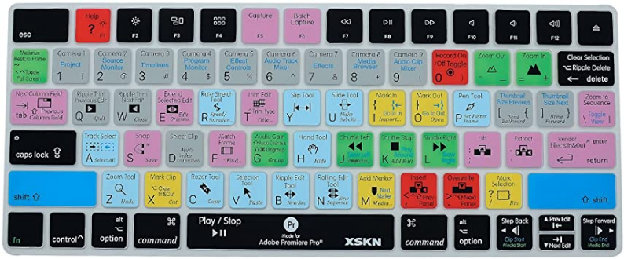

Nel mondo delle interfacce è importante non confondere l’acronimo UI (User Interface) ovvero lo spazio in cui viene l’interazione uomo-macchina, con l’acronimo di User Interaction che riguarda invece il modo in cui l’interazione si svolge. Lo scopo dell’interfaccia non è quello di mettere a disposizione dell’utente tutte le sue funzioni, come errore che fanno la maggior parte di ingegneri e informatici quando progettano ma bensì semplificare l’utilizzo all’utente ed erogare un’interazione facile nell’utilizzo. Un’interfaccia è ciò che sta tra due facce, rappresenta il punto di contatto tra due sistemi che devono comunicare; quindi, aiuta a mediare la comunicazione tra due macchine o tra la macchina e l’essere umano. Lo strumento è ciò che fa qualcosa, l’interfaccia è ciò che serve per guidarlo nell'esecuzione dell'azione. 

Quando l’uomo si imbarcò per la prima volta nell’Apollo 4 a bordo vi erano ingegneri ed esperti aerospaziali in grado di gestire i comandi dell’interfaccia; con l’evolversi della tecnologia l’interfaccia ha iniziato a semplificarsi. Nel 2002 con lo Space Shuttle i comandi sono diminuiti ma comunque l’uomo aveva il controllo di essi. Con la Crew Dragon del 2020, la base di controllo cambia totalmente, se prima era piena di comandi, ora si hanno a disposizione dei semplici monitor che si autogestiscono e non si aspettano un’interazione da parte dell’astronauta, ma comunicano ad esso ciò che succede in quel momento.

**Mediazione fisica nell’interazione**

Per comprendere l’architettura delle interfacce utente, dobbiamo partire da una constatazione fondamentale riguardante la natura umana: ovvero l’incapacità che ha l’uomo di interagire in modo naturale con la macchina, per far sì che ciò potesse essere possibile con l’evolversi della tecnologia nascono le interfacce utente.  
Un’interfaccia utente è formata da più livelli che collaborano tra loro per permettere all’utente di interagire con il sistema. Uno di questi livelli è la Human Machine Interface (HMI) ovvero l’interfaccia uomo-macchina. Sebbene oggi le interfacce vocali stiano rendendo l’interazione più immediata, ci siamo dovuti affidare alla creazione di Human Interface Device (componenti hardware progettati per facilitare l’interazione). Un esempio è l’interfaccia desktop, in cui abbiamo un dispositivo output (il monitor), e dispositivi input (tastiera e mouse) che ci consentono di tradurre i nostri comandi fisici in digitali.

**Le interfacce Utente**

Fare un’interfaccia utente non è facile, la buona interfaccia massimizza le informazioni, ma non tutte solo le più utili per l’utente, così da non creare ad esso confusione e senso di frustrazione. Motivo per cui la progettazione di un’interfaccia è un’attività interdisciplinare che va oltre la progettazione grafica e richiede l’intervento di altri campi come psicologia, fisica, neuroscienza e design.  
Le interfacce utente sono tipicamente classificate in base ai sensi che essa coinvolge per stabilire l’interazione. Noi possediamo cinque sensi, ciò ci porta automaticamente a identificare cinque possibili categorie di interfacce più una sesta che riguarda il balance ovvero il senso dell’orientamento. Le interfacce moderne non seguono più questo tipo di classificazione poiché coinvolgono più di un senso, l’iPad ad esempio viene considerato un’interfaccia single sense, ma in realtà è multi-sense poiché abilita vista, tatto e udito.

Le interfacce che usano più di un senso sono dette CUI (Composed user interface) esse basano la loro interazione su più sensi. La CUI più comune è la GUI (Graphical User Interface) la quale è composta da interfacce grafiche e tattili, anche se usato impropriamente poiché oggi la maggior parte delle volte viene coinvolto anche l’udito; quindi, sarebbe più corretto parlare di MUI (Multimedia User Interface).

Oggi disponiamo di numerosi canali di interazione , spesso si pensa che utilizzarli tutti contemporaneamente renda l’esperienza migliore. In realtà non sempre il multi-senso è un vantaggio, poiché ogni senso richiede al cervello un certo livello di attenzione: più stimoli sensoriali competono tra loro, più aumenta il carico cognitivo dell’utente. Questo può portare a distrazione e un’interazione meno efficace.

Per questo motivo, nella progettazione delle interfacce non dobbiamo progettare da un punto di vista puramente tecnologico ma dal punto di vista dell’utente.

**Le tipologie di interfacce**

Un altro modo per classificare le interfacce utente è a seconda di come rappresentano la realtà.

Le interfacce utente di tipo standard non hanno nessun link diretto con la realtà, essa è tutta trasformata secondo il modello concettuale (Word, ad esempio, somiglia ad un libro ma è tutto traslato in digitale).

Oltre alle interfacce tradizionali, ne esistono anche forme più immersive, come le Virtual Interface e Augmented Reality Interface:

Nella realtà virtuale l’utente viene completamente immerso in un ambiente digitale, ricreando un mondo alternativo il più realistico possibile, come accade nei videogiochi in prima persona.

Nella realtà aumentata l’ambiente reale non viene sostituito, ma arricchito da elementi digitali, traslando il contesto fisico dentro il sistema, cambiandone aspetto e funzionamento dell’interfaccia.

Infine, se immaginassimo un’interfaccia capace di coinvolgere tutti i sensi contemporaneamente, questa sarebbe definita Qualia Interface (Il termine qualia si riferisce alle percezioni soggettive e alla natura multisensoriale umana).  
Spesso le interfacce vengono classificate e numerate in base a quanti sensi abilita al suo utilizzo. Ad esempio, un’interfaccia 3S abilita 3 sensi in una MUI su AR.

**Human Interaction Device**

Quando parliamo di HID facciamo riferimento sia al dispositivo fisico, sia a una componente software chiamata HID protocol o specification. Nei primi anni dei computer questo scenario era molto più restrittivo poiché ogni computer riconosceva esclusivamente i dispositivi progettati per quel modello, senza i dispositivi originali non si poteva né installare tantomeno avviare il sistema operativo. Microsoft, che produceva solo software, era penalizzata da questa frammentazione. Per rendere il proprio sistema operativo universale, introdusse l’HID protocol, uno standard pensato per permettere ai dispositivi di funzionare senza driver dedicati. Il protocollo fu progettato rendendo minima la potenza computazionale, poiché negli anni ’80 aggiungere una capacità di elaborazione a tastiere o mouse avrebbe aumentato i costi e quindi sarebbe stata incompatibile con il mercato. Per questo venne definita una struttura fissa dei pacchetti e una tassonomia standard per descrivere ogni dispositivo. I dispositivi inviano dati formattati secondo queste regole, mentre il sistema operativo integra al suo interno tutto ciò che serve per interpretarli. In questo modo la potenza computazionale ricade interamente sul computer host, il quale progettato per gestirla. Il dispositivo invece, si limita a memorizzare il proprio device nella memoria in fase di programmazione. Il risultato è qualsiasi dispositivo conforme allo standard HID, una volta collegato, funziona immediatamente.

**Evoluzione e impatto del protocollo HID**

Inizialmente il protocollo HID era limitato a dispositivi standard come tastiere o mouse, successivamente fu esteso per supportare dispositivi più complessi come simulatori. La modifica consentiva ai dispositivi di inviare dati aggiuntivi che venivano gestiti da driver specifici, installati dall’utente quando necessario.  
Questa flessibilità ha permesso agli sviluppatori di creare interfacce innovative che emulano il comportamento di dispositivi standard. Il protocollo HID è stato implementato su porte seriali, USB e bluetooth, che emulano una porta seriale per la comunicazione di dati.

<u>Esempio  
</u>Il Makey Makey è una scheda elettronica (derivata da Arduino) che sfrutta il protocollo HID per trasformare qualsiasi oggetto conduttivo in un tasto di tastiera. Viene riconosciuto dal computer come una tastiera standard senza bisogno di driver. I suoi input sono mappati su tasti comuni (frecce direzionali, barra spaziatrice). Questo dispositivo dimostra come, sfruttando gli standard esistenti, sia possibile creare forme di interazione completamente nuove, uscendo dal paradigma di mouse e tastiera.

**Classificazione dei dispositivi di interazione**

I dispositivi per l’interazione si dividono in dispositivi di input e di output. Oggi molti dispositivi moderni sono mixati (sia input che output), ma la classificazione di base rimane valida. Un dispositivo di input si basa su uno o più sensori mentre, un dispositivo output si basa su uno o più attuatori.

Un sensore converte una variabile fisica in una variabile elettrica (analogica o digitale). Un esempio è il microfono che converte le onde sonore in un segnale elettrico tramite un trasduttore. Mentre un attuatore riceve un segnale elettrico (continuo o digitale) e produce una perturbazione fisica nell’ambiente. Un esempio è l’altoparlante, che converte un segnale elettrico nel movimento di una membrana per generare onde sonore.

**Tastiere e dispositivi di input testuale**

Così come possiamo classificare le interfacce in base ai sensi coinvolti, possiamo classificare anche i dispositivi di interazione in base al tipo di informazione che gestiscono, anche se oggi la maggior parte di essi è di tipo misto.

Le tastiere sono regolamentate dallo standard ISO 9995-2, che assicura coerenza, continuità d’utilizzo e usabilità per gli utenti da diverse parti del mondo. Esistono vari tipi di tastiere, ciascuna progettata per rispondere a specifiche esigenze funzionali ed ergonomiche. Gli standard definiscono la dimensione e la distanza tra i tasti e il numero di righe e colonne. Le tastiere più comuni sono le full-size da 1001, 104 o 105 tasti, che includono il tastierino numero, spesso assente nei moderni laptop.

Un layout di tastiera è una qualsiasi disposizione specifica fisica, visiva o funzionale dei tasti.

- Layout fisico: la disposizione meccanica dei tasti sulla tastiera. È uguale per tastiere della stessa classe, indipendentemente dalla lingua.

- Layout visuale: la disposizione delle etichette (lettere, simboli) stampate sui tasti. Ad esempio, la distinzione tra QWERTY, QWERTZ, AZERTY, a seconda del mercato di destinazione.

- Layout funzionale: la mappatura delle funzioni di un software specifico sui tasti fisici. Ad esempio, le skin in silicone che mostrano delle scorciatoie specifiche dei programmi, rendendole più accessibili.

**Layout QWERTY**

Il QWERTY è un layout visuale standard in Italia e altri paesi. Esso nasce da uno studio matematico e statistico fatto per ottimizzare la scrittura della lingua italiana, minimizzando lo spostamento delle dita raggruppando le lettere più usate sotto le mani.

**Dispositivi che emulano una tastiera**

Un barcode è uno scanner ottico capace di decifrare codici a barre stampati, decodificare i dati in essi contenuti e inviarli a un computer, trasferendo il codice letto come una stringa di testo digitata molto velocemente. Questo garantisce la compatibilità con qualsiasi software che accetti input da tastiera (software farmaceutici) senza il bisogno di driver specifici.

Un QR code è una versione più complessa di un barecode. La sua lettura produce una stringa di testo, il mondo in cui essa viene interpretata dipende dallo standard di formattazione utilizzato al suo interno. Software specifici possono interpretare questa stringa come Vcard o URL ma alla base rimane un input testuale.

Un tag RFID (Radio-Frequency Identification) è composto da un minuscolo transponder radio, un ricevitore radio e un trasmettitore. Quando viene attivato da un impulso elettromagnetico il tag trasmette dati digitali, solitamente un numero identificativo al lettore; un esempio sono le casse automatiche che si trovano da decathlon, un’antenna invia un segnale radio all’etichetta che contiene il chip, il quale si accende e risponde con il proprio ID che viene inviato al computer come stringa. È un sistema di scambio unidirezionale. Esistono due tipologie:

- I tag passivi vengono alimentati dall’energia delle onde radio di interrogazione del lettore RFID

- I tag attivi sono alimentati da una batteria e possono quindi essere letti a una distanza maggiore dal lettore RFID

Un tag NFC (Near Field Communication) è un sistema di scambio bidirezionale via radio a corto raggio. Entrambi i dispositivi coinvolti sono computazionalmente capaci e hanno una propria fonte energetica. Permette transazioni complesse come pagamenti o scambi tra contatti che richiedono più passaggi di comunicazione. L’uso con i dispositivi passivi come, ad esempio, la carta d’identità che ha un semplice chip e non è alimentata da fonte energetica richiede di mantenere un contatto più prolungato, rispetto ai dispositivi alimentati.

**Dispositivi di puntamento**

Un dispositivo di puntamento è un’interfaccia di input che consente l’inserimento di dati spaziali continui e multidimensionali in un computer. A differenza delle tastiere, che trasmettono dati testuali, questi dispositivi trasferiscono informazioni di posizione su un piano cartesiano, definito da almeno due assi (X e Y).

**Legge di Fitts**

La legge di Fitts è un modello predittivo del movimento umano, descrive come il tempo necessario per raggiungere un bersaglio dipenda dal rapporto tra la distanza da percorrere (D) e la lunghezza del bersaglio (W). In pratica più il bersaglio è lontano o piccolo, maggiore sarà il tempo per selezionarlo.

La formula è:

**a**: è il tempo di reazione del dispositivo (esempio: quando muoviamo il mouse, esso non parte immediatamente c’è un tempo refrattario, ovvio che la tecnologia oggi ha portato tempi impercettibili all’umano).

**b**: è la velocità intrinseca del dispositivo (esempio: un mouse può raggiungere solo una certa velocità massima, determinata sia dalle sue caratteristiche tecniche sia dal fatto che viene controllato manualmente dall’utente).

**D**: è la distanza dal punto di partenza al centro del bersaglio

**W**: è la larghezza del bersaglio misurata lungo l'asse del movimento.

Tasti più piccoli o più distanzi impiegano molto più tempo per essere raggiunti. Questo giustifica il raggruppamento di controlli correlati per velocizzare l’interazione (Se, ad esempio, in Word sto modificando la dimensione del testo, avere i relativi controlli posizionati vicini rende l’interazione più veloce, perché l’utente deve compiere uno spostamento minimo per raggiungerli); dietro al concetto dei controlli segregati esiste un principio opposto ma complementare: utilizziamo infatti la segregazione dei controlli per ridurre la probabilità di errori involontari. Questo è collegato alla legge di Fitts, perché aumentando la distanza tra due tasti che non devono essere premuti in successione, si offre all’utente più tempo per accorgersi dell’azione e correggere un eventuale errore.

La legge è valida anche in assenza di gravità e una versione estesa considera anche la direzione: i movimenti dal basso verso l’alto sono più lenti di quelli dall’alto verso il basso, influenzando il design delle interfacce, come ad esempio menu start lo troviamo in basso a sinistra.

**Classificazione delle interazioni di puntamento**

Quando parliamo di interazione tramite dispositivi, dobbiamo considerare in che modo questa interazione avviene poiché può essere di tipo diretto e indiretto.

1.  <u>Interazione diretta e indiretta</u>

L’interazione diretta si verifica quando l’utente interagisce direttamente sull’interfaccia, un esempio sono i touchscreen, per cui toccando direttamente lo schermo l’utente interagisce con il significante dell’azione senza dispositivi intermedi.

Con l’interazione indiretta l’input avviene su una superfice diversa da quella dove viene visualizzato l’output, ad esempio l’utilizzo di mouse.

2.  <u>Interazione relativa e assoluta</u>

L’interazione a sua volta può essere assoluta o relativa, in base a come il movimento del dispositivo di input viene trasdotto sullo schermo.

Un dispositivo a movimento assoluto collega direttamente la posizione del dispositivo con la posizione sullo schermo, ad esempio se una penna digitale viene spostata su un punto specifico, il cursore a sua volta si sposta esattamente in quel punto (infatti, i dispositivi assoluti sono anche diretti).

Un dispositivo a interazione relativa, il movimento del dispositivo controlla lo spostamento del cursore rispetto alla sua posizione inizia , non la sua posizione assoluta. Ad esempio, se muovo il touchpad di 1 cm, sullo schermo il cursore può spostarsi di più o di meno a seconda della scala dei movimenti, questo è tipico dei dispositivi ad input indiretto, per cui la superficie in cui si muove il dispositivo non coincide esattamente con quella in cui appare il cursore.

3.  <u>Classificazione dispositivi di puntamento</u>

I dispositivi di puntamento possono essere classificati in base al tipo di movimento generato a seguito dell’interazione.

- I dispositivi isotonici (stesso tono) applicano una forza costante per ottenere un movimento (es. il mouse)

- I dispositivi isometrici (stessa posizione), il dispositivo non si muove, lo spostamento del cursore è proporzionale alla forza applicata (es. trackpoint sui dispositivi laptop thinkpad)

- I dispositivi elastici si muovono opponendo una resistenza che aumenta con lo spostamento.

Altro modo per classificare i dispositivi di puntamento è in base a come l’interazione dell’utente provoca lo spostamento del cursore sullo schermo.

Un dispositivo di input position control lo spostamento del dispositivo corrisponde a uno spostamento del cursore (mouse), mentre in un dispositivo rate control lo spostamento del dispositivo impone una velocità di spostamento del cursore (joystick).

4.  **Performance e contesti d’uso**

Il mouse rimane il dispositivo più performante per velocità ed accuratezza, essenziale per i lavori di precisione (CAD, fotoritocco). Gli utenti esperti tendono ad utilizzare scorciatoie da tastiera per compiti ripetitivi o che richiedono piccoli spostamenti, minimizzando l’utilizzo del mouse. Persone con disabilità motorie agli arti superiori, dispositivi come joystick o trackball sono più efficaci del mouse, poiché la loro resistenza fisica aiuta a compensare il tremore e a controllare movimenti più grossolani. In casi più gravi si ricorre all’utilizzo di pulsanti direzionali.

**Eye tracking**

1.  Definizione e complessità

L’Eye tracker è un sistema per estrarre l’informazione su dove l’utente sta guardando. La direzione dello sguardo dipende da tre fattori principali: orientamento delle pupille, orientamento della testa e ambiente circostante. “Traccare” gli occhi non significa necessariamente sapere cosa l’utente sta guardando, ma solo dove guarda. Gli Eye tracker sono utilizzati nella ricerca sul sistema visivo, in psicologia, in psicolinguistica, nel marketing, come dispositivo di input per l'interazione uomo-macchina. I sistemi più semplici si limitano a osservare la posizione degli occhi, assumendo che la testa sia relativamente fissa.

2.  Sistemi di Eye tracking semplificati

Oggi sistemi Eye tracking sono affidabili anche in contesti non professionali e vengono utilizzati, ad esempio, per analizzare il comportamento degli utenti su siti web tramite heatmap, oppure per studiare come fissano le parole specifiche durante la lettura. Per ottenere dati accurati è necessario conoscere esattamente ciò che l'utente vede sullo schermo, così da poter correlare lo sguardo agli elementi mostrati. Anche in ambienti meno controllati, come ad esempio in un supermercato, i pattern di movimento degli occhi forniscono comunque indicazioni utili su come l'utente esplora e su quali elementi attira l'attenzione. Eye tracker trovano applicazione anche in ambito riabilitativo, ad esempio per il controllo di sedie a rotelle, bracci robotici o protesi. La tecnologia oggi più diffusa è quella basata su video: una telecamera, spesso illuminata da una luce infrarossa, cattura il riflesso corneale e la posizione della pupilla, da cui viene ricavata la rotazione dell'occhio nel tempo. I moderni eye tracker video, che tracciano uno o entrambi gli occhi, rappresentano quindi la soluzione più utilizzata è consolidata per misurare il movimento oculare.

 

Per realizzare l’eye tracking ci sono diversi metodi, distinguibili inizialmente dall’utilizzo di una tecnologia attiva e una tecnologia passiva. Con la tecnologia attiva, il sistema deve emettere energia per funzionare (es. luce infrarossa) con la tecnologia passiva il sistema utilizza l’energia già disponibile nell’ambiente (es. luce naturale).

Il metodo più affidabile che usa una tecnologia attiva è il bright pupil (pupilla luminosa), il quale emette un fascio di luce infrarossa in modo perpendicolare alla cornea, questo causa una riflessione molto alta dal fondo della retina, facendo apparire la pupilla come un punto super bianco nell’immagine catturata. La chiarezza di questo punto bianco rende facile estrarne la posizione tramite tecniche di “image processing” garantendo alta risoluzione. Lo svantaggio è la difficoltà costruttiva del dispositivo, che deve mantenere il fascio infrarosso sempre ortogonale alla cornea. Viene solitamente utilizzato in ambienti medici dove la testa del paziente è fissa come i macchinari da optometrista.

L’effetto opposto è il dark pupil (pupilla scura) utilizza una tecnologia attiva, ma illumina l’occhio in maniera tangenziale e non perpendicolare. Viene utilizzata una radiazione infrarossa che non entra nella pupilla (rimbalza sulla cornea) e quindi la pupilla appare nera, mentre il resto dell’occhio è illuminato. L’immagine in questo caso è più difficile da elaborare perché la pupilla non è mai completamente nera a causa di piccole riflessioni di luci che riescono ad entrare, nonostante la complessità, le tecnologie software odierne riescono a isolare la pupilla. Adatto ad ambienti sperimentali con movimenti limitati. Questo metodo viene usato in visori VR in cui una serie di LED infrarossi interni crea un’illuminazione uniforme per ridurre ombre.

Il metodo passivo invece si affida unicamente all’illuminazione ambientale, senza emettere alcuna sorgente infrarossa. Il dispositivo è molto più semplice da costruire perché non necessita di emettitori di luce. L’elaborazione dell’immagine è molto più complessa rispetto ai metodi attivi.

**Fisiologia dell’udito e implicazioni di design**

I dispositivi per l’interazione vocale si basano sulla trasduzione delle onde sonore e, in particolare, sulla comprensione del linguaggio da parte dei sistemi digitali. Il suono, fisicamente, è una vibrazione che si propaga come onda di pressione attraverso un mezzo, nell’essere umano la percezione auditiva è tra 20Hz e 20kHz, range che si riduce con l’avanzare dell’età, soprattutto per le frequenze più acute. Questo aspetto va preso in considerazione durante la progettazione delle interfacce che includono le componenti audio. Il periodo di un’onda, combinato con la velocità di propagazione, determina la lunghezza d’onda. Tali caratteristiche influenzano fenomeni come riflessione ed eco, fondamentali a capire perché l’acustica può favorire o limitare la qualità delle interazioni vocali come, ad esempio, durante una video call.

Il suono viene acquisito tramite microfono, che sono dei trasduttori in grado di convertire la pressione acustica in un segnale elettrico. Esistono numerose tipologie di microfoni (analogici o digitali), ciascuno ottimizzato per specifici intervalli di frequenza.

In alcuni contesti facciamo uso di un array di microfoni che operano contemporaneamente utilizzati per riconoscimenti vocali, apparecchi acustici, registrazioni ad alta fedeltà. Un array è solitamente composto da microfoni omnidirezionali, direzionali o la combinazione di essi, ogni microfono produce una serie temporale che rappresenta nel tempo l’andamento del segnale acustico; un array produce tante serie quanti sono i microfoni. Confrontando queste serie temporali (che differiscono tra loro poiché ogni microfono assume una posizione diversa nello spazio), è possibile dedurre informazioni sulla posizione direzione da cui proviene il suono.

Procedendo in questo modo è possibile fare anche la reiezione del rumore, esso si base sul fatto che il rumore ambientale in una stanza tende a essere relativamente costante, mentre la voce di un ipotetico speaker proviene da una direzione precisa. Se ad esempio la voce proviene da 220° con un angolo di 45°, è possibile aumentare l’importanza dei microfoni che registrano il suono proveniente da quella direzione e ridurre il peso degli altri. In alternativa, si possono leggere tutti i microfoni dell’array e individuare quali rilevano più chiaramente la voce. Da questi segnali si estrae il parlato, al quale viene poi sottratto il rumore di fondo stabile. In questo modo il sistema isola la voce e attenua le componenti indesiderate: è così che avviene la reiezione del rumore.

La reiezione del rumore delle cuffie funziona in modo efficace perché il sistema può sottrarre il rumore esterno dal suono riprodotto. Questo meccanismo lavora meglio quando è presente un rumore reale da eliminare; al contrario, in assenza di rumore diventa più difficile ottenere un risultato pulito poiché non c’è nulla da sottrarre. Gli array di microfoni, quindi, servono ad ottenere due risultati fondamentali:

1.  Individuare la posizione della sorgente sonora

2.  Applicare tecniche di reiezione del rumore

Nei sistemi moderni dotati di più microfoni, all’utente non viene quasi mai dato accesso diretto ai singoli microfoni, e spesso non si conosce nemmeno il loro numero. Ci viene invece fornito un “microfono virtuale”, sul quale possiamo configurare parametri come la reiezione del rumore.

Un Amazon Echo dispone di sei microfoni posizionati lungo il bordo in modo non completamente uniforme. Su questi microfoni sono presenti chip della famiglia DSP (Digital Signal Processor), utilizzati per elaborare i segnali audio.

I sistemi DSP sono componenti hardware specializzati nell’esecuzione di tale serie di elaborazioni, operando direttamente al livello di chip. Questo approccio esonera il sistema dall’affidarsi a elaborazioni software, in quanto un PC che interagisca tramite driver con un sistema di questo tipo non sarebbe in grado di eseguire i calcoli alla velocità richiesta. Al contrario, elaborando i segnali localmente su circuiti integrati dedicati, ovvero su controlli specifici che operano in modo autonomo, è possibile raggiungere velocità di elaborazione estremamente elevate.

<u>Limiti interazione vocale</u>

Con al nascita delle interfacce vocali, si pensava ad un’interazione più naturale grazie a un carico cognitivo ridotto e all’immediatezza del parlato, ma questo si è rivelato un limite strutturale poiché la banda di trasferimento informativo è di ordini grandezza inferiore a quella di un’interfaccia visiva. La comunicazione verbale, infatti, trasmette dati in modo lento e sequenziale, mentre un’interfaccia grafica può presentare in parallelo testi, immagini e relazioni spaziali, permettendo una comprensione ed un’esplorazione estremamente più rapide ed efficienti. È questo collo di bottiglia informativo, e non un difetto di naturalità, a spiegare perché gli assistenti vocali puri non siano riusciti a sostituire le applicazioni dotate di interfaccia visiva per compiti complessi o ricchi di dati.

<u>Il linguaggio</u>

La natura del linguaggio è effimera poiché spesso ci troviamo a cambiare il nostro registro e modo di esprimerci in base all’interlocutore che ci troviamo davanti, non utilizziamo un parlato standard, per questo spesso l’interazione vocale sembra più complessa di ciò che in realtà è, risultando più immediata la ricerca manuale. A complicare il tutto c’è anche il parsing vocale (processo di analisi e interpretazione del parlato) il quale richiede un elevato costo computazionale.

Ad esempio, ChatGpt ci permette di avere una conversazione orale poiché, attivandolo viene aperta una chiamata verso un server che riceve lo streaming audio, in alexa o Google home ciò non accade poiché deve garantire una certa privacy e quindi si attiva solo tramite una parola chiave riconoscibile anche offline, cosa che non accade con ChatGpt se provassimo ad utilizzarlo in modalità aereo. L’audio funziona molto bene in contesti molto controllati, ad esempio la dettatura in ambito medico, specialmente radiologico: mentre si osserva un’immagine, parlare è più naturale che scrivere, evitando così un doppio carico cognitivo. Qui il sistema funziona perché il PC è connesso alla rete e dispone della potenza necessaria, utilizza software specializzati e parte da un pre-referto già impostato. Addestrare un riconoscimento vocale su una base di conoscenza ristretta è molto più semplice, poiché in questo caso se viene dettato qualcosa fuori contesto, il sistema segnala errore. Inoltre, non è necessario controllare le bozze, perché le parole possibili sono limitate e difficilmente risultano sbagliate.

<u>Sensore ad immagine</u>

Un sensore di immagine funziona in modo analogo ad un array di microfoni, esso infatti è composto da sensori di luce disposti in matrice, ognuno dei quali cattura le componenti RGB e le converte in un segnale elettrico poi elaborato per ottenere l'immagine finale. Esistono due tipi di tecnologie usate per il CCD ovvero il sensore d’immagine: i CMOS e i MOSFET, quest’ultimo è il più utilizzato.

La scansione 3D è un processo di analisi di un oggetto o di un ambiente reale che raccoglie dati sul suo aspetto, aggiungendo componenti di profondità ad un’immagine bidimensionale. Normalmente un sensore CCD produce una matrice 2D in cui ogni cella (pixel) contiene uno dei valori RGB. Aggiungendo una quarta variabile, la Z, si ottiene invece una nuvola di punti, e quelli che erano pixel diventano voxel, cioè, informazioni volumetriche. Quindi non abbiamo più solo una posizione su un piano XY, ma una posizione nello spazio XYZ.  
La X e la Y non rappresentano la posizione sul piano, mentre la Z indica la profondità, cioè quanto un punto entra nello schermo. Se scansionassi ad esempio l’aula in 3D ottengo una rappresentazione tridimensionale composta da questi voxel, ma se la schiacciassi in una proiezione 2D, otterrei un risultato simile a una fotografia. Questo processo di schiacciamento corrisponde alla distanza focale che determina una cosa che è messa a fuoco e cosa che non lo è.

<u>Tipologie di scanner</u>

Gli scanner 3D, come gli eye tracker, si dividono in due categorie: attivi e passivi. Un trasduttore attivo è un sistema che per estrarre informazioni deve prima emettere energia e osservare come questa viene perturbata dall’oggetto, ricavando così colore, forma e struttura. I sistemi passivi, invece, si limitano a leggere l'energia già presente nell’ambiente.

<u>Scanner passivi</u>

Gli scanner 3D a tecnologia passiva più utilizzati sono i nostri occhi che funzionano tramite una visione stereoscopica: due “telecamere” separate che percepiscono immagini leggermente diverse, e il cervello integra queste ultime per ricostruire mentalmente la profondità. Se provassimo a chiudere un occhio, infatti, la percezione della componente Z verrebbe meno, anche se il cervello continua a offrirci un'illusione di profondità, data l’abitudine. La stereoscopia artificiale, infatti, si basa esattamente sugli stessi principi.

La maggior parte dei sistemi passivi rileva la luce visibile, poiché facilmente disponibile nell’ambiente, essa può essere implementata con hardware semplici come normali fotocamere digitali, rendendo questa soluzione più economica.

I sistemi fotometrici invece utilizzano una solo fotocamera fissa, poi si ruota la sorgente di illuminazione secondo un range, una posizione, una traiettoria nota. Queste tecniche permettono di invertire il modello di formazione delle immagini per ricostruire l’orientamento della superficie in corrispondenza di ciascun pixel.

Le tecniche di silhouette utilizzano contorni ottenuti da una sequenza di fotografie scattate attorno ad un oggetto su uno sfondo ad alto contrasto. Intersecando queste silhouette si ottiene un’approssimazione del volume visivo dell’oggetto. Tuttavia, questo metodo può non rilevare alcune concavità presenti nella geometria dell’oggetto.

<u>Scanner attivi</u>

Gli scanner attivi emettono energia, come luce, ultrasuoni o raggi X, e ne rilevano la riflessione o il passaggio attraverso lo stesso per analizzarlo o misurarlo, i principali scanner 3D attivi includono:

- Time of flight

- Triangolazione

- Luce strutturata

- Luce modulata

Lo scanner laser 3D a tempo di volo (Time of Flight), è uno scanner attivo che utilizza un raggio laser per esaminare un oggetto. Il cuore del sistema è un telemetro laser, che misura la distanza di una superficie per calcolare il tempo di andata e di ritorno di un impulso luminoso. La luce percorre circa 1 mm in 3,3 picosecondi, quindi rilevare la distanza di un punto richiede strumenti molto precisi. Lo scanner analizza un punto alla volta, spostando progressivamente la direzione da telemetro per coprire l'intero campo visivo. Il Time of Flight offre una alta risoluzione a lunghe distanze di scansione, ma ha dei limiti: il laser infrarosso rileva solo la distanza, ovvero l'informazione Z, non il colore o la larghezza degli oggetti. Questo perché il colore percepito dall'occhio dipende dalla luce bianca, che contiene tutte le frequenze. Se si utilizza solo un impulso infrarosso, il sensore riceve solamente la riflessione di infrarosso e perde tutte le informazioni di colore.

Lo scanner 3D a triangolazione è un sistema attivo che combina i principi della stereoscopia e del time-of-flight. Un laser proietta un prodotto sull’oggetto e, lateralmente, una fotocamera rileva la posizione del riflesso. La distanza dell’oggetto viene calcolata in base alla posizione del punto laser nell’immagine della fotocamera. Questa tecnica offre risoluzioni più private rispetto al Time of flight, perché non richiede la misurazione del tempo di ritorno della luce. Il nome triangolazione deriva infatti dal fatto che il punto laser e la fotocamera e il laser stesso formano un triangolo il cui calcolo geometrico permette di determinare la distanza.

Nel mondo più economico sono molto diffusi gli scanner 3D a luce strutturata. Questi dispositivi combinano un proiettore con due fotocamere, una ad infrarossi e una RGB. Il proiettore emette un pattern strutturato, solitamente nell’infrarosso una griglia. Quando questa griglia viene proiettata su un oggetto, nell’immagine catturata non appare più come una griglia regolare, ma come una serie di linee deformate dalla geometria dell’oggetto, ovvero della sua componente Z. Se conosco esattamente la forma del pattern proiettato, posso confrontarlo con l’immagine deformata e tramite software, ricostruire la componente Z che ha causato quella deformazione. In pratica, dall’analisi del pattern inviato e di quello catturato, ricavo la distanza dei punti. Per ottenere anche il colore proiettando l’infrarosso, questi scanner integrano la seconda fotocamera RGB, esse sono montate nello stesso supporto, così il software conosce i loro spostamenti reciproci e riuscire a ricostruire il modello 3D a colori. Gli scanner a luce strutturata scansionano un intero campo visivo in una frazione di secondo riducono o eliminano il problema della distorsione da movimento.

<u>Microsoft Kinect</u>

Il Kinect è una linea di dispositivi di input per il rilevamento del movimento prodotta da microsoft e introdotta nel 2010, essa si basa su un hardware derivato da PrimeSense. La tecnologia a luce strutturata è esattamente quella utilizzata all’interno del Microsoft Kinect, anche se oggi esistono molte varianti dello stesso principio. Allo stesso modo, i PC che effettuano un rinascimento facciale per sbloccare l’accesso utilizzano una metodologia analoga. Il riconoscimento del volto basato solo sull’immagine 2D non sarebbe sufficientemente sicuro; in 3D è molto più difficile da eludere, il Kinect funzionano proprio così: vi è una piccola lucina rossa che sembrava vibrare nella parte frontale. Quello era il proiettore a infrarossi, che illuminava l’ambiente con un pattern strutturato a circa 30 fps. Grazie a quel sistema, il Kinect ci forniva due tipi di immagine: l’immagine Depth, ottenuta confrontando la proiezione IR con ciò che rilevava la camera infrarossa e l’immagine RGB acquisita dalla seconda telecamera.

I dispositivi come il Wii Remote, controller moderni e sistemi di scansione 3D si basano su tecnologie Time of Flight. Il LiDAR, ad esempio, utilizza impulsi infrarossi che risultano fondamentali per mappature archeologiche. Questi sensori 3D sono oggi ampiamente utilizzati anche nella videosorveglianza "privacy compliant", poiché le immagini Time of Flight non consentono il riconoscimento delle persone né la lettura di schermi, ma permettono comunque di rilevare situazioni critiche come cadute o presenze sospette, ad esempio nelle RSA o negli sportelli Bancomat.

Sul fronte delle interfacce uomo-macchina, dispositivi come il Wii Remote e i Joy-Con del Nintendo Switch integrano IMU, sensori ottici, di vibrazione e algoritmi di rilevamento gestuale, combinando input multipli per offrire un’interazione più immersiva, precisa e naturale.

<u>IMU</u>

 Un’ IMU (Inertial Measurement Unit) è un sistema di misura inerziale che integra accelerometro, giroscopio e magnetometro, per stimare in modo più affidabile possibile la posizione e l’ orientamento di un dispositivo. A differenza del solo accelerometro, una IMU evita il problema del drift, tipico della doppia integrazione dell’accelerazione necessaria per ricavare velocità e posizione. Il processore dedicato (DSP) interno alla IMU effettua in tempo reale la sensor fusion, restituendo orientamento e movimento stabilizzati, oltre ai dati grezzi dei singoli sensori. Questi principi sono utilizzati nei dispositivi di uso comune, come il nostro cellulare, il magnetometro fornisce la bussola digitale proiettando il vettore del campo magnetico terrestre sul piano dello schermo, l’accelerometro rileva la gravità per determinare l’orientamento del cellulare (ad esempio la landscape o widescreen su YouTube), mentre il giroscopio stabilizza e disambigua le variazioni di rotazione. Le IMU a nove assi integrate in smartphone e controller moderni che permettono un tracciamento preciso del movimento tramite algoritmi avanzati di Motion Fusion.

<u>Heart Rate Wearable Monitor</u>

La fotopletismografia (PPG), utilizzata dalla luce verde degli smartwatch, misura le variazioni di volume sanguigno causate dalla sistole e dalla diastole attraverso la dilatazione dei capillari, consentendo di stimare il battito cardiaco (BPM) ma non rileva l’attività elettrica del cuore, come invece avviene con l’ECG. La luce verde è preferita nei dispositivi indossabili perché offre misure più stabili durante il movimento, questa lunghezza d’onda è infatti meno sensibile agli artefatti causati dai gesti dell’utente. La luce rossa, invece, è utilizzata soprattutto in ambito medico, dove il paziente è fermo, a queste frequenze il segnale è più preciso e consente non solo di stimare la frequenza cardiaca, ma anche la saturazione dell’ossigeno. La tecnologia PPG non misura l’andamento del cuore, ma la presenza di battiti, infatti, come dato del nostro smartwatch troviamo BPM ovvero Battito per minuto.

<u>Natural User Interface</u>

Una Natural User Interface (NUI) è progettata per risultare intuitiva, adattandosi alle competenze e conoscenze dell’utente. Il termine fu coniato da Bill Gates, non indica qualcosa di innato, ma bensì un design che rende l’interazione come qualcosa di immediato, che riduce al minimo la curva di apprendimento. Una NUI deve permettere sia agli utenti principianti che quelli esperti di interagire in modo diretto, offrendo la possibilità di apprendere pian piano anche le interazioni più complesse. Il design, quando è possibile, deve cercare di basarsi sulle capacità dell’utente e sulle sue esigenze. Una strategia per la progettazione di NUI è l’utilizzo di un “reality user interface” (RUI), noto anche come metodi delle “reality based interfaces ” (RBI) che permettono di interagire con il mondo reale tramite dispositivi indossabili. È importante notare che le RBI non sono l'unico approccio. Un’altra strategia altrettanto valida prevede di limitare e personalizzare le funzioni, così da semplificare l'interfaccia al punto da richiedere all'utente un apprendimento minimo. Ad esempio, i gesti multitouch sugli smartphone e tablet, come lo zoom con due dita o lo scroll con un dito, imitano movimenti analogici del mondo reale, l’obiettivo della NUI, infatti, è quello di rendere l’interfaccia “invisibile” permettendo all’utente di passare da principiante ad esperto. Possiamo dire che la NUI rappresenta un’evoluzione della GUI tradizionale in cui è presente però un’interazione digitale più naturale, intuitiva e coerente con le capacità dell’utente.

  

<u>Natural means no learning</u>

Studi hanno dimostrato che alcune capacità di interazione con le interfacce sono innate. Ad esempio, tra i 2 e i 3 anni circa il 27% dei bambini riesce a fare clic su uno schermo, mentre tra 4 e 6 anni 57% in grado di seguire gesti con un dito, come selezionare o trascinare un’oggetto. Questo indica che alcune modalità di interazione, come il puntamento verso gli oggetti di interesse o il trascinamento tramite il contatto prolungato, sono naturali e non richiedono alcuna esperienza precedente, pur essendo influenzate dall'ambiente. Pertanto, anche utenti inesperti possono apprendere rapidamente gesti base perché derivano da comportamenti comuni nella vita quotidiana.

