# HID (Human Interface Device) e NUI (Natural User Interfaces)

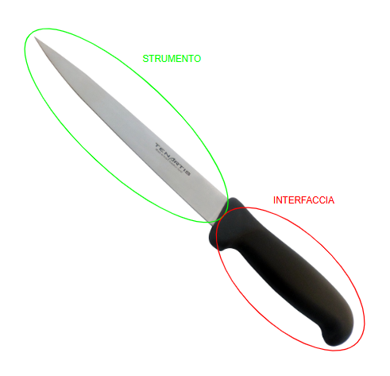

Nel mondo delle interfacce è importante non confondere l’acronimo UI (User Interface), ovvero lo spazio in cui avviene l’interazione uomo-macchina, con l’acronimo UX (User Experience) o con la pura interazione. Lo scopo primario dell’interfaccia non è quello di mettere a disposizione dell’utente tutte le funzioni contemporaneamente (errore che commettono la maggior parte degli ingegneri e informatici in fase di progettazione), bensì semplificare l’utilizzo ed erogare un’interazione facile, efficiente e piacevole. 

Un’interfaccia è letteralmente ciò che sta tra due facce: rappresenta il punto di contatto tra due sistemi che devono comunicare. Aiuta quindi a mediare la comunicazione tra due macchine o tra la macchina e l’essere umano. Lo strumento è ciò che fa l'azione, l’interfaccia è ciò che serve per guidare l'utente nell'esecuzione di tale azione.

Quando l’uomo si imbarcò per la prima volta nell’Apollo 4, a bordo vi erano ingegneri ed esperti aerospaziali unici in grado di gestire i complessi comandi dell’interfaccia. Con l’evolversi della tecnologia, l’interfaccia ha iniziato a semplificarsi. Nel 2002, con lo Space Shuttle, i comandi sono diminuiti ma l’uomo aveva comunque il controllo manuale di essi. Con la Crew Dragon del 2020 la plancia di controllo cambia totalmente: se prima era piena di comandi fisici, ora si hanno a disposizione dei monitor touch che gestiscono sistemi largamente automatizzati; l'interfaccia non si aspetta una continua interazione manuale da parte dell’astronauta, ma comunica ad esso ciò che succede in tempo reale.

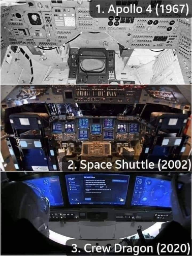

### Mediazione fisica nell’interazione
Per comprendere l’architettura delle interfacce utente, dobbiamo partire da una constatazione fondamentale riguardante la natura umana: l’incapacità che ha l’uomo di interagire in modo diretto e naturale con i segnali digitali della macchina. Per far sì che ciò potesse essere possibile, sono nate le interfacce utente.
Un’interfaccia utente è formata da più livelli che collaborano tra loro per permettere all’utente di interagire con il sistema. Uno di questi livelli è la Human-Machine Interface (HMI), ovvero l’interfaccia uomo-macchina. Sebbene oggi le interfacce vocali stiano rendendo l’interazione più immediata, storicamente ci siamo dovuti affidare alla creazione di Human Interface Device (HID), ovvero componenti hardware progettati per facilitare l’interazione fisica. Un esempio classico è l’interfaccia desktop, in cui abbiamo dispositivi di output (il monitor) e dispositivi di input (tastiera e mouse) che ci consentono di tradurre i nostri comandi fisici in segnali digitali.

### Le Interfacce Utente (UI) e i Sensi
Progettare un’interfaccia utente non è facile. La buona interfaccia massimizza il trasferimento delle informazioni, ma fornisce solo quelle utili all’utente in quel momento, evitando il sovraccarico informativo (information overload) che creerebbe confusione e senso di frustrazione. Motivo per cui la progettazione di un’interfaccia è per definizione un’attività interdisciplinare che va oltre la programmazione grafica e richiede l’intervento di campi come la psicologia, la fisica, le neuroscienze e il design.

Le interfacce utente sono tipicamente classificate in base ai sensi che coinvolgono per stabilire l’interazione. Noi possediamo cinque sensi, il che porta a identificare cinque possibili categorie di interfacce (Visual, Auditory, Tactile, Olfactory, Gustatory), più una sesta che riguarda l'equilibrio (Equilibrial UI), ovvero il senso dell’orientamento. 

Le interfacce moderne raramente utilizzano un senso solo. Le interfacce che usano più di un senso sono dette CUI (Composite User Interface). L’iPad, ad esempio, potrebbe sembrare un’interfaccia principalmente visiva, ma in realtà è una CUI poiché abilita vista, tatto e udito. 
La CUI più comune è la GUI (Graphical User Interface) la quale è composta da interfacce grafiche (visual) e tattili (tactile). Se a questa andiamo ad aggiungere l’udito (suono), otteniamo una MUI (Multimedia User Interface).

Oggi disponiamo di numerosi canali di interazione sensoriale e spesso si pensa che utilizzarli tutti contemporaneamente renda l’esperienza migliore. In realtà, non sempre il multi-senso è un vantaggio, poiché ogni senso richiede al cervello un certo livello di attenzione: più stimoli sensoriali competono tra loro, più aumenta il carico cognitivo dell’utente. Questo può portare a distrazione e a un’interazione meno efficace. Per questo motivo non dobbiamo progettare puramente spinti dalla tecnologia, ma sempre mettendo al centro i limiti e le capacità cognitive dell’utente.

### CUI: Standard, Virtual, Augmented e Qualia
Un altro modo per classificare le interfacce utente composite (CUI) è a seconda di come si relazionano con la realtà fisica:

*   **Standard CUI:** Utilizzano dispositivi standard (mouse, tastiere, monitor). L'interfaccia trasla un modello concettuale in digitale (Word, ad esempio, somiglia ad un foglio di carta, ma è una rappresentazione standard a schermo).

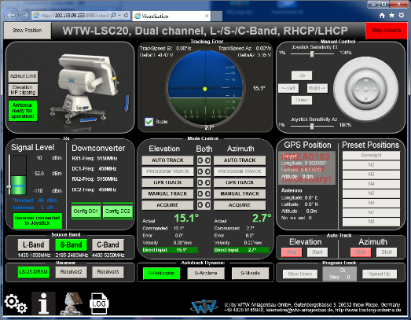

*   **Virtual Reality Interface:** L’utente viene completamente immerso in un ambiente digitale, escludendo il mondo reale (block out the real world) e ricreando un mondo alternativo realistico.

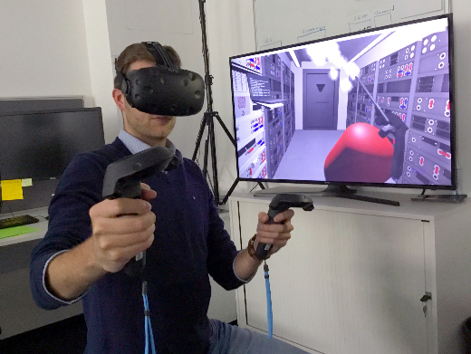

*   **Augmented Reality Interface:** L’ambiente reale non viene bloccato o sostituito, ma arricchito da elementi digitali, sovrapponendo l'interfaccia al contesto fisico in cui si trova l'utente.

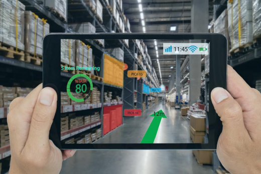

*   **Qualia Interface:** Se immaginassimo un’interfaccia capace di interagire con *tutti* i sensi umani contemporaneamente, questa verrebbe definita Qualia Interface (dal termine filosofico *qualia*, che si riferisce alle percezioni soggettive multisensoriali).

Le CUI possono anche essere classificate in base al *numero* di sensi abilitati. Ad esempio, un’interfaccia che coinvolge Vista, Udito e Olfatto è definita 3S (come il sistema Smell-O-Vision); aggiungendo il movimento fisico (tatto/equilibrio, come nei cinema 4D) si passa a 4S.

### Human Interface Device (HID)
Quando parliamo di HID (Human Interface Device) facciamo riferimento sia al dispositivo fisico in sé, sia alla specifica componente software nota come *HID protocol/specification* (tipicamente su standard USB). 
Prima dell'introduzione dello standard HID, i computer riconoscevano esclusivamente i dispositivi progettati per quello specifico protocollo o modello (ad es. per i vecchi mouse e tastiere servivano driver creati ad hoc). Microsoft e gli altri attori dell'industria erano penalizzati da questa frammentazione, che frenava l'innovazione hardware.

Per risolvere il problema, fu introdotto lo standard USB-HID, pensato per permettere ai dispositivi di funzionare senza dover installare driver personalizzati (il famoso messaggio "HID-compliant device riconosciuto").
Nel protocollo HID ci sono due entità: l'Host (il computer) e il Device (la periferica). Il dispositivo non deve avere una grande potenza di calcolo: si limita a contenere in ROM un **HID descriptor** (un array di byte pre-programmato) che descrive all'Host le caratteristiche dei pacchetti dati che invierà. È l'Host che si fa carico computazionalmente di ricevere l'HID descriptor, decodificarlo ("parsarne" la struttura) e capire come interpretare l'input o inviare l'output.
Esiste anche un *Boot Protocol*, un sotto-protocollo di base (senza l'uso dell'HID descriptor) che supporta funzioni minime solo per tastiere e mouse standard in fase di avvio del sistema.

### Evoluzione e impatto del protocollo HID
La standardizzazione dei pacchetti dati auto-descrittivi ha permesso agli sviluppatori di creare periferiche innovative in modo rapidissimo. Poiché tutti i principali sistemi operativi sanno decodificare nativamente i pacchetti HID, è possibile creare hardware del tutto nuovo che il computer riconoscerà automaticamente. Oggi il protocollo HID non è limitato all'USB, ma è utilizzato anche su altri bus di comunicazione, come il Bluetooth HID, Serial HID, ZigBee e HOGP.

#### Esempio  
 Il Makey Makey è una scheda elettronica che sfrutta il protocollo HID per trasformare qualsiasi oggetto conduttivo in un input. Viene riconosciuto dal computer nativamente come una tastiera/mouse standard senza bisogno di driver. I suoi input sono mappati su tasti comuni (frecce direzionali, click del mouse, barra spaziatrice). Questo dispositivo dimostra come, sfruttando gli standard esistenti, sia possibile creare forme di interazione completamente nuove.

### Classificazione dei dispositivi di interazione
Le periferiche HID si dividono in due macro-categorie fondamentali (input e output). Oggi molti dispositivi moderni sono misti, ma la distinzione di base a livello di componenti rimane valida:
*   **Dispositivi di input (Sensori):** Si basano su sensori il cui scopo è rilevare eventi nel mondo fisico e convertirli in informazioni elettroniche (analogiche o digitali). Un esempio è il microfono, che converte le onde sonore in un segnale elettrico.
*   **Dispositivi di output (Attuatori):** Si basano su attuatori il cui scopo è ricevere un segnale elettrico e convertirlo in un evento fisico nell’ambiente. Un esempio è l’altoparlante, che converte il segnale elettrico in movimento per generare onde sonore.

### Tastiere e layout
La tastiera è il dispositivo HID di input testuale più diffuso. Per garantire usabilità e coerenza nel mondo, le tastiere seguono standard fisici e meccanici precisi, come l'ISO 9995-2 o l'ANSI (che definiscono distanze tra i tasti e corsa del tasto). Le tastiere comuni "Full-size" moderne contano un numero fisso di tasti (101, 104 o 105).

Un layout di tastiera è la disposizione specifica fisica, visiva o funzionale dei tasti:
*   **Layout fisico:** La disposizione meccanica reale dei tasti. 
*   **Layout visuale:** La disposizione delle etichette (lettere, simboli) stampate o incise sui tasti.
*   **Layout funzionale:** La mappatura via software che associa il tasto premuto al carattere a schermo. Il sistema operativo riceve dalla tastiera fisica solo uno "scancode" (riga e colonna del tasto premuto) e, tramite una tabella di conversione, lo traduce in base al layout impostato nel software.

**Layout QWERTY**
Il QWERTY è di gran lunga il layout visivo standard più diffuso al mondo. Nasce storicamente come design ottimizzato per gli alfabeti con script latino e prende il nome dalle prime sei lettere in alto a sinistra.

### Altri Dispositivi HID e Sensori
Oltre alla classica tastiera, molti altri strumenti inviano o gestiscono informazioni digitali, spesso emulando proprio il comportamento testuale dell'HID:

*   **Lettori Barcode:** Un lettore di codici a barre (barcode reader) è uno scanner ottico capace di leggere codici stampati (formati da linee parallele di larghezza variabile), decodificarli e inviare i dati al computer. Molto spesso si comportano esattamente come una tastiera: passano il codice al computer come se fosse una stringa di testo digitata molto velocemente (permettendone l'uso in software gestionali senza driver dedicati).
*   **Lettori QR Code:** Un QR è un codice a barre bidimensionale più complesso che immagazzina dati in modo altamente efficiente. Come per il barcode classico, l'output primario è una stringa di testo, ma app o software specifici sono programmati per riconoscere come quella stringa è formattata (es. per aprire un URL o salvare una Vcard).
*   **RFID (Radio-Frequency Identification):** Un sistema basato su un minuscolo transponder radio. Quando attivato da un impulso elettromagnetico emesso da un lettore, il tag trasmette i suoi dati digitali (spesso un ID numerico). 
    *   *Tag passivi:* Non hanno batteria, si alimentano sfruttando l’energia delle onde radio inviate dal lettore.
    *   *Tag attivi:* Hanno una propria batteria interna e possono comunicare a raggio molto più ampio (centinaia di metri).
*   **NFC (Near Field Communication):** È un set di protocolli per la comunicazione bidirezionale radio a raggio molto corto (circa 4 cm o meno). Offre una connessione a bassa velocità utile per operazioni rapide e pagamenti. Sebbene venga spesso associato ai dispositivi di input/output, l'NFC è in realtà una *tecnologia di comunicazione* che può essere utilizzata per veicolare interazioni tra sistemi intelligenti.

**Dispositivi di puntamento**

Un dispositivo di puntamento è un’interfaccia di input che consente l’inserimento di dati spaziali continui e multidimensionali in un computer. A differenza delle tastiere, che trasmettono dati testuali, questi dispositivi trasferiscono informazioni di posizione su un piano, definito tipicamente da almeno due assi (X e Y).

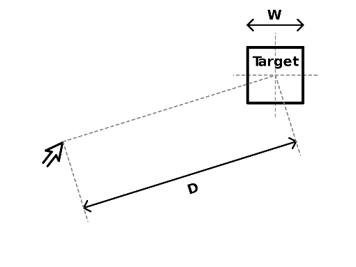

**Legge di Fitts**

La legge di Fitts è un modello predittivo del movimento umano, descrive come il tempo necessario per raggiungere un bersaglio dipenda dal rapporto tra la distanza da percorrere (D) e la grandezza del bersaglio (W). In pratica più il bersaglio è lontano o piccolo, maggiore sarà il tempo per selezionarlo.

$$MT = a + b \cdot \text{ID} = a + b \cdot \log_{2} \left( \frac{2D}{W} \right)$$

La formula è composta da:

**a**: è il tempo di avvio/arresto del movimento in secondi (misurato empiricamente, legato al tempo di reazione umano e del dispositivo).

**b**: è la velocità intrinseca del dispositivo (misurata empiricamente, determinata sia dalle sue caratteristiche tecniche sia dal fatto che viene controllato manualmente dall’utente).

**D**: è la distanza dal punto di partenza al centro del bersaglio.

**W**: è la larghezza del bersaglio misurata lungo l'asse del movimento.

Tasti più piccoli o più distanti impiegano molto più tempo per essere raggiunti. Questo giustifica il raggruppamento di controlli correlati per velocizzare l’interazione (se, ad esempio, in Word sto modificando la dimensione del testo, avere i relativi controlli posizionati vicini rende l’interazione più veloce, perché l’utente deve compiere uno spostamento minimo per raggiungerli). Dietro al concetto dei controlli segregati esiste un principio opposto ma complementare: utilizziamo infatti la segregazione dei controlli per ridurre la probabilità di errori involontari. Questo è collegato alla legge di Fitts, perché aumentando la distanza tra due tasti che non devono essere premuti in successione, si offre all’utente più tempo per accorgersi dell’azione e correggere un eventuale errore, rendendo la traiettoria più complessa intenzionalmente.

La legge è valida anche in assenza di gravità e una versione estesa considera anche la direzione: i movimenti orizzontali sono più veloci di quelli verticali, influenzando il design delle interfacce.

**Classificazione delle interazioni di puntamento**

Quando parliamo di interazione tramite dispositivi, dobbiamo considerare in che modo questa interazione avviene, poiché può essere di vario tipo.

1.  **Interazione diretta e indiretta**

L’interazione diretta si verifica quando l’utente agisce direttamente sullo schermo; un esempio sono i touchscreen, per cui toccando direttamente lo schermo l’utente interagisce con il significante dell’azione (il puntatore condivide la stessa posizione fisica del dispositivo di input).

Con l’interazione indiretta l’input avviene su una superficie diversa da quella dove viene visualizzato l’output, con una traslazione del movimento sullo schermo, ad esempio l’utilizzo del mouse.

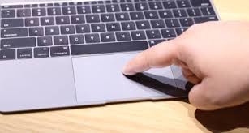

2.  **Interazione relativa e assoluta** 

L’interazione a sua volta può essere assoluta o relativa, in base a come il movimento del dispositivo di input viene mappato sullo schermo.

Un dispositivo a movimento assoluto mappa in modo coerente e diretto un punto nello spazio di input con un punto nello spazio di output. Ad esempio, se un dito o una penna digitale tocca un punto specifico, il cursore si sposta esattamente in quel punto. I dispositivi assoluti sono spesso diretti, ma non sempre (una tavoletta grafica per PC, ad esempio, è assoluta ma indiretta).

In un dispositivo a interazione relativa, lo spostamento del dispositivo controlla lo spostamento del cursore rispetto alla sua posizione iniziale, non la sua posizione assoluta. Ad esempio, se muovo il mouse di 1 cm, sullo schermo il cursore si sposta a partire da dove si trovava in precedenza. Questo è tipico dei dispositivi ad input indiretto.

3.  **Classificazione fisica e di controllo** 

I dispositivi di puntamento possono essere classificati in base al tipo di movimento e forza generati a seguito dell’interazione:

- I dispositivi isotonici (stesso tono) sono fisicamente mobili e misurano il proprio spostamento nello spazio (es. il mouse, la penna, il braccio umano).

- I dispositivi isometrici (stessa posizione) sono fissi e non si muovono fisicamente; misurano invece la forza che viene applicata su di essi (es. trackpoint sui dispositivi laptop ThinkPad o schermi sensibili alla forza).

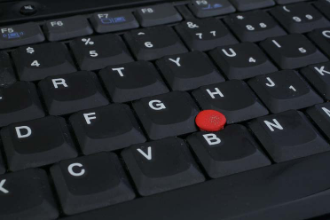

- I dispositivi elastici si muovono ma oppongono una resistenza che aumenta con lo spostamento (es. joystick).

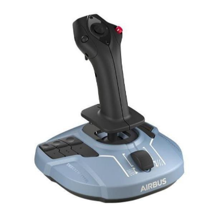

Un altro modo per classificare i dispositivi di puntamento è in base al tipo di mappatura logica tra l’interazione dell’utente e il cursore:

Un dispositivo position control (controllo di posizione) fa sì che lo spostamento del dispositivo corrisponda a un cambiamento di posizione del cursore (es. mouse). Un dispositivo rate control (controllo di frequenza/velocità), invece, fa sì che l'input determini la velocità e la direzione del movimento continuo del cursore (es. joystick o trackpoint).

4.  **Performance e contesti d’uso**

Il mouse rimane il dispositivo più performante per velocità ed accuratezza nella maggior parte dei task. Per distanze molto brevi sullo schermo, tuttavia, i tasti freccia (cursor keys) risultano spesso più rapidi. Per le persone con disabilità motorie, i dispositivi come joystick o trackball sono più efficaci del mouse, poiché richiedono movimenti diversi e aiutano a compensare i limiti fisici. Se l'applicazione della forza è un problema, si preferiscono superfici sensibili al tocco. 

**Eye tracking**

1.  Definizione e complessità

L’Eye tracking è il processo di misurazione del punto in cui l'utente sta guardando (gaze) o del movimento dell'occhio rispetto alla testa. Gli Eye tracker sono utilizzati nella ricerca sul sistema visivo, in psicologia, in psicolinguistica, nel marketing e come dispositivo di input per l'interazione uomo-macchina. I dispositivi più diffusi utilizzano immagini video da cui viene estratta la posizione dell'occhio. La tecnologia oggi più diffusa è quella basata su una telecamera illuminata da una luce, tipicamente infrarossa, che cattura il riflesso corneale (CR) e il centro della pupilla, elementi da cui viene ricavata matematicamente la rotazione dell'occhio nel tempo.

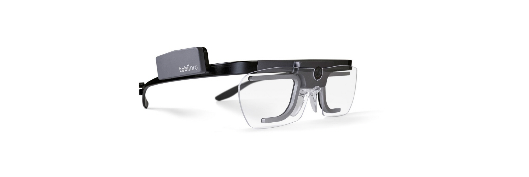 

Per realizzare l’eye tracking video ci sono diversi metodi, distinguibili tra l’utilizzo di tecnologia a luce attiva (infrarosso) e tecnologia a luce passiva. 

Il metodo più affidabile che usa una tecnologia attiva è il bright-pupil (pupilla luminosa). In questo caso l'illuminazione infrarossa è coassiale (in asse) con il percorso ottico della telecamera. L'occhio agisce come un catarifrangente e la luce riflette sul fondo della retina, facendo apparire la pupilla come un disco luminoso nell’immagine catturata (simile all'effetto "occhi rossi" delle foto). Questo contrasto rende facile e robusta l'estrazione della posizione della pupilla per il software, permettendo l'uso anche al buio. Lo svantaggio è la maggiore complessità costruttiva dell'hardware.

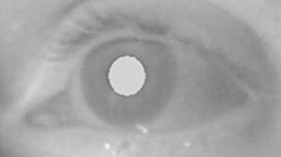

L’effetto opposto è il dark-pupil (pupilla scura). Anche qui si utilizza una tecnologia attiva a infrarossi, ma la sorgente di luce è fuori asse (offset) rispetto alla telecamera. In questo modo la retro-riflessione della retina viene deviata lontano dall'obiettivo, rendendo la pupilla nera e il resto dell’occhio illuminato. 

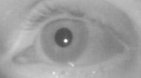

Il metodo passive light (luce passiva) invece si affida all’illuminazione visibile ambientale. Il dispositivo è più semplice da costruire hardware-wise, ma l’elaborazione dell’immagine software è molto più complessa rispetto ai metodi attivi a infrarossi.

3.  **Eye-tracking vs. Gaze-tracking**

È fondamentale distinguere tra eye-tracking e gaze-tracking. Gli eye-tracker misurano intrinsecamente la rotazione dell'occhio rispetto a un sistema di riferimento. 
Se il sistema è montato sulla testa dell'utente (head-mounted, come nei visori), viene misurato l'angolo dell'occhio rispetto alla testa (eye-in-head). Per capire cosa l'utente guarda nel mondo reale, la testa deve essere ferma o bisogna tracciare anche il movimento del cranio. 
Se invece il sistema è remoto (table-mounted, fisso sotto il monitor), vengono misurati direttamente gli angoli di sguardo (gaze) rispetto alle coordinate dello schermo, richiedendo in genere che l'utente mantenga la testa il più ferma possibile.

# Speech and Auditory Input Interfaces

**Fisiologia dell’udito e implicazioni di design**

I dispositivi per l’interazione vocale si basano sulla trasduzione delle onde sonore e, in particolare, sulla comprensione del linguaggio da parte dei sistemi digitali. Il suono, fisicamente, è una vibrazione che si propaga come onda di pressione attraverso un mezzo. Nell’essere umano, la percezione uditiva è limitata alle frequenze tra 20 Hz e 20 kHz (il range audio), un intervallo che si riduce con l’avanzare dell’età, soprattutto per le frequenze più acute. Le onde sonore superiori ai 20 kHz sono note come **ultrasuoni**, mentre quelle inferiori ai 20 Hz sono **infrasuoni** (entrambi non udibili dall'uomo). Questo aspetto va preso in considerazione durante la progettazione delle interfacce che includono componenti audio. Il periodo di un’onda, combinato con la velocità di propagazione, determina la lunghezza d’onda (nell'aria, queste onde hanno lunghezze che vanno da 17 metri a 1,7 centimetri). Tali caratteristiche influenzano fenomeni come riflessione ed eco, fondamentali per capire perché l’acustica può favorire o limitare la qualità delle interazioni vocali come, ad esempio, durante una video call.

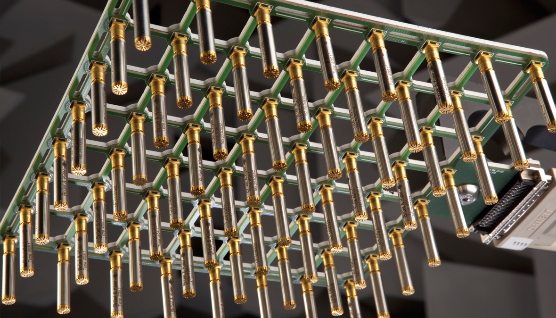

Il suono viene acquisito tramite microfoni, che sono dei dispositivi sensori (trasduttori) in grado di convertire la variazione di pressione acustica di un'onda in un segnale elettrico. Esistono numerose tipologie di microfoni (ampiamente usati come HID), ciascuno ottimizzato per specifici intervalli di frequenza o metodi di conversione.

In alcuni contesti facciamo uso di un array di microfoni che operano contemporaneamente, utilizzati per l'estrazione della voce dal rumore ambientale (telefoni, sistemi di riconoscimento vocale, apparecchi acustici), suono surround, registrazioni binaurali, localizzazione acustica di oggetti e monitoraggio del rumore ambientale. Un array è solitamente composto da microfoni omnidirezionali, direzionali o una combinazione di essi distribuiti nel perimetro di uno spazio. Ogni microfono produce una serie temporale che rappresenta l’andamento del segnale acustico; un array produce tante serie quanti sono i microfoni, tutte collegate a un computer che le interpreta. Confrontando queste serie temporali (che differiscono tra loro poiché ogni microfono assume una posizione diversa nello spazio), è possibile dedurre informazioni sulla direzione da cui proviene il suono.

Procedendo in questo modo è possibile fare anche la reiezione del rumore. Questa si basa sul fatto che il rumore ambientale in una stanza tende a essere relativamente costante, mentre la voce di un ipotetico speaker proviene da una direzione precisa. Se ad esempio la voce proviene da un angolo specifico, è possibile aumentare l’importanza dei microfoni che registrano il suono proveniente da quella direzione e ridurre il peso degli altri. In alternativa, si possono leggere tutti i microfoni dell’array ed elaborare i segnali. Da questi si estrae il parlato, al quale viene poi sottratto il rumore di fondo. In questo modo il sistema isola la voce e attenua le componenti indesiderate.

La reiezione del rumore delle cuffie funziona in modo efficace perché il sistema può sottrarre il rumore esterno dal suono riprodotto. Gli array di microfoni, quindi, servono a ottenere due risultati fondamentali:

1.  Individuare la posizione della sorgente sonora.
2.  Applicare tecniche di reiezione del rumore ambientale.

Nei sistemi moderni dotati di array composti da microfoni molto vicini tra loro, all’utente o al software non viene quasi mai dato accesso diretto ai singoli elementi. Sfruttando l'elaborazione simultanea, il sistema crea dei "microfoni virtuali", sui quali possiamo configurare parametri o direzionalità.

Un Amazon Echo dispone di sei microfoni posizionati lungo il bordo. Su questi microfoni sono presenti chip della famiglia DSP (Digital Signal Processor), utilizzati per elaborare i segnali audio.

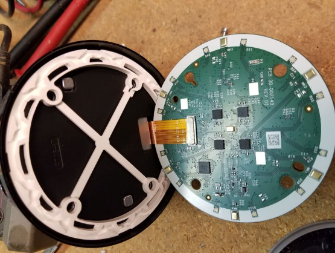

I sistemi DSP sono componenti hardware specializzati nell’esecuzione di calcoli complessi, operando direttamente a livello di chip. Questo approccio esonera il sistema dall’affidarsi a pesanti elaborazioni software lato CPU. Elaborando i segnali localmente su circuiti integrati dedicati, è possibile raggiungere le velocità di elaborazione in tempo reale necessarie per la pulizia del segnale.

### Limiti dell'interazione vocale 

Con la nascita delle interfacce vocali, l'obiettivo principale (il "sogno" del design) era creare un’interazione con basso carico cognitivo, bassi tassi di errore e un'esperienza utente naturale. Tuttavia, nella realtà, le applicazioni pratiche raramente permettono discussioni a forma libera con un computer a causa di limiti strutturali. Il primo problema è che la banda di trasferimento informativo è di ordini di grandezza inferiore a quella di un’interfaccia visiva. La comunicazione verbale trasmette dati in modo lento e sequenziale, mentre un’interfaccia grafica presenta in parallelo testi e relazioni spaziali. È questo collo di bottiglia informativo a spiegare perché gli assistenti vocali non abbiano sostituito le GUI per compiti complessi.

### Il linguaggio e le applicazioni di successo

Un altro limite è la natura effimera del linguaggio (che include tono, cadenza, ecc.), rendendo l’interazione a volte confusa. A complicare il tutto c’è anche la difficoltà nel parsing e nella ricerca all'interno del flusso vocale, processi che richiedono un elevato costo computazionale.

Per via di questi costi, la gestione dell'audio spesso si divide tra locale e cloud. Ad esempio, assistenti come Alexa o Google Home utilizzano il DSP locale unicamente per riconoscere offline una "parola chiave" (wake-word) per garantire reattività e privacy. Solo dopo l'attivazione aprono uno streaming verso un server potente per il parsing della richiesta completa. 

Nonostante le limitazioni, le interfacce vocali **hanno grande successo in contesti specifici**:
*   Vocabolari specializzati (es. ambito medico o legale).
*   Dettatura di referti, appunti o lettere.
*   Pratica delle abilità di comunicazione (es. pazienti virtuali).
*   Recupero o trascrizione automatica di contenuti audio (come radio o sottotitoli).
*   Sicurezza e identificazione dell'utente.

Nella dettatura in ambito radiologico, ad esempio, mentre si osserva un’immagine parlare è più naturale che scrivere (basso carico cognitivo). Il sistema ha successo perché addestrare un riconoscimento vocale su una base di vocabolario specializzata ristretta è molto più semplice, riducendo drasticamente il tasso di errore.

## Sensori di immagine 

Un sensore di immagine rileva e trasmette informazioni usate per creare un'immagine, convertendo l'attenuazione variabile delle onde luminose (quando passano o riflettono sugli oggetti) in piccoli impulsi di corrente. Esistono due tipologie principali di sensori digitali di immagine: i **CCD** (Charge-Coupled Device) e i **CMOS** (Active-pixel sensor). Entrambi si basano sulla tecnologia MOS (Metal-Oxide-Semiconductor): i CCD utilizzano condensatori MOS, mentre i CMOS si basano su amplificatori MOSFET. I sensori analogici per radiazioni invisibili, invece, tendono a coinvolgere tubi a vuoto.

La scansione 3D è un processo di analisi di un oggetto o di un ambiente reale che raccoglie dati sulla sua forma e sul suo aspetto (es. il colore). Normalmente un sensore d'immagine produce una matrice 2D in cui ogni cella (pixel) contiene i valori RGB. Aggiungendo una terza variabile, la Z, si ottiene una nuvola di punti utile per costruire modelli digitali tridimensionali (usati in VR, AR, motion capture, reverse engineering). I pixel con informazioni volumetriche diventano voxel. La X e la Y rappresentano la posizione sul piano, mentre la Z indica la profondità. 

*Nota sulle limitazioni:* Molte tecnologie di scansione ottica 3D presentano ancora difficoltà oggettive nella digitalizzazione di oggetti lucidi, riflettenti o trasparenti.

## Tipologie di scanner 3D

Le tecnologie di scansione 3D si dividono in due categorie principali: attive e passive.

### Scanner passivi 

I sistemi passivi non emettono radiazioni proprie, ma si limitano a leggere l'energia già presente e riflessa nell’ambiente (solitamente la luce visibile o l'infrarosso ambientale). Essendo basati su fotocamere digitali convenzionali, risultano spesso soluzioni molto economiche.

*   **Sistemi Stereoscopici:** Sono i più comuni. Usano due fotocamere separate che guardano la stessa scena (similmente agli occhi umani). Analizzando le leggere differenze tra le immagini, il sistema determina la distanza di ogni punto.
*   **Sistemi Fotometrici:** Utilizzano una sola fotocamera fissa, ma catturano immagini multiple variando le condizioni di illuminazione. Queste tecniche tentano di invertire il modello di formazione dell'immagine per recuperare l'orientamento della superficie in ogni pixel.
*   **Sistemi a Silhouette:** Utilizzano contorni ottenuti da una sequenza di fotografie scattate attorno a un oggetto tridimensionale contro uno sfondo ben contrastato. Estrudendo e intersecando queste silhouette, si forma un'approssimazione del volume visivo (visual hull). Tuttavia, questo metodo non riesce a rilevare le concavità interne di un oggetto (come l'interno di una ciotola).

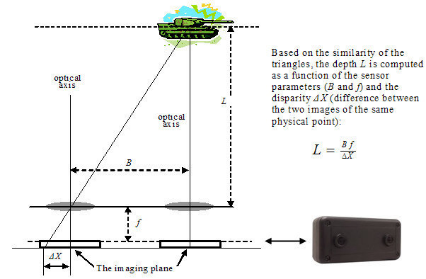

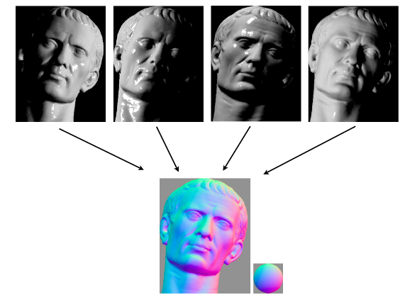

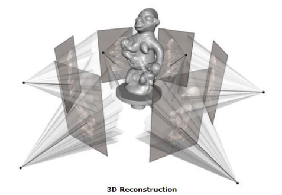

### Scanner attivi 

Gli scanner attivi emettono energia (come luce, ultrasuoni o raggi X) e ne rilevano la riflessione o la radiazione che attraversa l'oggetto. Le tipologie principali includono:

- Time of flight
- Triangolazione
- Luce strutturata
- Luce modulata

**Lo scanner laser 3D a tempo di volo (Time-of-Flight):** È uno scanner attivo che utilizza un raggio laser. Il cuore del sistema è un telemetro laser, che calcola la distanza misurando il tempo impiegato da un impulso di luce per fare andata e ritorno. La luce percorre 1 mm in circa 3,3 picosecondi, richiedendo strumenti di cronometraggio molto precisi. Il telemetro rileva la distanza di un punto alla volta nella sua direzione visiva, quindi per coprire l'intero campo visivo cambia progressivamente direzione. 

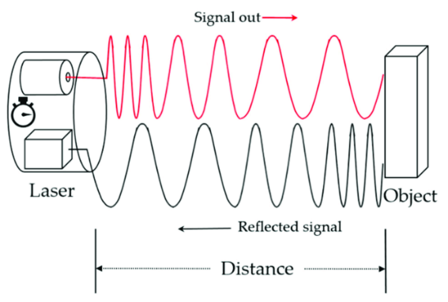

**Lo scanner 3D a triangolazione:** È un sistema attivo che sonda l'ambiente con un laser. Un emettitore proietta un punto luminoso sull’oggetto e una fotocamera rileva la posizione del riflesso. A seconda della distanza della superficie, il punto laser appare in posizioni diverse nel campo visivo della fotocamera. Il nome "triangolazione" deriva dal fatto che il punto laser, la fotocamera e l'emettitore formano un triangolo geometrico utile a calcolare la distanza.

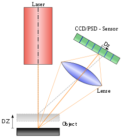

**Scanner a luce strutturata:** Questi scanner proiettano un pattern di luce (spesso tramite LCD o altra fonte stabile) sull'oggetto. Una fotocamera, leggermente sfalsata rispetto al proiettore, osserva la deformazione del pattern sulla geometria dell'oggetto e calcola la distanza di ogni punto. Il vantaggio principale è la velocità e la precisione: acquisendo multipli punti o l'intero campo visivo simultaneamente in una frazione di secondo, si riduce o elimina il problema della distorsione dovuta al movimento.

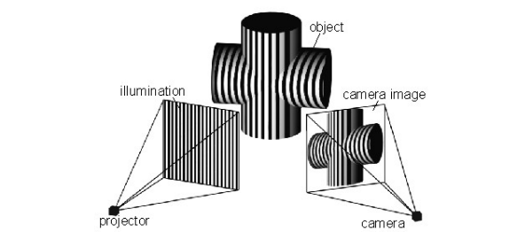

**Scanner a luce modulata:** Questi scanner proiettano una luce che cambia in modo continuo sull'oggetto, tipicamente variando la propria ampiezza con un andamento sinusoidale. Una fotocamera rileva la luce riflessa e l'ammontare dello sfasamento del pattern determina la distanza percorsa dalla luce. Questa tecnica permette anche di ignorare le interferenze luminose provenienti da altre fonti.

### Microsoft Kinect 

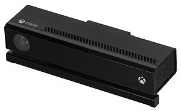

Il Kinect è una linea di dispositivi di input (Natural User Interface a mani libere) prodotta da Microsoft, rilasciata originariamente nel 2010 e basata inizialmente su hardware PrimeSense. Incorpora telecamere RGB, proiettori a infrarossi e sensori in grado di mappare la profondità tramite luce strutturata (o calcoli Time of Flight nelle versioni successive), affiancati a un array di microfoni. Insieme a software di intelligenza artificiale, permette il riconoscimento in tempo reale dei gesti, del parlato e il rilevamento dello scheletro del corpo per un massimo di quattro persone.

# Novel UIs are blended! 

I dispositivi come il Wii Remote, controller moderni e sistemi di scansione 3D si basano su tecnologie Time of Flight. Il LiDAR, ad esempio, utilizza impulsi infrarossi che risultano fondamentali per mappature archeologiche. Questi sensori 3D sono oggi ampiamente utilizzati anche nella videosorveglianza "privacy compliant", poiché le immagini Time of Flight non consentono il riconoscimento delle persone né la lettura di schermi, ma permettono comunque di rilevare situazioni critiche come cadute o presenze sospette, ad esempio nelle RSA o negli sportelli Bancomat.

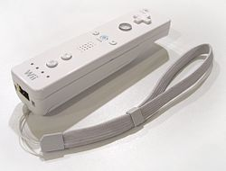

Sul fronte delle interfacce uomo-macchina, dispositivi come il Wii Remote e i Joy-Con del Nintendo Switch integrano IMU, sensori ottici, di vibrazione e algoritmi di rilevamento gestuale, combinando input multipli per offrire un’interazione più immersiva, precisa e naturale.

### IMU 

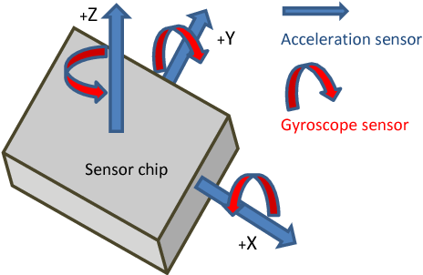 

Un'IMU (Inertial Measurement Unit) è un sistema di misura inerziale che integra accelerometro, giroscopio e talvolta magnetometro, per stimare in modo più affidabile possibile la posizione e l'orientamento di un corpo o dispositivo. A differenza del solo accelerometro, un'IMU evita il problema del drift, tipico della doppia integrazione dell’accelerazione necessaria per ricavare velocità e posizione. Il processore dedicato (Digital Motion Processor - DSP) interno all'IMU effettua in tempo reale la *sensor fusion*, restituendo orientamento e movimento stabilizzati, oltre ai dati grezzi dei singoli sensori. 

Questi principi sono utilizzati nei dispositivi di uso comune, come il nostro cellulare: il magnetometro fornisce la bussola digitale proiettando il vettore del campo magnetico terrestre sul piano dello schermo; l’accelerometro rileva la gravità per determinare l’orientamento del cellulare (ad esempio landscape o widescreen su YouTube); mentre il giroscopio stabilizza e disambigua le variazioni di rotazione. Le IMU a nove assi integrate in smartphone e controller moderni permettono un tracciamento preciso del movimento tramite algoritmi avanzati di MotionFusion.

### Wearable Devices e User Interfaces

Un wearable computer è un dispositivo di calcolo indossato sul corpo, in cui l'interfaccia e l'unità di calcolo si fondono in un'unica entità. Possono essere per uso generale (come un'estensione del mobile computing) o per scopi specializzati (come i fitness tracker o i visori come i Google Glass, controllati tramite gesti). 

I wearable possono essere posizionati al polso, al collo, sul braccio, sulla gamba o sulla testa. Condividono le stesse sfide tecniche del mobile computing, come la gestione delle batterie, la dissipazione del calore, le reti wireless (PAN) e la gestione dei dati. Una particolarità di molti wearable è che rimangono attivi in modo continuo, elaborando e registrando dati costantemente in background.

### Heart Rate Wearable Monitor 

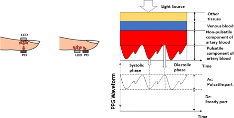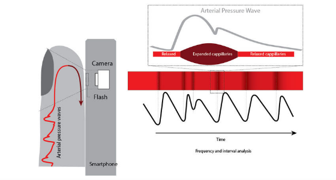

I monitor di frequenza cardiaca (HRM) di consumo utilizzano principalmente due tecnologie:
La **fotopletismografia (PPG)**, utilizzata dalla luce verde degli smartwatch, misura le variazioni di volume sanguigno causate dalla sistole e dalla diastole attraverso la dilatazione dei capillari, consentendo di stimare il battito cardiaco (BPM). Non rileva però l’attività elettrica del cuore, come invece avviene con l’**ECG (Elettrocardiogramma)**. La luce verde è preferita nei dispositivi indossabili perché offre misure più stabili durante il movimento: questa lunghezza d’onda è infatti meno sensibile agli artefatti causati dai gesti dell’utente. La luce rossa, invece, è utilizzata soprattutto in ambito medico o per letture più specifiche (quando il paziente è fermo), e consente non solo di stimare la frequenza cardiaca, ma anche la saturazione dell’ossigeno nel sangue (SpO2). La tecnologia PPG non misura l’andamento elettrico del cuore, ma la presenza meccanica dei battiti.

### Natural User Interface 

Una Natural User Interface (NUI) è un'interfaccia progettata per risultare di fatto "invisibile", adattandosi alle competenze e al contesto dell’utente. Il concetto, fortemente promosso da figure come Bill Gates, non indica un'interfaccia magicamente innata in sé, bensì un design in cui la transizione da principiante a esperto avviene in modo fluido e rapido. L'apprendimento è facilitato da un design che fa sentire l'utente costantemente capace di avere successo.

È importante fare una distinzione, evidenziata anche da ricercatori come Bill Buxton, tra un'interfaccia **intuitiva** e una **NUI**. Un'azione intuitiva non richiede apprendimento pregresso (es. lo swipe con un dito su iPad che imita lo spostamento fisico di un foglio analogico). Un'azione NUI, invece, può richiedere un apprendimento iniziale (es. lo swipe con quattro dita), ma diventa "naturale" perché si integra perfettamente con il modello mentale del sistema appena acquisito, riducendo il carico cognitivo.

Per la progettazione delle NUI, Joshua Blake elenca quattro linee guida fondamentali:
1. **Instant expertise** (Competenza immediata)
2. **Progressive learning** (Apprendimento progressivo)
3. **Direct interaction** (Interazione diretta)
4. **Low cognitive load** (Basso carico cognitivo, sfruttando principalmente abilità innate e competenze semplici).

Una strategia per la progettazione di NUI è l’utilizzo delle **Reality-Based Interfaces (RBI)**, che permettono di interagire con il mondo digitale fondendolo con quello reale (es. rendere un oggetto fisico "cliccabile" tramite un wearable). È importante notare che le RBI sono solo *uno* dei modi per ottenere una NUI, e i due termini non sono sinonimi. 
Un’altra strategia, non basata sulle RBI, prevede di limitare drasticamente e semplificare le funzionalità di default in modo che corrispondano esattamente agli obiettivi dell'utente (come la filosofia progettuale di Apple in iOS), rendendo l'uso del dispositivo "senza sforzo". In questo caso, spesso si confonde l'efficacia della NUI con la pura presenza del multi-touch, quando in realtà risiede nel design del software.

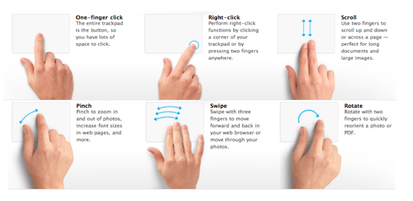 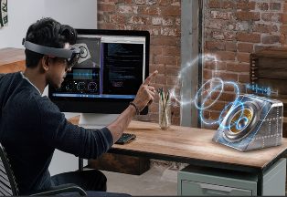 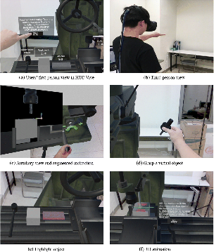

### Natural means no learning

L'idea che "naturale significhi assenza di apprendimento" è in realtà un falso mito. Studi sull'interazione dei bambini con i touchscreen hanno dimostrato che l'uso delle interfacce non è totalmente innato, ma richiede abilità cognitive e motorie che si sviluppano nel tempo. 

Ad esempio, tra i 2 e i 3 anni i bambini non riescono a seguire tecniche di prompting strutturate, e solo una minoranza (circa il 27%) riesce a fare tap su uno schermo in un punto intenzionale. Tra i 4 e i 6 anni, il 57% è in grado di eseguire gesti semplici come il tap e lo slide e di seguire istruzioni animate. Solo a 7-8 anni i bambini riescono a eseguire gesti più sofisticati come il *drag and drop* (30%) e a seguire istruzioni in formato audio e video. 

Questo indica che le NUI non eliminano la necessità di apprendere, ma sfruttano abilità che l'utente ha acquisito (e continua ad acquisire) vivendo nel mondo, adattandosi al suo livello di competenza.

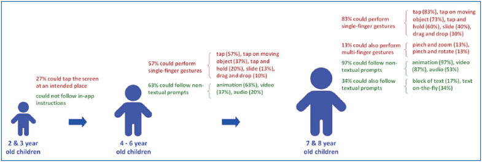